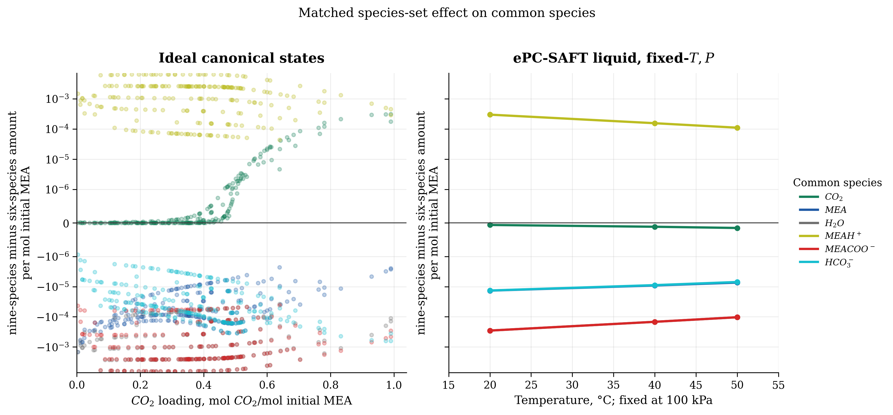
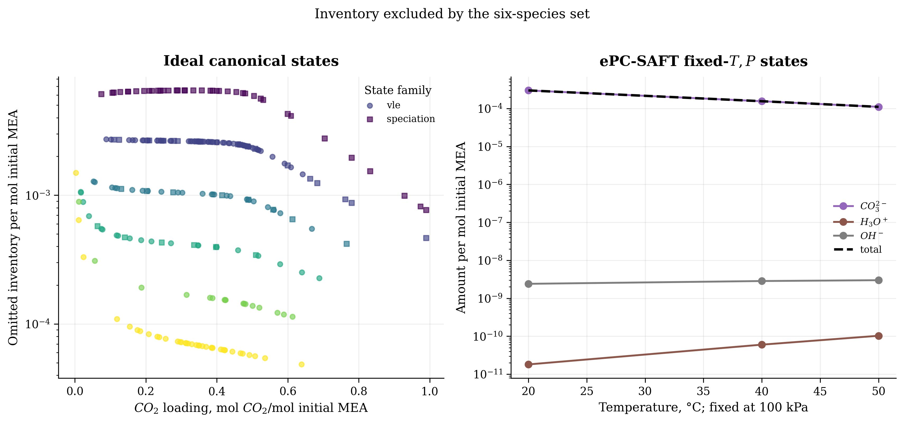
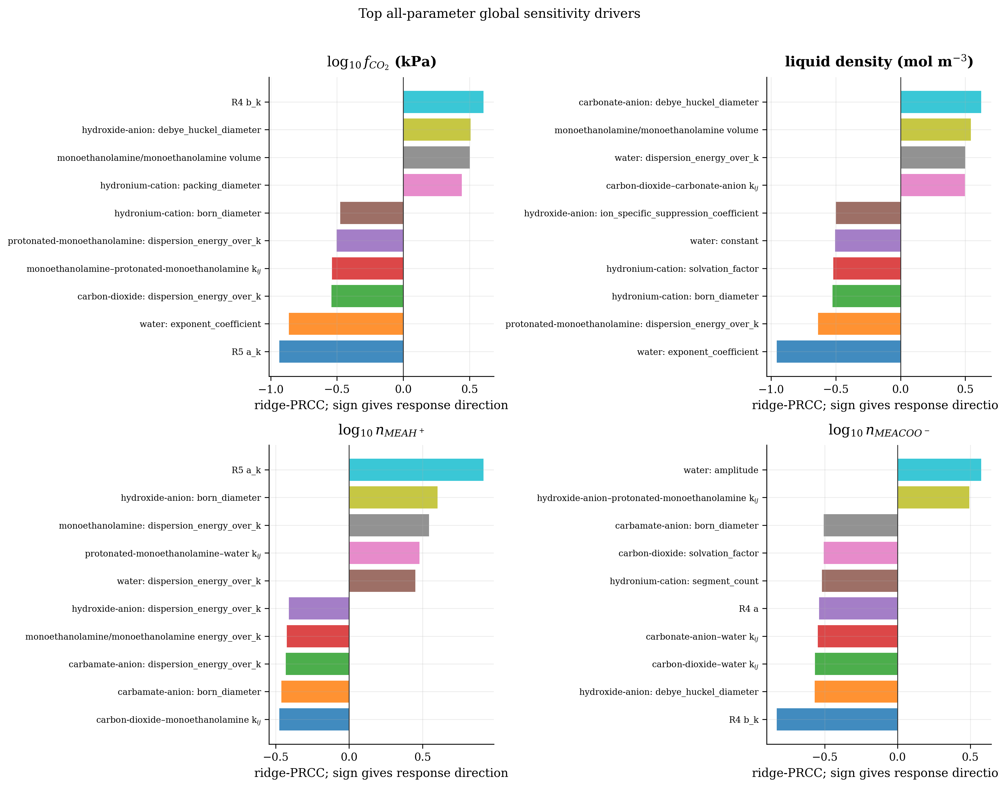
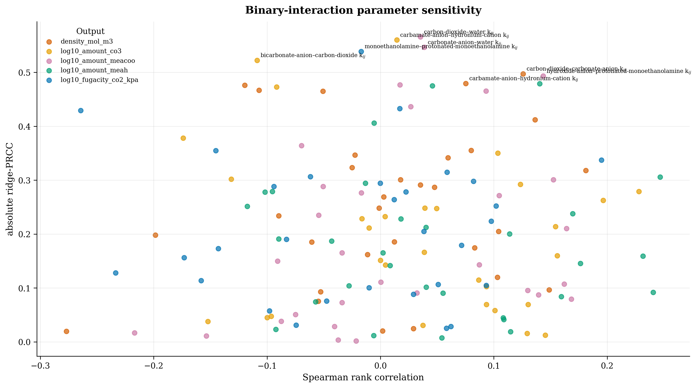
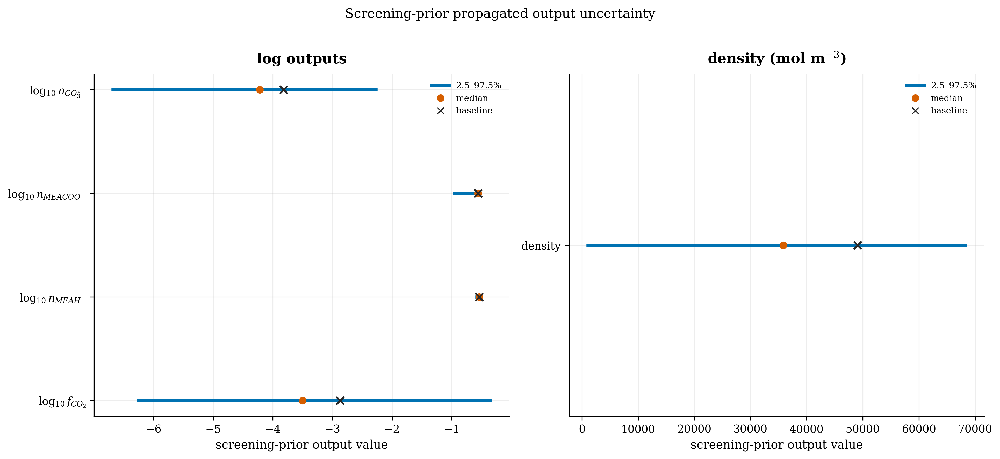

::: {.callout-warning}
## Working-notebook boundary

This notebook reads retained CSV tables and rendered figures; it does not rerun
the equilibrium calculations. The ideal lane satisfies its stated residual
limit. The ePC-SAFT liquid comparison and the all-parameter sensitivity survey
use the exact candidate packets identified below, which differ from the active
parameter set in `analyses/mea_parameter_bundle/`. Keep their numerical results
attached to those packet hashes.
:::

## Question and clean sequence

The question is whether a six-species reduced reaction set gives the same
common-species state as the matched nine-species set when the feed, reaction
source, temperature, pressure, and reporting basis are held fixed.

The sequence is:

1. Read the source-controlled nine-species reaction correlations.
2. Derive the six-species reaction correlations by exact stoichiometric
   projection; do not insert a separately fitted six-species parameter set.
3. Solve the nine- and six-species ideal-liquid systems at every canonical VLE
   and ChEq temperature/loading coordinate.
4. Use the installed ePC-SAFT Engine only for EOS evaluations and source-state
   transfer. Solve the reaction and balance equations with a disposable SciPy
   least-squares bridge because the Engine reactive declaration gate does not
   admit this reduced comparison directly.
5. Compare common-species amounts and report the inventory of carbonate,
   hydronium, and hydroxide omitted by the six-species set.

The reporting basis is amount per mol initial MEA. Loading is mol CO2 per mol
initial MEA, and the feed is 30 wt% MEA in water.

## Coefficient provenance

### Ideal-liquid lane

The nine-species ideal coefficients come from the local, source-controlled
[reaction constant manifest](../../data/reference/MEA/manifests/reaction_constant_manifest.csv).
They are the Edwards/Baygi water-carbonate family, the Tong/Baygi carbamate
hydrolysis entry, and the Bates/Pinching/Baygi protonated-amine dissociation
entry. The manifest, rather than a fitting-routine output, is the authority
for this lane.

The manifest correlation is

$$
\ln K(T) = A + B/T + C\ln(T) + DT.
$$

The retained nine-species values are:

| reaction | A | B (K) | C | D (K$^{-1}$) | source key |
|---|---:|---:|---:|---:|---|
| R1 | 132.899 | -13445.90 | -22.4773 | 0 | Edwards1978 via Baygi2015 |
| R2 | 231.465 | -12092.10 | -36.7816 | 0 | Edwards1978 via Baygi2015 |
| R3 | 216.049 | -12431.70 | -35.4819 | 0 | Edwards1978 via Baygi2015 |
| R4 | -1.8652 | -1545.30 | 0 | 0 | Tong2012 via Baygi2015 |
| R5 | 2.1211 | -8189.38 | 0 | -0.007484 | Bates1951 via Baygi2015 |

The six-species reactions are exact combinations of those same five reactions:

$$
\begin{bmatrix}R_{6,\mathrm{carb}}\\R_{6,\mathrm{bicarb}}\end{bmatrix}
=
\begin{bmatrix}0&1&0&-1&-1\\0&1&0&0&-1\end{bmatrix}
\begin{bmatrix}R_1\\R_2\\R_3\\R_4\\R_5\end{bmatrix}.
$$

Therefore the derived six-species coefficient rows are:

| reaction | source combination | A | B (K) | C | D (K$^{-1}$) |
|---|---|---:|---:|---:|---:|
| carbamate formation | R2 - R4 - R5 | 231.2091 | -2357.42 | -36.7816 | 0.007484 |
| bicarbonate formation | R2 - R5 | 229.3439 | -3902.72 | -36.7816 | 0.007484 |

These rows are recorded in
[reaction_coefficients.csv](results/reaction_coefficients.csv) with
`source_status = inference`. The six-species rows are not the earlier sibling
fitting-routine coefficients.

### ePC-SAFT liquid lane

For the ePC-SAFT lane, the reaction constants come from the Engine-side MEA
source contract used by the candidate input. R1-R3 use the same source forms
as above. R4 uses

$$
\ln K_{R4}=2.151-1545.3/T,
$$

and R5 uses the Bates source form

$$
\ln K_{R5}=-\ln(10)\left(2677.91/T+0.3869+0.0004277T\right).
$$

The ePC-SAFT six-species reaction constants are the same two exact rows of
the projection matrix applied to these Engine source constants. This keeps
the reaction source separate from the ideal manifest; the ideal R4/R5 rows
are not mixed into the ePC-SAFT calculation.

The liquid EOS parameters are not reaction coefficients. They come from the
immutable Engine candidate packet recorded in
[epcsaft_scipy_packet_manifest.csv](results/epcsaft_scipy_packet_manifest.csv),
which identifies the packet SHA-256 as
`12e380a27eb615e25bae580f8c1ec852020879917b08fa16a5821ae76311550d`.
The packet contains the common species pure-component, association, Born,
dielectric, molecular-weight, and interaction inputs used by both the nine-
and six-species EOS evaluations. This hash identifies the retained comparison;
it is not the active parameter document.

## Experiment contract

### Ideal canonical-state lane

The ideal lane uses every unique coordinate retained in the canonical
VLE/ChEq tables: 232 coordinates and 464 model-state rows. For each coordinate
the solve enforces the reaction equations, carbon loading, water-to-amine
ratio, electroneutrality, and normalization. Activities are dimensionless
ideal true-species activities, $a_i=x_i$.

The nine-species order is:

```text
CO2, MEA, H2O, MEAH+, MEACOO-, HCO3-, CO3^2-, H3O+, OH-
```

The six-species order is:

```text
CO2, MEA, H2O, MEAH+, MEACOO-, HCO3-
```

The internal acceptance limit is $10^{-8}$ for the maximum reaction or
balance residual. The retained maximum is $1.989520\times10^{-13}$ and every
ideal state converged. Ideal results are in
[solve_diagnostics.csv](results/solve_diagnostics.csv),
[state_species_results.csv](results/state_species_results.csv), and
[common_species_comparison.csv](results/common_species_comparison.csv).

### ePC-SAFT fixed-$T,P$ lane

The disposable bridge evaluates the Engine EOS at 100 kPa for 293.15, 313.15,
and 323.15 K. It solves positive formula-unit extents with SciPy while
enforcing the C/N/water feed ratios, exact charge balance, and the transferred
reaction affinities. The Engine supplies EOS fugacity coefficients, density,
and pressure evaluation; SciPy supplies the temporary equilibrium solve.

For the source-to-EOS standard-state transfer, the bridge uses the Engine
neutral-basis representation. In compact form:

$$
\frac{\mu_i}{RT}=\ln x_i+\ln\phi_i+
\ln\left(\frac{P}{\rho_{ref}RT}\right),
$$

and each transferred reaction constant is evaluated as

$$
\ln K_{\mathrm{EOS}}=\ln K_{\mathrm{source}}
+\alpha\cdot(c+s)
+\Delta\nu\ln\left(\frac{P}{\rho_{ref}RT}\right).
$$

The Engine reactive declaration gate is therefore bypassed only for the
temporary equilibrium layer; it is not treated as a failed scientific
experiment. The retained bridge diagnostics show source transfer passed,
charge/balance/reaction residuals below the stated limit, and EOS pressure
reproduction within $8.67\times10^{-7}$ Pa. This is a fixed-$T,P$ liquid
composition calculation, not a VLE pressure calculation.

## Retained results

### Ideal lane

| quantity | retained result |
|---|---:|
| unique canonical coordinates | 232 |
| ideal states attempted | 464 |
| ideal states converged | 464 |
| maximum raw solve residual | $1.989520\times10^{-13}$ |
| maximum common-species absolute delta | $6.510011\times10^{-3}$ mol/mol initial MEA |
| maximum omitted nine-species inventory | $6.510012\times10^{-3}$ mol/mol initial MEA |

The maximum ideal omitted inventory occurs at a 20 °C Matin ChEq coordinate
with loading 0.31 and is dominated by carbonate. The full coordinate-level
inventory is in [omitted_species_inventory.csv](results/omitted_species_inventory.csv).

### ePC-SAFT liquid lane

| temperature (K) | carbonate amount | hydronium amount | hydroxide amount | total omitted amount |
|---:|---:|---:|---:|---:|
| 293.15 | $2.992502\times10^{-4}$ | $1.81\times10^{-11}$ | $2.408\times10^{-9}$ | $2.992526\times10^{-4}$ |
| 313.15 | $1.555471\times10^{-4}$ | $6.01\times10^{-11}$ | $2.851\times10^{-9}$ | $1.555500\times10^{-4}$ |
| 323.15 | $1.104485\times10^{-4}$ | $1.03\times10^{-10}$ | $2.998\times10^{-9}$ | $1.104516\times10^{-4}$ |

The largest common-species deltas in the retained ePC-SAFT lane are small on
this reporting basis: H2O and MEACOO- reach about
$-2.86\times10^{-4}$ mol/mol initial MEA, while MEAH+ reaches
$+2.99\times10^{-4}$. The complete rows are in
[epcsaft_scipy_comparison.csv](results/epcsaft_scipy_comparison.csv).





## Corrected apparent projection and CO$_2$ pressure

The corrected neutral projection is formed from conserved totals, not from the
first three true-species entries:

$$
n_{\mathrm{CO_2,app}}=n_{\mathrm{CO_2}}+n_{\mathrm{MEACOO^-}}+n_{\mathrm{HCO_3^-}}+n_{\mathrm{CO_3^{2-}}},
\quad
n_{\mathrm{MEA,app}}=n_{\mathrm{MEA}}+n_{\mathrm{MEAH^+}}+n_{\mathrm{MEACOO^-}},
$$

$$
n_{\mathrm{H_2O,app}}=n_{\mathrm{H_2O}}+n_{\mathrm{HCO_3^-}}+n_{\mathrm{CO_3^{2-}}}+n_{\mathrm{H_3O^+}}+n_{\mathrm{OH^-}}.
$$

The full 161-row CO$_2$-pressure table was evaluated with this projection and
the retained neutral `flashTQ` EOS. The projection equality is numerical to
machine precision, so one neutral pressure evaluation is shared by both model
labels.

| quantity | six species | nine species |
|---|---:|---:|
| pressure rows attempted | 161 | 161 |
| pressure rows converged | 1 | 1 |
| coverage | 0.62% | 0.62% |
| median absolute log$_{10}$ error on converged rows | 6.003934 | 6.003934 |
| maximum projected-composition difference | — | $1.321165\times10^{-14}$ |

The single converged row predicted 2038.38 kPa for an observed 0.00202 kPa
point. The other 160 rows returned `SolutionError: A solution was not found
for flashTQ`. This is a useful negative diagnostic, not a pressure-fit result:
the neutral EOS is being asked to treat chemically bound total carbon as free
molecular CO$_2$. A fair CO$_2$-pressure test therefore needs a reactive bubble
calculation with species-specific fugacity, not this neutral apparent flash.

The result also answers the six-versus-nine identifiability question for this
observable. At fixed feed and loading, the carbon, amine, and water totals are
fixed before the neutral EOS call. Reaction coefficients and internal ionic
parameters can change true-species allocation, but their corrected apparent
pressure sensitivity is structurally zero. The retained screen is in
[`corrected_apparent_parameter_sensitivity_screen.csv`](results/corrected_apparent_parameter_sensitivity_screen.csv).

## Parameter reduction and explicit-species follow-up

The ten reactive/ionic identities in the screen are all marked
`structural_zero` for corrected neutral pressure. The pressure-only active set
should therefore exclude them: keep one-segment counts fixed, keep Born
diameters fixed, keep source-bound reaction correlations fixed, and do not fit
the provisional MEAH$^+$ or MEACOO$^-$ size/energy terms against pressure alone.
The two ion-size terms remain candidates only for a future explicit-species
ePC-SAFT fit against density and speciation with regularization.

This corrected-pressure result is a structural screen, separate from the
screening-prior UQ reported below. The retained explicit-species sensitivity
studies show that ion-coefficient and Born-form choices can change speciation
and can affect convergence, but those studies use
older Engine wheel hashes (`e142888...` and `cfe8e2...`) and are not a current
packet UQ. They support keeping the full nine-species chemistry for reactive
speciation work; they do not justify deleting carbonate or promoting any ion
parameter.

## All-parameter sensitivity and screening-prior UQ

This survey tests the complete continuous thermodynamic parameter inventory,
including records that were fixed in the candidate packet. It uses the valid
candidate-3 parameter document and the explicit Engine wheel recorded in
[uq_run_receipt.json](results/uq_run_receipt.json). The wheel hash is
`sha256:05cca73463b9b44dcb3a77dfd239b767ec63aafce7d18b85b2a66b80773847a5`;
the locked production hash is different, so these are diagnostic results.

### Parameter universe and sampling contract

The retained
[parameter inventory](results/uq_parameter_inventory.csv) contains 143
identities:

| disposition | count | treatment |
|---|---:|---|
| included continuous identities/groups | 113 | varied in the LHC and ranked by Spearman, rank-SRC, and ridge-PRCC |
| same-sign ionic $k_{ij}$ | 7 | excluded structurally because the installed ionic topology omits them |
| derived MEA--water association records | 4 | excluded because the Engine derives them by a combining rule |
| chemical identity records | 18 | fixed by chemistry; not valid continuous UQ coordinates |
| discrete ionic topology choice | 1 | retained as scenario metadata, not forced into a continuous LHC |

The 113 included groups contain 29 included binary $k_{ij}$ terms, one
reciprocal-temperature slope, five reaction-correlation coefficients, and the
pure-component association, segment, dispersion, dielectric, Born,
Debye--Hückel, solvation, and suppression records. Packet-fixed values were
still varied for screening. The ranges are declared screening priors: mostly
family-relative intervals (5% for segment counts, 8--20% for most pure and
ionic terms, 25% of the absolute value or 0.01 for included (k_{ij}), and
unit-aware 20% reaction-coefficient intervals). They are not experimental
standard deviations and are not a posterior covariance.

The design is a scrambled, random-coordinate-optimized Latin hypercube with
128 points and seed `20260901`, evaluated at the central 313.15 K,
100 kPa, loading-0.29 state. Its largest pairwise input-rank correlation is
0.359. The Engine supplies fugacity coefficients, density, source-reference
transfer, and exact fixed-pressure composition derivatives; a temporary
SciPy/Newton reaction-extents bridge solves the five equilibrium extents. The
equilibrium gate is $10^{-6}$ in maximum log-affinity residual. Five rows
failed the line-search gate and remain in the retained sample table; 123 of
128 rows are valid (96.1% coverage).

### Global sensitivity results

The primary ranking is ridge-PRCC after rank-transforming the LHC inputs and
outputs; bootstrap 95% intervals for the unadjusted Spearman coefficient are
also retained. The top drivers are:

| output | leading parameter groups and ridge-PRCC |
|---|---|
| $\log_{10} f_{CO_2}$ | R5 ($a_K$) -0.935; water segment-diameter exponent coefficient -0.863; R4 ($b_K$) +0.605; CO2 dispersion energy -0.541; MEA--MEAH$^+$ ($k_{ij}$) -0.539 |
| density | water segment-diameter exponent coefficient -0.956; MEAH$^+$ dispersion energy -0.637; carbonate Born/Debye--Hückel diameter +0.622; MEA self-association volume +0.544; hydronium Born diameter -0.526 |
| $\log_{10} n_{MEAH^+}$ | R5 ($a_K$) +0.914; hydroxide Born diameter +0.601; MEA dispersion energy +0.544; MEAH$^+$--water ($k_{ij}$) +0.479; CO2--MEA reciprocal slope -0.475 |
| $\log_{10} n_{MEACOO^-}$ | R4 ($b_K$) -0.828; water segment-diameter amplitude +0.574; hydroxide Debye--Hückel diameter -0.569; CO2--water ($k_{ij}$) -0.566; carbonate--water ($k_{ij}$) -0.547 |
| $\log_{10} n_{CO_3^{2-}}$ | R5 ($a_K$) +0.968; R4 ($b_K$) +0.715; water segment-diameter exponent coefficient -0.708; carbamate--hydronium ($k_{ij}$) +0.560; bicarbonate--CO2 ($k_{ij}$) -0.522 |
<!--
|---|---|
| (log_{10} f_{CO_2}) | R5 (a_K) −0.935; water segment-diameter exponent coefficient −0.863; R4 (b_K) +0.605; CO2 dispersion energy −0.541; MEA--MEAH\(^+) (k_{ij}) −0.539 |
| density | water segment-diameter exponent coefficient −0.956; MEAH\(^+) dispersion energy −0.637; carbonate Born/Debye--Hückel diameter +0.622; MEA self-association volume +0.544; hydronium Born diameter −0.526 |
| (log_{10} n_{MEAH^+}) | R5 (a_K) +0.914; hydroxide Born diameter +0.601; MEA dispersion energy +0.544; MEAH\(^+)--water (k_{ij}) +0.479; CO2--MEA reciprocal slope −0.475 |
| (log_{10} n_{MEACOO^-}) | R4 (b_K) −0.828; water segment-diameter amplitude +0.574; hydroxide Debye--Hückel diameter −0.569; CO2--water (k_{ij}) −0.566; carbonate--water (k_{ij}) −0.547 |
| (log_{10} n_{CO_3^{2-}}) | R5 (a_K) +0.968; R4 (b_K) +0.715; water segment-diameter exponent coefficient −0.708; carbamate--hydronium (k_{ij}) +0.560; bicarbonate--CO2 (k_{ij}) −0.522 |

-->

These ranks answer the binary-interaction question directly: binary terms are
not uniformly negligible. CO2--water, carbonate--water,
MEA--MEAH\(^+), MEAH\(^+)--water, carbamate--hydronium, and
bicarbonate--CO2 interactions enter the leading observable-specific ranks.
Their importance is conditional on this provisional packet and declared prior;
it does not by itself justify fitting every binary term.





### Propagated screening-prior intervals

| output | baseline | 2.5% | median | 97.5% | valid/attempted |
|---|---:|---:|---:|---:|---:|
| $\log_{10} f_{CO_2}$ (kPa) | -2.873 | -6.254 | -3.504 | -0.347 | 123/128 |
| density (mol m$^{-3}$) | 49,077 | 1,049 | 35,818 | 68,279 | 123/128 |
| $\log_{10} n_{MEAH^+}$ | -0.538 | -0.579 | -0.538 | -0.530 | 123/128 |
| $\log_{10} n_{MEACOO^-}$ | -0.556 | -0.950 | -0.556 | -0.542 | 123/128 |
| $\log_{10} n_{CO_3^{2-}}$ | -3.818 | -6.681 | -4.218 | -2.272 | 123/128 |
<!--
|---|---:|---:|---:|---:|---:|
| (log_{10} f_{CO_2}) (kPa) | −2.873 | −6.254 | −3.504 | −0.347 | 123/128 |
| density (mol m\(^{-3}\)) | 49,077 | 1,049 | 35,818 | 68,279 | 123/128 |
| (log_{10} n_{MEAH^+}) | −0.538 | −0.579 | −0.538 | −0.530 | 123/128 |
| (log_{10} n_{MEACOO^-}) | −0.556 | −0.950 | −0.556 | −0.542 | 123/128 |
| (log_{10} n_{CO_3^{2-}}) | −3.818 | −6.681 | −4.218 | −2.272 | 123/128 |

-->

The density and CO2-fugacity ranges are broad because the survey deliberately
propagates uncertainty in all EOS, interaction, and reaction coordinates. The
reported intervals are screening-prior propagation only—not confidence
intervals, credible intervals, or uncertainty on measured data.



The optional one-at-a-time endpoint and top-parameter state-grid phases were
not run to completion in this execution; their status is retained in
[uq_endpoint_status.csv](results/uq_endpoint_status.csv). Therefore the
global LHC rankings above are the authoritative sensitivity result here, and
no missing endpoint/grid rows are interpreted as zero sensitivity.

## Interpretation

The six-species reduction is not equivalent to simply deleting three columns
from a nine-species result. It changes the equilibrium chart and redistributes
material among the common species. In the ideal canonical sweep, the largest
redistribution is about $6.51\times10^{-3}$ mol per mol initial MEA. In the
fixed-100-kPa ePC-SAFT lane, the redistribution is smaller over the three
temperatures tested, while carbonate remains the dominant omitted species.

Those statements are retained model comparisons, not causal estimates of a
pressure or experimental-error mechanism. The ideal and ePC-SAFT lanes also
use different reaction-source contracts and are therefore not pooled into a
single score.

## Limitations and claim boundary

- The ePC-SAFT packet is provisional and diagnostic, not an adopted parameter
  set.
- The disposable SciPy bridge is a temporary equilibrium method, not a
  production Engine API or a replacement for Engine declaration validation.
- The ePC-SAFT results are fixed-$T,P$ liquid compositions. They do not claim
  VLE pressure, bubble-point agreement, global equilibrium, or phase
  stability.
- No reaction coefficients were fitted during this experiment. The new UQ is
  screening-prior propagation with rank-based global sensitivity, not a
  measurement-backed posterior or Hessian-derived uncertainty. The retained
  corrected-pressure screen remains a separate structural-sensitivity result.
- The six-species ideal lane is not the earlier sibling fitting-routine fit;
  it is an exact projection of the source-controlled nine-species reaction
  basis.
- Omitted inventory is reported as a diagnostic. It is not by itself a
  sensitivity derivative or an attribution of model error.

## Reproduction and retained-file map

The ideal retained tables can be regenerated with:

```bash
uv run python analyses/enrtl_six_species_ideal_comparison/scripts/generate_data.py
uv run python analyses/enrtl_six_species_ideal_comparison/scripts/generate_corrected_apparent_pressure.py
uv run python analyses/enrtl_six_species_ideal_comparison/scripts/generate_corrected_apparent_sensitivity.py
```

The claim-led figures can be rendered from retained tables with:

```bash
uv run python analyses/enrtl_six_species_ideal_comparison/scripts/render_figures.py
```

The all-parameter UQ is checkpointed in four-row LHC parts so the exact
128-point design can be resumed safely. Set `EPCSAFT_ENGINE_WHEEL` to the
explicit wheel used for the run and repeat the `lhc` command over
`MEA_UQ_BATCH_START`/`MEA_UQ_BATCH_STOP` until `[0,128)` is covered:

```bash
EPCSAFT_ENGINE_WHEEL=/path/to/epcsaft.whl MEA_UQ_PHASE=lhc \\
  MEA_UQ_SAMPLE_COUNT=128 MEA_UQ_BATCH_START=0 MEA_UQ_BATCH_STOP=4 \\
  uv run --with /path/to/epcsaft.whl \\
  python analyses/enrtl_six_species_ideal_comparison/scripts/generate_full_uq.py
EPCSAFT_ENGINE_WHEEL=/path/to/epcsaft.whl MEA_UQ_PHASE=aggregate-lhc \\
  MEA_UQ_SAMPLE_COUNT=128 uv run --with /path/to/epcsaft.whl \\
  python analyses/enrtl_six_species_ideal_comparison/scripts/generate_full_uq.py
EPCSAFT_ENGINE_WHEEL=/path/to/epcsaft.whl MEA_UQ_PHASE=finalize \\
  MEA_UQ_SAMPLE_COUNT=128 MEA_UQ_SKIP_ENDPOINTS=1 \\
  uv run --with /path/to/epcsaft.whl \\
  python analyses/enrtl_six_species_ideal_comparison/scripts/generate_full_uq.py
uv run python analyses/enrtl_six_species_ideal_comparison/scripts/render_uq_figures.py
```

The ePC-SAFT bridge was intentionally disposable. Its retained authority is
the output packet under `results/epcsaft_scipy_*.csv` and the accompanying
[lane status](results/epcsaft_scipy_lane_status.csv), diagnostics, reaction
values, packet manifest, and summary. This notebook does not rerun that
bridge.

The source and result hashes are retained in
[source_manifest.csv](results/source_manifest.csv),
[epcsaft_scipy_packet_manifest.csv](results/epcsaft_scipy_packet_manifest.csv),
and [the figure source manifest](figures/output/source_manifest.csv).
