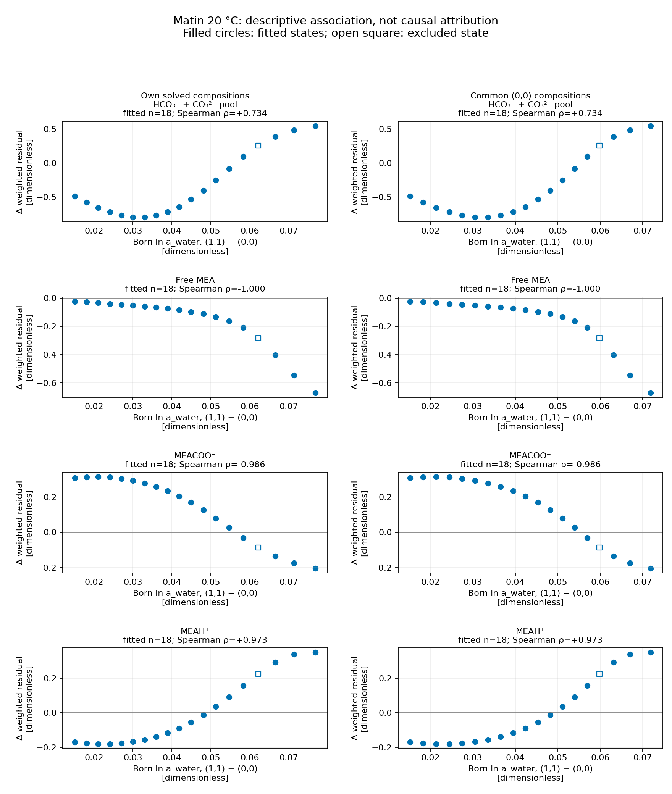

This notebook records the accepted #121 v2–v2.2 probes on installed wheel 28181e72. It is retained numerical evidence awaiting the parent's delivered review, with no parameter adoption. Cost means C = ½‖r_w‖²: 160 weighted targets at 84 states, with reaction constants fixed. Pressure uses ln(predicted/observed)/0.3; speciation uses (predicted−observed)/(0.1 observed+0.001). The reported bicarbonate target pools bicarbonate and carbonate.

The original 7.42423 cost penalty is concentrated in Matin 20 °C speciation (+11.34102); pressure (−1.77716) and Böttinger (−2.13963) favor (1,1). The re-evaluated baselines reproduce the retained values on the pinned wheel. Model D uses solvent-only permittivity. P1 decomposition and rank correlations are descriptive associations, not causal attribution.

The screening bounds are engineering analog envelopes: Figiel 2025, Model Parameters, Tables 2–3, p. 9411, reports non-proton Born diameters 2.784–4.985 Å, H⁺ 1.218 Å, and solvent factors water 1.5, methanol 1.4, ethanol 1.6 (Eqs. 8–10). It contains no MEA ions or MEA solvent factor. Each MEAH⁺, MEACOO⁻, HCO₃⁻, CO₃²⁻ and OH⁻ diameter uses 2–5 Å; H₃O⁺ uses 1–2 Å by H⁺ analogy; f_MEA uses 1–2 by solvent analogy. Held 2014 §2.3/Table 2 gives segment diameters, a different quantity. Local displacements are at most half each interval width. Water factor remains 1.5, epsilon_ion remains 8, and c_shell/c_dielectric stay in [0,1].

Finite differences use the declared scaled steps and entrywise tolerance, including one retry. No entry is dropped or zeroed. Five-coordinate bounded local least squares respect the (0,0) active bounds. A predicted reduction is a local screen; a capped refit establishes only its achieved reduction unless convergence is demonstrated. Thresholds 3.71 and 1.86 are declared screening thresholds, not statistical significance limits.

## Complete objective evaluations

Every complete evaluation has the three-group split below. P1 is a decomposition at retained states and has no new complete-objective cost.

| name | cost | pressure_cost | bottinger_cost | matin_cost | wall_s |
| --- | --- | --- | --- | --- | --- |
| baseline-00 | 40.20153733055829 | 11.842294320365763 | 7.620127375669452 | 20.739115634523074 | 23.96914978299901 |
| baseline-11 | 47.625767079386335 | 10.065137253900291 | 5.480496093109368 | 32.08013373237667 | 26.349379969000438 |
| baseline-00-exact-k | 40.20153733055829 | 11.842294320365763 | 7.620127375669452 | 20.739115634523074 | 29.464025040000706 |
| baseline-11-exact-k | 47.625767079386335 | 10.065137253900291 | 5.480496093109368 | 32.08013373237667 | 24.115818466998462 |
| equality-01-at-00 | 40.20153733055829 | 11.842294320365763 | 7.620127375669452 | 20.739115634523074 | 22.766841304997797 |
| p1b-0 | 454.51066343418114 | 386.2629189906784 | 4.864525059347153 | 63.3832193841556 | 21.742977187001088 |
| p1b-0.25 | 4407.072737672663 | 2616.26128620865 | 435.9706142679368 | 1354.8408371960759 | 23.093098977999034 |
| p1b-0.5 | 11297.582430259114 | 6155.9286140836 | 1576.4107412916132 | 3565.243074883899 | 23.646943050000118 |
| p1b-0.75 | 4107.287212412851 | 1954.369022550114 | 509.335112936234 | 1643.5830769265028 | 22.872281316002045 |
| branch-baseline-11 | 47.62576707938633 | 10.06513725390029 | 5.480496093109368 | 32.08013373237667 | 22.099737109998387 |
| branch-baseline-00 | 40.20153733055829 | 11.842294320365763 | 7.620127375669452 | 20.739115634523074 | 21.99991391400181 |
| fd-11-q0-rho0.0001-offset1 | 47.624840412675134 | 10.064662977125273 | 5.480129589910588 | 32.08004784563927 | 22.565686321999237 |
| fd-11-q0-rho0.0001-offset-1 | 47.62669655688095 | 10.065614066993758 | 5.480862710394579 | 32.080219779492616 | 22.60729881700172 |
| fd-11-q0-rho1e-05-offset1 | 47.625674286266914 | 10.065089712115357 | 5.480459437662805 | 32.08012513648875 | 22.3025605690018 |
| fd-11-q0-rho1e-05-offset-1 | 47.62585990062507 | 10.06518482104604 | 5.480532749709299 | 32.08014232986974 | 22.436368629001663 |
| fd-11-q1-rho0.0001-offset1 | 47.62586906670033 | 10.065393006313933 | 5.480882348322968 | 32.07959371206343 | 22.076295685998048 |
| fd-11-q1-rho0.0001-offset-1 | 47.62566590491044 | 10.064882188621077 | 5.480109805878871 | 32.080673910410496 | 22.45835598699705 |
| fd-11-q1-rho1e-05-offset1 | 47.62577724155598 | 10.065162798229675 | 5.480534720077748 | 32.08007972324856 | 22.063223687000573 |
| fd-11-q1-rho1e-05-offset-1 | 47.625756925355745 | 10.06511171644054 | 5.480457465832941 | 32.08018774308226 | 21.780143438001687 |
| fd-11-q2-rho0.0001-offset1 | 47.625281707696075 | 10.06424074090062 | 5.480135541525063 | 32.080905425270394 | 22.239600451001024 |
| fd-11-q2-rho0.0001-offset-1 | 47.62625430053578 | 10.066035630155831 | 5.48085677109635 | 32.0793618992836 | 22.395596673999535 |
| fd-11-q2-rho1e-05-offset1 | 47.625718459014365 | 10.065047518770655 | 5.48046003227127 | 32.08021090797244 | 22.049954701000388 |
| fd-11-q2-rho1e-05-offset-1 | 47.625815718258835 | 10.065227007655986 | 5.4805321552243536 | 32.0800565553785 | 23.453880479999498 |
| fd-11-q3-rho0.0001-offset1 | 47.6245476603069 | 10.065198432643598 | 5.479814467244011 | 32.07953476041929 | 22.95943642199927 |
| fd-11-q3-rho0.0001-offset-1 | 47.62698756456511 | 10.065076079809314 | 5.481178018175815 | 32.080733466579986 | 24.333181867998064 |
| fd-11-q3-rho1e-05-offset1 | 47.62564508952195 | 10.06514337156497 | 5.480427917067609 | 32.08007380088937 | 25.586569130999123 |
| fd-11-q3-rho1e-05-offset-1 | 47.62588907992246 | 10.065131136281343 | 5.480564272154806 | 32.08019367148631 | 23.250082255999587 |
| fd-11-q4-rho0.0001-offset1 | 47.625766775192254 | 10.065137230369293 | 5.48049607959587 | 32.08013346522709 | 22.960186442000122 |
| fd-11-q4-rho0.0001-offset-1 | 47.62576738367703 | 10.06513727743568 | 5.480496106637547 | 32.0801339996038 | 22.830691478997323 |
| fd-11-q4-rho1e-05-offset1 | 47.62576704895356 | 10.065137251544733 | 5.480496091748801 | 32.080133705660025 | 22.78202701900227 |
| fd-11-q4-rho1e-05-offset-1 | 47.62576710981685 | 10.065137256251779 | 5.480496094468734 | 32.080133759096334 | 23.676109195999743 |
| fd-11-q4-rho0.001-offset1 | 47.625764040673296 | 10.065137018847159 | 5.48049595807825 | 32.080131063747885 | 23.13622889200269 |
| fd-11-q4-rho0.001-offset-1 | 47.62577012547733 | 10.065137489503327 | 5.480496228499597 | 32.080136407474406 | 22.958579984999233 |
| fd-11-q5-rho0.0001-offset1 | 47.625767078649616 | 10.065137253073338 | 5.480496093125644 | 32.08013373245063 | 24.474792028999218 |
| fd-11-q5-rho0.0001-offset-1 | 47.62576708013908 | 10.065137254721584 | 5.480496093106567 | 32.08013373231093 | 24.563733760001924 |
| fd-11-q5-rho1e-05-offset1 | 47.62576707932017 | 10.065137253818254 | 5.480496093116918 | 32.080133732385 | 25.235839832999773 |
| fd-11-q5-rho1e-05-offset-1 | 47.625767079466094 | 10.06513725398145 | 5.4804960931149855 | 32.08013373236966 | 23.999402777997602 |
| fd-11-q5-rho0.001-offset1 | 47.62576707193553 | 10.065137245684863 | 5.480496093200187 | 32.08013373305048 | 23.574913937998645 |
| fd-11-q5-rho0.001-offset-1 | 47.625767086870695 | 10.065137262140752 | 5.480496093032197 | 32.08013373169775 | 23.55275869400066 |
| fd-11-q6-rho0.0001-offset-1 | 47.625097987880814 | 10.064759417707844 | 5.479657949542654 | 32.08068062063032 | 25.67398817799767 |
| fd-11-q6-rho0.0001-offset-2 | 47.62443067284843 | 10.064382671139882 | 5.478819909476372 | 32.08122809223218 | 24.624151216001337 |
| fd-11-q6-rho1e-05-offset-1 | 47.62570009031685 | 10.065099421262657 | 5.480412274101528 | 32.080188394952664 | 24.932008918000065 |
| fd-11-q6-rho1e-05-offset-2 | 47.62563311901467 | 10.065061599522991 | 5.480328456120515 | 32.080243063371164 | 23.4875837139989 |
| fd-11-q7-rho0.0001-offset1 | 47.62765316374227 | 10.065393594906284 | 5.47963201940448 | 32.08262754943151 | 24.2165784050012 |
| fd-11-q7-rho0.0001-offset2 | 47.62954223942902 | 10.065652495258494 | 5.4787681873142615 | 32.085121556856265 | 23.489078318001702 |
| fd-11-q7-rho1e-05-offset1 | 47.625955553212975 | 10.065162772830528 | 5.480409674871399 | 32.080383105511046 | 24.169980391001445 |
| fd-11-q7-rho1e-05-offset2 | 47.626144056954175 | 10.06518831735189 | 5.480323259042822 | 32.080632480559466 | 24.083240773001307 |
| fd-11-q8-rho0.0001-offset-1 | 47.63945120704564 | 10.073153664935077 | 5.491556840733223 | 32.07474070137734 | 24.011598688997765 |
| fd-11-q8-rho0.0001-offset-2 | 47.65383233421508 | 10.081741172256892 | 5.5026510490346485 | 32.069440112923544 | 24.786183707001328 |
| fd-11-q8-rho1e-05-offset-1 | 47.6271041440372 | 10.06591320046878 | 5.481600664400203 | 32.079590279168215 | 25.394194355001673 |
| fd-11-q8-rho1e-05-offset-2 | 47.62844817334774 | 10.066694856484155 | 5.4827055695776865 | 32.0790477472859 | 24.77083935400151 |
| fd-00-q0-rho0.0001-offset1 | 40.202252870918755 | 11.843025492803907 | 7.620509660117315 | 20.73871771799753 | 23.696236065999983 |
| fd-00-q0-rho0.0001-offset-1 | 40.20082185739675 | 11.841563164215726 | 7.619745038031022 | 20.739513655149995 | 25.692518359999667 |
| fd-00-q0-rho1e-05-offset1 | 40.201608881573705 | 11.842367436877943 | 7.62016560650881 | 20.73907583818695 | 25.47371066100095 |
| fd-00-q0-rho1e-05-offset-1 | 40.20146578021898 | 11.842221204019129 | 7.620089144300447 | 20.739155431899402 | 29.502167392998672 |
| fd-00-q1-rho0.0001-offset1 | 40.202245587476455 | 11.84298648235625 | 7.6202392065508135 | 20.73901989856939 | 30.45864618500127 |
| fd-00-q1-rho0.0001-offset-1 | 40.20082909814925 | 11.841602163756374 | 7.620015529978618 | 20.73921140441426 | 29.449796928998694 |
| fd-00-q1-rho1e-05-offset1 | 40.20160815514871 | 11.842363536324058 | 7.620138559425141 | 20.739106059399514 | 27.754229868998664 |
| fd-00-q1-rho1e-05-offset-1 | 40.20146650621503 | 11.842225104464468 | 7.6201161917666225 | 20.739125209983936 | 24.71463796399985 |
| fd-00-q2-rho0.0001-offset1 | 40.201480805848256 | 11.842294556722807 | 7.620300176654783 | 20.738886072470667 | 23.296382611002628 |
| fd-00-q2-rho0.0001-offset-1 | 40.20159387522815 | 11.84229408462129 | 7.619954547153918 | 20.739345243452938 | 23.409479786998418 |
| fd-00-q2-rho1e-05-offset1 | 40.20153167718949 | 11.842294343971583 | 7.6201446570081615 | 20.739092676209747 | 23.50249678399996 |
| fd-00-q2-rho1e-05-offset-1 | 40.2015429841261 | 11.842294296762663 | 7.620110094058526 | 20.739138593304908 | 24.109921441999177 |
| p2-predicted-best-group | 53.26329853692991 | 18.131575592016727 | 5.22890774410021 | 29.90281520081297 | 24.347805542998685 |
| p3-best-group | 43.95087709645577 | 10.079568329977882 | 5.800014813125253 | 28.071293953352633 | 149.78063386299982 |
| p4-fd-11-q0-rho0.0001-sign1 | 47.62556700256743 | 10.06444561270545 | 5.479299462862907 | 32.08182192699907 | 24.89566226700117 |
| p4-fd-11-q0-rho0.0001-sign-1 | 47.62597115057145 | 10.065831976445146 | 5.481693137299682 | 32.07844603682663 | 24.83689914200295 |
| p4-fd-11-q0-rho1e-05-sign1 | 47.62574689196419 | 10.06506795111694 | 5.480376411465065 | 32.08030252938219 | 24.503238893001253 |
| p4-fd-11-q0-rho1e-05-sign-1 | 47.625787306757246 | 10.065206587495446 | 5.480615778899281 | 32.07996494036252 | 23.544101432999014 |
| p4-fd-11-q1-rho0.0001-sign1 | 47.625706021095745 | 10.06511243583734 | 5.480504082185871 | 32.080089503072536 | 24.40063492000263 |
| p4-fd-11-q1-rho0.0001-sign-1 | 47.62582813863432 | 10.06516207248844 | 5.480488104119937 | 32.08017796202594 | 23.802129571002297 |
| p4-fd-11-q1-rho1e-05-sign1 | 47.62576097351568 | 10.065134772069916 | 5.480496892013729 | 32.08012930943204 | 23.720560338002542 |
| p4-fd-11-q1-rho1e-05-sign-1 | 47.6257731852682 | 10.065139735735759 | 5.480495294206256 | 32.08013815532619 | 23.940325096999004 |
| p4-fd-11-q2-rho0.0001-sign1 | 47.62595310522309 | 10.065810378452385 | 5.4816945930483 | 32.078448133722404 | 23.9946753309996 |
| p4-fd-11-q2-rho0.0001-sign-1 | 47.625585466615576 | 10.06446762827282 | 5.479298008248315 | 32.08181983009444 | 24.30881591800062 |
| p4-fd-11-q2-rho1e-05-sign1 | 47.625785483386906 | 10.06520440890403 | 5.480615924433165 | 32.07996515004971 | 24.209212484998716 |
| p4-fd-11-q2-rho1e-05-sign-1 | 47.625748719524736 | 10.065070133887144 | 5.480376265945481 | 32.08030231969211 | 23.958707677000348 |
| p4-fd-11-q3-rho0.0001-sign1 | 47.6257805811136 | 10.06511455305579 | 5.480488120977704 | 32.080177907080106 | 24.62619869500122 |
| p4-fd-11-q3-rho0.0001-sign-1 | 47.62575357886486 | 10.065159955523812 | 5.480504065328251 | 32.080089558012794 | 24.728387213999667 |
| p4-fd-11-q3-rho1e-05-sign1 | 47.62576842950735 | 10.065134983781139 | 5.48049529589275 | 32.080138149833466 | 24.87295495899889 |
| p4-fd-11-q3-rho1e-05-sign-1 | 47.625765729283486 | 10.065139524028984 | 5.480496890328451 | 32.080129314926054 | 24.75095232699823 |
| p4-predicted-joint-11 | 43.70548052953331 | 9.31127008371566 | 5.270143550924233 | 29.124066894893417 | 24.747356148000108 |
| p4-fd-00-q0-rho0.0001-sign1 | 40.19966885485269 | 11.840750598425654 | 7.61813058849433 | 20.740787667932704 | 24.79434954899989 |
| p4-fd-00-q0-rho0.0001-sign-1 | 40.20341007978347 | 11.84384105522551 | 7.6221247414328905 | 20.737444283125065 | 24.564148822999414 |
| p4-fd-00-q0-rho1e-05-sign1 | 40.201350290678285 | 11.842139812587131 | 7.619927670917414 | 20.739282807173737 | 24.55373227200107 |
| p4-fd-00-q0-rho1e-05-sign-1 | 40.20172441316956 | 11.84244885827181 | 7.6203270862085954 | 20.738948468689156 | 24.113552050999715 |
| p4-fd-00-q1-rho0.0001-sign1 | 40.201470731468056 | 11.842270701280036 | 7.620128199038806 | 20.739071831149214 | 23.502614023000206 |
| p4-fd-00-q1-rho0.0001-sign-1 | 40.20160393075342 | 11.842317939950599 | 7.620126552441587 | 20.739159438361238 | 25.14734007199877 |
| p4-fd-00-q1-rho1e-05-sign1 | 40.20153067059745 | 11.84229195843473 | 7.620127458000993 | 20.739111254161728 | 24.755678451998392 |
| p4-fd-00-q1-rho1e-05-sign-1 | 40.20154399052806 | 11.842296682302237 | 7.620127293340495 | 20.739120014885327 | 24.433100491001824 |
| p4-fd-00-q2-rho0.0001-sign1 | 40.20043478912092 | 11.840861553449649 | 7.62212738446733 | 20.737445851203944 | 24.868449000998226 |
| p4-fd-00-q2-rho0.0001-sign-1 | 40.202644465752186 | 11.84373041914321 | 7.618127946798885 | 20.74078609981009 | 23.73080055900209 |
| p4-fd-00-q2-rho1e-05-sign1 | 40.20142686969048 | 11.842150893738575 | 7.620327350453117 | 20.73894862549879 | 26.498115558999416 |
| p4-fd-00-q2-rho1e-05-sign-1 | 40.20164783736273 | 11.842437780310942 | 7.619927406687329 | 20.739282650364455 | 24.24121097099851 |
| p4-fd-00-q3-rho0.0001-sign1 | 40.201548723611786 | 11.84226273238227 | 7.620126593955563 | 20.73915939727395 | 23.623080522000237 |
| p4-fd-00-q3-rho0.0001-sign-1 | 40.20152593885826 | 11.842325909094011 | 7.62012815752516 | 20.73907187223909 | 24.23429325899997 |
| p4-fd-00-q3-rho1e-05-sign1 | 40.20153846980352 | 11.842291161535039 | 7.620127297491795 | 20.73912001077669 | 23.26293630299915 |
| p4-fd-00-q3-rho1e-05-sign-1 | 40.20153619132714 | 11.842297479205529 | 7.62012745384894 | 20.739111258272672 | 23.681835642000806 |
| p4-predicted-joint-00 | 32.550632956001905 | 8.503508388306146 | 6.179979371347656 | 17.867145196348105 | 23.505701161000616 |
| p5a-11-full-rescore | 53.76949192216955 | 8.143458770301347 | 3.10081948346976 | 42.52521366839844 | 23.696119711999927 |
| p5a-00-full-rescore | 43.62396270570897 | 11.436855954248276 | 5.7353296353712215 | 26.45177711608947 | 24.23406159800288 |
| p5b-11-full-rescore | 59.08177277859806 | 7.946708340095356 | 2.525063228296459 | 48.61000121020624 | 25.014570089002518 |
| p5b-00-full-rescore | 46.9854278700196 | 11.603555297027912 | 5.246481604550522 | 30.135390968441165 | 24.21358667200184 |

## Costs and signed residuals by source and species

Matin measured ambient-temperature acid/base titration and total inorganic carbon; this packet represents it at 20 °C. Its paper reports higher bicarbonate than Jakobsen NMR (Matin 2012, Experimental Section; Results and Discussion, Method Description and Speciation Comparisons, Table S1/Fig. 2). Böttinger 2008 uses online NMR (Experimental Section, NMR spectroscopy), with free and protonated MEA measured as their sum. Different source conditions and target definitions prevent treating opposite residual signs alone as experimental inconsistency. The inherited reaction-temperature screen held pivot ln K fixed; P4 adds offset directions and does not demonstrate that inherited enthalpies caused the Born-form gap.

| evaluation | source | species | n | cost | mean_signed_weighted_residual | basis |
| --- | --- | --- | --- | --- | --- | --- |
| baseline-00 | Matin | HCO3- | 18 | 3.8114741 | -0.43786536 | fitted targets; positive means model above; HCO3 includes carbonate pool |
| baseline-00 | Matin | MEA | 18 | 6.4842383 | -0.69642626 | fitted targets; positive means model above; HCO3 includes carbonate pool |
| baseline-00 | Matin | MEAH+ | 18 | 9.9848124 | 0.97760101 | fitted targets; positive means model above; HCO3 includes carbonate pool |
| baseline-00 | Matin | MEACOO- | 18 | 0.4585908 | 0.081936249 | fitted targets; positive means model above; HCO3 includes carbonate pool |
| baseline-00 | Matin | MEA + MEAH+ | 0 | None | None | no fitted target for this source/species |
| baseline-00 | Bottinger | HCO3- | 4 | 3.3727014 | 1.1262234 | fitted targets; positive means model above; HCO3 includes carbonate pool |
| baseline-00 | Bottinger | MEA | 0 | None | None | no fitted target for this source/species |
| baseline-00 | Bottinger | MEAH+ | 0 | None | None | no fitted target for this source/species |
| baseline-00 | Bottinger | MEACOO- | 18 | 3.5911974 | -0.5144415 | fitted targets; positive means model above; HCO3 includes carbonate pool |
| baseline-00 | Bottinger | MEA + MEAH+ | 18 | 0.65622852 | 0.11767319 | fitted targets; positive means model above; HCO3 includes carbonate pool |
| baseline-11 | Matin | HCO3- | 18 | 9.8353344 | -0.80852077 | fitted targets; positive means model above; HCO3 includes carbonate pool |
| baseline-11 | Matin | MEA | 18 | 9.908868 | -0.85426739 | fitted targets; positive means model above; HCO3 includes carbonate pool |
| baseline-11 | Matin | MEAH+ | 18 | 11.199874 | 0.95834858 | fitted targets; positive means model above; HCO3 includes carbonate pool |
| baseline-11 | Matin | MEACOO- | 18 | 1.1360575 | 0.23042101 | fitted targets; positive means model above; HCO3 includes carbonate pool |
| baseline-11 | Matin | MEA + MEAH+ | 0 | None | None | no fitted target for this source/species |
| baseline-11 | Bottinger | HCO3- | 4 | 2.3632005 | 0.70890076 | fitted targets; positive means model above; HCO3 includes carbonate pool |
| baseline-11 | Bottinger | MEA | 0 | None | None | no fitted target for this source/species |
| baseline-11 | Bottinger | MEAH+ | 0 | None | None | no fitted target for this source/species |
| baseline-11 | Bottinger | MEACOO- | 18 | 2.4524246 | -0.35165577 | fitted targets; positive means model above; HCO3 includes carbonate pool |
| baseline-11 | Bottinger | MEA + MEAH+ | 18 | 0.66487096 | 0.050738898 | fitted targets; positive means model above; HCO3 includes carbonate pool |
| baseline-00-exact-k | Matin | HCO3- | 18 | 3.8114741 | -0.43786536 | fitted targets; positive means model above; HCO3 includes carbonate pool |
| baseline-00-exact-k | Matin | MEA | 18 | 6.4842383 | -0.69642626 | fitted targets; positive means model above; HCO3 includes carbonate pool |
| baseline-00-exact-k | Matin | MEAH+ | 18 | 9.9848124 | 0.97760101 | fitted targets; positive means model above; HCO3 includes carbonate pool |
| baseline-00-exact-k | Matin | MEACOO- | 18 | 0.4585908 | 0.081936249 | fitted targets; positive means model above; HCO3 includes carbonate pool |
| baseline-00-exact-k | Matin | MEA + MEAH+ | 0 | None | None | no fitted target for this source/species |
| baseline-00-exact-k | Bottinger | HCO3- | 4 | 3.3727014 | 1.1262234 | fitted targets; positive means model above; HCO3 includes carbonate pool |
| baseline-00-exact-k | Bottinger | MEA | 0 | None | None | no fitted target for this source/species |
| baseline-00-exact-k | Bottinger | MEAH+ | 0 | None | None | no fitted target for this source/species |
| baseline-00-exact-k | Bottinger | MEACOO- | 18 | 3.5911974 | -0.5144415 | fitted targets; positive means model above; HCO3 includes carbonate pool |
| baseline-00-exact-k | Bottinger | MEA + MEAH+ | 18 | 0.65622852 | 0.11767319 | fitted targets; positive means model above; HCO3 includes carbonate pool |
| baseline-11-exact-k | Matin | HCO3- | 18 | 9.8353344 | -0.80852077 | fitted targets; positive means model above; HCO3 includes carbonate pool |
| baseline-11-exact-k | Matin | MEA | 18 | 9.908868 | -0.85426739 | fitted targets; positive means model above; HCO3 includes carbonate pool |
| baseline-11-exact-k | Matin | MEAH+ | 18 | 11.199874 | 0.95834858 | fitted targets; positive means model above; HCO3 includes carbonate pool |
| baseline-11-exact-k | Matin | MEACOO- | 18 | 1.1360575 | 0.23042101 | fitted targets; positive means model above; HCO3 includes carbonate pool |
| baseline-11-exact-k | Matin | MEA + MEAH+ | 0 | None | None | no fitted target for this source/species |
| baseline-11-exact-k | Bottinger | HCO3- | 4 | 2.3632005 | 0.70890076 | fitted targets; positive means model above; HCO3 includes carbonate pool |
| baseline-11-exact-k | Bottinger | MEA | 0 | None | None | no fitted target for this source/species |
| baseline-11-exact-k | Bottinger | MEAH+ | 0 | None | None | no fitted target for this source/species |
| baseline-11-exact-k | Bottinger | MEACOO- | 18 | 2.4524246 | -0.35165577 | fitted targets; positive means model above; HCO3 includes carbonate pool |
| baseline-11-exact-k | Bottinger | MEA + MEAH+ | 18 | 0.66487096 | 0.050738898 | fitted targets; positive means model above; HCO3 includes carbonate pool |
| equality-01-at-00 | Matin | HCO3- | 18 | 3.8114741 | -0.43786536 | fitted targets; positive means model above; HCO3 includes carbonate pool |
| equality-01-at-00 | Matin | MEA | 18 | 6.4842383 | -0.69642626 | fitted targets; positive means model above; HCO3 includes carbonate pool |
| equality-01-at-00 | Matin | MEAH+ | 18 | 9.9848124 | 0.97760101 | fitted targets; positive means model above; HCO3 includes carbonate pool |
| equality-01-at-00 | Matin | MEACOO- | 18 | 0.4585908 | 0.081936249 | fitted targets; positive means model above; HCO3 includes carbonate pool |
| equality-01-at-00 | Matin | MEA + MEAH+ | 0 | None | None | no fitted target for this source/species |
| equality-01-at-00 | Bottinger | HCO3- | 4 | 3.3727014 | 1.1262234 | fitted targets; positive means model above; HCO3 includes carbonate pool |
| equality-01-at-00 | Bottinger | MEA | 0 | None | None | no fitted target for this source/species |
| equality-01-at-00 | Bottinger | MEAH+ | 0 | None | None | no fitted target for this source/species |
| equality-01-at-00 | Bottinger | MEACOO- | 18 | 3.5911974 | -0.5144415 | fitted targets; positive means model above; HCO3 includes carbonate pool |
| equality-01-at-00 | Bottinger | MEA + MEAH+ | 18 | 0.65622852 | 0.11767319 | fitted targets; positive means model above; HCO3 includes carbonate pool |
| p1b-0 | Matin | HCO3- | 18 | 39.90565 | -2.0083995 | fitted targets; positive means model above; HCO3 includes carbonate pool |
| p1b-0 | Matin | MEA | 18 | 14.44868 | -0.99279243 | fitted targets; positive means model above; HCO3 includes carbonate pool |
| p1b-0 | Matin | MEAH+ | 18 | 4.8053363 | 0.62950098 | fitted targets; positive means model above; HCO3 includes carbonate pool |
| p1b-0 | Matin | MEACOO- | 18 | 4.2235525 | 0.64678649 | fitted targets; positive means model above; HCO3 includes carbonate pool |
| p1b-0 | Matin | MEA + MEAH+ | 0 | None | None | no fitted target for this source/species |
| p1b-0 | Bottinger | HCO3- | 4 | 2.5338498 | -1.0593614 | fitted targets; positive means model above; HCO3 includes carbonate pool |
| p1b-0 | Bottinger | MEA | 0 | None | None | no fitted target for this source/species |
| p1b-0 | Bottinger | MEAH+ | 0 | None | None | no fitted target for this source/species |
| p1b-0 | Bottinger | MEACOO- | 18 | 1.64019 | -0.056993929 | fitted targets; positive means model above; HCO3 includes carbonate pool |
| p1b-0 | Bottinger | MEA + MEAH+ | 18 | 0.69048519 | -0.14229203 | fitted targets; positive means model above; HCO3 includes carbonate pool |
| p1b-0.25 | Matin | HCO3- | 18 | 1005.4145 | 8.6446381 | fitted targets; positive means model above; HCO3 includes carbonate pool |
| p1b-0.25 | Matin | MEA | 18 | 18.613103 | -1.0739573 | fitted targets; positive means model above; HCO3 includes carbonate pool |
| p1b-0.25 | Matin | MEAH+ | 18 | 210.77311 | 4.1875797 | fitted targets; positive means model above; HCO3 includes carbonate pool |
| p1b-0.25 | Matin | MEACOO- | 18 | 120.04012 | -3.0293265 | fitted targets; positive means model above; HCO3 includes carbonate pool |
| p1b-0.25 | Matin | MEA + MEAH+ | 0 | None | None | no fitted target for this source/species |
| p1b-0.25 | Bottinger | HCO3- | 4 | 322.36635 | 11.616183 | fitted targets; positive means model above; HCO3 includes carbonate pool |
| p1b-0.25 | Bottinger | MEA | 0 | None | None | no fitted target for this source/species |
| p1b-0.25 | Bottinger | MEAH+ | 0 | None | None | no fitted target for this source/species |
| p1b-0.25 | Bottinger | MEACOO- | 18 | 76.948663 | -2.3958787 | fitted targets; positive means model above; HCO3 includes carbonate pool |
| p1b-0.25 | Bottinger | MEA + MEAH+ | 18 | 36.6556 | 1.3870255 | fitted targets; positive means model above; HCO3 includes carbonate pool |
| p1b-0.5 | Matin | HCO3- | 18 | 2738.4074 | 15.88846 | fitted targets; positive means model above; HCO3 includes carbonate pool |
| p1b-0.5 | Matin | MEA | 18 | 27.075828 | -1.2648196 | fitted targets; positive means model above; HCO3 includes carbonate pool |
| p1b-0.5 | Matin | MEAH+ | 18 | 475.57896 | 6.8213058 | fitted targets; positive means model above; HCO3 includes carbonate pool |
| p1b-0.5 | Matin | MEACOO- | 18 | 324.18087 | -5.6140327 | fitted targets; positive means model above; HCO3 includes carbonate pool |
| p1b-0.5 | Matin | MEA + MEAH+ | 0 | None | None | no fitted target for this source/species |
| p1b-0.5 | Bottinger | HCO3- | 4 | 1218.3459 | 23.935804 | fitted targets; positive means model above; HCO3 includes carbonate pool |
| p1b-0.5 | Bottinger | MEA | 0 | None | None | no fitted target for this source/species |
| p1b-0.5 | Bottinger | MEAH+ | 0 | None | None | no fitted target for this source/species |
| p1b-0.5 | Bottinger | MEACOO- | 18 | 248.74265 | -4.6858284 | fitted targets; positive means model above; HCO3 includes carbonate pool |
| p1b-0.5 | Bottinger | MEA + MEAH+ | 18 | 109.32218 | 2.7258645 | fitted targets; positive means model above; HCO3 includes carbonate pool |
| p1b-0.75 | Matin | HCO3- | 18 | 1230.9407 | 9.8538753 | fitted targets; positive means model above; HCO3 includes carbonate pool |
| p1b-0.75 | Matin | MEA | 18 | 19.658415 | -1.1003352 | fitted targets; positive means model above; HCO3 includes carbonate pool |
| p1b-0.75 | Matin | MEAH+ | 18 | 246.63609 | 4.6226438 | fitted targets; positive means model above; HCO3 includes carbonate pool |
| p1b-0.75 | Matin | MEACOO- | 18 | 146.34786 | -3.4588338 | fitted targets; positive means model above; HCO3 includes carbonate pool |
| p1b-0.75 | Matin | MEA + MEAH+ | 0 | None | None | no fitted target for this source/species |
| p1b-0.75 | Bottinger | HCO3- | 4 | 374.63348 | 12.490636 | fitted targets; positive means model above; HCO3 includes carbonate pool |
| p1b-0.75 | Bottinger | MEA | 0 | None | None | no fitted target for this source/species |
| p1b-0.75 | Bottinger | MEAH+ | 0 | None | None | no fitted target for this source/species |
| p1b-0.75 | Bottinger | MEACOO- | 18 | 91.724653 | -2.6436888 | fitted targets; positive means model above; HCO3 includes carbonate pool |
| p1b-0.75 | Bottinger | MEA + MEAH+ | 18 | 42.976981 | 1.5281124 | fitted targets; positive means model above; HCO3 includes carbonate pool |
| branch-baseline-11 | Matin | HCO3- | 18 | 9.8353344 | -0.80852077 | fitted targets; positive means model above; HCO3 includes carbonate pool |
| branch-baseline-11 | Matin | MEA | 18 | 9.908868 | -0.85426739 | fitted targets; positive means model above; HCO3 includes carbonate pool |
| branch-baseline-11 | Matin | MEAH+ | 18 | 11.199874 | 0.95834858 | fitted targets; positive means model above; HCO3 includes carbonate pool |
| branch-baseline-11 | Matin | MEACOO- | 18 | 1.1360575 | 0.23042101 | fitted targets; positive means model above; HCO3 includes carbonate pool |
| branch-baseline-11 | Matin | MEA + MEAH+ | 0 | None | None | no fitted target for this source/species |
| branch-baseline-11 | Bottinger | HCO3- | 4 | 2.3632005 | 0.70890076 | fitted targets; positive means model above; HCO3 includes carbonate pool |
| branch-baseline-11 | Bottinger | MEA | 0 | None | None | no fitted target for this source/species |
| branch-baseline-11 | Bottinger | MEAH+ | 0 | None | None | no fitted target for this source/species |
| branch-baseline-11 | Bottinger | MEACOO- | 18 | 2.4524246 | -0.35165577 | fitted targets; positive means model above; HCO3 includes carbonate pool |
| branch-baseline-11 | Bottinger | MEA + MEAH+ | 18 | 0.66487096 | 0.050738898 | fitted targets; positive means model above; HCO3 includes carbonate pool |
| branch-baseline-00 | Matin | HCO3- | 18 | 3.8114741 | -0.43786536 | fitted targets; positive means model above; HCO3 includes carbonate pool |
| branch-baseline-00 | Matin | MEA | 18 | 6.4842383 | -0.69642626 | fitted targets; positive means model above; HCO3 includes carbonate pool |
| branch-baseline-00 | Matin | MEAH+ | 18 | 9.9848124 | 0.97760101 | fitted targets; positive means model above; HCO3 includes carbonate pool |
| branch-baseline-00 | Matin | MEACOO- | 18 | 0.4585908 | 0.081936249 | fitted targets; positive means model above; HCO3 includes carbonate pool |
| branch-baseline-00 | Matin | MEA + MEAH+ | 0 | None | None | no fitted target for this source/species |
| branch-baseline-00 | Bottinger | HCO3- | 4 | 3.3727014 | 1.1262234 | fitted targets; positive means model above; HCO3 includes carbonate pool |
| branch-baseline-00 | Bottinger | MEA | 0 | None | None | no fitted target for this source/species |
| branch-baseline-00 | Bottinger | MEAH+ | 0 | None | None | no fitted target for this source/species |
| branch-baseline-00 | Bottinger | MEACOO- | 18 | 3.5911974 | -0.5144415 | fitted targets; positive means model above; HCO3 includes carbonate pool |
| branch-baseline-00 | Bottinger | MEA + MEAH+ | 18 | 0.65622852 | 0.11767319 | fitted targets; positive means model above; HCO3 includes carbonate pool |
| fd-11-q0-rho0.0001-offset1 | Matin | HCO3- | 18 | 9.8358338 | -0.80858014 | fitted targets; positive means model above; HCO3 includes carbonate pool |
| fd-11-q0-rho0.0001-offset1 | Matin | MEA | 18 | 9.9087753 | -0.85426443 | fitted targets; positive means model above; HCO3 includes carbonate pool |
| fd-11-q0-rho0.0001-offset1 | Matin | MEAH+ | 18 | 11.199347 | 0.95832793 | fitted targets; positive means model above; HCO3 includes carbonate pool |
| fd-11-q0-rho0.0001-offset1 | Matin | MEACOO- | 18 | 1.1360917 | 0.23044145 | fitted targets; positive means model above; HCO3 includes carbonate pool |
| fd-11-q0-rho0.0001-offset1 | Matin | MEA + MEAH+ | 0 | None | None | no fitted target for this source/species |
| fd-11-q0-rho0.0001-offset1 | Bottinger | HCO3- | 4 | 2.3629629 | 0.70884459 | fitted targets; positive means model above; HCO3 includes carbonate pool |
| fd-11-q0-rho0.0001-offset1 | Bottinger | MEA | 0 | None | None | no fitted target for this source/species |
| fd-11-q0-rho0.0001-offset1 | Bottinger | MEAH+ | 0 | None | None | no fitted target for this source/species |
| fd-11-q0-rho0.0001-offset1 | Bottinger | MEACOO- | 18 | 2.4523305 | -0.35164459 | fitted targets; positive means model above; HCO3 includes carbonate pool |
| fd-11-q0-rho0.0001-offset1 | Bottinger | MEA + MEAH+ | 18 | 0.66483623 | 0.050731353 | fitted targets; positive means model above; HCO3 includes carbonate pool |
| fd-11-q0-rho0.0001-offset-1 | Matin | HCO3- | 18 | 9.8348349 | -0.80846138 | fitted targets; positive means model above; HCO3 includes carbonate pool |
| fd-11-q0-rho0.0001-offset-1 | Matin | MEA | 18 | 9.9089607 | -0.85427035 | fitted targets; positive means model above; HCO3 includes carbonate pool |
| fd-11-q0-rho0.0001-offset-1 | Matin | MEAH+ | 18 | 11.200401 | 0.95836923 | fitted targets; positive means model above; HCO3 includes carbonate pool |
| fd-11-q0-rho0.0001-offset-1 | Matin | MEACOO- | 18 | 1.1360234 | 0.23040057 | fitted targets; positive means model above; HCO3 includes carbonate pool |
| fd-11-q0-rho0.0001-offset-1 | Matin | MEA + MEAH+ | 0 | None | None | no fitted target for this source/species |
| fd-11-q0-rho0.0001-offset-1 | Bottinger | HCO3- | 4 | 2.3634382 | 0.70895694 | fitted targets; positive means model above; HCO3 includes carbonate pool |
| fd-11-q0-rho0.0001-offset-1 | Bottinger | MEA | 0 | None | None | no fitted target for this source/species |
| fd-11-q0-rho0.0001-offset-1 | Bottinger | MEAH+ | 0 | None | None | no fitted target for this source/species |
| fd-11-q0-rho0.0001-offset-1 | Bottinger | MEACOO- | 18 | 2.4525188 | -0.35166695 | fitted targets; positive means model above; HCO3 includes carbonate pool |
| fd-11-q0-rho0.0001-offset-1 | Bottinger | MEA + MEAH+ | 18 | 0.6649057 | 0.050746444 | fitted targets; positive means model above; HCO3 includes carbonate pool |
| fd-11-q0-rho1e-05-offset1 | Matin | HCO3- | 18 | 9.8353843 | -0.80852671 | fitted targets; positive means model above; HCO3 includes carbonate pool |
| fd-11-q0-rho1e-05-offset1 | Matin | MEA | 18 | 9.9088587 | -0.85426709 | fitted targets; positive means model above; HCO3 includes carbonate pool |
| fd-11-q0-rho1e-05-offset1 | Matin | MEAH+ | 18 | 11.199821 | 0.95834651 | fitted targets; positive means model above; HCO3 includes carbonate pool |
| fd-11-q0-rho1e-05-offset1 | Matin | MEACOO- | 18 | 1.136061 | 0.23042306 | fitted targets; positive means model above; HCO3 includes carbonate pool |
| fd-11-q0-rho1e-05-offset1 | Matin | MEA + MEAH+ | 0 | None | None | no fitted target for this source/species |
| fd-11-q0-rho1e-05-offset1 | Bottinger | HCO3- | 4 | 2.3631767 | 0.70889514 | fitted targets; positive means model above; HCO3 includes carbonate pool |
| fd-11-q0-rho1e-05-offset1 | Bottinger | MEA | 0 | None | None | no fitted target for this source/species |
| fd-11-q0-rho1e-05-offset1 | Bottinger | MEAH+ | 0 | None | None | no fitted target for this source/species |
| fd-11-q0-rho1e-05-offset1 | Bottinger | MEACOO- | 18 | 2.4524152 | -0.35165465 | fitted targets; positive means model above; HCO3 includes carbonate pool |
| fd-11-q0-rho1e-05-offset1 | Bottinger | MEA + MEAH+ | 18 | 0.66486748 | 0.050738143 | fitted targets; positive means model above; HCO3 includes carbonate pool |
| fd-11-q0-rho1e-05-offset-1 | Matin | HCO3- | 18 | 9.8352844 | -0.80851483 | fitted targets; positive means model above; HCO3 includes carbonate pool |
| fd-11-q0-rho1e-05-offset-1 | Matin | MEA | 18 | 9.9088773 | -0.85426768 | fitted targets; positive means model above; HCO3 includes carbonate pool |
| fd-11-q0-rho1e-05-offset-1 | Matin | MEAH+ | 18 | 11.199927 | 0.95835064 | fitted targets; positive means model above; HCO3 includes carbonate pool |
| fd-11-q0-rho1e-05-offset-1 | Matin | MEACOO- | 18 | 1.1360541 | 0.23041897 | fitted targets; positive means model above; HCO3 includes carbonate pool |
| fd-11-q0-rho1e-05-offset-1 | Matin | MEA + MEAH+ | 0 | None | None | no fitted target for this source/species |
| fd-11-q0-rho1e-05-offset-1 | Bottinger | HCO3- | 4 | 2.3632243 | 0.70890637 | fitted targets; positive means model above; HCO3 includes carbonate pool |
| fd-11-q0-rho1e-05-offset-1 | Bottinger | MEA | 0 | None | None | no fitted target for this source/species |
| fd-11-q0-rho1e-05-offset-1 | Bottinger | MEAH+ | 0 | None | None | no fitted target for this source/species |
| fd-11-q0-rho1e-05-offset-1 | Bottinger | MEACOO- | 18 | 2.452434 | -0.35165689 | fitted targets; positive means model above; HCO3 includes carbonate pool |
| fd-11-q0-rho1e-05-offset-1 | Bottinger | MEA + MEAH+ | 18 | 0.66487443 | 0.050739652 | fitted targets; positive means model above; HCO3 includes carbonate pool |
| fd-11-q1-rho0.0001-offset1 | Matin | HCO3- | 18 | 9.8349894 | -0.80847994 | fitted targets; positive means model above; HCO3 includes carbonate pool |
| fd-11-q1-rho0.0001-offset1 | Matin | MEA | 18 | 9.9085233 | -0.85425529 | fitted targets; positive means model above; HCO3 includes carbonate pool |
| fd-11-q1-rho0.0001-offset1 | Matin | MEAH+ | 18 | 11.20005 | 0.95835591 | fitted targets; positive means model above; HCO3 includes carbonate pool |
| fd-11-q1-rho0.0001-offset1 | Matin | MEACOO- | 18 | 1.1360314 | 0.23040681 | fitted targets; positive means model above; HCO3 includes carbonate pool |
| fd-11-q1-rho0.0001-offset1 | Matin | MEA + MEAH+ | 0 | None | None | no fitted target for this source/species |
| fd-11-q1-rho0.0001-offset1 | Bottinger | HCO3- | 4 | 2.3634959 | 0.70898731 | fitted targets; positive means model above; HCO3 includes carbonate pool |
| fd-11-q1-rho0.0001-offset1 | Bottinger | MEA | 0 | None | None | no fitted target for this source/species |
| fd-11-q1-rho0.0001-offset1 | Bottinger | MEAH+ | 0 | None | None | no fitted target for this source/species |
| fd-11-q1-rho0.0001-offset1 | Bottinger | MEACOO- | 18 | 2.4524955 | -0.35166826 | fitted targets; positive means model above; HCO3 includes carbonate pool |
| fd-11-q1-rho0.0001-offset1 | Bottinger | MEA + MEAH+ | 18 | 0.66489099 | 0.050747132 | fitted targets; positive means model above; HCO3 includes carbonate pool |
| fd-11-q1-rho0.0001-offset-1 | Matin | HCO3- | 18 | 9.8356794 | -0.80856161 | fitted targets; positive means model above; HCO3 includes carbonate pool |
| fd-11-q1-rho0.0001-offset-1 | Matin | MEA | 18 | 9.9092127 | -0.85427949 | fitted targets; positive means model above; HCO3 includes carbonate pool |
| fd-11-q1-rho0.0001-offset-1 | Matin | MEAH+ | 18 | 11.199698 | 0.95834125 | fitted targets; positive means model above; HCO3 includes carbonate pool |
| fd-11-q1-rho0.0001-offset-1 | Matin | MEACOO- | 18 | 1.1360837 | 0.23043522 | fitted targets; positive means model above; HCO3 includes carbonate pool |
| fd-11-q1-rho0.0001-offset-1 | Matin | MEA + MEAH+ | 0 | None | None | no fitted target for this source/species |
| fd-11-q1-rho0.0001-offset-1 | Bottinger | HCO3- | 4 | 2.3629051 | 0.70881419 | fitted targets; positive means model above; HCO3 includes carbonate pool |
| fd-11-q1-rho0.0001-offset-1 | Bottinger | MEA | 0 | None | None | no fitted target for this source/species |
| fd-11-q1-rho0.0001-offset-1 | Bottinger | MEAH+ | 0 | None | None | no fitted target for this source/species |
| fd-11-q1-rho0.0001-offset-1 | Bottinger | MEACOO- | 18 | 2.4523537 | -0.35164327 | fitted targets; positive means model above; HCO3 includes carbonate pool |
| fd-11-q1-rho0.0001-offset-1 | Bottinger | MEA + MEAH+ | 18 | 0.66485092 | 0.050730661 | fitted targets; positive means model above; HCO3 includes carbonate pool |
| fd-11-q1-rho1e-05-offset1 | Matin | HCO3- | 18 | 9.8352999 | -0.80851669 | fitted targets; positive means model above; HCO3 includes carbonate pool |
| fd-11-q1-rho1e-05-offset1 | Matin | MEA | 18 | 9.9088335 | -0.85426618 | fitted targets; positive means model above; HCO3 includes carbonate pool |
| fd-11-q1-rho1e-05-offset1 | Matin | MEAH+ | 18 | 11.199891 | 0.95834931 | fitted targets; positive means model above; HCO3 includes carbonate pool |
| fd-11-q1-rho1e-05-offset1 | Matin | MEACOO- | 18 | 1.1360549 | 0.23041959 | fitted targets; positive means model above; HCO3 includes carbonate pool |
| fd-11-q1-rho1e-05-offset1 | Matin | MEA + MEAH+ | 0 | None | None | no fitted target for this source/species |
| fd-11-q1-rho1e-05-offset1 | Bottinger | HCO3- | 4 | 2.3632301 | 0.70890941 | fitted targets; positive means model above; HCO3 includes carbonate pool |
| fd-11-q1-rho1e-05-offset1 | Bottinger | MEA | 0 | None | None | no fitted target for this source/species |
| fd-11-q1-rho1e-05-offset1 | Bottinger | MEAH+ | 0 | None | None | no fitted target for this source/species |
| fd-11-q1-rho1e-05-offset1 | Bottinger | MEACOO- | 18 | 2.4524317 | -0.35165702 | fitted targets; positive means model above; HCO3 includes carbonate pool |
| fd-11-q1-rho1e-05-offset1 | Bottinger | MEA + MEAH+ | 18 | 0.66487296 | 0.050739721 | fitted targets; positive means model above; HCO3 includes carbonate pool |
| fd-11-q1-rho1e-05-offset-1 | Matin | HCO3- | 18 | 9.8353689 | -0.80852485 | fitted targets; positive means model above; HCO3 includes carbonate pool |
| fd-11-q1-rho1e-05-offset-1 | Matin | MEA | 18 | 9.9089025 | -0.8542686 | fitted targets; positive means model above; HCO3 includes carbonate pool |
| fd-11-q1-rho1e-05-offset-1 | Matin | MEAH+ | 18 | 11.199856 | 0.95834785 | fitted targets; positive means model above; HCO3 includes carbonate pool |
| fd-11-q1-rho1e-05-offset-1 | Matin | MEACOO- | 18 | 1.1360601 | 0.23042243 | fitted targets; positive means model above; HCO3 includes carbonate pool |
| fd-11-q1-rho1e-05-offset-1 | Matin | MEA + MEAH+ | 0 | None | None | no fitted target for this source/species |
| fd-11-q1-rho1e-05-offset-1 | Bottinger | HCO3- | 4 | 2.363171 | 0.7088921 | fitted targets; positive means model above; HCO3 includes carbonate pool |
| fd-11-q1-rho1e-05-offset-1 | Bottinger | MEA | 0 | None | None | no fitted target for this source/species |
| fd-11-q1-rho1e-05-offset-1 | Bottinger | MEAH+ | 0 | None | None | no fitted target for this source/species |
| fd-11-q1-rho1e-05-offset-1 | Bottinger | MEACOO- | 18 | 2.4524175 | -0.35165452 | fitted targets; positive means model above; HCO3 includes carbonate pool |
| fd-11-q1-rho1e-05-offset-1 | Bottinger | MEA + MEAH+ | 18 | 0.66486895 | 0.050738074 | fitted targets; positive means model above; HCO3 includes carbonate pool |
| fd-11-q2-rho0.0001-offset1 | Matin | HCO3- | 18 | 9.8355197 | -0.80854576 | fitted targets; positive means model above; HCO3 includes carbonate pool |
| fd-11-q2-rho0.0001-offset1 | Matin | MEA | 18 | 9.9094065 | -0.85428614 | fitted targets; positive means model above; HCO3 includes carbonate pool |
| fd-11-q2-rho0.0001-offset1 | Matin | MEAH+ | 18 | 11.199907 | 0.95834974 | fitted targets; positive means model above; HCO3 includes carbonate pool |
| fd-11-q2-rho0.0001-offset1 | Matin | MEACOO- | 18 | 1.1360718 | 0.23042974 | fitted targets; positive means model above; HCO3 includes carbonate pool |
| fd-11-q2-rho0.0001-offset1 | Matin | MEA + MEAH+ | 0 | None | None | no fitted target for this source/species |
| fd-11-q2-rho0.0001-offset1 | Bottinger | HCO3- | 4 | 2.3629 | 0.70880597 | fitted targets; positive means model above; HCO3 includes carbonate pool |
| fd-11-q2-rho0.0001-offset1 | Bottinger | MEA | 0 | None | None | no fitted target for this source/species |
| fd-11-q2-rho0.0001-offset1 | Bottinger | MEAH+ | 0 | None | None | no fitted target for this source/species |
| fd-11-q2-rho0.0001-offset1 | Bottinger | MEACOO- | 18 | 2.452375 | -0.35164422 | fitted targets; positive means model above; HCO3 includes carbonate pool |
| fd-11-q2-rho0.0001-offset1 | Bottinger | MEA + MEAH+ | 18 | 0.66486061 | 0.050731251 | fitted targets; positive means model above; HCO3 includes carbonate pool |
| fd-11-q2-rho0.0001-offset-1 | Matin | HCO3- | 18 | 9.835149 | -0.80849577 | fitted targets; positive means model above; HCO3 includes carbonate pool |
| fd-11-q2-rho0.0001-offset-1 | Matin | MEA | 18 | 9.9083294 | -0.85424863 | fitted targets; positive means model above; HCO3 includes carbonate pool |
| fd-11-q2-rho0.0001-offset-1 | Matin | MEAH+ | 18 | 11.19984 | 0.95834742 | fitted targets; positive means model above; HCO3 includes carbonate pool |
| fd-11-q2-rho0.0001-offset-1 | Matin | MEACOO- | 18 | 1.1360432 | 0.23041229 | fitted targets; positive means model above; HCO3 includes carbonate pool |
| fd-11-q2-rho0.0001-offset-1 | Matin | MEA + MEAH+ | 0 | None | None | no fitted target for this source/species |
| fd-11-q2-rho0.0001-offset-1 | Bottinger | HCO3- | 4 | 2.3635012 | 0.70899557 | fitted targets; positive means model above; HCO3 includes carbonate pool |
| fd-11-q2-rho0.0001-offset-1 | Bottinger | MEA | 0 | None | None | no fitted target for this source/species |
| fd-11-q2-rho0.0001-offset-1 | Bottinger | MEAH+ | 0 | None | None | no fitted target for this source/species |
| fd-11-q2-rho0.0001-offset-1 | Bottinger | MEACOO- | 18 | 2.4524743 | -0.35166732 | fitted targets; positive means model above; HCO3 includes carbonate pool |
| fd-11-q2-rho0.0001-offset-1 | Bottinger | MEA + MEAH+ | 18 | 0.66488131 | 0.050746545 | fitted targets; positive means model above; HCO3 includes carbonate pool |
| fd-11-q2-rho1e-05-offset1 | Matin | HCO3- | 18 | 9.8353529 | -0.80852327 | fitted targets; positive means model above; HCO3 includes carbonate pool |
| fd-11-q2-rho1e-05-offset1 | Matin | MEA | 18 | 9.9089219 | -0.85426926 | fitted targets; positive means model above; HCO3 includes carbonate pool |
| fd-11-q2-rho1e-05-offset1 | Matin | MEAH+ | 18 | 11.199877 | 0.95834869 | fitted targets; positive means model above; HCO3 includes carbonate pool |
| fd-11-q2-rho1e-05-offset1 | Matin | MEACOO- | 18 | 1.136059 | 0.23042188 | fitted targets; positive means model above; HCO3 includes carbonate pool |
| fd-11-q2-rho1e-05-offset1 | Matin | MEA + MEAH+ | 0 | None | None | no fitted target for this source/species |
| fd-11-q2-rho1e-05-offset1 | Bottinger | HCO3- | 4 | 2.3631705 | 0.70889128 | fitted targets; positive means model above; HCO3 includes carbonate pool |
| fd-11-q2-rho1e-05-offset1 | Bottinger | MEA | 0 | None | None | no fitted target for this source/species |
| fd-11-q2-rho1e-05-offset1 | Bottinger | MEAH+ | 0 | None | None | no fitted target for this source/species |
| fd-11-q2-rho1e-05-offset1 | Bottinger | MEACOO- | 18 | 2.4524197 | -0.35165461 | fitted targets; positive means model above; HCO3 includes carbonate pool |
| fd-11-q2-rho1e-05-offset1 | Bottinger | MEA + MEAH+ | 18 | 0.66486992 | 0.050738133 | fitted targets; positive means model above; HCO3 includes carbonate pool |
| fd-11-q2-rho1e-05-offset-1 | Matin | HCO3- | 18 | 9.8353158 | -0.80851827 | fitted targets; positive means model above; HCO3 includes carbonate pool |
| fd-11-q2-rho1e-05-offset-1 | Matin | MEA | 18 | 9.9088141 | -0.85426551 | fitted targets; positive means model above; HCO3 includes carbonate pool |
| fd-11-q2-rho1e-05-offset-1 | Matin | MEAH+ | 18 | 11.19987 | 0.95834846 | fitted targets; positive means model above; HCO3 includes carbonate pool |
| fd-11-q2-rho1e-05-offset-1 | Matin | MEACOO- | 18 | 1.1360561 | 0.23042014 | fitted targets; positive means model above; HCO3 includes carbonate pool |
| fd-11-q2-rho1e-05-offset-1 | Matin | MEA + MEAH+ | 0 | None | None | no fitted target for this source/species |
| fd-11-q2-rho1e-05-offset-1 | Bottinger | HCO3- | 4 | 2.3632306 | 0.70891024 | fitted targets; positive means model above; HCO3 includes carbonate pool |
| fd-11-q2-rho1e-05-offset-1 | Bottinger | MEA | 0 | None | None | no fitted target for this source/species |
| fd-11-q2-rho1e-05-offset-1 | Bottinger | MEAH+ | 0 | None | None | no fitted target for this source/species |
| fd-11-q2-rho1e-05-offset-1 | Bottinger | MEACOO- | 18 | 2.4524296 | -0.35165692 | fitted targets; positive means model above; HCO3 includes carbonate pool |
| fd-11-q2-rho1e-05-offset-1 | Bottinger | MEA + MEAH+ | 18 | 0.66487199 | 0.050739662 | fitted targets; positive means model above; HCO3 includes carbonate pool |
| fd-11-q3-rho0.0001-offset1 | Matin | HCO3- | 18 | 9.836156 | -0.80863259 | fitted targets; positive means model above; HCO3 includes carbonate pool |
| fd-11-q3-rho0.0001-offset1 | Matin | MEA | 18 | 9.9085105 | -0.85425566 | fitted targets; positive means model above; HCO3 includes carbonate pool |
| fd-11-q3-rho0.0001-offset1 | Matin | MEAH+ | 18 | 11.198761 | 0.95830722 | fitted targets; positive means model above; HCO3 includes carbonate pool |
| fd-11-q3-rho0.0001-offset1 | Matin | MEACOO- | 18 | 1.1361069 | 0.23045929 | fitted targets; positive means model above; HCO3 includes carbonate pool |
| fd-11-q3-rho0.0001-offset1 | Matin | MEA + MEAH+ | 0 | None | None | no fitted target for this source/species |
| fd-11-q3-rho0.0001-offset1 | Bottinger | HCO3- | 4 | 2.362764 | 0.70880404 | fitted targets; positive means model above; HCO3 includes carbonate pool |
| fd-11-q3-rho0.0001-offset1 | Bottinger | MEA | 0 | None | None | no fitted target for this source/species |
| fd-11-q3-rho0.0001-offset1 | Bottinger | MEAH+ | 0 | None | None | no fitted target for this source/species |
| fd-11-q3-rho0.0001-offset1 | Bottinger | MEACOO- | 18 | 2.4522501 | -0.35163636 | fitted targets; positive means model above; HCO3 includes carbonate pool |
| fd-11-q3-rho0.0001-offset1 | Bottinger | MEA + MEAH+ | 18 | 0.66480031 | 0.050725295 | fitted targets; positive means model above; HCO3 includes carbonate pool |
| fd-11-q3-rho0.0001-offset-1 | Matin | HCO3- | 18 | 9.8345129 | -0.80840892 | fitted targets; positive means model above; HCO3 includes carbonate pool |
| fd-11-q3-rho0.0001-offset-1 | Matin | MEA | 18 | 9.9092256 | -0.85427912 | fitted targets; positive means model above; HCO3 includes carbonate pool |
| fd-11-q3-rho0.0001-offset-1 | Matin | MEAH+ | 18 | 11.200987 | 0.95838996 | fitted targets; positive means model above; HCO3 includes carbonate pool |
| fd-11-q3-rho0.0001-offset-1 | Matin | MEACOO- | 18 | 1.1360082 | 0.23038272 | fitted targets; positive means model above; HCO3 includes carbonate pool |
| fd-11-q3-rho0.0001-offset-1 | Matin | MEA + MEAH+ | 0 | None | None | no fitted target for this source/species |
| fd-11-q3-rho0.0001-offset-1 | Bottinger | HCO3- | 4 | 2.3636372 | 0.70899751 | fitted targets; positive means model above; HCO3 includes carbonate pool |
| fd-11-q3-rho0.0001-offset-1 | Bottinger | MEA | 0 | None | None | no fitted target for this source/species |
| fd-11-q3-rho0.0001-offset-1 | Bottinger | MEAH+ | 0 | None | None | no fitted target for this source/species |
| fd-11-q3-rho0.0001-offset-1 | Bottinger | MEACOO- | 18 | 2.4525992 | -0.35167518 | fitted targets; positive means model above; HCO3 includes carbonate pool |
| fd-11-q3-rho0.0001-offset-1 | Bottinger | MEA + MEAH+ | 18 | 0.66494163 | 0.050752505 | fitted targets; positive means model above; HCO3 includes carbonate pool |
| fd-11-q3-rho1e-05-offset1 | Matin | HCO3- | 18 | 9.8354165 | -0.80853195 | fitted targets; positive means model above; HCO3 includes carbonate pool |
| fd-11-q3-rho1e-05-offset1 | Matin | MEA | 18 | 9.9088322 | -0.85426622 | fitted targets; positive means model above; HCO3 includes carbonate pool |
| fd-11-q3-rho1e-05-offset1 | Matin | MEAH+ | 18 | 11.199763 | 0.95834444 | fitted targets; positive means model above; HCO3 includes carbonate pool |
| fd-11-q3-rho1e-05-offset1 | Matin | MEACOO- | 18 | 1.1360625 | 0.23042484 | fitted targets; positive means model above; HCO3 includes carbonate pool |
| fd-11-q3-rho1e-05-offset1 | Matin | MEA + MEAH+ | 0 | None | None | no fitted target for this source/species |
| fd-11-q3-rho1e-05-offset1 | Bottinger | HCO3- | 4 | 2.3631569 | 0.70889108 | fitted targets; positive means model above; HCO3 includes carbonate pool |
| fd-11-q3-rho1e-05-offset1 | Bottinger | MEA | 0 | None | None | no fitted target for this source/species |
| fd-11-q3-rho1e-05-offset1 | Bottinger | MEAH+ | 0 | None | None | no fitted target for this source/species |
| fd-11-q3-rho1e-05-offset1 | Bottinger | MEACOO- | 18 | 2.4524072 | -0.35165383 | fitted targets; positive means model above; HCO3 includes carbonate pool |
| fd-11-q3-rho1e-05-offset1 | Bottinger | MEA + MEAH+ | 18 | 0.66486389 | 0.050737537 | fitted targets; positive means model above; HCO3 includes carbonate pool |
| fd-11-q3-rho1e-05-offset-1 | Matin | HCO3- | 18 | 9.8352522 | -0.80850959 | fitted targets; positive means model above; HCO3 includes carbonate pool |
| fd-11-q3-rho1e-05-offset-1 | Matin | MEA | 18 | 9.9089038 | -0.85426856 | fitted targets; positive means model above; HCO3 includes carbonate pool |
| fd-11-q3-rho1e-05-offset-1 | Matin | MEAH+ | 18 | 11.199985 | 0.95835272 | fitted targets; positive means model above; HCO3 includes carbonate pool |
| fd-11-q3-rho1e-05-offset-1 | Matin | MEACOO- | 18 | 1.1360526 | 0.23041718 | fitted targets; positive means model above; HCO3 includes carbonate pool |
| fd-11-q3-rho1e-05-offset-1 | Matin | MEA + MEAH+ | 0 | None | None | no fitted target for this source/species |
| fd-11-q3-rho1e-05-offset-1 | Bottinger | HCO3- | 4 | 2.3632442 | 0.70891043 | fitted targets; positive means model above; HCO3 includes carbonate pool |
| fd-11-q3-rho1e-05-offset-1 | Bottinger | MEA | 0 | None | None | no fitted target for this source/species |
| fd-11-q3-rho1e-05-offset-1 | Bottinger | MEAH+ | 0 | None | None | no fitted target for this source/species |
| fd-11-q3-rho1e-05-offset-1 | Bottinger | MEACOO- | 18 | 2.4524421 | -0.35165771 | fitted targets; positive means model above; HCO3 includes carbonate pool |
| fd-11-q3-rho1e-05-offset-1 | Bottinger | MEA + MEAH+ | 18 | 0.66487802 | 0.050740258 | fitted targets; positive means model above; HCO3 includes carbonate pool |
| fd-11-q4-rho0.0001-offset1 | Matin | HCO3- | 18 | 9.8353344 | -0.80852077 | fitted targets; positive means model above; HCO3 includes carbonate pool |
| fd-11-q4-rho0.0001-offset1 | Matin | MEA | 18 | 9.9088679 | -0.85426738 | fitted targets; positive means model above; HCO3 includes carbonate pool |
| fd-11-q4-rho0.0001-offset1 | Matin | MEAH+ | 18 | 11.199874 | 0.95834857 | fitted targets; positive means model above; HCO3 includes carbonate pool |
| fd-11-q4-rho0.0001-offset1 | Matin | MEACOO- | 18 | 1.1360575 | 0.23042101 | fitted targets; positive means model above; HCO3 includes carbonate pool |
| fd-11-q4-rho0.0001-offset1 | Matin | MEA + MEAH+ | 0 | None | None | no fitted target for this source/species |
| fd-11-q4-rho0.0001-offset1 | Bottinger | HCO3- | 4 | 2.3632005 | 0.70890075 | fitted targets; positive means model above; HCO3 includes carbonate pool |
| fd-11-q4-rho0.0001-offset1 | Bottinger | MEA | 0 | None | None | no fitted target for this source/species |
| fd-11-q4-rho0.0001-offset1 | Bottinger | MEAH+ | 0 | None | None | no fitted target for this source/species |
| fd-11-q4-rho0.0001-offset1 | Bottinger | MEACOO- | 18 | 2.4524246 | -0.35165577 | fitted targets; positive means model above; HCO3 includes carbonate pool |
| fd-11-q4-rho0.0001-offset1 | Bottinger | MEA + MEAH+ | 18 | 0.66487096 | 0.050738897 | fitted targets; positive means model above; HCO3 includes carbonate pool |
| fd-11-q4-rho0.0001-offset-1 | Matin | HCO3- | 18 | 9.8353343 | -0.80852077 | fitted targets; positive means model above; HCO3 includes carbonate pool |
| fd-11-q4-rho0.0001-offset-1 | Matin | MEA | 18 | 9.9088681 | -0.8542674 | fitted targets; positive means model above; HCO3 includes carbonate pool |
| fd-11-q4-rho0.0001-offset-1 | Matin | MEAH+ | 18 | 11.199874 | 0.95834859 | fitted targets; positive means model above; HCO3 includes carbonate pool |
| fd-11-q4-rho0.0001-offset-1 | Matin | MEACOO- | 18 | 1.1360575 | 0.23042101 | fitted targets; positive means model above; HCO3 includes carbonate pool |
| fd-11-q4-rho0.0001-offset-1 | Matin | MEA + MEAH+ | 0 | None | None | no fitted target for this source/species |
| fd-11-q4-rho0.0001-offset-1 | Bottinger | HCO3- | 4 | 2.3632005 | 0.70890076 | fitted targets; positive means model above; HCO3 includes carbonate pool |
| fd-11-q4-rho0.0001-offset-1 | Bottinger | MEA | 0 | None | None | no fitted target for this source/species |
| fd-11-q4-rho0.0001-offset-1 | Bottinger | MEAH+ | 0 | None | None | no fitted target for this source/species |
| fd-11-q4-rho0.0001-offset-1 | Bottinger | MEACOO- | 18 | 2.4524246 | -0.35165577 | fitted targets; positive means model above; HCO3 includes carbonate pool |
| fd-11-q4-rho0.0001-offset-1 | Bottinger | MEA + MEAH+ | 18 | 0.66487096 | 0.050738898 | fitted targets; positive means model above; HCO3 includes carbonate pool |
| fd-11-q4-rho1e-05-offset1 | Matin | HCO3- | 18 | 9.8353344 | -0.80852077 | fitted targets; positive means model above; HCO3 includes carbonate pool |
| fd-11-q4-rho1e-05-offset1 | Matin | MEA | 18 | 9.908868 | -0.85426739 | fitted targets; positive means model above; HCO3 includes carbonate pool |
| fd-11-q4-rho1e-05-offset1 | Matin | MEAH+ | 18 | 11.199874 | 0.95834858 | fitted targets; positive means model above; HCO3 includes carbonate pool |
| fd-11-q4-rho1e-05-offset1 | Matin | MEACOO- | 18 | 1.1360575 | 0.23042101 | fitted targets; positive means model above; HCO3 includes carbonate pool |
| fd-11-q4-rho1e-05-offset1 | Matin | MEA + MEAH+ | 0 | None | None | no fitted target for this source/species |
| fd-11-q4-rho1e-05-offset1 | Bottinger | HCO3- | 4 | 2.3632005 | 0.70890076 | fitted targets; positive means model above; HCO3 includes carbonate pool |
| fd-11-q4-rho1e-05-offset1 | Bottinger | MEA | 0 | None | None | no fitted target for this source/species |
| fd-11-q4-rho1e-05-offset1 | Bottinger | MEAH+ | 0 | None | None | no fitted target for this source/species |
| fd-11-q4-rho1e-05-offset1 | Bottinger | MEACOO- | 18 | 2.4524246 | -0.35165577 | fitted targets; positive means model above; HCO3 includes carbonate pool |
| fd-11-q4-rho1e-05-offset1 | Bottinger | MEA + MEAH+ | 18 | 0.66487096 | 0.050738898 | fitted targets; positive means model above; HCO3 includes carbonate pool |
| fd-11-q4-rho1e-05-offset-1 | Matin | HCO3- | 18 | 9.8353344 | -0.80852077 | fitted targets; positive means model above; HCO3 includes carbonate pool |
| fd-11-q4-rho1e-05-offset-1 | Matin | MEA | 18 | 9.908868 | -0.85426739 | fitted targets; positive means model above; HCO3 includes carbonate pool |
| fd-11-q4-rho1e-05-offset-1 | Matin | MEAH+ | 18 | 11.199874 | 0.95834858 | fitted targets; positive means model above; HCO3 includes carbonate pool |
| fd-11-q4-rho1e-05-offset-1 | Matin | MEACOO- | 18 | 1.1360575 | 0.23042101 | fitted targets; positive means model above; HCO3 includes carbonate pool |
| fd-11-q4-rho1e-05-offset-1 | Matin | MEA + MEAH+ | 0 | None | None | no fitted target for this source/species |
| fd-11-q4-rho1e-05-offset-1 | Bottinger | HCO3- | 4 | 2.3632005 | 0.70890076 | fitted targets; positive means model above; HCO3 includes carbonate pool |
| fd-11-q4-rho1e-05-offset-1 | Bottinger | MEA | 0 | None | None | no fitted target for this source/species |
| fd-11-q4-rho1e-05-offset-1 | Bottinger | MEAH+ | 0 | None | None | no fitted target for this source/species |
| fd-11-q4-rho1e-05-offset-1 | Bottinger | MEACOO- | 18 | 2.4524246 | -0.35165577 | fitted targets; positive means model above; HCO3 includes carbonate pool |
| fd-11-q4-rho1e-05-offset-1 | Bottinger | MEA + MEAH+ | 18 | 0.66487096 | 0.050738898 | fitted targets; positive means model above; HCO3 includes carbonate pool |
| fd-11-q4-rho0.001-offset1 | Matin | HCO3- | 18 | 9.8353345 | -0.80852078 | fitted targets; positive means model above; HCO3 includes carbonate pool |
| fd-11-q4-rho0.001-offset1 | Matin | MEA | 18 | 9.9088668 | -0.85426731 | fitted targets; positive means model above; HCO3 includes carbonate pool |
| fd-11-q4-rho0.001-offset1 | Matin | MEAH+ | 18 | 11.199872 | 0.95834845 | fitted targets; positive means model above; HCO3 includes carbonate pool |
| fd-11-q4-rho0.001-offset1 | Matin | MEACOO- | 18 | 1.1360575 | 0.23042102 | fitted targets; positive means model above; HCO3 includes carbonate pool |
| fd-11-q4-rho0.001-offset1 | Matin | MEA + MEAH+ | 0 | None | None | no fitted target for this source/species |
| fd-11-q4-rho0.001-offset1 | Bottinger | HCO3- | 4 | 2.3632004 | 0.70890073 | fitted targets; positive means model above; HCO3 includes carbonate pool |
| fd-11-q4-rho0.001-offset1 | Bottinger | MEA | 0 | None | None | no fitted target for this source/species |
| fd-11-q4-rho0.001-offset1 | Bottinger | MEAH+ | 0 | None | None | no fitted target for this source/species |
| fd-11-q4-rho0.001-offset1 | Bottinger | MEACOO- | 18 | 2.4524246 | -0.35165577 | fitted targets; positive means model above; HCO3 includes carbonate pool |
| fd-11-q4-rho0.001-offset1 | Bottinger | MEA + MEAH+ | 18 | 0.66487095 | 0.050738895 | fitted targets; positive means model above; HCO3 includes carbonate pool |
| fd-11-q4-rho0.001-offset-1 | Matin | HCO3- | 18 | 9.8353342 | -0.80852076 | fitted targets; positive means model above; HCO3 includes carbonate pool |
| fd-11-q4-rho0.001-offset-1 | Matin | MEA | 18 | 9.9088692 | -0.85426747 | fitted targets; positive means model above; HCO3 includes carbonate pool |
| fd-11-q4-rho0.001-offset-1 | Matin | MEAH+ | 18 | 11.199875 | 0.95834871 | fitted targets; positive means model above; HCO3 includes carbonate pool |
| fd-11-q4-rho0.001-offset-1 | Matin | MEACOO- | 18 | 1.1360575 | 0.23042101 | fitted targets; positive means model above; HCO3 includes carbonate pool |
| fd-11-q4-rho0.001-offset-1 | Matin | MEA + MEAH+ | 0 | None | None | no fitted target for this source/species |
| fd-11-q4-rho0.001-offset-1 | Bottinger | HCO3- | 4 | 2.3632006 | 0.70890078 | fitted targets; positive means model above; HCO3 includes carbonate pool |
| fd-11-q4-rho0.001-offset-1 | Bottinger | MEA | 0 | None | None | no fitted target for this source/species |
| fd-11-q4-rho0.001-offset-1 | Bottinger | MEAH+ | 0 | None | None | no fitted target for this source/species |
| fd-11-q4-rho0.001-offset-1 | Bottinger | MEACOO- | 18 | 2.4524246 | -0.35165577 | fitted targets; positive means model above; HCO3 includes carbonate pool |
| fd-11-q4-rho0.001-offset-1 | Bottinger | MEA + MEAH+ | 18 | 0.66487096 | 0.0507389 | fitted targets; positive means model above; HCO3 includes carbonate pool |
| fd-11-q5-rho0.0001-offset1 | Matin | HCO3- | 18 | 9.8353344 | -0.80852077 | fitted targets; positive means model above; HCO3 includes carbonate pool |
| fd-11-q5-rho0.0001-offset1 | Matin | MEA | 18 | 9.908868 | -0.85426739 | fitted targets; positive means model above; HCO3 includes carbonate pool |
| fd-11-q5-rho0.0001-offset1 | Matin | MEAH+ | 18 | 11.199874 | 0.95834858 | fitted targets; positive means model above; HCO3 includes carbonate pool |
| fd-11-q5-rho0.0001-offset1 | Matin | MEACOO- | 18 | 1.1360575 | 0.23042101 | fitted targets; positive means model above; HCO3 includes carbonate pool |
| fd-11-q5-rho0.0001-offset1 | Matin | MEA + MEAH+ | 0 | None | None | no fitted target for this source/species |
| fd-11-q5-rho0.0001-offset1 | Bottinger | HCO3- | 4 | 2.3632005 | 0.70890076 | fitted targets; positive means model above; HCO3 includes carbonate pool |
| fd-11-q5-rho0.0001-offset1 | Bottinger | MEA | 0 | None | None | no fitted target for this source/species |
| fd-11-q5-rho0.0001-offset1 | Bottinger | MEAH+ | 0 | None | None | no fitted target for this source/species |
| fd-11-q5-rho0.0001-offset1 | Bottinger | MEACOO- | 18 | 2.4524246 | -0.35165577 | fitted targets; positive means model above; HCO3 includes carbonate pool |
| fd-11-q5-rho0.0001-offset1 | Bottinger | MEA + MEAH+ | 18 | 0.66487096 | 0.050738898 | fitted targets; positive means model above; HCO3 includes carbonate pool |
| fd-11-q5-rho0.0001-offset-1 | Matin | HCO3- | 18 | 9.8353344 | -0.80852077 | fitted targets; positive means model above; HCO3 includes carbonate pool |
| fd-11-q5-rho0.0001-offset-1 | Matin | MEA | 18 | 9.908868 | -0.85426739 | fitted targets; positive means model above; HCO3 includes carbonate pool |
| fd-11-q5-rho0.0001-offset-1 | Matin | MEAH+ | 18 | 11.199874 | 0.95834858 | fitted targets; positive means model above; HCO3 includes carbonate pool |
| fd-11-q5-rho0.0001-offset-1 | Matin | MEACOO- | 18 | 1.1360575 | 0.23042101 | fitted targets; positive means model above; HCO3 includes carbonate pool |
| fd-11-q5-rho0.0001-offset-1 | Matin | MEA + MEAH+ | 0 | None | None | no fitted target for this source/species |
| fd-11-q5-rho0.0001-offset-1 | Bottinger | HCO3- | 4 | 2.3632005 | 0.70890076 | fitted targets; positive means model above; HCO3 includes carbonate pool |
| fd-11-q5-rho0.0001-offset-1 | Bottinger | MEA | 0 | None | None | no fitted target for this source/species |
| fd-11-q5-rho0.0001-offset-1 | Bottinger | MEAH+ | 0 | None | None | no fitted target for this source/species |
| fd-11-q5-rho0.0001-offset-1 | Bottinger | MEACOO- | 18 | 2.4524246 | -0.35165577 | fitted targets; positive means model above; HCO3 includes carbonate pool |
| fd-11-q5-rho0.0001-offset-1 | Bottinger | MEA + MEAH+ | 18 | 0.66487096 | 0.050738898 | fitted targets; positive means model above; HCO3 includes carbonate pool |
| fd-11-q5-rho1e-05-offset1 | Matin | HCO3- | 18 | 9.8353344 | -0.80852077 | fitted targets; positive means model above; HCO3 includes carbonate pool |
| fd-11-q5-rho1e-05-offset1 | Matin | MEA | 18 | 9.908868 | -0.85426739 | fitted targets; positive means model above; HCO3 includes carbonate pool |
| fd-11-q5-rho1e-05-offset1 | Matin | MEAH+ | 18 | 11.199874 | 0.95834858 | fitted targets; positive means model above; HCO3 includes carbonate pool |
| fd-11-q5-rho1e-05-offset1 | Matin | MEACOO- | 18 | 1.1360575 | 0.23042101 | fitted targets; positive means model above; HCO3 includes carbonate pool |
| fd-11-q5-rho1e-05-offset1 | Matin | MEA + MEAH+ | 0 | None | None | no fitted target for this source/species |
| fd-11-q5-rho1e-05-offset1 | Bottinger | HCO3- | 4 | 2.3632005 | 0.70890076 | fitted targets; positive means model above; HCO3 includes carbonate pool |
| fd-11-q5-rho1e-05-offset1 | Bottinger | MEA | 0 | None | None | no fitted target for this source/species |
| fd-11-q5-rho1e-05-offset1 | Bottinger | MEAH+ | 0 | None | None | no fitted target for this source/species |
| fd-11-q5-rho1e-05-offset1 | Bottinger | MEACOO- | 18 | 2.4524246 | -0.35165577 | fitted targets; positive means model above; HCO3 includes carbonate pool |
| fd-11-q5-rho1e-05-offset1 | Bottinger | MEA + MEAH+ | 18 | 0.66487096 | 0.050738898 | fitted targets; positive means model above; HCO3 includes carbonate pool |
| fd-11-q5-rho1e-05-offset-1 | Matin | HCO3- | 18 | 9.8353344 | -0.80852077 | fitted targets; positive means model above; HCO3 includes carbonate pool |
| fd-11-q5-rho1e-05-offset-1 | Matin | MEA | 18 | 9.908868 | -0.85426739 | fitted targets; positive means model above; HCO3 includes carbonate pool |
| fd-11-q5-rho1e-05-offset-1 | Matin | MEAH+ | 18 | 11.199874 | 0.95834858 | fitted targets; positive means model above; HCO3 includes carbonate pool |
| fd-11-q5-rho1e-05-offset-1 | Matin | MEACOO- | 18 | 1.1360575 | 0.23042101 | fitted targets; positive means model above; HCO3 includes carbonate pool |
| fd-11-q5-rho1e-05-offset-1 | Matin | MEA + MEAH+ | 0 | None | None | no fitted target for this source/species |
| fd-11-q5-rho1e-05-offset-1 | Bottinger | HCO3- | 4 | 2.3632005 | 0.70890076 | fitted targets; positive means model above; HCO3 includes carbonate pool |
| fd-11-q5-rho1e-05-offset-1 | Bottinger | MEA | 0 | None | None | no fitted target for this source/species |
| fd-11-q5-rho1e-05-offset-1 | Bottinger | MEAH+ | 0 | None | None | no fitted target for this source/species |
| fd-11-q5-rho1e-05-offset-1 | Bottinger | MEACOO- | 18 | 2.4524246 | -0.35165577 | fitted targets; positive means model above; HCO3 includes carbonate pool |
| fd-11-q5-rho1e-05-offset-1 | Bottinger | MEA + MEAH+ | 18 | 0.66487096 | 0.050738898 | fitted targets; positive means model above; HCO3 includes carbonate pool |
| fd-11-q5-rho0.001-offset1 | Matin | HCO3- | 18 | 9.8353344 | -0.80852077 | fitted targets; positive means model above; HCO3 includes carbonate pool |
| fd-11-q5-rho0.001-offset1 | Matin | MEA | 18 | 9.908868 | -0.85426739 | fitted targets; positive means model above; HCO3 includes carbonate pool |
| fd-11-q5-rho0.001-offset1 | Matin | MEAH+ | 18 | 11.199874 | 0.95834858 | fitted targets; positive means model above; HCO3 includes carbonate pool |
| fd-11-q5-rho0.001-offset1 | Matin | MEACOO- | 18 | 1.1360575 | 0.23042101 | fitted targets; positive means model above; HCO3 includes carbonate pool |
| fd-11-q5-rho0.001-offset1 | Matin | MEA + MEAH+ | 0 | None | None | no fitted target for this source/species |
| fd-11-q5-rho0.001-offset1 | Bottinger | HCO3- | 4 | 2.3632005 | 0.70890076 | fitted targets; positive means model above; HCO3 includes carbonate pool |
| fd-11-q5-rho0.001-offset1 | Bottinger | MEA | 0 | None | None | no fitted target for this source/species |
| fd-11-q5-rho0.001-offset1 | Bottinger | MEAH+ | 0 | None | None | no fitted target for this source/species |
| fd-11-q5-rho0.001-offset1 | Bottinger | MEACOO- | 18 | 2.4524246 | -0.35165577 | fitted targets; positive means model above; HCO3 includes carbonate pool |
| fd-11-q5-rho0.001-offset1 | Bottinger | MEA + MEAH+ | 18 | 0.66487096 | 0.050738898 | fitted targets; positive means model above; HCO3 includes carbonate pool |
| fd-11-q5-rho0.001-offset-1 | Matin | HCO3- | 18 | 9.8353344 | -0.80852077 | fitted targets; positive means model above; HCO3 includes carbonate pool |
| fd-11-q5-rho0.001-offset-1 | Matin | MEA | 18 | 9.908868 | -0.85426739 | fitted targets; positive means model above; HCO3 includes carbonate pool |
| fd-11-q5-rho0.001-offset-1 | Matin | MEAH+ | 18 | 11.199874 | 0.95834858 | fitted targets; positive means model above; HCO3 includes carbonate pool |
| fd-11-q5-rho0.001-offset-1 | Matin | MEACOO- | 18 | 1.1360575 | 0.23042101 | fitted targets; positive means model above; HCO3 includes carbonate pool |
| fd-11-q5-rho0.001-offset-1 | Matin | MEA + MEAH+ | 0 | None | None | no fitted target for this source/species |
| fd-11-q5-rho0.001-offset-1 | Bottinger | HCO3- | 4 | 2.3632005 | 0.70890076 | fitted targets; positive means model above; HCO3 includes carbonate pool |
| fd-11-q5-rho0.001-offset-1 | Bottinger | MEA | 0 | None | None | no fitted target for this source/species |
| fd-11-q5-rho0.001-offset-1 | Bottinger | MEAH+ | 0 | None | None | no fitted target for this source/species |
| fd-11-q5-rho0.001-offset-1 | Bottinger | MEACOO- | 18 | 2.4524246 | -0.35165577 | fitted targets; positive means model above; HCO3 includes carbonate pool |
| fd-11-q5-rho0.001-offset-1 | Bottinger | MEA + MEAH+ | 18 | 0.66487096 | 0.050738898 | fitted targets; positive means model above; HCO3 includes carbonate pool |
| fd-11-q6-rho0.0001-offset-1 | Matin | HCO3- | 18 | 9.836704 | -0.80865702 | fitted targets; positive means model above; HCO3 includes carbonate pool |
| fd-11-q6-rho0.0001-offset-1 | Matin | MEA | 18 | 9.9089477 | -0.85427041 | fitted targets; positive means model above; HCO3 includes carbonate pool |
| fd-11-q6-rho0.0001-offset-1 | Matin | MEAH+ | 18 | 11.198864 | 0.95830482 | fitted targets; positive means model above; HCO3 includes carbonate pool |
| fd-11-q6-rho0.0001-offset-1 | Matin | MEACOO- | 18 | 1.1361644 | 0.23046837 | fitted targets; positive means model above; HCO3 includes carbonate pool |
| fd-11-q6-rho0.0001-offset-1 | Matin | MEA + MEAH+ | 0 | None | None | no fitted target for this source/species |
| fd-11-q6-rho0.0001-offset-1 | Bottinger | HCO3- | 4 | 2.3626491 | 0.70875933 | fitted targets; positive means model above; HCO3 includes carbonate pool |
| fd-11-q6-rho0.0001-offset-1 | Bottinger | MEA | 0 | None | None | no fitted target for this source/species |
| fd-11-q6-rho0.0001-offset-1 | Bottinger | MEAH+ | 0 | None | None | no fitted target for this source/species |
| fd-11-q6-rho0.0001-offset-1 | Bottinger | MEACOO- | 18 | 2.4522076 | -0.35162737 | fitted targets; positive means model above; HCO3 includes carbonate pool |
| fd-11-q6-rho0.0001-offset-1 | Bottinger | MEA + MEAH+ | 18 | 0.66480129 | 0.050720657 | fitted targets; positive means model above; HCO3 includes carbonate pool |
| fd-11-q6-rho0.0001-offset-2 | Matin | HCO3- | 18 | 9.838074 | -0.80879326 | fitted targets; positive means model above; HCO3 includes carbonate pool |
| fd-11-q6-rho0.0001-offset-2 | Matin | MEA | 18 | 9.9090275 | -0.85427343 | fitted targets; positive means model above; HCO3 includes carbonate pool |
| fd-11-q6-rho0.0001-offset-2 | Matin | MEAH+ | 18 | 11.197855 | 0.95826107 | fitted targets; positive means model above; HCO3 includes carbonate pool |
| fd-11-q6-rho0.0001-offset-2 | Matin | MEACOO- | 18 | 1.1362714 | 0.23051572 | fitted targets; positive means model above; HCO3 includes carbonate pool |
| fd-11-q6-rho0.0001-offset-2 | Matin | MEA + MEAH+ | 0 | None | None | no fitted target for this source/species |
| fd-11-q6-rho0.0001-offset-2 | Bottinger | HCO3- | 4 | 2.3620977 | 0.70861789 | fitted targets; positive means model above; HCO3 includes carbonate pool |
| fd-11-q6-rho0.0001-offset-2 | Bottinger | MEA | 0 | None | None | no fitted target for this source/species |
| fd-11-q6-rho0.0001-offset-2 | Bottinger | MEAH+ | 0 | None | None | no fitted target for this source/species |
| fd-11-q6-rho0.0001-offset-2 | Bottinger | MEACOO- | 18 | 2.4519905 | -0.35159896 | fitted targets; positive means model above; HCO3 includes carbonate pool |
| fd-11-q6-rho0.0001-offset-2 | Bottinger | MEA + MEAH+ | 18 | 0.66473163 | 0.050702416 | fitted targets; positive means model above; HCO3 includes carbonate pool |
| fd-11-q6-rho1e-05-offset-1 | Matin | HCO3- | 18 | 9.8354713 | -0.80853439 | fitted targets; positive means model above; HCO3 includes carbonate pool |
| fd-11-q6-rho1e-05-offset-1 | Matin | MEA | 18 | 9.908876 | -0.85426769 | fitted targets; positive means model above; HCO3 includes carbonate pool |
| fd-11-q6-rho1e-05-offset-1 | Matin | MEAH+ | 18 | 11.199773 | 0.9583442 | fitted targets; positive means model above; HCO3 includes carbonate pool |
| fd-11-q6-rho1e-05-offset-1 | Matin | MEACOO- | 18 | 1.1360682 | 0.23042575 | fitted targets; positive means model above; HCO3 includes carbonate pool |
| fd-11-q6-rho1e-05-offset-1 | Matin | MEA + MEAH+ | 0 | None | None | no fitted target for this source/species |
| fd-11-q6-rho1e-05-offset-1 | Bottinger | HCO3- | 4 | 2.3631454 | 0.70888661 | fitted targets; positive means model above; HCO3 includes carbonate pool |
| fd-11-q6-rho1e-05-offset-1 | Bottinger | MEA | 0 | None | None | no fitted target for this source/species |
| fd-11-q6-rho1e-05-offset-1 | Bottinger | MEAH+ | 0 | None | None | no fitted target for this source/species |
| fd-11-q6-rho1e-05-offset-1 | Bottinger | MEACOO- | 18 | 2.4524029 | -0.35165293 | fitted targets; positive means model above; HCO3 includes carbonate pool |
| fd-11-q6-rho1e-05-offset-1 | Bottinger | MEA + MEAH+ | 18 | 0.66486399 | 0.050737074 | fitted targets; positive means model above; HCO3 includes carbonate pool |
| fd-11-q6-rho1e-05-offset-2 | Matin | HCO3- | 18 | 9.8356082 | -0.80854802 | fitted targets; positive means model above; HCO3 includes carbonate pool |
| fd-11-q6-rho1e-05-offset-2 | Matin | MEA | 18 | 9.9088839 | -0.85426799 | fitted targets; positive means model above; HCO3 includes carbonate pool |
| fd-11-q6-rho1e-05-offset-2 | Matin | MEAH+ | 18 | 11.199672 | 0.95833983 | fitted targets; positive means model above; HCO3 includes carbonate pool |
| fd-11-q6-rho1e-05-offset-2 | Matin | MEACOO- | 18 | 1.1360789 | 0.23043048 | fitted targets; positive means model above; HCO3 includes carbonate pool |
| fd-11-q6-rho1e-05-offset-2 | Matin | MEA + MEAH+ | 0 | None | None | no fitted target for this source/species |
| fd-11-q6-rho1e-05-offset-2 | Bottinger | HCO3- | 4 | 2.3630902 | 0.70887247 | fitted targets; positive means model above; HCO3 includes carbonate pool |
| fd-11-q6-rho1e-05-offset-2 | Bottinger | MEA | 0 | None | None | no fitted target for this source/species |
| fd-11-q6-rho1e-05-offset-2 | Bottinger | MEAH+ | 0 | None | None | no fitted target for this source/species |
| fd-11-q6-rho1e-05-offset-2 | Bottinger | MEACOO- | 18 | 2.4523812 | -0.35165009 | fitted targets; positive means model above; HCO3 includes carbonate pool |
| fd-11-q6-rho1e-05-offset-2 | Bottinger | MEA + MEAH+ | 18 | 0.66485702 | 0.050735249 | fitted targets; positive means model above; HCO3 includes carbonate pool |
| fd-11-q7-rho0.0001-offset1 | Matin | HCO3- | 18 | 9.8370569 | -0.80864607 | fitted targets; positive means model above; HCO3 includes carbonate pool |
| fd-11-q7-rho0.0001-offset1 | Matin | MEA | 18 | 9.9098513 | -0.85430111 | fitted targets; positive means model above; HCO3 includes carbonate pool |
| fd-11-q7-rho0.0001-offset1 | Matin | MEAH+ | 18 | 11.199503 | 0.95832133 | fitted targets; positive means model above; HCO3 includes carbonate pool |
| fd-11-q7-rho0.0001-offset1 | Matin | MEACOO- | 18 | 1.1362168 | 0.23046559 | fitted targets; positive means model above; HCO3 includes carbonate pool |
| fd-11-q7-rho0.0001-offset1 | Matin | MEA + MEAH+ | 0 | None | None | no fitted target for this source/species |
| fd-11-q7-rho0.0001-offset1 | Bottinger | HCO3- | 4 | 2.3625867 | 0.70871094 | fitted targets; positive means model above; HCO3 includes carbonate pool |
| fd-11-q7-rho0.0001-offset1 | Bottinger | MEA | 0 | None | None | no fitted target for this source/species |
| fd-11-q7-rho0.0001-offset1 | Bottinger | MEAH+ | 0 | None | None | no fitted target for this source/species |
| fd-11-q7-rho0.0001-offset1 | Bottinger | MEACOO- | 18 | 2.4522158 | -0.35162059 | fitted targets; positive means model above; HCO3 includes carbonate pool |
| fd-11-q7-rho0.0001-offset1 | Bottinger | MEA + MEAH+ | 18 | 0.66482951 | 0.050718071 | fitted targets; positive means model above; HCO3 includes carbonate pool |
| fd-11-q7-rho0.0001-offset2 | Matin | HCO3- | 18 | 9.8387795 | -0.80877135 | fitted targets; positive means model above; HCO3 includes carbonate pool |
| fd-11-q7-rho0.0001-offset2 | Matin | MEA | 18 | 9.9108347 | -0.85433484 | fitted targets; positive means model above; HCO3 includes carbonate pool |
| fd-11-q7-rho0.0001-offset2 | Matin | MEAH+ | 18 | 11.199131 | 0.95829409 | fitted targets; positive means model above; HCO3 includes carbonate pool |
| fd-11-q7-rho0.0001-offset2 | Matin | MEACOO- | 18 | 1.1363761 | 0.23051016 | fitted targets; positive means model above; HCO3 includes carbonate pool |
| fd-11-q7-rho0.0001-offset2 | Matin | MEA + MEAH+ | 0 | None | None | no fitted target for this source/species |
| fd-11-q7-rho0.0001-offset2 | Bottinger | HCO3- | 4 | 2.361973 | 0.70852113 | fitted targets; positive means model above; HCO3 includes carbonate pool |
| fd-11-q7-rho0.0001-offset2 | Bottinger | MEA | 0 | None | None | no fitted target for this source/species |
| fd-11-q7-rho0.0001-offset2 | Bottinger | MEAH+ | 0 | None | None | no fitted target for this source/species |
| fd-11-q7-rho0.0001-offset2 | Bottinger | MEACOO- | 18 | 2.4520071 | -0.35158542 | fitted targets; positive means model above; HCO3 includes carbonate pool |
| fd-11-q7-rho0.0001-offset2 | Bottinger | MEA + MEAH+ | 18 | 0.66478808 | 0.050697245 | fitted targets; positive means model above; HCO3 includes carbonate pool |
| fd-11-q7-rho1e-05-offset1 | Matin | HCO3- | 18 | 9.8355066 | -0.8085333 | fitted targets; positive means model above; HCO3 includes carbonate pool |
| fd-11-q7-rho1e-05-offset1 | Matin | MEA | 18 | 9.9089663 | -0.85427076 | fitted targets; positive means model above; HCO3 includes carbonate pool |
| fd-11-q7-rho1e-05-offset1 | Matin | MEAH+ | 18 | 11.199837 | 0.95834585 | fitted targets; positive means model above; HCO3 includes carbonate pool |
| fd-11-q7-rho1e-05-offset1 | Matin | MEACOO- | 18 | 1.1360735 | 0.23042547 | fitted targets; positive means model above; HCO3 includes carbonate pool |
| fd-11-q7-rho1e-05-offset1 | Matin | MEA + MEAH+ | 0 | None | None | no fitted target for this source/species |
| fd-11-q7-rho1e-05-offset1 | Bottinger | HCO3- | 4 | 2.3631391 | 0.70888178 | fitted targets; positive means model above; HCO3 includes carbonate pool |
| fd-11-q7-rho1e-05-offset1 | Bottinger | MEA | 0 | None | None | no fitted target for this source/species |
| fd-11-q7-rho1e-05-offset1 | Bottinger | MEAH+ | 0 | None | None | no fitted target for this source/species |
| fd-11-q7-rho1e-05-offset1 | Bottinger | MEACOO- | 18 | 2.4524037 | -0.35165225 | fitted targets; positive means model above; HCO3 includes carbonate pool |
| fd-11-q7-rho1e-05-offset1 | Bottinger | MEA + MEAH+ | 18 | 0.66486681 | 0.050736815 | fitted targets; positive means model above; HCO3 includes carbonate pool |
| fd-11-q7-rho1e-05-offset2 | Matin | HCO3- | 18 | 9.8356788 | -0.80854583 | fitted targets; positive means model above; HCO3 includes carbonate pool |
| fd-11-q7-rho1e-05-offset2 | Matin | MEA | 18 | 9.9090647 | -0.85427413 | fitted targets; positive means model above; HCO3 includes carbonate pool |
| fd-11-q7-rho1e-05-offset2 | Matin | MEAH+ | 18 | 11.1998 | 0.95834313 | fitted targets; positive means model above; HCO3 includes carbonate pool |
| fd-11-q7-rho1e-05-offset2 | Matin | MEACOO- | 18 | 1.1360894 | 0.23042993 | fitted targets; positive means model above; HCO3 includes carbonate pool |
| fd-11-q7-rho1e-05-offset2 | Matin | MEA + MEAH+ | 0 | None | None | no fitted target for this source/species |
| fd-11-q7-rho1e-05-offset2 | Bottinger | HCO3- | 4 | 2.3630777 | 0.70886279 | fitted targets; positive means model above; HCO3 includes carbonate pool |
| fd-11-q7-rho1e-05-offset2 | Bottinger | MEA | 0 | None | None | no fitted target for this source/species |
| fd-11-q7-rho1e-05-offset2 | Bottinger | MEAH+ | 0 | None | None | no fitted target for this source/species |
| fd-11-q7-rho1e-05-offset2 | Bottinger | MEACOO- | 18 | 2.4523829 | -0.35164873 | fitted targets; positive means model above; HCO3 includes carbonate pool |
| fd-11-q7-rho1e-05-offset2 | Bottinger | MEA + MEAH+ | 18 | 0.66486267 | 0.050734732 | fitted targets; positive means model above; HCO3 includes carbonate pool |
| fd-11-q8-rho0.0001-offset-1 | Matin | HCO3- | 18 | 9.8190633 | -0.80680746 | fitted targets; positive means model above; HCO3 includes carbonate pool |
| fd-11-q8-rho0.0001-offset-1 | Matin | MEA | 18 | 9.9079545 | -0.85423125 | fitted targets; positive means model above; HCO3 includes carbonate pool |
| fd-11-q8-rho0.0001-offset-1 | Matin | MEAH+ | 18 | 11.212891 | 0.95889499 | fitted targets; positive means model above; HCO3 includes carbonate pool |
| fd-11-q8-rho0.0001-offset-1 | Matin | MEACOO- | 18 | 1.1348318 | 0.22982728 | fitted targets; positive means model above; HCO3 includes carbonate pool |
| fd-11-q8-rho0.0001-offset-1 | Matin | MEA + MEAH+ | 0 | None | None | no fitted target for this source/species |
| fd-11-q8-rho0.0001-offset-1 | Bottinger | HCO3- | 4 | 2.3705992 | 0.7108001 | fitted targets; positive means model above; HCO3 includes carbonate pool |
| fd-11-q8-rho0.0001-offset-1 | Bottinger | MEA | 0 | None | None | no fitted target for this source/species |
| fd-11-q8-rho0.0001-offset-1 | Bottinger | MEAH+ | 0 | None | None | no fitted target for this source/species |
| fd-11-q8-rho0.0001-offset-1 | Bottinger | MEACOO- | 18 | 2.4551783 | -0.35201839 | fitted targets; positive means model above; HCO3 includes carbonate pool |
| fd-11-q8-rho0.0001-offset-1 | Bottinger | MEA + MEAH+ | 18 | 0.66577933 | 0.050975442 | fitted targets; positive means model above; HCO3 includes carbonate pool |
| fd-11-q8-rho0.0001-offset-2 | Matin | HCO3- | 18 | 9.8028477 | -0.80509201 | fitted targets; positive means model above; HCO3 includes carbonate pool |
| fd-11-q8-rho0.0001-offset-2 | Matin | MEA | 18 | 9.9070448 | -0.85419523 | fitted targets; positive means model above; HCO3 includes carbonate pool |
| fd-11-q8-rho0.0001-offset-2 | Matin | MEAH+ | 18 | 11.225934 | 0.95944217 | fitted targets; positive means model above; HCO3 includes carbonate pool |
| fd-11-q8-rho0.0001-offset-2 | Matin | MEACOO- | 18 | 1.1336135 | 0.22923281 | fitted targets; positive means model above; HCO3 includes carbonate pool |
| fd-11-q8-rho0.0001-offset-2 | Matin | MEA + MEAH+ | 0 | None | None | no fitted target for this source/species |
| fd-11-q8-rho0.0001-offset-2 | Bottinger | HCO3- | 4 | 2.3780212 | 0.71270113 | fitted targets; positive means model above; HCO3 includes carbonate pool |
| fd-11-q8-rho0.0001-offset-2 | Bottinger | MEA | 0 | None | None | no fitted target for this source/species |
| fd-11-q8-rho0.0001-offset-2 | Bottinger | MEAH+ | 0 | None | None | no fitted target for this source/species |
| fd-11-q8-rho0.0001-offset-2 | Bottinger | MEACOO- | 18 | 2.457939 | -0.35238139 | fitted targets; positive means model above; HCO3 includes carbonate pool |
| fd-11-q8-rho0.0001-offset-2 | Bottinger | MEA + MEAH+ | 18 | 0.66669087 | 0.051212237 | fitted targets; positive means model above; HCO3 includes carbonate pool |
| fd-11-q8-rho1e-05-offset-1 | Matin | HCO3- | 18 | 9.8337048 | -0.80834953 | fitted targets; positive means model above; HCO3 includes carbonate pool |
| fd-11-q8-rho1e-05-offset-1 | Matin | MEA | 18 | 9.9087765 | -0.85426377 | fitted targets; positive means model above; HCO3 includes carbonate pool |
| fd-11-q8-rho1e-05-offset-1 | Matin | MEAH+ | 18 | 11.201174 | 0.95840319 | fitted targets; positive means model above; HCO3 includes carbonate pool |
| fd-11-q8-rho1e-05-offset-1 | Matin | MEACOO- | 18 | 1.1359346 | 0.23036167 | fitted targets; positive means model above; HCO3 includes carbonate pool |
| fd-11-q8-rho1e-05-offset-1 | Matin | MEA + MEAH+ | 0 | None | None | no fitted target for this source/species |
| fd-11-q8-rho1e-05-offset-1 | Bottinger | HCO3- | 4 | 2.3639393 | 0.70909062 | fitted targets; positive means model above; HCO3 includes carbonate pool |
| fd-11-q8-rho1e-05-offset-1 | Bottinger | MEA | 0 | None | None | no fitted target for this source/species |
| fd-11-q8-rho1e-05-offset-1 | Bottinger | MEAH+ | 0 | None | None | no fitted target for this source/species |
| fd-11-q8-rho1e-05-offset-1 | Bottinger | MEACOO- | 18 | 2.4526997 | -0.35169201 | fitted targets; positive means model above; HCO3 includes carbonate pool |
| fd-11-q8-rho1e-05-offset-1 | Bottinger | MEA + MEAH+ | 18 | 0.66496165 | 0.050762541 | fitted targets; positive means model above; HCO3 includes carbonate pool |
| fd-11-q8-rho1e-05-offset-2 | Matin | HCO3- | 18 | 9.8320757 | -0.80817828 | fitted targets; positive means model above; HCO3 includes carbonate pool |
| fd-11-q8-rho1e-05-offset-2 | Matin | MEA | 18 | 9.908685 | -0.85426015 | fitted targets; positive means model above; HCO3 includes carbonate pool |
| fd-11-q8-rho1e-05-offset-2 | Matin | MEAH+ | 18 | 11.202475 | 0.9584578 | fitted targets; positive means model above; HCO3 includes carbonate pool |
| fd-11-q8-rho1e-05-offset-2 | Matin | MEACOO- | 18 | 1.1358118 | 0.23030232 | fitted targets; positive means model above; HCO3 includes carbonate pool |
| fd-11-q8-rho1e-05-offset-2 | Matin | MEA + MEAH+ | 0 | None | None | no fitted target for this source/species |
| fd-11-q8-rho1e-05-offset-2 | Bottinger | HCO3- | 4 | 2.3646784 | 0.70928049 | fitted targets; positive means model above; HCO3 includes carbonate pool |
| fd-11-q8-rho1e-05-offset-2 | Bottinger | MEA | 0 | None | None | no fitted target for this source/species |
| fd-11-q8-rho1e-05-offset-2 | Bottinger | MEAH+ | 0 | None | None | no fitted target for this source/species |
| fd-11-q8-rho1e-05-offset-2 | Bottinger | MEACOO- | 18 | 2.4529748 | -0.35172826 | fitted targets; positive means model above; HCO3 includes carbonate pool |
| fd-11-q8-rho1e-05-offset-2 | Bottinger | MEA + MEAH+ | 18 | 0.66505238 | 0.050786186 | fitted targets; positive means model above; HCO3 includes carbonate pool |
| fd-00-q0-rho0.0001-offset1 | Matin | HCO3- | 18 | 3.8112352 | -0.437833 | fitted targets; positive means model above; HCO3 includes carbonate pool |
| fd-00-q0-rho0.0001-offset1 | Matin | MEA | 18 | 6.4840143 | -0.69641535 | fitted targets; positive means model above; HCO3 includes carbonate pool |
| fd-00-q0-rho0.0001-offset1 | Matin | MEAH+ | 18 | 9.9848946 | 0.9776071 | fitted targets; positive means model above; HCO3 includes carbonate pool |
| fd-00-q0-rho0.0001-offset1 | Matin | MEACOO- | 18 | 0.4585736 | 0.081924427 | fitted targets; positive means model above; HCO3 includes carbonate pool |
| fd-00-q0-rho0.0001-offset1 | Matin | MEA + MEAH+ | 0 | None | None | no fitted target for this source/species |
| fd-00-q0-rho0.0001-offset1 | Bottinger | HCO3- | 4 | 3.3729858 | 1.1262831 | fitted targets; positive means model above; HCO3 includes carbonate pool |
| fd-00-q0-rho0.0001-offset1 | Bottinger | MEA | 0 | None | None | no fitted target for this source/species |
| fd-00-q0-rho0.0001-offset1 | Bottinger | MEAH+ | 0 | None | None | no fitted target for this source/species |
| fd-00-q0-rho0.0001-offset1 | Bottinger | MEACOO- | 18 | 3.5912796 | -0.51445184 | fitted targets; positive means model above; HCO3 includes carbonate pool |
| fd-00-q0-rho0.0001-offset1 | Bottinger | MEA + MEAH+ | 18 | 0.65624422 | 0.11767923 | fitted targets; positive means model above; HCO3 includes carbonate pool |
| fd-00-q0-rho0.0001-offset-1 | Matin | HCO3- | 18 | 3.811713 | -0.43789771 | fitted targets; positive means model above; HCO3 includes carbonate pool |
| fd-00-q0-rho0.0001-offset-1 | Matin | MEA | 18 | 6.4844624 | -0.69643716 | fitted targets; positive means model above; HCO3 includes carbonate pool |
| fd-00-q0-rho0.0001-offset-1 | Matin | MEAH+ | 18 | 9.9847302 | 0.97759491 | fitted targets; positive means model above; HCO3 includes carbonate pool |
| fd-00-q0-rho0.0001-offset-1 | Matin | MEACOO- | 18 | 0.458608 | 0.081948073 | fitted targets; positive means model above; HCO3 includes carbonate pool |
| fd-00-q0-rho0.0001-offset-1 | Matin | MEA + MEAH+ | 0 | None | None | no fitted target for this source/species |
| fd-00-q0-rho0.0001-offset-1 | Bottinger | HCO3- | 4 | 3.372417 | 1.1261638 | fitted targets; positive means model above; HCO3 includes carbonate pool |
| fd-00-q0-rho0.0001-offset-1 | Bottinger | MEA | 0 | None | None | no fitted target for this source/species |
| fd-00-q0-rho0.0001-offset-1 | Bottinger | MEAH+ | 0 | None | None | no fitted target for this source/species |
| fd-00-q0-rho0.0001-offset-1 | Bottinger | MEACOO- | 18 | 3.5911153 | -0.51443115 | fitted targets; positive means model above; HCO3 includes carbonate pool |
| fd-00-q0-rho0.0001-offset-1 | Bottinger | MEA + MEAH+ | 18 | 0.65621281 | 0.11766714 | fitted targets; positive means model above; HCO3 includes carbonate pool |
| fd-00-q0-rho1e-05-offset1 | Matin | HCO3- | 18 | 3.8114502 | -0.43786212 | fitted targets; positive means model above; HCO3 includes carbonate pool |
| fd-00-q0-rho1e-05-offset1 | Matin | MEA | 18 | 6.4842159 | -0.69642517 | fitted targets; positive means model above; HCO3 includes carbonate pool |
| fd-00-q0-rho1e-05-offset1 | Matin | MEAH+ | 18 | 9.9848206 | 0.97760162 | fitted targets; positive means model above; HCO3 includes carbonate pool |
| fd-00-q0-rho1e-05-offset1 | Matin | MEACOO- | 18 | 0.45858908 | 0.081935066 | fitted targets; positive means model above; HCO3 includes carbonate pool |
| fd-00-q0-rho1e-05-offset1 | Matin | MEA + MEAH+ | 0 | None | None | no fitted target for this source/species |
| fd-00-q0-rho1e-05-offset1 | Bottinger | HCO3- | 4 | 3.3727299 | 1.1262294 | fitted targets; positive means model above; HCO3 includes carbonate pool |
| fd-00-q0-rho1e-05-offset1 | Bottinger | MEA | 0 | None | None | no fitted target for this source/species |
| fd-00-q0-rho1e-05-offset1 | Bottinger | MEAH+ | 0 | None | None | no fitted target for this source/species |
| fd-00-q0-rho1e-05-offset1 | Bottinger | MEACOO- | 18 | 3.5912057 | -0.51444253 | fitted targets; positive means model above; HCO3 includes carbonate pool |
| fd-00-q0-rho1e-05-offset1 | Bottinger | MEA + MEAH+ | 18 | 0.65623009 | 0.11767379 | fitted targets; positive means model above; HCO3 includes carbonate pool |
| fd-00-q0-rho1e-05-offset-1 | Matin | HCO3- | 18 | 3.811498 | -0.43786859 | fitted targets; positive means model above; HCO3 includes carbonate pool |
| fd-00-q0-rho1e-05-offset-1 | Matin | MEA | 18 | 6.4842608 | -0.69642735 | fitted targets; positive means model above; HCO3 includes carbonate pool |
| fd-00-q0-rho1e-05-offset-1 | Matin | MEAH+ | 18 | 9.9848042 | 0.9776004 | fitted targets; positive means model above; HCO3 includes carbonate pool |
| fd-00-q0-rho1e-05-offset-1 | Matin | MEACOO- | 18 | 0.45859252 | 0.081937431 | fitted targets; positive means model above; HCO3 includes carbonate pool |
| fd-00-q0-rho1e-05-offset-1 | Matin | MEA + MEAH+ | 0 | None | None | no fitted target for this source/species |
| fd-00-q0-rho1e-05-offset-1 | Bottinger | HCO3- | 4 | 3.372673 | 1.1262175 | fitted targets; positive means model above; HCO3 includes carbonate pool |
| fd-00-q0-rho1e-05-offset-1 | Bottinger | MEA | 0 | None | None | no fitted target for this source/species |
| fd-00-q0-rho1e-05-offset-1 | Bottinger | MEAH+ | 0 | None | None | no fitted target for this source/species |
| fd-00-q0-rho1e-05-offset-1 | Bottinger | MEACOO- | 18 | 3.5911892 | -0.51444046 | fitted targets; positive means model above; HCO3 includes carbonate pool |
| fd-00-q0-rho1e-05-offset-1 | Bottinger | MEA + MEAH+ | 18 | 0.65622694 | 0.11767258 | fitted targets; positive means model above; HCO3 includes carbonate pool |
| fd-00-q1-rho0.0001-offset1 | Matin | HCO3- | 18 | 3.8116009 | -0.43788063 | fitted targets; positive means model above; HCO3 includes carbonate pool |
| fd-00-q1-rho0.0001-offset1 | Matin | MEA | 18 | 6.484102 | -0.69642049 | fitted targets; positive means model above; HCO3 includes carbonate pool |
| fd-00-q1-rho0.0001-offset1 | Matin | MEAH+ | 18 | 9.984716 | 0.97759458 | fitted targets; positive means model above; HCO3 includes carbonate pool |
| fd-00-q1-rho0.0001-offset1 | Matin | MEACOO- | 18 | 0.45860096 | 0.081942511 | fitted targets; positive means model above; HCO3 includes carbonate pool |
| fd-00-q1-rho0.0001-offset1 | Matin | MEA + MEAH+ | 0 | None | None | no fitted target for this source/species |
| fd-00-q1-rho0.0001-offset1 | Bottinger | HCO3- | 4 | 3.3728599 | 1.1262545 | fitted targets; positive means model above; HCO3 includes carbonate pool |
| fd-00-q1-rho0.0001-offset1 | Bottinger | MEA | 0 | None | None | no fitted target for this source/species |
| fd-00-q1-rho0.0001-offset1 | Bottinger | MEAH+ | 0 | None | None | no fitted target for this source/species |
| fd-00-q1-rho0.0001-offset1 | Bottinger | MEACOO- | 18 | 3.5911506 | -0.51443885 | fitted targets; positive means model above; HCO3 includes carbonate pool |
| fd-00-q1-rho0.0001-offset1 | Bottinger | MEA + MEAH+ | 18 | 0.65622877 | 0.11767337 | fitted targets; positive means model above; HCO3 includes carbonate pool |
| fd-00-q1-rho0.0001-offset-1 | Matin | HCO3- | 18 | 3.8113473 | -0.43785008 | fitted targets; positive means model above; HCO3 includes carbonate pool |
| fd-00-q1-rho0.0001-offset-1 | Matin | MEA | 18 | 6.4843747 | -0.69643202 | fitted targets; positive means model above; HCO3 includes carbonate pool |
| fd-00-q1-rho0.0001-offset-1 | Matin | MEAH+ | 18 | 9.9849087 | 0.97760743 | fitted targets; positive means model above; HCO3 includes carbonate pool |
| fd-00-q1-rho0.0001-offset-1 | Matin | MEACOO- | 18 | 0.45858063 | 0.081929985 | fitted targets; positive means model above; HCO3 includes carbonate pool |
| fd-00-q1-rho0.0001-offset-1 | Matin | MEA + MEAH+ | 0 | None | None | no fitted target for this source/species |
| fd-00-q1-rho0.0001-offset-1 | Bottinger | HCO3- | 4 | 3.3725429 | 1.1261924 | fitted targets; positive means model above; HCO3 includes carbonate pool |
| fd-00-q1-rho0.0001-offset-1 | Bottinger | MEA | 0 | None | None | no fitted target for this source/species |
| fd-00-q1-rho0.0001-offset-1 | Bottinger | MEAH+ | 0 | None | None | no fitted target for this source/species |
| fd-00-q1-rho0.0001-offset-1 | Bottinger | MEACOO- | 18 | 3.5912443 | -0.51444414 | fitted targets; positive means model above; HCO3 includes carbonate pool |
| fd-00-q1-rho0.0001-offset-1 | Bottinger | MEA + MEAH+ | 18 | 0.65622827 | 0.117673 | fitted targets; positive means model above; HCO3 includes carbonate pool |
| fd-00-q1-rho1e-05-offset1 | Matin | HCO3- | 18 | 3.8114868 | -0.43786688 | fitted targets; positive means model above; HCO3 includes carbonate pool |
| fd-00-q1-rho1e-05-offset1 | Matin | MEA | 18 | 6.4842247 | -0.69642568 | fitted targets; positive means model above; HCO3 includes carbonate pool |
| fd-00-q1-rho1e-05-offset1 | Matin | MEAH+ | 18 | 9.9848027 | 0.97760036 | fitted targets; positive means model above; HCO3 includes carbonate pool |
| fd-00-q1-rho1e-05-offset1 | Matin | MEACOO- | 18 | 0.45859182 | 0.081936875 | fitted targets; positive means model above; HCO3 includes carbonate pool |
| fd-00-q1-rho1e-05-offset1 | Matin | MEA + MEAH+ | 0 | None | None | no fitted target for this source/species |
| fd-00-q1-rho1e-05-offset1 | Bottinger | HCO3- | 4 | 3.3727173 | 1.1262266 | fitted targets; positive means model above; HCO3 includes carbonate pool |
| fd-00-q1-rho1e-05-offset1 | Bottinger | MEA | 0 | None | None | no fitted target for this source/species |
| fd-00-q1-rho1e-05-offset1 | Bottinger | MEAH+ | 0 | None | None | no fitted target for this source/species |
| fd-00-q1-rho1e-05-offset1 | Bottinger | MEACOO- | 18 | 3.5911928 | -0.51444123 | fitted targets; positive means model above; HCO3 includes carbonate pool |
| fd-00-q1-rho1e-05-offset1 | Bottinger | MEA + MEAH+ | 18 | 0.65622854 | 0.1176732 | fitted targets; positive means model above; HCO3 includes carbonate pool |
| fd-00-q1-rho1e-05-offset-1 | Matin | HCO3- | 18 | 3.8114614 | -0.43786383 | fitted targets; positive means model above; HCO3 includes carbonate pool |
| fd-00-q1-rho1e-05-offset-1 | Matin | MEA | 18 | 6.484252 | -0.69642683 | fitted targets; positive means model above; HCO3 includes carbonate pool |
| fd-00-q1-rho1e-05-offset-1 | Matin | MEAH+ | 18 | 9.984822 | 0.97760165 | fitted targets; positive means model above; HCO3 includes carbonate pool |
| fd-00-q1-rho1e-05-offset-1 | Matin | MEACOO- | 18 | 0.45858978 | 0.081935622 | fitted targets; positive means model above; HCO3 includes carbonate pool |
| fd-00-q1-rho1e-05-offset-1 | Matin | MEA + MEAH+ | 0 | None | None | no fitted target for this source/species |
| fd-00-q1-rho1e-05-offset-1 | Bottinger | HCO3- | 4 | 3.3726856 | 1.1262203 | fitted targets; positive means model above; HCO3 includes carbonate pool |
| fd-00-q1-rho1e-05-offset-1 | Bottinger | MEA | 0 | None | None | no fitted target for this source/species |
| fd-00-q1-rho1e-05-offset-1 | Bottinger | MEAH+ | 0 | None | None | no fitted target for this source/species |
| fd-00-q1-rho1e-05-offset-1 | Bottinger | MEACOO- | 18 | 3.5912021 | -0.51444176 | fitted targets; positive means model above; HCO3 includes carbonate pool |
| fd-00-q1-rho1e-05-offset-1 | Bottinger | MEA + MEAH+ | 18 | 0.65622849 | 0.11767317 | fitted targets; positive means model above; HCO3 includes carbonate pool |
| fd-00-q2-rho0.0001-offset1 | Matin | HCO3- | 18 | 3.8113561 | -0.43784974 | fitted targets; positive means model above; HCO3 includes carbonate pool |
| fd-00-q2-rho0.0001-offset1 | Matin | MEA | 18 | 6.484146 | -0.69642054 | fitted targets; positive means model above; HCO3 includes carbonate pool |
| fd-00-q2-rho0.0001-offset1 | Matin | MEAH+ | 18 | 9.9848024 | 0.97760043 | fitted targets; positive means model above; HCO3 includes carbonate pool |
| fd-00-q2-rho0.0001-offset1 | Matin | MEACOO- | 18 | 0.45858148 | 0.081930346 | fitted targets; positive means model above; HCO3 includes carbonate pool |
| fd-00-q2-rho0.0001-offset1 | Matin | MEA + MEAH+ | 0 | None | None | no fitted target for this source/species |
| fd-00-q2-rho0.0001-offset1 | Bottinger | HCO3- | 4 | 3.3728044 | 1.1262482 | fitted targets; positive means model above; HCO3 includes carbonate pool |
| fd-00-q2-rho0.0001-offset1 | Bottinger | MEA | 0 | None | None | no fitted target for this source/species |
| fd-00-q2-rho0.0001-offset1 | Bottinger | MEAH+ | 0 | None | None | no fitted target for this source/species |
| fd-00-q2-rho0.0001-offset1 | Bottinger | MEACOO- | 18 | 3.59126 | -0.5144487 | fitted targets; positive means model above; HCO3 includes carbonate pool |
| fd-00-q2-rho0.0001-offset1 | Bottinger | MEA + MEAH+ | 18 | 0.65623585 | 0.11767663 | fitted targets; positive means model above; HCO3 includes carbonate pool |
| fd-00-q2-rho0.0001-offset-1 | Matin | HCO3- | 18 | 3.8115921 | -0.43788098 | fitted targets; positive means model above; HCO3 includes carbonate pool |
| fd-00-q2-rho0.0001-offset-1 | Matin | MEA | 18 | 6.4843307 | -0.69643198 | fitted targets; positive means model above; HCO3 includes carbonate pool |
| fd-00-q2-rho0.0001-offset-1 | Matin | MEAH+ | 18 | 9.9848223 | 0.97760158 | fitted targets; positive means model above; HCO3 includes carbonate pool |
| fd-00-q2-rho0.0001-offset-1 | Matin | MEACOO- | 18 | 0.45860012 | 0.081942153 | fitted targets; positive means model above; HCO3 includes carbonate pool |
| fd-00-q2-rho0.0001-offset-1 | Matin | MEA + MEAH+ | 0 | None | None | no fitted target for this source/species |
| fd-00-q2-rho0.0001-offset-1 | Bottinger | HCO3- | 4 | 3.3725985 | 1.1261987 | fitted targets; positive means model above; HCO3 includes carbonate pool |
| fd-00-q2-rho0.0001-offset-1 | Bottinger | MEA | 0 | None | None | no fitted target for this source/species |
| fd-00-q2-rho0.0001-offset-1 | Bottinger | MEAH+ | 0 | None | None | no fitted target for this source/species |
| fd-00-q2-rho0.0001-offset-1 | Bottinger | MEACOO- | 18 | 3.5911349 | -0.51443429 | fitted targets; positive means model above; HCO3 includes carbonate pool |
| fd-00-q2-rho0.0001-offset-1 | Bottinger | MEA + MEAH+ | 18 | 0.65622118 | 0.11766974 | fitted targets; positive means model above; HCO3 includes carbonate pool |
| fd-00-q2-rho1e-05-offset1 | Matin | HCO3- | 18 | 3.8114623 | -0.43786379 | fitted targets; positive means model above; HCO3 includes carbonate pool |
| fd-00-q2-rho1e-05-offset1 | Matin | MEA | 18 | 6.4842291 | -0.69642568 | fitted targets; positive means model above; HCO3 includes carbonate pool |
| fd-00-q2-rho1e-05-offset1 | Matin | MEAH+ | 18 | 9.9848114 | 0.97760095 | fitted targets; positive means model above; HCO3 includes carbonate pool |
| fd-00-q2-rho1e-05-offset1 | Matin | MEACOO- | 18 | 0.45858987 | 0.081935658 | fitted targets; positive means model above; HCO3 includes carbonate pool |
| fd-00-q2-rho1e-05-offset1 | Matin | MEA + MEAH+ | 0 | None | None | no fitted target for this source/species |
| fd-00-q2-rho1e-05-offset1 | Bottinger | HCO3- | 4 | 3.3727117 | 1.1262259 | fitted targets; positive means model above; HCO3 includes carbonate pool |
| fd-00-q2-rho1e-05-offset1 | Bottinger | MEA | 0 | None | None | no fitted target for this source/species |
| fd-00-q2-rho1e-05-offset1 | Bottinger | MEAH+ | 0 | None | None | no fitted target for this source/species |
| fd-00-q2-rho1e-05-offset1 | Bottinger | MEACOO- | 18 | 3.5912037 | -0.51444222 | fitted targets; positive means model above; HCO3 includes carbonate pool |
| fd-00-q2-rho1e-05-offset1 | Bottinger | MEA + MEAH+ | 18 | 0.65622925 | 0.11767353 | fitted targets; positive means model above; HCO3 includes carbonate pool |
| fd-00-q2-rho1e-05-offset-1 | Matin | HCO3- | 18 | 3.8114859 | -0.43786692 | fitted targets; positive means model above; HCO3 includes carbonate pool |
| fd-00-q2-rho1e-05-offset-1 | Matin | MEA | 18 | 6.4842476 | -0.69642683 | fitted targets; positive means model above; HCO3 includes carbonate pool |
| fd-00-q2-rho1e-05-offset-1 | Matin | MEAH+ | 18 | 9.9848134 | 0.97760106 | fitted targets; positive means model above; HCO3 includes carbonate pool |
| fd-00-q2-rho1e-05-offset-1 | Matin | MEACOO- | 18 | 0.45859173 | 0.081936839 | fitted targets; positive means model above; HCO3 includes carbonate pool |
| fd-00-q2-rho1e-05-offset-1 | Matin | MEA + MEAH+ | 0 | None | None | no fitted target for this source/species |
| fd-00-q2-rho1e-05-offset-1 | Bottinger | HCO3- | 4 | 3.3726911 | 1.126221 | fitted targets; positive means model above; HCO3 includes carbonate pool |
| fd-00-q2-rho1e-05-offset-1 | Bottinger | MEA | 0 | None | None | no fitted target for this source/species |
| fd-00-q2-rho1e-05-offset-1 | Bottinger | MEAH+ | 0 | None | None | no fitted target for this source/species |
| fd-00-q2-rho1e-05-offset-1 | Bottinger | MEACOO- | 18 | 3.5911912 | -0.51444077 | fitted targets; positive means model above; HCO3 includes carbonate pool |
| fd-00-q2-rho1e-05-offset-1 | Bottinger | MEA + MEAH+ | 18 | 0.65622778 | 0.11767284 | fitted targets; positive means model above; HCO3 includes carbonate pool |
| p2-predicted-best-group | Matin | HCO3- | 18 | 7.3546438 | -0.72923855 | fitted targets; positive means model above; HCO3 includes carbonate pool |
| p2-predicted-best-group | Matin | MEA | 18 | 10.534392 | -0.86775429 | fitted targets; positive means model above; HCO3 includes carbonate pool |
| p2-predicted-best-group | Matin | MEAH+ | 18 | 11.162914 | 0.98052834 | fitted targets; positive means model above; HCO3 includes carbonate pool |
| p2-predicted-best-group | Matin | MEACOO- | 18 | 0.85086609 | 0.19812904 | fitted targets; positive means model above; HCO3 includes carbonate pool |
| p2-predicted-best-group | Matin | MEA + MEAH+ | 0 | None | None | no fitted target for this source/species |
| p2-predicted-best-group | Bottinger | HCO3- | 4 | 1.9155637 | 0.65159529 | fitted targets; positive means model above; HCO3 includes carbonate pool |
| p2-predicted-best-group | Bottinger | MEA | 0 | None | None | no fitted target for this source/species |
| p2-predicted-best-group | Bottinger | MEAH+ | 0 | None | None | no fitted target for this source/species |
| p2-predicted-best-group | Bottinger | MEACOO- | 18 | 2.6775032 | -0.38412469 | fitted targets; positive means model above; HCO3 includes carbonate pool |
| p2-predicted-best-group | Bottinger | MEA + MEAH+ | 18 | 0.63584082 | 0.058752005 | fitted targets; positive means model above; HCO3 includes carbonate pool |
| p3-best-group | Matin | HCO3- | 18 | 7.5150405 | -0.70283863 | fitted targets; positive means model above; HCO3 includes carbonate pool |
| p3-best-group | Matin | MEA | 18 | 8.8461263 | -0.81005563 | fitted targets; positive means model above; HCO3 includes carbonate pool |
| p3-best-group | Matin | MEAH+ | 18 | 10.834216 | 0.96285421 | fitted targets; positive means model above; HCO3 includes carbonate pool |
| p3-best-group | Matin | MEACOO- | 18 | 0.87591135 | 0.18970744 | fitted targets; positive means model above; HCO3 includes carbonate pool |
| p3-best-group | Matin | MEA + MEAH+ | 0 | None | None | no fitted target for this source/species |
| p3-best-group | Bottinger | HCO3- | 4 | 2.4352139 | 0.78596371 | fitted targets; positive means model above; HCO3 includes carbonate pool |
| p3-best-group | Bottinger | MEA | 0 | None | None | no fitted target for this source/species |
| p3-best-group | Bottinger | MEAH+ | 0 | None | None | no fitted target for this source/species |
| p3-best-group | Bottinger | MEACOO- | 18 | 2.7035649 | -0.3926291 | fitted targets; positive means model above; HCO3 includes carbonate pool |
| p3-best-group | Bottinger | MEA + MEAH+ | 18 | 0.66123607 | 0.067421808 | fitted targets; positive means model above; HCO3 includes carbonate pool |
| p4-fd-11-q0-rho0.0001-sign1 | Matin | HCO3- | 18 | 9.8368682 | -0.80866549 | fitted targets; positive means model above; HCO3 includes carbonate pool |
| p4-fd-11-q0-rho0.0001-sign1 | Matin | MEA | 18 | 9.9096114 | -0.85429458 | fitted targets; positive means model above; HCO3 includes carbonate pool |
| p4-fd-11-q0-rho0.0001-sign1 | Matin | MEAH+ | 18 | 11.199158 | 0.95831676 | fitted targets; positive means model above; HCO3 includes carbonate pool |
| p4-fd-11-q0-rho0.0001-sign1 | Matin | MEACOO- | 18 | 1.1361839 | 0.23047157 | fitted targets; positive means model above; HCO3 includes carbonate pool |
| p4-fd-11-q0-rho0.0001-sign1 | Matin | MEA + MEAH+ | 0 | None | None | no fitted target for this source/species |
| p4-fd-11-q0-rho0.0001-sign1 | Bottinger | HCO3- | 4 | 2.3623321 | 0.70863694 | fitted targets; positive means model above; HCO3 includes carbonate pool |
| p4-fd-11-q0-rho0.0001-sign1 | Bottinger | MEA | 0 | None | None | no fitted target for this source/species |
| p4-fd-11-q0-rho0.0001-sign1 | Bottinger | MEAH+ | 0 | None | None | no fitted target for this source/species |
| p4-fd-11-q0-rho0.0001-sign1 | Bottinger | MEACOO- | 18 | 2.4521631 | -0.35161185 | fitted targets; positive means model above; HCO3 includes carbonate pool |
| p4-fd-11-q0-rho0.0001-sign1 | Bottinger | MEA + MEAH+ | 18 | 0.66480422 | 0.050711402 | fitted targets; positive means model above; HCO3 includes carbonate pool |
| p4-fd-11-q0-rho0.0001-sign-1 | Matin | HCO3- | 18 | 9.8338009 | -0.80837604 | fitted targets; positive means model above; HCO3 includes carbonate pool |
| p4-fd-11-q0-rho0.0001-sign-1 | Matin | MEA | 18 | 9.9081246 | -0.8542402 | fitted targets; positive means model above; HCO3 includes carbonate pool |
| p4-fd-11-q0-rho0.0001-sign-1 | Matin | MEAH+ | 18 | 11.200589 | 0.9583804 | fitted targets; positive means model above; HCO3 includes carbonate pool |
| p4-fd-11-q0-rho0.0001-sign-1 | Matin | MEACOO- | 18 | 1.1359312 | 0.23037045 | fitted targets; positive means model above; HCO3 includes carbonate pool |
| p4-fd-11-q0-rho0.0001-sign-1 | Matin | MEA + MEAH+ | 0 | None | None | no fitted target for this source/species |
| p4-fd-11-q0-rho0.0001-sign-1 | Bottinger | HCO3- | 4 | 2.3640692 | 0.70916459 | fitted targets; positive means model above; HCO3 includes carbonate pool |
| p4-fd-11-q0-rho0.0001-sign-1 | Bottinger | MEA | 0 | None | None | no fitted target for this source/species |
| p4-fd-11-q0-rho0.0001-sign-1 | Bottinger | MEAH+ | 0 | None | None | no fitted target for this source/species |
| p4-fd-11-q0-rho0.0001-sign-1 | Bottinger | MEACOO- | 18 | 2.4526862 | -0.35169969 | fitted targets; positive means model above; HCO3 includes carbonate pool |
| p4-fd-11-q0-rho0.0001-sign-1 | Bottinger | MEA + MEAH+ | 18 | 0.66493772 | 0.050766395 | fitted targets; positive means model above; HCO3 includes carbonate pool |
| p4-fd-11-q0-rho1e-05-sign1 | Matin | HCO3- | 18 | 9.8354877 | -0.80853524 | fitted targets; positive means model above; HCO3 includes carbonate pool |
| p4-fd-11-q0-rho1e-05-sign1 | Matin | MEA | 18 | 9.9089423 | -0.85427011 | fitted targets; positive means model above; HCO3 includes carbonate pool |
| p4-fd-11-q0-rho1e-05-sign1 | Matin | MEAH+ | 18 | 11.199802 | 0.9583454 | fitted targets; positive means model above; HCO3 includes carbonate pool |
| p4-fd-11-q0-rho1e-05-sign1 | Matin | MEACOO- | 18 | 1.1360702 | 0.23042607 | fitted targets; positive means model above; HCO3 includes carbonate pool |
| p4-fd-11-q0-rho1e-05-sign1 | Matin | MEA + MEAH+ | 0 | None | None | no fitted target for this source/species |
| p4-fd-11-q0-rho1e-05-sign1 | Bottinger | HCO3- | 4 | 2.3631137 | 0.70887437 | fitted targets; positive means model above; HCO3 includes carbonate pool |
| p4-fd-11-q0-rho1e-05-sign1 | Bottinger | MEA | 0 | None | None | no fitted target for this source/species |
| p4-fd-11-q0-rho1e-05-sign1 | Bottinger | MEAH+ | 0 | None | None | no fitted target for this source/species |
| p4-fd-11-q0-rho1e-05-sign1 | Bottinger | MEACOO- | 18 | 2.4523985 | -0.35165138 | fitted targets; positive means model above; HCO3 includes carbonate pool |
| p4-fd-11-q0-rho1e-05-sign1 | Bottinger | MEA + MEAH+ | 18 | 0.66486428 | 0.050736148 | fitted targets; positive means model above; HCO3 includes carbonate pool |
| p4-fd-11-q0-rho1e-05-sign-1 | Matin | HCO3- | 18 | 9.835181 | -0.8085063 | fitted targets; positive means model above; HCO3 includes carbonate pool |
| p4-fd-11-q0-rho1e-05-sign-1 | Matin | MEA | 18 | 9.9087937 | -0.85426467 | fitted targets; positive means model above; HCO3 includes carbonate pool |
| p4-fd-11-q0-rho1e-05-sign-1 | Matin | MEAH+ | 18 | 11.199945 | 0.95835176 | fitted targets; positive means model above; HCO3 includes carbonate pool |
| p4-fd-11-q0-rho1e-05-sign-1 | Matin | MEACOO- | 18 | 1.1360449 | 0.23041596 | fitted targets; positive means model above; HCO3 includes carbonate pool |
| p4-fd-11-q0-rho1e-05-sign-1 | Matin | MEA + MEAH+ | 0 | None | None | no fitted target for this source/species |
| p4-fd-11-q0-rho1e-05-sign-1 | Bottinger | HCO3- | 4 | 2.3632874 | 0.70892714 | fitted targets; positive means model above; HCO3 includes carbonate pool |
| p4-fd-11-q0-rho1e-05-sign-1 | Bottinger | MEA | 0 | None | None | no fitted target for this source/species |
| p4-fd-11-q0-rho1e-05-sign-1 | Bottinger | MEAH+ | 0 | None | None | no fitted target for this source/species |
| p4-fd-11-q0-rho1e-05-sign-1 | Bottinger | MEACOO- | 18 | 2.4524508 | -0.35166016 | fitted targets; positive means model above; HCO3 includes carbonate pool |
| p4-fd-11-q0-rho1e-05-sign-1 | Bottinger | MEA + MEAH+ | 18 | 0.66487763 | 0.050741647 | fitted targets; positive means model above; HCO3 includes carbonate pool |
| p4-fd-11-q1-rho0.0001-sign1 | Matin | HCO3- | 18 | 9.8352942 | -0.80851698 | fitted targets; positive means model above; HCO3 includes carbonate pool |
| p4-fd-11-q1-rho0.0001-sign1 | Matin | MEA | 18 | 9.9088485 | -0.85426668 | fitted targets; positive means model above; HCO3 includes carbonate pool |
| p4-fd-11-q1-rho0.0001-sign1 | Matin | MEAH+ | 18 | 11.199893 | 0.95834941 | fitted targets; positive means model above; HCO3 includes carbonate pool |
| p4-fd-11-q1-rho0.0001-sign1 | Matin | MEACOO- | 18 | 1.1360542 | 0.23041969 | fitted targets; positive means model above; HCO3 includes carbonate pool |
| p4-fd-11-q1-rho0.0001-sign1 | Matin | MEA + MEAH+ | 0 | None | None | no fitted target for this source/species |
| p4-fd-11-q1-rho0.0001-sign1 | Bottinger | HCO3- | 4 | 2.3632008 | 0.7088981 | fitted targets; positive means model above; HCO3 includes carbonate pool |
| p4-fd-11-q1-rho0.0001-sign1 | Bottinger | MEA | 0 | None | None | no fitted target for this source/species |
| p4-fd-11-q1-rho0.0001-sign1 | Bottinger | MEAH+ | 0 | None | None | no fitted target for this source/species |
| p4-fd-11-q1-rho0.0001-sign1 | Bottinger | MEACOO- | 18 | 2.45243 | -0.35165587 | fitted targets; positive means model above; HCO3 includes carbonate pool |
| p4-fd-11-q1-rho0.0001-sign1 | Bottinger | MEA + MEAH+ | 18 | 0.66487325 | 0.05073897 | fitted targets; positive means model above; HCO3 includes carbonate pool |
| p4-fd-11-q1-rho0.0001-sign-1 | Matin | HCO3- | 18 | 9.8353745 | -0.80852456 | fitted targets; positive means model above; HCO3 includes carbonate pool |
| p4-fd-11-q1-rho0.0001-sign-1 | Matin | MEA | 18 | 9.9088875 | -0.8542681 | fitted targets; positive means model above; HCO3 includes carbonate pool |
| p4-fd-11-q1-rho0.0001-sign-1 | Matin | MEAH+ | 18 | 11.199855 | 0.95834774 | fitted targets; positive means model above; HCO3 includes carbonate pool |
| p4-fd-11-q1-rho0.0001-sign-1 | Matin | MEACOO- | 18 | 1.1360608 | 0.23042234 | fitted targets; positive means model above; HCO3 includes carbonate pool |
| p4-fd-11-q1-rho0.0001-sign-1 | Matin | MEA + MEAH+ | 0 | None | None | no fitted target for this source/species |
| p4-fd-11-q1-rho0.0001-sign-1 | Bottinger | HCO3- | 4 | 2.3632002 | 0.70890342 | fitted targets; positive means model above; HCO3 includes carbonate pool |
| p4-fd-11-q1-rho0.0001-sign-1 | Bottinger | MEA | 0 | None | None | no fitted target for this source/species |
| p4-fd-11-q1-rho0.0001-sign-1 | Bottinger | MEAH+ | 0 | None | None | no fitted target for this source/species |
| p4-fd-11-q1-rho0.0001-sign-1 | Bottinger | MEACOO- | 18 | 2.4524192 | -0.35165567 | fitted targets; positive means model above; HCO3 includes carbonate pool |
| p4-fd-11-q1-rho0.0001-sign-1 | Bottinger | MEA + MEAH+ | 18 | 0.66486867 | 0.050738825 | fitted targets; positive means model above; HCO3 includes carbonate pool |
| p4-fd-11-q1-rho1e-05-sign1 | Matin | HCO3- | 18 | 9.8353303 | -0.80852039 | fitted targets; positive means model above; HCO3 includes carbonate pool |
| p4-fd-11-q1-rho1e-05-sign1 | Matin | MEA | 18 | 9.9088661 | -0.85426732 | fitted targets; positive means model above; HCO3 includes carbonate pool |
| p4-fd-11-q1-rho1e-05-sign1 | Matin | MEAH+ | 18 | 11.199876 | 0.95834866 | fitted targets; positive means model above; HCO3 includes carbonate pool |
| p4-fd-11-q1-rho1e-05-sign1 | Matin | MEACOO- | 18 | 1.1360572 | 0.23042088 | fitted targets; positive means model above; HCO3 includes carbonate pool |
| p4-fd-11-q1-rho1e-05-sign1 | Matin | MEA + MEAH+ | 0 | None | None | no fitted target for this source/species |
| p4-fd-11-q1-rho1e-05-sign1 | Bottinger | HCO3- | 4 | 2.3632005 | 0.70890049 | fitted targets; positive means model above; HCO3 includes carbonate pool |
| p4-fd-11-q1-rho1e-05-sign1 | Bottinger | MEA | 0 | None | None | no fitted target for this source/species |
| p4-fd-11-q1-rho1e-05-sign1 | Bottinger | MEAH+ | 0 | None | None | no fitted target for this source/species |
| p4-fd-11-q1-rho1e-05-sign1 | Bottinger | MEACOO- | 18 | 2.4524252 | -0.35165578 | fitted targets; positive means model above; HCO3 includes carbonate pool |
| p4-fd-11-q1-rho1e-05-sign1 | Bottinger | MEA + MEAH+ | 18 | 0.66487119 | 0.050738905 | fitted targets; positive means model above; HCO3 includes carbonate pool |
| p4-fd-11-q1-rho1e-05-sign-1 | Matin | HCO3- | 18 | 9.8353384 | -0.80852115 | fitted targets; positive means model above; HCO3 includes carbonate pool |
| p4-fd-11-q1-rho1e-05-sign-1 | Matin | MEA | 18 | 9.9088699 | -0.85426746 | fitted targets; positive means model above; HCO3 includes carbonate pool |
| p4-fd-11-q1-rho1e-05-sign-1 | Matin | MEAH+ | 18 | 11.199872 | 0.9583485 | fitted targets; positive means model above; HCO3 includes carbonate pool |
| p4-fd-11-q1-rho1e-05-sign-1 | Matin | MEACOO- | 18 | 1.1360579 | 0.23042114 | fitted targets; positive means model above; HCO3 includes carbonate pool |
| p4-fd-11-q1-rho1e-05-sign-1 | Matin | MEA + MEAH+ | 0 | None | None | no fitted target for this source/species |
| p4-fd-11-q1-rho1e-05-sign-1 | Bottinger | HCO3- | 4 | 2.3632005 | 0.70890102 | fitted targets; positive means model above; HCO3 includes carbonate pool |
| p4-fd-11-q1-rho1e-05-sign-1 | Bottinger | MEA | 0 | None | None | no fitted target for this source/species |
| p4-fd-11-q1-rho1e-05-sign-1 | Bottinger | MEAH+ | 0 | None | None | no fitted target for this source/species |
| p4-fd-11-q1-rho1e-05-sign-1 | Bottinger | MEACOO- | 18 | 2.4524241 | -0.35165576 | fitted targets; positive means model above; HCO3 includes carbonate pool |
| p4-fd-11-q1-rho1e-05-sign-1 | Bottinger | MEA + MEAH+ | 18 | 0.66487073 | 0.05073889 | fitted targets; positive means model above; HCO3 includes carbonate pool |
| p4-fd-11-q2-rho0.0001-sign1 | Matin | HCO3- | 18 | 9.8338017 | -0.808376 | fitted targets; positive means model above; HCO3 includes carbonate pool |
| p4-fd-11-q2-rho0.0001-sign1 | Matin | MEA | 18 | 9.9081255 | -0.85424023 | fitted targets; positive means model above; HCO3 includes carbonate pool |
| p4-fd-11-q2-rho0.0001-sign1 | Matin | MEAH+ | 18 | 11.20059 | 0.95838042 | fitted targets; positive means model above; HCO3 includes carbonate pool |
| p4-fd-11-q2-rho0.0001-sign1 | Matin | MEACOO- | 18 | 1.1359313 | 0.23037045 | fitted targets; positive means model above; HCO3 includes carbonate pool |
| p4-fd-11-q2-rho0.0001-sign1 | Matin | MEA + MEAH+ | 0 | None | None | no fitted target for this source/species |
| p4-fd-11-q2-rho0.0001-sign1 | Bottinger | HCO3- | 4 | 2.3640706 | 0.7091652 | fitted targets; positive means model above; HCO3 includes carbonate pool |
| p4-fd-11-q2-rho0.0001-sign1 | Bottinger | MEA | 0 | None | None | no fitted target for this source/species |
| p4-fd-11-q2-rho0.0001-sign1 | Bottinger | MEAH+ | 0 | None | None | no fitted target for this source/species |
| p4-fd-11-q2-rho0.0001-sign1 | Bottinger | MEACOO- | 18 | 2.4526863 | -0.35169967 | fitted targets; positive means model above; HCO3 includes carbonate pool |
| p4-fd-11-q2-rho0.0001-sign1 | Bottinger | MEA + MEAH+ | 18 | 0.66493773 | 0.050766383 | fitted targets; positive means model above; HCO3 includes carbonate pool |
| p4-fd-11-q2-rho0.0001-sign-1 | Matin | HCO3- | 18 | 9.8368674 | -0.80866554 | fitted targets; positive means model above; HCO3 includes carbonate pool |
| p4-fd-11-q2-rho0.0001-sign-1 | Matin | MEA | 18 | 9.9096105 | -0.85429455 | fitted targets; positive means model above; HCO3 includes carbonate pool |
| p4-fd-11-q2-rho0.0001-sign-1 | Matin | MEAH+ | 18 | 11.199158 | 0.95831674 | fitted targets; positive means model above; HCO3 includes carbonate pool |
| p4-fd-11-q2-rho0.0001-sign-1 | Matin | MEACOO- | 18 | 1.1361839 | 0.23047157 | fitted targets; positive means model above; HCO3 includes carbonate pool |
| p4-fd-11-q2-rho0.0001-sign-1 | Matin | MEA + MEAH+ | 0 | None | None | no fitted target for this source/species |
| p4-fd-11-q2-rho0.0001-sign-1 | Bottinger | HCO3- | 4 | 2.3623308 | 0.70863633 | fitted targets; positive means model above; HCO3 includes carbonate pool |
| p4-fd-11-q2-rho0.0001-sign-1 | Bottinger | MEA | 0 | None | None | no fitted target for this source/species |
| p4-fd-11-q2-rho0.0001-sign-1 | Bottinger | MEAH+ | 0 | None | None | no fitted target for this source/species |
| p4-fd-11-q2-rho0.0001-sign-1 | Bottinger | MEACOO- | 18 | 2.452163 | -0.35161187 | fitted targets; positive means model above; HCO3 includes carbonate pool |
| p4-fd-11-q2-rho0.0001-sign-1 | Bottinger | MEA + MEAH+ | 18 | 0.66480421 | 0.050711414 | fitted targets; positive means model above; HCO3 includes carbonate pool |
| p4-fd-11-q2-rho1e-05-sign1 | Matin | HCO3- | 18 | 9.8351811 | -0.80850629 | fitted targets; positive means model above; HCO3 includes carbonate pool |
| p4-fd-11-q2-rho1e-05-sign1 | Matin | MEA | 18 | 9.9087937 | -0.85426467 | fitted targets; positive means model above; HCO3 includes carbonate pool |
| p4-fd-11-q2-rho1e-05-sign1 | Matin | MEAH+ | 18 | 11.199945 | 0.95835176 | fitted targets; positive means model above; HCO3 includes carbonate pool |
| p4-fd-11-q2-rho1e-05-sign1 | Matin | MEACOO- | 18 | 1.1360449 | 0.23041596 | fitted targets; positive means model above; HCO3 includes carbonate pool |
| p4-fd-11-q2-rho1e-05-sign1 | Matin | MEA + MEAH+ | 0 | None | None | no fitted target for this source/species |
| p4-fd-11-q2-rho1e-05-sign1 | Bottinger | HCO3- | 4 | 2.3632875 | 0.7089272 | fitted targets; positive means model above; HCO3 includes carbonate pool |
| p4-fd-11-q2-rho1e-05-sign1 | Bottinger | MEA | 0 | None | None | no fitted target for this source/species |
| p4-fd-11-q2-rho1e-05-sign1 | Bottinger | MEAH+ | 0 | None | None | no fitted target for this source/species |
| p4-fd-11-q2-rho1e-05-sign1 | Bottinger | MEACOO- | 18 | 2.4524508 | -0.35166016 | fitted targets; positive means model above; HCO3 includes carbonate pool |
| p4-fd-11-q2-rho1e-05-sign1 | Bottinger | MEA + MEAH+ | 18 | 0.66487763 | 0.050741646 | fitted targets; positive means model above; HCO3 includes carbonate pool |
| p4-fd-11-q2-rho1e-05-sign-1 | Matin | HCO3- | 18 | 9.8354876 | -0.80853525 | fitted targets; positive means model above; HCO3 includes carbonate pool |
| p4-fd-11-q2-rho1e-05-sign-1 | Matin | MEA | 18 | 9.9089423 | -0.85427011 | fitted targets; positive means model above; HCO3 includes carbonate pool |
| p4-fd-11-q2-rho1e-05-sign-1 | Matin | MEAH+ | 18 | 11.199802 | 0.9583454 | fitted targets; positive means model above; HCO3 includes carbonate pool |
| p4-fd-11-q2-rho1e-05-sign-1 | Matin | MEACOO- | 18 | 1.1360702 | 0.23042607 | fitted targets; positive means model above; HCO3 includes carbonate pool |
| p4-fd-11-q2-rho1e-05-sign-1 | Matin | MEA + MEAH+ | 0 | None | None | no fitted target for this source/species |
| p4-fd-11-q2-rho1e-05-sign-1 | Bottinger | HCO3- | 4 | 2.3631135 | 0.70887431 | fitted targets; positive means model above; HCO3 includes carbonate pool |
| p4-fd-11-q2-rho1e-05-sign-1 | Bottinger | MEA | 0 | None | None | no fitted target for this source/species |
| p4-fd-11-q2-rho1e-05-sign-1 | Bottinger | MEAH+ | 0 | None | None | no fitted target for this source/species |
| p4-fd-11-q2-rho1e-05-sign-1 | Bottinger | MEACOO- | 18 | 2.4523985 | -0.35165138 | fitted targets; positive means model above; HCO3 includes carbonate pool |
| p4-fd-11-q2-rho1e-05-sign-1 | Bottinger | MEA + MEAH+ | 18 | 0.66486428 | 0.050736149 | fitted targets; positive means model above; HCO3 includes carbonate pool |
| p4-fd-11-q3-rho0.0001-sign1 | Matin | HCO3- | 18 | 9.8353745 | -0.80852456 | fitted targets; positive means model above; HCO3 includes carbonate pool |
| p4-fd-11-q3-rho0.0001-sign1 | Matin | MEA | 18 | 9.9088875 | -0.8542681 | fitted targets; positive means model above; HCO3 includes carbonate pool |
| p4-fd-11-q3-rho0.0001-sign1 | Matin | MEAH+ | 18 | 11.199855 | 0.95834774 | fitted targets; positive means model above; HCO3 includes carbonate pool |
| p4-fd-11-q3-rho0.0001-sign1 | Matin | MEACOO- | 18 | 1.1360608 | 0.23042234 | fitted targets; positive means model above; HCO3 includes carbonate pool |
| p4-fd-11-q3-rho0.0001-sign1 | Matin | MEA + MEAH+ | 0 | None | None | no fitted target for this source/species |
| p4-fd-11-q3-rho0.0001-sign1 | Bottinger | HCO3- | 4 | 2.3632002 | 0.70890343 | fitted targets; positive means model above; HCO3 includes carbonate pool |
| p4-fd-11-q3-rho0.0001-sign1 | Bottinger | MEA | 0 | None | None | no fitted target for this source/species |
| p4-fd-11-q3-rho0.0001-sign1 | Bottinger | MEAH+ | 0 | None | None | no fitted target for this source/species |
| p4-fd-11-q3-rho0.0001-sign1 | Bottinger | MEACOO- | 18 | 2.4524192 | -0.35165567 | fitted targets; positive means model above; HCO3 includes carbonate pool |
| p4-fd-11-q3-rho0.0001-sign1 | Bottinger | MEA + MEAH+ | 18 | 0.66486867 | 0.050738825 | fitted targets; positive means model above; HCO3 includes carbonate pool |
| p4-fd-11-q3-rho0.0001-sign-1 | Matin | HCO3- | 18 | 9.8352942 | -0.80851698 | fitted targets; positive means model above; HCO3 includes carbonate pool |
| p4-fd-11-q3-rho0.0001-sign-1 | Matin | MEA | 18 | 9.9088485 | -0.85426668 | fitted targets; positive means model above; HCO3 includes carbonate pool |
| p4-fd-11-q3-rho0.0001-sign-1 | Matin | MEAH+ | 18 | 11.199893 | 0.95834941 | fitted targets; positive means model above; HCO3 includes carbonate pool |
| p4-fd-11-q3-rho0.0001-sign-1 | Matin | MEACOO- | 18 | 1.1360542 | 0.23041969 | fitted targets; positive means model above; HCO3 includes carbonate pool |
| p4-fd-11-q3-rho0.0001-sign-1 | Matin | MEA + MEAH+ | 0 | None | None | no fitted target for this source/species |
| p4-fd-11-q3-rho0.0001-sign-1 | Bottinger | HCO3- | 4 | 2.3632008 | 0.70889809 | fitted targets; positive means model above; HCO3 includes carbonate pool |
| p4-fd-11-q3-rho0.0001-sign-1 | Bottinger | MEA | 0 | None | None | no fitted target for this source/species |
| p4-fd-11-q3-rho0.0001-sign-1 | Bottinger | MEAH+ | 0 | None | None | no fitted target for this source/species |
| p4-fd-11-q3-rho0.0001-sign-1 | Bottinger | MEACOO- | 18 | 2.45243 | -0.35165587 | fitted targets; positive means model above; HCO3 includes carbonate pool |
| p4-fd-11-q3-rho0.0001-sign-1 | Bottinger | MEA + MEAH+ | 18 | 0.66487325 | 0.05073897 | fitted targets; positive means model above; HCO3 includes carbonate pool |
| p4-fd-11-q3-rho1e-05-sign1 | Matin | HCO3- | 18 | 9.8353384 | -0.80852115 | fitted targets; positive means model above; HCO3 includes carbonate pool |
| p4-fd-11-q3-rho1e-05-sign1 | Matin | MEA | 18 | 9.9088699 | -0.85426746 | fitted targets; positive means model above; HCO3 includes carbonate pool |
| p4-fd-11-q3-rho1e-05-sign1 | Matin | MEAH+ | 18 | 11.199872 | 0.9583485 | fitted targets; positive means model above; HCO3 includes carbonate pool |
| p4-fd-11-q3-rho1e-05-sign1 | Matin | MEACOO- | 18 | 1.1360579 | 0.23042114 | fitted targets; positive means model above; HCO3 includes carbonate pool |
| p4-fd-11-q3-rho1e-05-sign1 | Matin | MEA + MEAH+ | 0 | None | None | no fitted target for this source/species |
| p4-fd-11-q3-rho1e-05-sign1 | Bottinger | HCO3- | 4 | 2.3632005 | 0.70890102 | fitted targets; positive means model above; HCO3 includes carbonate pool |
| p4-fd-11-q3-rho1e-05-sign1 | Bottinger | MEA | 0 | None | None | no fitted target for this source/species |
| p4-fd-11-q3-rho1e-05-sign1 | Bottinger | MEAH+ | 0 | None | None | no fitted target for this source/species |
| p4-fd-11-q3-rho1e-05-sign1 | Bottinger | MEACOO- | 18 | 2.4524241 | -0.35165576 | fitted targets; positive means model above; HCO3 includes carbonate pool |
| p4-fd-11-q3-rho1e-05-sign1 | Bottinger | MEA + MEAH+ | 18 | 0.66487073 | 0.05073889 | fitted targets; positive means model above; HCO3 includes carbonate pool |
| p4-fd-11-q3-rho1e-05-sign-1 | Matin | HCO3- | 18 | 9.8353303 | -0.80852039 | fitted targets; positive means model above; HCO3 includes carbonate pool |
| p4-fd-11-q3-rho1e-05-sign-1 | Matin | MEA | 18 | 9.9088661 | -0.85426732 | fitted targets; positive means model above; HCO3 includes carbonate pool |
| p4-fd-11-q3-rho1e-05-sign-1 | Matin | MEAH+ | 18 | 11.199876 | 0.95834866 | fitted targets; positive means model above; HCO3 includes carbonate pool |
| p4-fd-11-q3-rho1e-05-sign-1 | Matin | MEACOO- | 18 | 1.1360572 | 0.23042088 | fitted targets; positive means model above; HCO3 includes carbonate pool |
| p4-fd-11-q3-rho1e-05-sign-1 | Matin | MEA + MEAH+ | 0 | None | None | no fitted target for this source/species |
| p4-fd-11-q3-rho1e-05-sign-1 | Bottinger | HCO3- | 4 | 2.3632005 | 0.70890049 | fitted targets; positive means model above; HCO3 includes carbonate pool |
| p4-fd-11-q3-rho1e-05-sign-1 | Bottinger | MEA | 0 | None | None | no fitted target for this source/species |
| p4-fd-11-q3-rho1e-05-sign-1 | Bottinger | MEAH+ | 0 | None | None | no fitted target for this source/species |
| p4-fd-11-q3-rho1e-05-sign-1 | Bottinger | MEACOO- | 18 | 2.4524252 | -0.35165578 | fitted targets; positive means model above; HCO3 includes carbonate pool |
| p4-fd-11-q3-rho1e-05-sign-1 | Bottinger | MEA + MEAH+ | 18 | 0.66487119 | 0.050738905 | fitted targets; positive means model above; HCO3 includes carbonate pool |
| p4-predicted-joint-11 | Matin | HCO3- | 18 | 9.071469 | -0.71406005 | fitted targets; positive means model above; HCO3 includes carbonate pool |
| p4-predicted-joint-11 | Matin | MEA | 18 | 8.0435477 | -0.78127892 | fitted targets; positive means model above; HCO3 includes carbonate pool |
| p4-predicted-joint-11 | Matin | MEAH+ | 18 | 10.942864 | 0.9481718 | fitted targets; positive means model above; HCO3 includes carbonate pool |
| p4-predicted-joint-11 | Matin | MEACOO- | 18 | 1.0661857 | 0.19663505 | fitted targets; positive means model above; HCO3 includes carbonate pool |
| p4-predicted-joint-11 | Matin | MEA + MEAH+ | 0 | None | None | no fitted target for this source/species |
| p4-predicted-joint-11 | Bottinger | HCO3- | 4 | 1.9380111 | 0.37488607 | fitted targets; positive means model above; HCO3 includes carbonate pool |
| p4-predicted-joint-11 | Bottinger | MEA | 0 | None | None | no fitted target for this source/species |
| p4-predicted-joint-11 | Bottinger | MEAH+ | 0 | None | None | no fitted target for this source/species |
| p4-predicted-joint-11 | Bottinger | MEACOO- | 18 | 2.5832812 | -0.32866965 | fitted targets; positive means model above; HCO3 includes carbonate pool |
| p4-predicted-joint-11 | Bottinger | MEA + MEAH+ | 18 | 0.74885125 | 0.035308964 | fitted targets; positive means model above; HCO3 includes carbonate pool |
| p4-fd-00-q0-rho0.0001-sign1 | Matin | HCO3- | 18 | 3.8128259 | -0.43804086 | fitted targets; positive means model above; HCO3 includes carbonate pool |
| p4-fd-00-q0-rho0.0001-sign1 | Matin | MEA | 18 | 6.4850562 | -0.69646819 | fitted targets; positive means model above; HCO3 includes carbonate pool |
| p4-fd-00-q0-rho0.0001-sign1 | Matin | MEAH+ | 18 | 9.9842238 | 0.97756835 | fitted targets; positive means model above; HCO3 includes carbonate pool |
| p4-fd-00-q0-rho0.0001-sign1 | Matin | MEACOO- | 18 | 0.45868174 | 0.081999325 | fitted targets; positive means model above; HCO3 includes carbonate pool |
| p4-fd-00-q0-rho0.0001-sign1 | Matin | MEA + MEAH+ | 0 | None | None | no fitted target for this source/species |
| p4-fd-00-q0-rho0.0001-sign1 | Bottinger | HCO3- | 4 | 3.3712843 | 1.1259216 | fitted targets; positive means model above; HCO3 includes carbonate pool |
| p4-fd-00-q0-rho0.0001-sign1 | Bottinger | MEA | 0 | None | None | no fitted target for this source/species |
| p4-fd-00-q0-rho0.0001-sign1 | Bottinger | MEAH+ | 0 | None | None | no fitted target for this source/species |
| p4-fd-00-q0-rho0.0001-sign1 | Bottinger | MEACOO- | 18 | 3.5907145 | -0.51438332 | fitted targets; positive means model above; HCO3 includes carbonate pool |
| p4-fd-00-q0-rho0.0001-sign1 | Bottinger | MEA + MEAH+ | 18 | 0.65613185 | 0.11763978 | fitted targets; positive means model above; HCO3 includes carbonate pool |
| p4-fd-00-q0-rho0.0001-sign-1 | Matin | HCO3- | 18 | 3.8101228 | -0.43768984 | fitted targets; positive means model above; HCO3 includes carbonate pool |
| p4-fd-00-q0-rho0.0001-sign-1 | Matin | MEA | 18 | 6.4834205 | -0.69638432 | fitted targets; positive means model above; HCO3 includes carbonate pool |
| p4-fd-00-q0-rho0.0001-sign-1 | Matin | MEAH+ | 18 | 9.985401 | 0.97763366 | fitted targets; positive means model above; HCO3 includes carbonate pool |
| p4-fd-00-q0-rho0.0001-sign-1 | Matin | MEACOO- | 18 | 0.45849993 | 0.081873168 | fitted targets; positive means model above; HCO3 includes carbonate pool |
| p4-fd-00-q0-rho0.0001-sign-1 | Matin | MEA + MEAH+ | 0 | None | None | no fitted target for this source/species |
| p4-fd-00-q0-rho0.0001-sign-1 | Bottinger | HCO3- | 4 | 3.374119 | 1.1265253 | fitted targets; positive means model above; HCO3 includes carbonate pool |
| p4-fd-00-q0-rho0.0001-sign-1 | Bottinger | MEA | 0 | None | None | no fitted target for this source/species |
| p4-fd-00-q0-rho0.0001-sign-1 | Bottinger | MEAH+ | 0 | None | None | no fitted target for this source/species |
| p4-fd-00-q0-rho0.0001-sign-1 | Bottinger | MEACOO- | 18 | 3.5916805 | -0.51449967 | fitted targets; positive means model above; HCO3 includes carbonate pool |
| p4-fd-00-q0-rho0.0001-sign-1 | Bottinger | MEA + MEAH+ | 18 | 0.65632521 | 0.1177066 | fitted targets; positive means model above; HCO3 includes carbonate pool |
| p4-fd-00-q0-rho1e-05-sign1 | Matin | HCO3- | 18 | 3.8116093 | -0.43788291 | fitted targets; positive means model above; HCO3 includes carbonate pool |
| p4-fd-00-q0-rho1e-05-sign1 | Matin | MEA | 18 | 6.4843201 | -0.69643045 | fitted targets; positive means model above; HCO3 includes carbonate pool |
| p4-fd-00-q0-rho1e-05-sign1 | Matin | MEAH+ | 18 | 9.9847535 | 0.97759774 | fitted targets; positive means model above; HCO3 includes carbonate pool |
| p4-fd-00-q0-rho1e-05-sign1 | Matin | MEACOO- | 18 | 0.45859989 | 0.081942557 | fitted targets; positive means model above; HCO3 includes carbonate pool |
| p4-fd-00-q0-rho1e-05-sign1 | Matin | MEA + MEAH+ | 0 | None | None | no fitted target for this source/species |
| p4-fd-00-q0-rho1e-05-sign1 | Bottinger | HCO3- | 4 | 3.3725597 | 1.1261933 | fitted targets; positive means model above; HCO3 includes carbonate pool |
| p4-fd-00-q0-rho1e-05-sign1 | Bottinger | MEA | 0 | None | None | no fitted target for this source/species |
| p4-fd-00-q0-rho1e-05-sign1 | Bottinger | MEAH+ | 0 | None | None | no fitted target for this source/species |
| p4-fd-00-q0-rho1e-05-sign1 | Bottinger | MEACOO- | 18 | 3.5911491 | -0.51443568 | fitted targets; positive means model above; HCO3 includes carbonate pool |
| p4-fd-00-q0-rho1e-05-sign1 | Bottinger | MEA + MEAH+ | 18 | 0.65621885 | 0.11766985 | fitted targets; positive means model above; HCO3 includes carbonate pool |
| p4-fd-00-q0-rho1e-05-sign-1 | Matin | HCO3- | 18 | 3.811339 | -0.4378478 | fitted targets; positive means model above; HCO3 includes carbonate pool |
| p4-fd-00-q0-rho1e-05-sign-1 | Matin | MEA | 18 | 6.4841566 | -0.69642206 | fitted targets; positive means model above; HCO3 includes carbonate pool |
| p4-fd-00-q0-rho1e-05-sign-1 | Matin | MEAH+ | 18 | 9.9848712 | 0.97760427 | fitted targets; positive means model above; HCO3 includes carbonate pool |
| p4-fd-00-q0-rho1e-05-sign-1 | Matin | MEACOO- | 18 | 0.45858171 | 0.081929941 | fitted targets; positive means model above; HCO3 includes carbonate pool |
| p4-fd-00-q0-rho1e-05-sign-1 | Matin | MEA + MEAH+ | 0 | None | None | no fitted target for this source/species |
| p4-fd-00-q0-rho1e-05-sign-1 | Bottinger | HCO3- | 4 | 3.3728432 | 1.1262536 | fitted targets; positive means model above; HCO3 includes carbonate pool |
| p4-fd-00-q0-rho1e-05-sign-1 | Bottinger | MEA | 0 | None | None | no fitted target for this source/species |
| p4-fd-00-q0-rho1e-05-sign-1 | Bottinger | MEAH+ | 0 | None | None | no fitted target for this source/species |
| p4-fd-00-q0-rho1e-05-sign-1 | Bottinger | MEACOO- | 18 | 3.5912458 | -0.51444731 | fitted targets; positive means model above; HCO3 includes carbonate pool |
| p4-fd-00-q0-rho1e-05-sign-1 | Bottinger | MEA + MEAH+ | 18 | 0.65623818 | 0.11767653 | fitted targets; positive means model above; HCO3 includes carbonate pool |
| p4-fd-00-q1-rho0.0001-sign1 | Matin | HCO3- | 18 | 3.8114387 | -0.43786076 | fitted targets; positive means model above; HCO3 includes carbonate pool |
| p4-fd-00-q1-rho0.0001-sign1 | Matin | MEA | 18 | 6.4842169 | -0.69642516 | fitted targets; positive means model above; HCO3 includes carbonate pool |
| p4-fd-00-q1-rho0.0001-sign1 | Matin | MEAH+ | 18 | 9.9848278 | 0.97760186 | fitted targets; positive means model above; HCO3 includes carbonate pool |
| p4-fd-00-q1-rho0.0001-sign1 | Matin | MEACOO- | 18 | 0.45858842 | 0.081934596 | fitted targets; positive means model above; HCO3 includes carbonate pool |
| p4-fd-00-q1-rho0.0001-sign1 | Matin | MEA + MEAH+ | 0 | None | None | no fitted target for this source/species |
| p4-fd-00-q1-rho0.0001-sign1 | Bottinger | HCO3- | 4 | 3.3726944 | 1.1262202 | fitted targets; positive means model above; HCO3 includes carbonate pool |
| p4-fd-00-q1-rho0.0001-sign1 | Bottinger | MEA | 0 | None | None | no fitted target for this source/species |
| p4-fd-00-q1-rho0.0001-sign1 | Bottinger | MEAH+ | 0 | None | None | no fitted target for this source/species |
| p4-fd-00-q1-rho0.0001-sign1 | Bottinger | MEACOO- | 18 | 3.5912034 | -0.5144416 | fitted targets; positive means model above; HCO3 includes carbonate pool |
| p4-fd-00-q1-rho0.0001-sign1 | Bottinger | MEA + MEAH+ | 18 | 0.6562304 | 0.11767324 | fitted targets; positive means model above; HCO3 includes carbonate pool |
| p4-fd-00-q1-rho0.0001-sign-1 | Matin | HCO3- | 18 | 3.8115095 | -0.43786996 | fitted targets; positive means model above; HCO3 includes carbonate pool |
| p4-fd-00-q1-rho0.0001-sign-1 | Matin | MEA | 18 | 6.4842598 | -0.69642735 | fitted targets; positive means model above; HCO3 includes carbonate pool |
| p4-fd-00-q1-rho0.0001-sign-1 | Matin | MEAH+ | 18 | 9.9847969 | 0.97760015 | fitted targets; positive means model above; HCO3 includes carbonate pool |
| p4-fd-00-q1-rho0.0001-sign-1 | Matin | MEACOO- | 18 | 0.45859318 | 0.081937902 | fitted targets; positive means model above; HCO3 includes carbonate pool |
| p4-fd-00-q1-rho0.0001-sign-1 | Matin | MEA + MEAH+ | 0 | None | None | no fitted target for this source/species |
| p4-fd-00-q1-rho0.0001-sign-1 | Bottinger | HCO3- | 4 | 3.3727084 | 1.1262267 | fitted targets; positive means model above; HCO3 includes carbonate pool |
| p4-fd-00-q1-rho0.0001-sign-1 | Bottinger | MEA | 0 | None | None | no fitted target for this source/species |
| p4-fd-00-q1-rho0.0001-sign-1 | Bottinger | MEAH+ | 0 | None | None | no fitted target for this source/species |
| p4-fd-00-q1-rho0.0001-sign-1 | Bottinger | MEACOO- | 18 | 3.5911915 | -0.51444139 | fitted targets; positive means model above; HCO3 includes carbonate pool |
| p4-fd-00-q1-rho0.0001-sign-1 | Bottinger | MEA + MEAH+ | 18 | 0.65622663 | 0.11767313 | fitted targets; positive means model above; HCO3 includes carbonate pool |
| p4-fd-00-q1-rho1e-05-sign1 | Matin | HCO3- | 18 | 3.8114706 | -0.4378649 | fitted targets; positive means model above; HCO3 includes carbonate pool |
| p4-fd-00-q1-rho1e-05-sign1 | Matin | MEA | 18 | 6.4842362 | -0.69642615 | fitted targets; positive means model above; HCO3 includes carbonate pool |
| p4-fd-00-q1-rho1e-05-sign1 | Matin | MEAH+ | 18 | 9.9848139 | 0.97760109 | fitted targets; positive means model above; HCO3 includes carbonate pool |
| p4-fd-00-q1-rho1e-05-sign1 | Matin | MEACOO- | 18 | 0.45859056 | 0.081936083 | fitted targets; positive means model above; HCO3 includes carbonate pool |
| p4-fd-00-q1-rho1e-05-sign1 | Matin | MEA + MEAH+ | 0 | None | None | no fitted target for this source/species |
| p4-fd-00-q1-rho1e-05-sign1 | Bottinger | HCO3- | 4 | 3.3727007 | 1.1262231 | fitted targets; positive means model above; HCO3 includes carbonate pool |
| p4-fd-00-q1-rho1e-05-sign1 | Bottinger | MEA | 0 | None | None | no fitted target for this source/species |
| p4-fd-00-q1-rho1e-05-sign1 | Bottinger | MEAH+ | 0 | None | None | no fitted target for this source/species |
| p4-fd-00-q1-rho1e-05-sign1 | Bottinger | MEACOO- | 18 | 3.591198 | -0.51444151 | fitted targets; positive means model above; HCO3 includes carbonate pool |
| p4-fd-00-q1-rho1e-05-sign1 | Bottinger | MEA + MEAH+ | 18 | 0.6562287 | 0.11767319 | fitted targets; positive means model above; HCO3 includes carbonate pool |
| p4-fd-00-q1-rho1e-05-sign-1 | Matin | HCO3- | 18 | 3.8114777 | -0.43786582 | fitted targets; positive means model above; HCO3 includes carbonate pool |
| p4-fd-00-q1-rho1e-05-sign-1 | Matin | MEA | 18 | 6.4842405 | -0.69642637 | fitted targets; positive means model above; HCO3 includes carbonate pool |
| p4-fd-00-q1-rho1e-05-sign-1 | Matin | MEAH+ | 18 | 9.9848108 | 0.97760092 | fitted targets; positive means model above; HCO3 includes carbonate pool |
| p4-fd-00-q1-rho1e-05-sign-1 | Matin | MEACOO- | 18 | 0.45859104 | 0.081936414 | fitted targets; positive means model above; HCO3 includes carbonate pool |
| p4-fd-00-q1-rho1e-05-sign-1 | Matin | MEA + MEAH+ | 0 | None | None | no fitted target for this source/species |
| p4-fd-00-q1-rho1e-05-sign-1 | Bottinger | HCO3- | 4 | 3.3727021 | 1.1262238 | fitted targets; positive means model above; HCO3 includes carbonate pool |
| p4-fd-00-q1-rho1e-05-sign-1 | Bottinger | MEA | 0 | None | None | no fitted target for this source/species |
| p4-fd-00-q1-rho1e-05-sign-1 | Bottinger | MEAH+ | 0 | None | None | no fitted target for this source/species |
| p4-fd-00-q1-rho1e-05-sign-1 | Bottinger | MEACOO- | 18 | 3.5911969 | -0.51444148 | fitted targets; positive means model above; HCO3 includes carbonate pool |
| p4-fd-00-q1-rho1e-05-sign-1 | Bottinger | MEA + MEAH+ | 18 | 0.65622833 | 0.11767318 | fitted targets; positive means model above; HCO3 includes carbonate pool |
| p4-fd-00-q2-rho0.0001-sign1 | Matin | HCO3- | 18 | 3.8101233 | -0.43768979 | fitted targets; positive means model above; HCO3 includes carbonate pool |
| p4-fd-00-q2-rho0.0001-sign1 | Matin | MEA | 18 | 6.4834212 | -0.69638436 | fitted targets; positive means model above; HCO3 includes carbonate pool |
| p4-fd-00-q2-rho0.0001-sign1 | Matin | MEAH+ | 18 | 9.9854014 | 0.97763367 | fitted targets; positive means model above; HCO3 includes carbonate pool |
| p4-fd-00-q2-rho0.0001-sign1 | Matin | MEACOO- | 18 | 0.45849994 | 0.081873167 | fitted targets; positive means model above; HCO3 includes carbonate pool |
| p4-fd-00-q2-rho0.0001-sign1 | Matin | MEA + MEAH+ | 0 | None | None | no fitted target for this source/species |
| p4-fd-00-q2-rho0.0001-sign1 | Bottinger | HCO3- | 4 | 3.3741216 | 1.126526 | fitted targets; positive means model above; HCO3 includes carbonate pool |
| p4-fd-00-q2-rho0.0001-sign1 | Bottinger | MEA | 0 | None | None | no fitted target for this source/species |
| p4-fd-00-q2-rho0.0001-sign1 | Bottinger | MEAH+ | 0 | None | None | no fitted target for this source/species |
| p4-fd-00-q2-rho0.0001-sign1 | Bottinger | MEACOO- | 18 | 3.5916806 | -0.51449964 | fitted targets; positive means model above; HCO3 includes carbonate pool |
| p4-fd-00-q2-rho0.0001-sign1 | Bottinger | MEA + MEAH+ | 18 | 0.65632521 | 0.11770658 | fitted targets; positive means model above; HCO3 includes carbonate pool |
| p4-fd-00-q2-rho0.0001-sign-1 | Matin | HCO3- | 18 | 3.8128254 | -0.43804091 | fitted targets; positive means model above; HCO3 includes carbonate pool |
| p4-fd-00-q2-rho0.0001-sign-1 | Matin | MEA | 18 | 6.4850556 | -0.69646815 | fitted targets; positive means model above; HCO3 includes carbonate pool |
| p4-fd-00-q2-rho0.0001-sign-1 | Matin | MEAH+ | 18 | 9.9842234 | 0.97756834 | fitted targets; positive means model above; HCO3 includes carbonate pool |
| p4-fd-00-q2-rho0.0001-sign-1 | Matin | MEACOO- | 18 | 0.45868173 | 0.081999326 | fitted targets; positive means model above; HCO3 includes carbonate pool |
| p4-fd-00-q2-rho0.0001-sign-1 | Matin | MEA + MEAH+ | 0 | None | None | no fitted target for this source/species |
| p4-fd-00-q2-rho0.0001-sign-1 | Bottinger | HCO3- | 4 | 3.3712817 | 1.1259209 | fitted targets; positive means model above; HCO3 includes carbonate pool |
| p4-fd-00-q2-rho0.0001-sign-1 | Bottinger | MEA | 0 | None | None | no fitted target for this source/species |
| p4-fd-00-q2-rho0.0001-sign-1 | Bottinger | MEAH+ | 0 | None | None | no fitted target for this source/species |
| p4-fd-00-q2-rho0.0001-sign-1 | Bottinger | MEACOO- | 18 | 3.5907144 | -0.51438335 | fitted targets; positive means model above; HCO3 includes carbonate pool |
| p4-fd-00-q2-rho0.0001-sign-1 | Bottinger | MEA + MEAH+ | 18 | 0.65613186 | 0.11763979 | fitted targets; positive means model above; HCO3 includes carbonate pool |
| p4-fd-00-q2-rho1e-05-sign1 | Matin | HCO3- | 18 | 3.811339 | -0.4378478 | fitted targets; positive means model above; HCO3 includes carbonate pool |
| p4-fd-00-q2-rho1e-05-sign1 | Matin | MEA | 18 | 6.4841566 | -0.69642207 | fitted targets; positive means model above; HCO3 includes carbonate pool |
| p4-fd-00-q2-rho1e-05-sign1 | Matin | MEAH+ | 18 | 9.9848713 | 0.97760427 | fitted targets; positive means model above; HCO3 includes carbonate pool |
| p4-fd-00-q2-rho1e-05-sign1 | Matin | MEACOO- | 18 | 0.45858171 | 0.081929941 | fitted targets; positive means model above; HCO3 includes carbonate pool |
| p4-fd-00-q2-rho1e-05-sign1 | Matin | MEA + MEAH+ | 0 | None | None | no fitted target for this source/species |
| p4-fd-00-q2-rho1e-05-sign1 | Bottinger | HCO3- | 4 | 3.3728434 | 1.1262537 | fitted targets; positive means model above; HCO3 includes carbonate pool |
| p4-fd-00-q2-rho1e-05-sign1 | Bottinger | MEA | 0 | None | None | no fitted target for this source/species |
| p4-fd-00-q2-rho1e-05-sign1 | Bottinger | MEAH+ | 0 | None | None | no fitted target for this source/species |
| p4-fd-00-q2-rho1e-05-sign1 | Bottinger | MEACOO- | 18 | 3.5912458 | -0.51444731 | fitted targets; positive means model above; HCO3 includes carbonate pool |
| p4-fd-00-q2-rho1e-05-sign1 | Bottinger | MEA + MEAH+ | 18 | 0.65623818 | 0.11767653 | fitted targets; positive means model above; HCO3 includes carbonate pool |
| p4-fd-00-q2-rho1e-05-sign-1 | Matin | HCO3- | 18 | 3.8116092 | -0.43788291 | fitted targets; positive means model above; HCO3 includes carbonate pool |
| p4-fd-00-q2-rho1e-05-sign-1 | Matin | MEA | 18 | 6.4843201 | -0.69643045 | fitted targets; positive means model above; HCO3 includes carbonate pool |
| p4-fd-00-q2-rho1e-05-sign-1 | Matin | MEAH+ | 18 | 9.9847535 | 0.97759774 | fitted targets; positive means model above; HCO3 includes carbonate pool |
| p4-fd-00-q2-rho1e-05-sign-1 | Matin | MEACOO- | 18 | 0.45859989 | 0.081942557 | fitted targets; positive means model above; HCO3 includes carbonate pool |
| p4-fd-00-q2-rho1e-05-sign-1 | Matin | MEA + MEAH+ | 0 | None | None | no fitted target for this source/species |
| p4-fd-00-q2-rho1e-05-sign-1 | Bottinger | HCO3- | 4 | 3.3725594 | 1.1261932 | fitted targets; positive means model above; HCO3 includes carbonate pool |
| p4-fd-00-q2-rho1e-05-sign-1 | Bottinger | MEA | 0 | None | None | no fitted target for this source/species |
| p4-fd-00-q2-rho1e-05-sign-1 | Bottinger | MEAH+ | 0 | None | None | no fitted target for this source/species |
| p4-fd-00-q2-rho1e-05-sign-1 | Bottinger | MEACOO- | 18 | 3.5911491 | -0.51443568 | fitted targets; positive means model above; HCO3 includes carbonate pool |
| p4-fd-00-q2-rho1e-05-sign-1 | Bottinger | MEA + MEAH+ | 18 | 0.65621885 | 0.11766985 | fitted targets; positive means model above; HCO3 includes carbonate pool |
| p4-fd-00-q3-rho0.0001-sign1 | Matin | HCO3- | 18 | 3.8115095 | -0.43786996 | fitted targets; positive means model above; HCO3 includes carbonate pool |
| p4-fd-00-q3-rho0.0001-sign1 | Matin | MEA | 18 | 6.4842598 | -0.69642735 | fitted targets; positive means model above; HCO3 includes carbonate pool |
| p4-fd-00-q3-rho0.0001-sign1 | Matin | MEAH+ | 18 | 9.9847969 | 0.97760015 | fitted targets; positive means model above; HCO3 includes carbonate pool |
| p4-fd-00-q3-rho0.0001-sign1 | Matin | MEACOO- | 18 | 0.45859318 | 0.081937902 | fitted targets; positive means model above; HCO3 includes carbonate pool |
| p4-fd-00-q3-rho0.0001-sign1 | Matin | MEA + MEAH+ | 0 | None | None | no fitted target for this source/species |
| p4-fd-00-q3-rho0.0001-sign1 | Bottinger | HCO3- | 4 | 3.3727085 | 1.1262267 | fitted targets; positive means model above; HCO3 includes carbonate pool |
| p4-fd-00-q3-rho0.0001-sign1 | Bottinger | MEA | 0 | None | None | no fitted target for this source/species |
| p4-fd-00-q3-rho0.0001-sign1 | Bottinger | MEAH+ | 0 | None | None | no fitted target for this source/species |
| p4-fd-00-q3-rho0.0001-sign1 | Bottinger | MEACOO- | 18 | 3.5911915 | -0.51444139 | fitted targets; positive means model above; HCO3 includes carbonate pool |
| p4-fd-00-q3-rho0.0001-sign1 | Bottinger | MEA + MEAH+ | 18 | 0.65622663 | 0.11767313 | fitted targets; positive means model above; HCO3 includes carbonate pool |
| p4-fd-00-q3-rho0.0001-sign-1 | Matin | HCO3- | 18 | 3.8114387 | -0.43786076 | fitted targets; positive means model above; HCO3 includes carbonate pool |
| p4-fd-00-q3-rho0.0001-sign-1 | Matin | MEA | 18 | 6.4842169 | -0.69642516 | fitted targets; positive means model above; HCO3 includes carbonate pool |
| p4-fd-00-q3-rho0.0001-sign-1 | Matin | MEAH+ | 18 | 9.9848278 | 0.97760186 | fitted targets; positive means model above; HCO3 includes carbonate pool |
| p4-fd-00-q3-rho0.0001-sign-1 | Matin | MEACOO- | 18 | 0.45858842 | 0.081934596 | fitted targets; positive means model above; HCO3 includes carbonate pool |
| p4-fd-00-q3-rho0.0001-sign-1 | Matin | MEA + MEAH+ | 0 | None | None | no fitted target for this source/species |
| p4-fd-00-q3-rho0.0001-sign-1 | Bottinger | HCO3- | 4 | 3.3726943 | 1.1262202 | fitted targets; positive means model above; HCO3 includes carbonate pool |
| p4-fd-00-q3-rho0.0001-sign-1 | Bottinger | MEA | 0 | None | None | no fitted target for this source/species |
| p4-fd-00-q3-rho0.0001-sign-1 | Bottinger | MEAH+ | 0 | None | None | no fitted target for this source/species |
| p4-fd-00-q3-rho0.0001-sign-1 | Bottinger | MEACOO- | 18 | 3.5912034 | -0.5144416 | fitted targets; positive means model above; HCO3 includes carbonate pool |
| p4-fd-00-q3-rho0.0001-sign-1 | Bottinger | MEA + MEAH+ | 18 | 0.6562304 | 0.11767324 | fitted targets; positive means model above; HCO3 includes carbonate pool |
| p4-fd-00-q3-rho1e-05-sign1 | Matin | HCO3- | 18 | 3.8114777 | -0.43786582 | fitted targets; positive means model above; HCO3 includes carbonate pool |
| p4-fd-00-q3-rho1e-05-sign1 | Matin | MEA | 18 | 6.4842405 | -0.69642637 | fitted targets; positive means model above; HCO3 includes carbonate pool |
| p4-fd-00-q3-rho1e-05-sign1 | Matin | MEAH+ | 18 | 9.9848108 | 0.97760092 | fitted targets; positive means model above; HCO3 includes carbonate pool |
| p4-fd-00-q3-rho1e-05-sign1 | Matin | MEACOO- | 18 | 0.45859104 | 0.081936414 | fitted targets; positive means model above; HCO3 includes carbonate pool |
| p4-fd-00-q3-rho1e-05-sign1 | Matin | MEA + MEAH+ | 0 | None | None | no fitted target for this source/species |
| p4-fd-00-q3-rho1e-05-sign1 | Bottinger | HCO3- | 4 | 3.3727021 | 1.1262238 | fitted targets; positive means model above; HCO3 includes carbonate pool |
| p4-fd-00-q3-rho1e-05-sign1 | Bottinger | MEA | 0 | None | None | no fitted target for this source/species |
| p4-fd-00-q3-rho1e-05-sign1 | Bottinger | MEAH+ | 0 | None | None | no fitted target for this source/species |
| p4-fd-00-q3-rho1e-05-sign1 | Bottinger | MEACOO- | 18 | 3.5911969 | -0.51444148 | fitted targets; positive means model above; HCO3 includes carbonate pool |
| p4-fd-00-q3-rho1e-05-sign1 | Bottinger | MEA + MEAH+ | 18 | 0.65622833 | 0.11767318 | fitted targets; positive means model above; HCO3 includes carbonate pool |
| p4-fd-00-q3-rho1e-05-sign-1 | Matin | HCO3- | 18 | 3.8114706 | -0.4378649 | fitted targets; positive means model above; HCO3 includes carbonate pool |
| p4-fd-00-q3-rho1e-05-sign-1 | Matin | MEA | 18 | 6.4842362 | -0.69642615 | fitted targets; positive means model above; HCO3 includes carbonate pool |
| p4-fd-00-q3-rho1e-05-sign-1 | Matin | MEAH+ | 18 | 9.9848139 | 0.97760109 | fitted targets; positive means model above; HCO3 includes carbonate pool |
| p4-fd-00-q3-rho1e-05-sign-1 | Matin | MEACOO- | 18 | 0.45859056 | 0.081936083 | fitted targets; positive means model above; HCO3 includes carbonate pool |
| p4-fd-00-q3-rho1e-05-sign-1 | Matin | MEA + MEAH+ | 0 | None | None | no fitted target for this source/species |
| p4-fd-00-q3-rho1e-05-sign-1 | Bottinger | HCO3- | 4 | 3.3727007 | 1.1262231 | fitted targets; positive means model above; HCO3 includes carbonate pool |
| p4-fd-00-q3-rho1e-05-sign-1 | Bottinger | MEA | 0 | None | None | no fitted target for this source/species |
| p4-fd-00-q3-rho1e-05-sign-1 | Bottinger | MEAH+ | 0 | None | None | no fitted target for this source/species |
| p4-fd-00-q3-rho1e-05-sign-1 | Bottinger | MEACOO- | 18 | 3.591198 | -0.51444151 | fitted targets; positive means model above; HCO3 includes carbonate pool |
| p4-fd-00-q3-rho1e-05-sign-1 | Bottinger | MEA + MEAH+ | 18 | 0.6562287 | 0.11767319 | fitted targets; positive means model above; HCO3 includes carbonate pool |
| p4-predicted-joint-00 | Matin | HCO3- | 18 | 4.110806 | -0.44344879 | fitted targets; positive means model above; HCO3 includes carbonate pool |
| p4-predicted-joint-00 | Matin | MEA | 18 | 4.4661849 | -0.57996431 | fitted targets; positive means model above; HCO3 includes carbonate pool |
| p4-predicted-joint-00 | Matin | MEAH+ | 18 | 8.7949423 | 0.89687037 | fitted targets; positive means model above; HCO3 includes carbonate pool |
| p4-predicted-joint-00 | Matin | MEACOO- | 18 | 0.49521203 | 0.088626408 | fitted targets; positive means model above; HCO3 includes carbonate pool |
| p4-predicted-joint-00 | Matin | MEA + MEAH+ | 0 | None | None | no fitted target for this source/species |
| p4-predicted-joint-00 | Bottinger | HCO3- | 4 | 2.1583203 | 0.59012771 | fitted targets; positive means model above; HCO3 includes carbonate pool |
| p4-predicted-joint-00 | Bottinger | MEA | 0 | None | None | no fitted target for this source/species |
| p4-predicted-joint-00 | Bottinger | MEAH+ | 0 | None | None | no fitted target for this source/species |
| p4-predicted-joint-00 | Bottinger | MEACOO- | 18 | 3.3013289 | -0.43291692 | fitted targets; positive means model above; HCO3 includes carbonate pool |
| p4-predicted-joint-00 | Bottinger | MEA + MEAH+ | 18 | 0.72033022 | 0.077233483 | fitted targets; positive means model above; HCO3 includes carbonate pool |
| p5a-11-full-rescore | Matin | HCO3- | 18 | 20.777595 | -1.4175737 | fitted targets; positive means model above; HCO3 includes carbonate pool |
| p5a-11-full-rescore | Matin | MEA | 18 | 11.759829 | -0.91579563 | fitted targets; positive means model above; HCO3 includes carbonate pool |
| p5a-11-full-rescore | Matin | MEAH+ | 18 | 7.8043522 | 0.78635775 | fitted targets; positive means model above; HCO3 includes carbonate pool |
| p5a-11-full-rescore | Matin | MEACOO- | 18 | 2.1834379 | 0.44308086 | fitted targets; positive means model above; HCO3 includes carbonate pool |
| p5a-11-full-rescore | Matin | MEA + MEAH+ | 0 | None | None | no fitted target for this source/species |
| p5a-11-full-rescore | Bottinger | HCO3- | 4 | 1.0303331 | 0.37917908 | fitted targets; positive means model above; HCO3 includes carbonate pool |
| p5a-11-full-rescore | Bottinger | MEA | 0 | None | None | no fitted target for this source/species |
| p5a-11-full-rescore | Bottinger | MEAH+ | 0 | None | None | no fitted target for this source/species |
| p5a-11-full-rescore | Bottinger | MEACOO- | 18 | 1.6385477 | -0.24743648 | fitted targets; positive means model above; HCO3 includes carbonate pool |
| p5a-11-full-rescore | Bottinger | MEA + MEAH+ | 18 | 0.43193867 | -0.013267293 | fitted targets; positive means model above; HCO3 includes carbonate pool |
| p5a-00-full-rescore | Matin | HCO3- | 18 | 9.0399306 | -0.87988213 | fitted targets; positive means model above; HCO3 includes carbonate pool |
| p5a-00-full-rescore | Matin | MEA | 18 | 8.2642057 | -0.77642299 | fitted targets; positive means model above; HCO3 includes carbonate pool |
| p5a-00-full-rescore | Matin | MEAH+ | 18 | 8.2296172 | 0.86917139 | fitted targets; positive means model above; HCO3 includes carbonate pool |
| p5a-00-full-rescore | Matin | MEACOO- | 18 | 0.91802361 | 0.24172707 | fitted targets; positive means model above; HCO3 includes carbonate pool |
| p5a-00-full-rescore | Matin | MEA + MEAH+ | 0 | None | None | no fitted target for this source/species |
| p5a-00-full-rescore | Bottinger | HCO3- | 4 | 2.4676855 | 0.98652136 | fitted targets; positive means model above; HCO3 includes carbonate pool |
| p5a-00-full-rescore | Bottinger | MEA | 0 | None | None | no fitted target for this source/species |
| p5a-00-full-rescore | Bottinger | MEAH+ | 0 | None | None | no fitted target for this source/species |
| p5a-00-full-rescore | Bottinger | MEACOO- | 18 | 2.7851411 | -0.43999679 | fitted targets; positive means model above; HCO3 includes carbonate pool |
| p5a-00-full-rescore | Bottinger | MEA + MEAH+ | 18 | 0.48250303 | 0.077901122 | fitted targets; positive means model above; HCO3 includes carbonate pool |
| p5b-11-full-rescore | Matin | HCO3- | 18 | 25.239393 | -1.5878078 | fitted targets; positive means model above; HCO3 includes carbonate pool |
| p5b-11-full-rescore | Matin | MEA | 18 | 13.541967 | -0.96630881 | fitted targets; positive means model above; HCO3 includes carbonate pool |
| p5b-11-full-rescore | Matin | MEAH+ | 18 | 7.1840022 | 0.75274131 | fitted targets; positive means model above; HCO3 includes carbonate pool |
| p5b-11-full-rescore | Matin | MEACOO- | 18 | 2.6446382 | 0.50203555 | fitted targets; positive means model above; HCO3 includes carbonate pool |
| p5b-11-full-rescore | Matin | MEA + MEAH+ | 0 | None | None | no fitted target for this source/species |
| p5b-11-full-rescore | Bottinger | HCO3- | 4 | 0.66565666 | 0.26370476 | fitted targets; positive means model above; HCO3 includes carbonate pool |
| p5b-11-full-rescore | Bottinger | MEA | 0 | None | None | no fitted target for this source/species |
| p5b-11-full-rescore | Bottinger | MEAH+ | 0 | None | None | no fitted target for this source/species |
| p5b-11-full-rescore | Bottinger | MEACOO- | 18 | 1.4671934 | -0.22007137 | fitted targets; positive means model above; HCO3 includes carbonate pool |
| p5b-11-full-rescore | Bottinger | MEA + MEAH+ | 18 | 0.3922132 | -0.032071595 | fitted targets; positive means model above; HCO3 includes carbonate pool |
| p5b-00-full-rescore | Matin | HCO3- | 18 | 11.987602 | -1.0442155 | fitted targets; positive means model above; HCO3 includes carbonate pool |
| p5b-00-full-rescore | Matin | MEA | 18 | 9.2909835 | -0.81464102 | fitted targets; positive means model above; HCO3 includes carbonate pool |
| p5b-00-full-rescore | Matin | MEAH+ | 18 | 7.6479974 | 0.83110266 | fitted targets; positive means model above; HCO3 includes carbonate pool |
| p5b-00-full-rescore | Matin | MEACOO- | 18 | 1.2088079 | 0.30032049 | fitted targets; positive means model above; HCO3 includes carbonate pool |
| p5b-00-full-rescore | Matin | MEA + MEAH+ | 0 | None | None | no fitted target for this source/species |
| p5b-00-full-rescore | Bottinger | HCO3- | 4 | 2.2592735 | 0.96898825 | fitted targets; positive means model above; HCO3 includes carbonate pool |
| p5b-00-full-rescore | Bottinger | MEA | 0 | None | None | no fitted target for this source/species |
| p5b-00-full-rescore | Bottinger | MEAH+ | 0 | None | None | no fitted target for this source/species |
| p5b-00-full-rescore | Bottinger | MEACOO- | 18 | 2.5588138 | -0.4198629 | fitted targets; positive means model above; HCO3 includes carbonate pool |
| p5b-00-full-rescore | Bottinger | MEA + MEAH+ | 18 | 0.42839426 | 0.066093888 | fitted targets; positive means model above; HCO3 includes carbonate pool |

## Finite-difference agreement

| form | coordinate | available | attempts | agreeing_entries | total_entries | max_difference_over_tolerance |
| --- | --- | --- | --- | --- | --- | --- |
| 11 | component/protonated-monoethanolamine/born_diameter | True | 1 | 160 | 160 | 0.025660998 |
| 11 | component/carbamate-anion/born_diameter | True | 1 | 160 | 160 | 0.0035702837 |
| 11 | component/bicarbonate-anion/born_diameter | True | 1 | 160 | 160 | 0.018596451 |
| 11 | component/carbonate-anion/born_diameter | True | 1 | 160 | 160 | 0.013318176 |
| 11 | component/hydroxide-anion/born_diameter | True | 2 | 160 | 160 | 0.6270214 |
| 11 | component/hydronium-cation/born_diameter | False | 2 | 157 | 160 | 3.0518155 |
| 11 | model/electrolyte/c_shell | True | 1 | 160 | 160 | 0.022807349 |
| 11 | component/monoethanolamine/solvation_factor | True | 1 | 160 | 160 | 0.0041184163 |
| 11 | model/electrolyte/c_dielectric | True | 1 | 160 | 160 | 0.0022606906 |
| 00 | component/protonated-monoethanolamine/born_diameter | True | 1 | 160 | 160 | 0.021784935 |
| 00 | component/carbamate-anion/born_diameter | True | 1 | 160 | 160 | 0.0024018933 |
| 00 | component/bicarbonate-anion/born_diameter | True | 1 | 160 | 160 | 0.021864708 |

## Bounded local screens

| form | group | available | classification | predicted_reduction_first | predicted_reduction_second |
| --- | --- | --- | --- | --- | --- |
| 11 | single-q0 | True | inconclusive | 3.4880005999903716 | 3.4880004152671447 |
| 11 | single-q1 | True | not supported locally | 0.42526408164170704 | 0.42526417857945376 |
| 11 | single-q2 | True | not supported locally | 0.9868553143077747 | 0.9868552936924218 |
| 11 | single-q3 | True | confirmation required | 4.8470674311885205 | 4.847067392673786 |
| 11 | single-q4 | True | not supported locally | 0.0014811137680226238 | 0.0014811244045560557 |
| 11 | single-q5 | False | unavailable |  |  |
| 11 | single-q6 | True | inconclusive | 3.0728051660907383 | 3.072805156612546 |
| 11 | single-q7 | True | not supported locally | -7.105427357601002e-15 | -7.105427357601002e-15 |
| 11 | single-q8 | True | not supported locally | 0.0 | 0.0 |
| 11 | main-diameters | True | confirmation required | 4.072220979738276 | 4.0722208701647915 |
| 11 | secondary-diameters | False | unavailable |  |  |
| 11 | shell-and-MEA | True | inconclusive | 3.0728051660907383 | 3.072805156612546 |
| 11 | saturation | True | not supported locally | 0.0 | 0.0 |
| 11 | joint | False | unavailable |  |  |
| 00 | single-q0 | True | not supported locally | 1.4664156446534165 | 1.4664156794848964 |
| 00 | single-q1 | True | inconclusive | 1.8970534439264668 | 1.897053418004596 |
| 00 | single-q2 | True | not supported locally | 0.22298320356433265 | 0.2229831761094374 |
| 00 | main-diameters | True | inconclusive | 2.4482980735293367 | 2.4482979972658043 |

## Confirming refits

The native iteration history includes the initial point at entry 0; optimizer updates are history length minus one (pinned Engine fit.hpp, iteration_costs comment; fit.cpp, remaining-budget subtraction and result.iterations assignment).

| group | achieved_cost | achieved_reduction | classification | converged | optimizer_updates | native_history_entries_including_initial | status |
| --- | --- | --- | --- | --- | --- | --- | --- |
| main-diameters | 43.950877 | 3.67489 | inconclusive | True | 5 | 6 | converged |

Incomplete or skipped cases supply no physical evidence:

```json
[
  {
    "case": "p3-joint-group-unavailable.json",
    "classification": "unavailable",
    "reason": "P2 joint group includes H3O Born-diameter column, which failed the entrywise two-step agreement after the single allowed retry. No complete admissible joint predicted-step evaluation exists.",
    "refit_run": false,
    "physical_disposition": "none"
  },
  {
    "case": "p3-shell-only-job-failure.json",
    "exception": "RuntimeError",
    "message": "p3-shell-only: no complete final objective"
  }
]
```

## Whole augmented Jacobians

Form 11: accepted for attribution = False; unavailable columns = ['component/hydronium-cation/born_diameter']. Full unaccepted estimates are shown without deleting columns. Physical singular values mix Å and dimensionless coordinate units; normalized values remove column scales.

jacobian_first: normalized singular values [2.484063342353764, 1.6654579380217667, 1.3555611582068219, 1.3161675574377598, 0.9142321108574578, 0.5856022542464145, 0.48810088377350674, 0.2573798825606729, 0.043940187470077774, 0.024709786136258544, 0.007024417601839759, 0.0027099286767289653, 0.0009067189815175409, 0.0001538630699503705]; physical singular values [268.6725095769497, 68.72379990794586, 34.84883289863102, 11.85316941415405, 5.368657224199851, 0.9351728682258549, 0.437002980816928, 0.09699556085580209, 0.028474616092625162, 0.014830643052669809, 0.003034359029208826, 0.0006232407872139244, 0.0001898457290659239, 2.1561436193660164e-06]; ranks 14/14.

jacobian_second: normalized singular values [2.484120460227063, 1.6654558790591474, 1.3555683728580572, 1.3161674572411568, 0.9141989842786977, 0.5855669501605085, 0.48790218439558164, 0.2573793435503298, 0.043940735406899176, 0.02470692667166086, 0.007025041429487758, 0.0027098141509513023, 0.0009069627453818363, 0.00015381531142995267]; physical singular values [268.67253760677323, 68.72380109742603, 34.84883133676682, 11.85316900690597, 5.36865936379493, 0.9351729470775709, 0.4370027849601486, 0.09699572503000914, 0.02847462092412034, 0.014830642017375426, 0.0030343693881223254, 0.0006232382606319603, 0.00018984805565750313, 2.1550884059342736e-06]; ranks 14/14.

Form 00: accepted for attribution = True; unavailable columns = []. Full unaccepted estimates are shown without deleting columns. Physical singular values mix Å and dimensionless coordinate units; normalized values remove column scales.

jacobian_first: normalized singular values [1.6054034794447405, 1.4810650397891325, 1.4140734669899802, 0.9039547298527708, 0.5937920192347457, 0.23285384628076305, 0.07200447738539549, 0.019838644981798603]; physical singular values [76.7258179469231, 60.93214814662621, 24.97817277750132, 9.780403883500577, 0.2648040604870057, 0.09751553174992847, 0.04187089417938645, 0.0066737048709226855]; ranks 8/8.

jacobian_second: normalized singular values [1.6054034760909395, 1.4810650271035444, 1.4140734635113996, 0.9039547313905584, 0.5937920584486611, 0.23285386531903074, 0.07200447728708881, 0.019838644492671594]; physical singular values [76.7258179469419, 60.93214814641275, 24.9781727757636, 9.780403882701588, 0.2648040600394454, 0.09751553298933481, 0.04187089303109915, 0.006673704869465803]; ranks 8/8.

## P1: loading-range reaction changes

All values are dimensionless changes in the Born part of ln Πγ^ν, referenced to infinite dilution. The loading basis is retained-feed mol CO₂/mol MEA. R1 is water dissociation, R2 bicarbonate formation, R3 carbonate formation, R4 carbamate hydrolysis, R5 MEAH⁺ dissociation. Own paths use each optimum; common-11-on-00 uses the (0,0) compositions.

| path | mass_fraction | T_K | reaction | n | loading_low | loading_high | born_ln_product_gamma_nu_low | born_ln_product_gamma_nu_high | change_over_retained_loading_range |
| --- | --- | --- | --- | --- | --- | --- | --- | --- | --- |
| own-00 | 0.15 | 313.15 | R1 | 14 | 0.1110022200444009 | 0.5650113002260044 | 0.6165922024719421 | 0.046859843582865324 | -0.5697323588890768 |
| own-00 | 0.15 | 313.15 | R2 | 14 | 0.1110022200444009 | 0.5650113002260044 | 0.6212857547321937 | 0.04720775224754892 | -0.5740780024846448 |
| own-00 | 0.15 | 313.15 | R3 | 14 | 0.1110022200444009 | 0.5650113002260044 | 0.976212805492441 | 0.07293911990524293 | -0.9032736855871981 |
| own-00 | 0.15 | 313.15 | R4 | 14 | 0.1110022200444009 | 0.5650113002260044 | 0.07320716719473985 | 0.251078368589047 | 0.17787120139430712 |
| own-00 | 0.15 | 313.15 | R5 | 14 | 0.1110022200444009 | 0.5650113002260044 | 0.33382794962597195 | 0.2703968343014349 | -0.06343111532453705 |
| own-00 | 0.15 | 353.15 | R1 | 6 | 0.10300206004120083 | 0.40900818016360324 | 0.5593171170505542 | 0.18667914475280156 | -0.37263797229775264 |
| own-00 | 0.15 | 353.15 | R2 | 6 | 0.10300206004120083 | 0.40900818016360324 | 0.5635781497585262 | 0.18807889405868072 | -0.37549925569984544 |
| own-00 | 0.15 | 353.15 | R3 | 6 | 0.10300206004120083 | 0.40900818016360324 | 0.8860254987978422 | 0.2925311209797812 | -0.593494377818061 |
| own-00 | 0.15 | 353.15 | R4 | 6 | 0.10300206004120083 | 0.40900818016360324 | 0.059855249566336255 | 0.1581090929488056 | 0.09825384338246934 |
| own-00 | 0.15 | 353.15 | R5 | 6 | 0.10300206004120083 | 0.40900818016360324 | 0.29645934317147393 | 0.23583354110219545 | -0.06062580206927848 |
| own-00 | 0.3 | 313.15 | R1 | 32 | 0.08870177403548071 | 0.6419128382567652 | 1.4569448334789392 | 0.04264854623446723 | -1.414296287244472 |
| own-00 | 0.3 | 313.15 | R2 | 32 | 0.08870177403548071 | 0.6419128382567652 | 1.4679885272868025 | 0.042948841922457515 | -1.425039685364345 |
| own-00 | 0.3 | 313.15 | R3 | 32 | 0.08870177403548071 | 0.6419128382567652 | 2.3000470284513366 | 0.06405789897651815 | -2.2359891294748184 |
| own-00 | 0.3 | 313.15 | R4 | 32 | 0.08870177403548071 | 0.6419128382567652 | 0.14131426672500425 | 0.6976812088426207 | 0.5563669421176165 |
| own-00 | 0.3 | 313.15 | R5 | 32 | 0.08870177403548071 | 0.6419128382567652 | 0.7545419376956204 | 0.7143558494625744 | -0.040186088233046036 |
| own-00 | 0.3 | 353.15 | R1 | 11 | 0.01730034600692014 | 0.6889137782755654 | 1.4389691096725308 | 0.06481382043457984 | -1.374155289237951 |
| own-00 | 0.3 | 353.15 | R2 | 11 | 0.01730034600692014 | 0.6889137782755654 | 1.4499668919802566 | 0.06527046273047454 | -1.384696429249782 |
| own-00 | 0.3 | 353.15 | R3 | 11 | 0.01730034600692014 | 0.6889137782755654 | 2.284525723192269 | 0.09738946508832669 | -2.1871362581039424 |
| own-00 | 0.3 | 353.15 | R4 | 11 | 0.01730034600692014 | 0.6889137782755654 | 0.07593728099302233 | 0.6219117687983111 | 0.5459744878052888 |
| own-00 | 0.3 | 353.15 | R5 | 11 | 0.01730034600692014 | 0.6889137782755654 | 0.6866156054530759 | 0.6472679310068781 | -0.0393476744461978 |
| own-00 | 0.45 | 313.15 | R1 | 15 | 0.1410028200564011 | 0.49700994019880396 | 2.278675393702308 | 0.24059591711337447 | -2.0380794765889334 |
| own-00 | 0.45 | 313.15 | R2 | 15 | 0.1410028200564011 | 0.49700994019880396 | 2.295652696994601 | 0.2422324457640772 | -2.053420251230524 |
| own-00 | 0.45 | 313.15 | R3 | 15 | 0.1410028200564011 | 0.49700994019880396 | 3.555295554225207 | 0.3531844296510478 | -3.2021111245741594 |
| own-00 | 0.45 | 313.15 | R4 | 15 | 0.1410028200564011 | 0.49700994019880396 | 0.3044100651041646 | 1.0045128188813433 | 0.7001027537771787 |
| own-00 | 0.45 | 313.15 | R5 | 15 | 0.1410028200564011 | 0.49700994019880396 | 1.2471156795878215 | 1.0953850098707019 | -0.15173066971711968 |
| own-00 | 0.45 | 353.15 | R1 | 11 | 0.017000340006800136 | 0.4350087001740035 | 2.3670881007724116 | 0.5943609298314296 | -1.772727170940982 |
| own-00 | 0.45 | 353.15 | R2 | 11 | 0.017000340006800136 | 0.4350087001740035 | 2.3851596651446725 | 0.5985000592647051 | -1.7866596058799673 |
| own-00 | 0.45 | 353.15 | R3 | 11 | 0.017000340006800136 | 0.4350087001740035 | 3.7552209055692627 | 0.8861999402002168 | -2.869020965369046 |
| own-00 | 0.45 | 353.15 | R4 | 11 | 0.017000340006800136 | 0.4350087001740035 | 0.12314814156154963 | 0.7152707130170244 | 0.5921225714554748 |
| own-00 | 0.45 | 353.15 | R5 | 11 | 0.017000340006800136 | 0.4350087001740035 | 1.126615235417936 | 0.9451058339799134 | -0.18150940143802252 |
| own-11 | 0.15 | 313.15 | R1 | 14 | 0.1110022200444009 | 0.5650113002260044 | -0.435765082399584 | -1.3439550563445444 | -0.9081899739449604 |
| own-11 | 0.15 | 313.15 | R2 | 14 | 0.1110022200444009 | 0.5650113002260044 | -0.3969791506869811 | -1.1326666972096486 | -0.7356875465226675 |
| own-11 | 0.15 | 313.15 | R3 | 14 | 0.1110022200444009 | 0.5650113002260044 | -0.2538320955985327 | -1.324870442851969 | -1.0710383472534364 |
| own-11 | 0.15 | 313.15 | R4 | 14 | 0.1110022200444009 | 0.5650113002260044 | -0.028934607063050066 | -0.09753491056789798 | -0.06860030350484791 |
| own-11 | 0.15 | 313.15 | R5 | 14 | 0.1110022200444009 | 0.5650113002260044 | -0.17810122502574188 | -0.47229762897239524 | -0.29419640394665336 |
| own-11 | 0.15 | 353.15 | R1 | 6 | 0.10300206004120083 | 0.40900818016360324 | -0.3522195164264694 | -0.8515198725366879 | -0.4993003561102185 |
| own-11 | 0.15 | 353.15 | R2 | 6 | 0.10300206004120083 | 0.40900818016360324 | -0.3219584795115221 | -0.7255221875506124 | -0.40356370803909025 |
| own-11 | 0.15 | 353.15 | R3 | 6 | 0.10300206004120083 | 0.40900818016360324 | -0.18409628958302982 | -0.7982399653475571 | -0.6141436757645273 |
| own-11 | 0.15 | 353.15 | R4 | 6 | 0.10300206004120083 | 0.40900818016360324 | -0.023229737715675824 | -0.06147111726507681 | -0.03824137954940099 |
| own-11 | 0.15 | 353.15 | R5 | 6 | 0.10300206004120083 | 0.40900818016360324 | -0.14474519527332497 | -0.30753448184619536 | -0.1627892865728704 |
| own-11 | 0.3 | 313.15 | R1 | 32 | 0.08870177403548071 | 0.6419128382567652 | -0.9206346371534302 | -3.57309120312906 | -2.65245656597563 |
| own-11 | 0.3 | 313.15 | R2 | 32 | 0.08870177403548071 | 0.6419128382567652 | -0.8558175269823937 | -3.0503977090707672 | -2.1945801820883735 |
| own-11 | 0.3 | 313.15 | R3 | 32 | 0.08870177403548071 | 0.6419128382567652 | -0.49128195862597757 | -3.5016648138223623 | -3.0103828551963847 |
| own-11 | 0.3 | 313.15 | R4 | 32 | 0.08870177403548071 | 0.6419128382567652 | -0.062161306426226304 | -0.2311791607706759 | -0.1690178543444496 |
| own-11 | 0.3 | 313.15 | R5 | 32 | 0.08870177403548071 | 0.6419128382567652 | -0.3899807105482651 | -1.2127552948761426 | -0.8227745843278775 |
| own-11 | 0.3 | 353.15 | R1 | 11 | 0.01730034600692014 | 0.6889137782755654 | -0.5561775905686588 | -3.131933542804756 | -2.575755952236097 |
| own-11 | 0.3 | 353.15 | R2 | 11 | 0.01730034600692014 | 0.6889137782755654 | -0.5483679374186827 | -2.6902665715550675 | -2.1418986341363846 |
| own-11 | 0.3 | 353.15 | R3 | 11 | 0.01730034600692014 | 0.6889137782755654 | -0.13004273894989282 | -3.086447539598998 | -2.9564048006491053 |
| own-11 | 0.3 | 353.15 | R4 | 11 | 0.01730034600692014 | 0.6889137782755654 | -0.028764814682075368 | -0.19103720877784625 | -0.16227239409577088 |
| own-11 | 0.3 | 353.15 | R5 | 11 | 0.01730034600692014 | 0.6889137782755654 | -0.25461567299003995 | -1.0653476753363158 | -0.8107320023462758 |
| own-11 | 0.45 | 313.15 | R1 | 15 | 0.1410028200564011 | 0.49700994019880396 | -1.9972120961413644 | -5.056336348222995 | -3.059124252081631 |
| own-11 | 0.45 | 313.15 | R2 | 15 | 0.1410028200564011 | 0.49700994019880396 | -1.825253444404242 | -4.358616387487782 | -2.5333629430835396 |
| own-11 | 0.45 | 313.15 | R3 | 15 | 0.1410028200564011 | 0.49700994019880396 | -1.317653636811725 | -4.858720637761975 | -3.5410670009502496 |
| own-11 | 0.45 | 313.15 | R4 | 15 | 0.1410028200564011 | 0.49700994019880396 | -0.15518010358249512 | -0.2749877095666182 | -0.1198076059841231 |
| own-11 | 0.45 | 313.15 | R5 | 15 | 0.1410028200564011 | 0.49700994019880396 | -0.8280069385247941 | -1.656588919393089 | -0.8285819808682948 |
| own-11 | 0.45 | 353.15 | R1 | 11 | 0.017000340006800136 | 0.4350087001740035 | -1.080672531118024 | -3.670043937208586 | -2.589371406090562 |
| own-11 | 0.45 | 353.15 | R2 | 11 | 0.017000340006800136 | 0.4350087001740035 | -1.0695832643037955 | -3.182952586000486 | -2.1133693216966907 |
| own-11 | 0.45 | 353.15 | R3 | 11 | 0.017000340006800136 | 0.4350087001740035 | -0.39592072339905027 | -3.443902469299699 | -3.047981745900649 |
| own-11 | 0.45 | 353.15 | R4 | 11 | 0.017000340006800136 | 0.4350087001740035 | -0.056949080187998824 | -0.2420795905757238 | -0.185130510387725 |
| own-11 | 0.45 | 353.15 | R5 | 11 | 0.017000340006800136 | 0.4350087001740035 | -0.49837870801149453 | -1.2802185639379324 | -0.7818398559264379 |
| common-11-on-00 | 0.15 | 313.15 | R1 | 14 | 0.1110022200444009 | 0.5650113002260044 | -0.43985389827347987 | -1.3390090105146584 | -0.8991551122411785 |
| common-11-on-00 | 0.15 | 313.15 | R2 | 14 | 0.1110022200444009 | 0.5650113002260044 | -0.3999601213358164 | -1.1295949610568858 | -0.7296348397210695 |
| common-11-on-00 | 0.15 | 313.15 | R3 | 14 | 0.1110022200444009 | 0.5650113002260044 | -0.2566642875782943 | -1.3189680805213655 | -1.0623037929430712 |
| common-11-on-00 | 0.15 | 313.15 | R4 | 14 | 0.1110022200444009 | 0.5650113002260044 | -0.02888960623747394 | -0.09816270003569727 | -0.06927309379822333 |
| common-11-on-00 | 0.15 | 313.15 | R5 | 14 | 0.1110022200444009 | 0.5650113002260044 | -0.17882980079275868 | -0.47253041307281407 | -0.2937006122800554 |
| common-11-on-00 | 0.15 | 353.15 | R1 | 6 | 0.10300206004120083 | 0.40900818016360324 | -0.35349523337723454 | -0.8537759836318131 | -0.5002807502545785 |
| common-11-on-00 | 0.15 | 353.15 | R2 | 6 | 0.10300206004120083 | 0.40900818016360324 | -0.3229955331302209 | -0.7275635263560429 | -0.40456799322582204 |
| common-11-on-00 | 0.15 | 353.15 | R3 | 6 | 0.10300206004120083 | 0.40900818016360324 | -0.18464554927142451 | -0.7979317096669583 | -0.6132861603955337 |
| common-11-on-00 | 0.15 | 353.15 | R4 | 6 | 0.10300206004120083 | 0.40900818016360324 | -0.02327004548595113 | -0.061715150757027715 | -0.038445105271076585 |
| common-11-on-00 | 0.15 | 353.15 | R5 | 6 | 0.10300206004120083 | 0.40900818016360324 | -0.14511585186809128 | -0.308518347733699 | -0.16340249586560773 |
| common-11-on-00 | 0.3 | 313.15 | R1 | 32 | 0.08870177403548071 | 0.6419128382567652 | -0.9280071321521888 | -3.538805447447764 | -2.6107983152955754 |
| common-11-on-00 | 0.3 | 313.15 | R2 | 32 | 0.08870177403548071 | 0.6419128382567652 | -0.8614256745082607 | -3.0252924277522224 | -2.163866753243962 |
| common-11-on-00 | 0.3 | 313.15 | R3 | 32 | 0.08870177403548071 | 0.6419128382567652 | -0.49608209693888483 | -3.470029203361687 | -2.973947106422802 |
| common-11-on-00 | 0.3 | 313.15 | R4 | 32 | 0.08870177403548071 | 0.6419128382567652 | -0.062250688081968875 | -0.2348161997557341 | -0.17256551167376522 |
| common-11-on-00 | 0.3 | 313.15 | R5 | 32 | 0.08870177403548071 | 0.6419128382567652 | -0.39163909898686633 | -1.2114610459637234 | -0.8198219469768571 |
| common-11-on-00 | 0.3 | 353.15 | R1 | 11 | 0.01730034600692014 | 0.6889137782755654 | -0.557166016544933 | -3.1242404460731947 | -2.5670744295282617 |
| common-11-on-00 | 0.3 | 353.15 | R2 | 11 | 0.01730034600692014 | 0.6889137782755654 | -0.5491951041612525 | -2.6850897309930613 | -2.1358946268318086 |
| common-11-on-00 | 0.3 | 353.15 | R3 | 11 | 0.01730034600692014 | 0.6889137782755654 | -0.13067979079004388 | -3.0724469229941 | -2.941767132204056 |
| common-11-on-00 | 0.3 | 353.15 | R4 | 11 | 0.01730034600692014 | 0.6889137782755654 | -0.028828667792405227 | -0.1926538566223197 | -0.16382518882991448 |
| common-11-on-00 | 0.3 | 353.15 | R5 | 11 | 0.01730034600692014 | 0.6889137782755654 | -0.25495409406542 | -1.0662765695897374 | -0.8113224755243174 |
| common-11-on-00 | 0.45 | 313.15 | R1 | 15 | 0.1410028200564011 | 0.49700994019880396 | -2.013315210573708 | -4.919629113041488 | -2.9063139024677795 |
| common-11-on-00 | 0.45 | 313.15 | R2 | 15 | 0.1410028200564011 | 0.49700994019880396 | -1.8385149483800596 | -4.2543815395467455 | -2.4158665911666857 |
| common-11-on-00 | 0.45 | 313.15 | R3 | 15 | 0.1410028200564011 | 0.49700994019880396 | -1.3267195433245504 | -4.744073137960957 | -3.417353594636406 |
| common-11-on-00 | 0.45 | 313.15 | R4 | 15 | 0.1410028200564011 | 0.49700994019880396 | -0.15584295346207178 | -0.2927920697030917 | -0.1369491162410199 |
| common-11-on-00 | 0.45 | 313.15 | R5 | 15 | 0.1410028200564011 | 0.49700994019880396 | -0.8327455271584956 | -1.653552582590061 | -0.8208070554315654 |
| common-11-on-00 | 0.45 | 353.15 | R1 | 11 | 0.017000340006800136 | 0.4350087001740035 | -1.0824221551084463 | -3.6687300317631824 | -2.586307876654736 |
| common-11-on-00 | 0.45 | 353.15 | R2 | 11 | 0.017000340006800136 | 0.4350087001740035 | -1.071162311232038 | -3.1834299907071157 | -2.1122676794750777 |
| common-11-on-00 | 0.45 | 353.15 | R3 | 11 | 0.017000340006800136 | 0.4350087001740035 | -0.3969954630197208 | -3.433800059236038 | -3.0368045962163173 |
| common-11-on-00 | 0.45 | 353.15 | R4 | 11 | 0.017000340006800136 | 0.4350087001740035 | -0.057089604714150255 | -0.24509385357639069 | -0.18800424886224043 |
| common-11-on-00 | 0.45 | 353.15 | R5 | 11 | 0.017000340006800136 | 0.4350087001740035 | -0.49909338245792867 | -1.2842935888014022 | -0.7852002063434735 |

## P1: each Matin and Böttinger state

Born water ln activity and ionic ln gamma are dimensionless native chemical-potential differences. The native on/off decomposition uses identical T, density and composition; reference is pure water at infinite dilution and 101325 Pa. These single-ion model contributions are not measured single-ion activities.

| identity | T_K | loading_mol_CO2_per_mol_MEA | in_fitted_objective | water_born_ln_activity_00 | water_born_ln_activity_11 | water_born_ln_activity_difference | water_born_ln_activity_common_difference | protonated-monoethanolamine_born_ln_activity_00 | protonated-monoethanolamine_born_ln_activity_11 | protonated-monoethanolamine_born_ln_activity_difference | protonated-monoethanolamine_born_ln_activity_common_difference | carbamate-anion_born_ln_activity_00 | carbamate-anion_born_ln_activity_11 | carbamate-anion_born_ln_activity_difference | carbamate-anion_born_ln_activity_common_difference | bicarbonate-anion_born_ln_activity_00 | bicarbonate-anion_born_ln_activity_11 | bicarbonate-anion_born_ln_activity_difference | bicarbonate-anion_born_ln_activity_common_difference |
| --- | --- | --- | --- | --- | --- | --- | --- | --- | --- | --- | --- | --- | --- | --- | --- | --- | --- | --- | --- |
| Bottinger2008_state_030 | 293.15 | 0.0749014980299606 | True | -0.007114319838651184 | 0.003670050660367963 | 0.010784370499019147 | 0.01085054371683647 | 0.3857376753057338 | -0.26999322925684055 | -0.6557309045625743 | -0.6606576963118016 | 0.3848835314936707 | -0.2695398536537539 | -0.6544233851474246 | -0.6593470815333262 | 0.4542998818316448 | -0.3063857328297672 | -0.760685614661412 | -0.7658608715267121 |
| Bottinger2008_state_031 | 293.15 | 0.1499029980599612 | True | -0.01232152103522921 | 0.008729225703369536 | 0.021050746738598747 | 0.021306826592690342 | 0.3263676024091353 | -0.3796905862935205 | -0.7060581887026558 | -0.7144762034563144 | 0.3256449225001461 | -0.3791419888423775 | -0.7047869113425236 | -0.7131996361628126 | 0.3843771886959928 | -0.4237265568328894 | -0.8081037455288822 | -0.8169463837457442 |
| Bottinger2008_state_032 | 293.15 | 0.2349046980939619 | True | -0.01562324984069896 | 0.016586830864829594 | 0.032210080705528554 | 0.03272930030943222 | 0.2556733255117365 | -0.5104847249426712 | -0.7661580504544077 | -0.7762034504164603 | 0.2551071848340314 | -0.5098208631189891 | -0.7649280479530205 | -0.7749670388150207 | 0.3011174925431419 | -0.5637729778279663 | -0.8648904703711082 | -0.8754503294216534 |
| Bottinger2008_state_033 | 293.15 | 0.30890617812356247 | True | -0.015820127506362525 | 0.025861908321115123 | 0.04168203582747765 | 0.04220967115109886 | 0.191189377238004 | -0.6321920253717792 | -0.8233814026097832 | -0.8306631827659601 | 0.19076602418238053 | -0.6314198552818198 | -0.8221858794642003 | -0.8294626530575897 | 0.2251719680164399 | -0.6941741932863579 | -0.9193461613027978 | -0.9270298187365427 |
| Bottinger2008_state_034 | 293.15 | 0.38790775815516315 | True | -0.012852460134299193 | 0.039247019185632226 | 0.05209947931993142 | 0.051807884633149115 | 0.11995658375991525 | -0.7733026154195102 | -0.8932591991794254 | -0.8901212861905208 | 0.11969096237962162 | -0.7724042474831094 | -0.892095209862731 | -0.8889580035722133 | 0.141278037681559 | -0.8454146966853671 | -0.9866927343669261 | -0.98349809463582 |
| Bottinger2008_state_035 | 293.15 | 0.4739094781895638 | True | -0.006199003977355844 | 0.05921513389666622 | 0.06541413787402206 | 0.06228460215699627 | 0.04612706033537961 | -0.940861147580506 | -0.9869882079158856 | -0.961791349333879 | 0.04602492060232066 | -0.9398098196624005 | -0.9858347402647212 | -0.9606507263140998 | 0.05432582659437912 | -1.0252513413963413 | -1.0795771679907205 | -1.0533492696070823 |
| Bottinger2008_state_042 | 313.15 | 0.124902498049961 | False | -0.009627253166112126 | 0.006222185030525296 | 0.015849438196637422 | 0.015941229023091807 | 0.3296696691372176 | -0.30960496474878596 | -0.6392746338860036 | -0.6428219406683127 | 0.3289396774202089 | -0.3091405581905349 | -0.6380802356107438 | -0.6416249035783892 | 0.3882661749694023 | -0.3468829241622018 | -0.7351490991316041 | -0.7389082238187541 |
| Bottinger2008_state_043 | 313.15 | 0.20490409808196164 | True | -0.01324347336614018 | 0.012158393058145478 | 0.025401866424285657 | 0.025620224763766686 | 0.26844149217080826 | -0.419489094297262 | -0.6879305864680703 | -0.6928115535153552 | 0.267847078780278 | -0.4189263328092636 | -0.6867734115895416 | -0.6916507470762667 | 0.31615511260409335 | -0.46466201344645697 | -0.7808171260505503 | -0.7859895988158314 |
| Bottinger2008_state_044 | 313.15 | 0.2359047180943619 | True | -0.01401816312075077 | 0.014962596467347211 | 0.028980759588097982 | 0.02924750944546517 | 0.24386370272617341 | -0.46333444981121374 | -0.7071981525373872 | -0.712270019200588 | 0.24332371224556937 | -0.46273185477889456 | -0.7060555670244639 | -0.71112362581664 | 0.2872087909062486 | -0.5117048114241527 | -0.7989136023304013 | -0.8042911271677724 |
| Bottinger2008_state_045 | 313.15 | 0.2799055981119623 | True | -0.014447903362588832 | 0.0195063656261798 | 0.03395426898876863 | 0.03426686525616596 | 0.20818601852562324 | -0.5270099597339879 | -0.7351959782596111 | -0.7400472540908538 | 0.20772502959232497 | -0.5263489745454422 | -0.7340740041377671 | -0.7389215163110805 | 0.24518964485449146 | -0.5800673048415774 | -0.8252569496960689 | -0.8304103347091143 |
| Bottinger2008_state_046 | 313.15 | 0.34290685813716276 | False | -0.013574407755848839 | 0.027355687303076692 | 0.04093009505892553 | 0.04118893966009374 | 0.15568256642114875 | -0.6216766133088356 | -0.7773591797299844 | -0.7804441280341052 | 0.1553378365457263 | -0.6209277452181823 | -0.7762655817639086 | -0.7793476690603711 | 0.18335406691173262 | -0.681788327480632 | -0.8651423943923646 | -0.8684569960571764 |
| Bottinger2008_state_047 | 313.15 | 0.3539070781415628 | True | -0.013232047347669251 | 0.028912344720239957 | 0.04214439206790921 | 0.042368882935733154 | 0.14639061190649727 | -0.6386922387179936 | -0.7850828506244909 | -0.7876305425667454 | 0.1460664573234567 | -0.6379274454496908 | -0.7839939027731475 | -0.7865390210817509 | 0.17241053168498865 | -0.7000822684429693 | -0.8724928001279579 | -0.87524707788711 |
| Bottinger2008_state_048 | 313.15 | 0.4599091981839637 | True | -0.007283984321537318 | 0.04739297655571306 | 0.05467696087725038 | 0.05388829447315402 | 0.05955188436939807 | -0.8111360536803147 | -0.8706879380497128 | -0.8637833337517122 | 0.05942001787880713 | -0.8102066983509815 | -0.8696267162297886 | -0.8627246451025599 | 0.07013682034150293 | -0.8857354959866086 | -0.9558723163281115 | -0.9487643741642273 |
| Bottinger2008_state_049 | 313.15 | 0.4659093181863638 | True | -0.006862999825427707 | 0.048642659041624015 | 0.05550565886705172 | 0.0546205473762118 | 0.05527907897092632 | -0.82130036839024 | -0.8765794473611663 | -0.868975408216329 | 0.055156673807374546 | -0.8203609712591344 | -0.875517645066509 | -0.8679165162863853 | 0.06510455330652576 | -0.8967058670935728 | -0.9618104204000986 | -0.953972765999481 |
| Bottinger2008_state_050 | 313.15 | 0.4869097381947639 | True | -0.005455957307491488 | 0.05317057690803395 | 0.05862653421552544 | 0.05739883038305926 | 0.04178945892951447 | -0.8569550039829323 | -0.8987444629124468 | -0.8888245991207384 | 0.0416969240021956 | -0.8559797056595642 | -0.8976766296617598 | -0.8877609407972784 | 0.0492172465094427 | -0.9352422948648211 | -0.9844595413742638 | -0.9742045557724452 |
| Bottinger2008_state_055 | 333.15 | 0.13090261805236106 | True | -0.00906059441573781 | 0.0061038424758574905 | 0.015164436891595301 | 0.015228709454218503 | 0.3068687121293294 | -0.2912372520377744 | -0.5981059641671038 | -0.6001147386399168 | 0.30618920885973466 | -0.2908062238569187 | -0.5969954327166533 | -0.5990023094565231 | 0.36141250539685643 | -0.32583592586371424 | -0.6872484312605707 | -0.6894095369375464 |
| Bottinger2008_state_056 | 333.15 | 0.20290405808116166 | True | -0.01202526202176557 | 0.011010680457772537 | 0.023035942479538107 | 0.02316630824038235 | 0.25575868881668384 | -0.3823437391299649 | -0.6381024279466487 | -0.6407681703001913 | 0.2551923591179843 | -0.38183044309400316 | -0.6370228022119875 | -0.63968603094645 | 0.3012180285857937 | -0.4235460616507112 | -0.7247640902365049 | -0.7276316010415087 |
| Bottinger2008_state_057 | 333.15 | 0.27690553811076224 | True | -0.01325734779220511 | 0.017502233626595753 | 0.030759581418800863 | 0.030951350462649074 | 0.20067365676698046 | -0.4792405286565895 | -0.67991418542357 | -0.682730852413215 | 0.2002293025513211 | -0.4786375329388193 | -0.6788668354901404 | -0.6816807463679879 | 0.23634201269999267 | -0.5276430533239704 | -0.7639850660239631 | -0.7670229663727355 |
| Bottinger2008_state_058 | 333.15 | 0.4149082981659633 | True | -0.00982281798129847 | 0.03477760336004465 | 0.04460042134134312 | 0.044650787594154195 | 0.09377399704263212 | -0.6714778658017053 | -0.7652518628443374 | -0.7655674182258565 | 0.09356635209522324 | -0.6706902622764233 | -0.7642566143716465 | -0.7645706468503306 | 0.11044167708428176 | -0.7346988770616747 | -0.8451405541459565 | -0.845578353082459 |
| Bottinger2008_state_059 | 333.15 | 0.4889097781955639 | True | -0.00563625146859259 | 0.04773953352038163 | 0.05337578498897422 | 0.053046860969564236 | 0.0443518608328759 | -0.7824887312480371 | -0.826840592080913 | -0.8240714879934501 | 0.04425365194660458 | -0.7815886759345005 | -0.8258423278811051 | -0.823073332758355 | 0.052235097646160966 | -0.8547362584461666 | -0.9069713560923276 | -0.904193505393664 |
| Bottinger2008_state_063 | 353.15 | 0.06390127802556052 | False | -0.004495050137277801 | 0.0024527429718705918 | 0.006947793109148392 | 0.006965912140453057 | 0.32731665890986505 | -0.19489507080093915 | -0.5222117297108042 | -0.5229867704443762 | 0.32659187749314356 | -0.19456016081717564 | -0.5211520383103192 | -0.5219261611310628 | 0.3854949334322839 | -0.22177832763651395 | -0.6072732610687979 | -0.6081219827527491 |
| Bottinger2008_state_064 | 353.15 | 0.14090281805636112 | False | -0.00870727221001566 | 0.006320255788406115 | 0.015027527998421775 | 0.015086435187615876 | 0.2796657915836249 | -0.28250485654082524 | -0.5621706481244502 | -0.5636042189170638 | 0.27904652408497554 | -0.28209309234053137 | -0.5611396164255069 | -0.5625714813429141 | 0.3293744536831298 | -0.3155572087793246 | -0.6449316624624544 | -0.6465021640257476 |
| Bottinger2008_state_065 | 353.15 | 0.24490489809796198 | False | -0.011902289011348266 | 0.0135055429975246 | 0.025407832008872866 | 0.025537754761503884 | 0.21100793503364912 | -0.40534530534000623 | -0.6163532403736554 | -0.6183014609444513 | 0.2105406974948778 | -0.40482179538140883 | -0.6153624928762866 | -0.6173083699116688 | 0.24851313752373017 | -0.4473675004241784 | -0.6958806379479086 | -0.698016974333143 |
| Bottinger2008_state_066 | 353.15 | 0.33590671813436274 | False | -0.011841547421401089 | 0.022144049352656126 | 0.033985596774057214 | 0.03415556158000577 | 0.14732446955542855 | -0.51790334275519 | -0.6652278123106186 | -0.6670727252581088 | 0.14699824711962606 | -0.5172733379710053 | -0.6642715850906313 | -0.6661140596691268 | 0.17351037607858188 | -0.5684738878012752 | -0.741984263879857 | -0.7440249049398631 |
| Bottinger2008_state_067 | 353.15 | 0.39790795815916324 | False | -0.010105356601394888 | 0.0296279405336648 | 0.039733297135059686 | 0.039885124617223155 | 0.10333735965338064 | -0.5979321963929181 | -0.7012695560462987 | -0.7026043782014426 | 0.10310853843125756 | -0.5972239463157081 | -0.7003324847469656 | -0.7016650845447288 | 0.12170486132092151 | -0.6547834986920407 | -0.7764883600129622 | -0.7780015710094688 |
| Matin2012_state_001 | 293.15 | 0.10590211804236084 | True | -0.009501646739067837 | 0.005576008781220665 | 0.015077655520288502 | 0.015209391757016633 | 0.3615335029973892 | -0.31479375684784827 | -0.6763272598452374 | -0.6828294813343518 | 0.3607329547900804 | -0.31430168187586105 | -0.6750346366659414 | -0.6815327736472341 | 0.42579358513455645 | -0.3542926625119094 | -0.7800862476464658 | -0.7869163329732203 |
| Matin2012_state_002 | 293.15 | 0.12790255805116105 | True | -0.01099855532157612 | 0.00708345637007568 | 0.0180820116916518 | 0.018272047486192378 | 0.3440707408254582 | -0.34703687142263107 | -0.6911076122480893 | -0.6986269341453237 | 0.3433088606332717 | -0.34651677875876885 | -0.6898256393920406 | -0.6973402382870688 | 0.40522693764575024 | -0.3887847599257839 | -0.7940116975715341 | -0.8019101353128804 |
| Matin2012_state_003 | 293.15 | 0.1499029980599612 | True | -0.01232152103523454 | 0.008729225703364207 | 0.021050746738598747 | 0.021306826592693895 | 0.32636760240916374 | -0.3796905862935205 | -0.7060581887026842 | -0.7144762034563428 | 0.32564492250020294 | -0.3791419888423775 | -0.7047869113425804 | -0.7131996361628694 | 0.38437718869604964 | -0.4237265568329178 | -0.8081037455289675 | -0.8169463837457727 |
| Matin2012_state_004 | 293.15 | 0.17290345806916138 | True | -0.013508507007383486 | 0.010608394672454224 | 0.02411690167983771 | 0.02444735709282142 | 0.30760001518959257 | -0.41430923354542415 | -0.7219092487350167 | -0.7311011730752455 | 0.30691889258636706 | -0.4137302847569515 | -0.7206491773433186 | -0.7298353167408322 | 0.36227379252306946 | -0.46078150887313996 | -0.8230553013962094 | -0.8327115836515304 |
| Matin2012_state_005 | 293.15 | 0.19490389807796157 | True | -0.01444626564360263 | 0.012569188427921318 | 0.027015454071523948 | 0.02741821099952446 | 0.2893979399826492 | -0.4479278049015818 | -0.737325744884231 | -0.7470565091545041 | 0.28875712246468765 | -0.4473192650439728 | -0.7360763875086604 | -0.7458010102127446 | 0.34083642421558125 | -0.4967753582180876 | -0.8376117824336688 | -0.84783553081337 |
| Matin2012_state_006 | 293.15 | 0.21790435808716177 | True | -0.015209084624228097 | 0.014803969557711127 | 0.030013054181939225 | 0.030486967043827917 | 0.2701055326040205 | -0.4836570032627492 | -0.7537625358667697 | -0.7637938128150097 | 0.2695074345076591 | -0.48301690374049144 | -0.7525243382481506 | -0.7625492516154111 | 0.318114924726558 | -0.535037853916748 | -0.853152778643306 | -0.8636948608533714 |
| Matin2012_state_007 | 293.15 | 0.24090481809636194 | True | -0.015738029599257075 | 0.017244279789846217 | 0.03298230938910329 | 0.03351524394540384 | 0.2505447397270757 | -0.5200443699730783 | -0.770589109700154 | -0.7805914591800729 | 0.24998995534170376 | -0.5193720288054067 | -0.7693619841471104 | -0.779357935755769 | 0.29507733607124464 | -0.5740132606225359 | -0.8690905966937805 | -0.8796065039220196 |
| Matin2012_state_008 | 293.15 | 0.26390527810556214 | True | -0.016021288180875004 | 0.01990943994133687 | 0.035930728122211875 | 0.03650061202899657 | 0.23071836128147538 | -0.5571608539636941 | -0.7878792152451695 | -0.7974536961915248 | 0.23020747869657043 | -0.5564555385057588 | -0.7866630172023292 | -0.7962312923344541 | 0.27172695584758344 | -0.6137765940872839 | -0.8855035499348674 | -0.8955761721924773 |
| Matin2012_state_009 | 293.15 | 0.2869057381147623 | True | -0.016047050065164825 | 0.022821671939684762 | 0.03886872200484959 | 0.03944091074873057 | 0.2106328609094419 | -0.5950845020234681 | -0.80571736293291 | -0.8143876530253635 | 0.21016645390201916 | -0.5943454231736496 | -0.8045118770756687 | -0.8131764230102476 | 0.2480713965654502 | -0.6544104328859248 | -0.902481829451375 | -0.9116132036531042 |
| Matin2012_state_010 | 293.15 | 0.3099061981239625 | True | -0.015803808947024933 | 0.02600642170066436 | 0.041810230647689295 | 0.042334493544169405 | 0.19030047634592506 | -0.6338993405861117 | -0.8241998169320368 | -0.8314050283705114 | 0.18987909159477567 | -0.6331256468947402 | -0.8230047384895158 | -0.8302049844943156 | 0.2241250711326188 | -0.6960038081335256 | -0.9201288792661444 | -0.9277326665458645 |
| Matin2012_state_011 | 293.15 | 0.33390667813356273 | True | -0.0152516747368594 | 0.029651451589060684 | 0.044903126325920084 | 0.045303337557825785 | 0.16884444658802522 | -0.6754465432329937 | -0.8442909898210189 | -0.8492721320093324 | 0.1684705721949058 | -0.6746357483160921 | -0.8431063205109979 | -0.8480837025828123 | 0.19885538033602757 | -0.740529129746875 | -0.9393845100829026 | -0.9446674771817527 |
| Matin2012_state_012 | 293.15 | 0.3579071581431629 | True | -0.01438509962083856 | 0.03366131232085756 | 0.04804641194169612 | 0.048221826376961374 | 0.14718678422235598 | -0.718156649452709 | -0.8653434336750649 | -0.8672880391342801 | 0.1468608666648663 | -0.7173076692710083 | -0.8641685359358746 | -0.866111044972314 | 0.17334821812875134 | -0.7863043708643147 | -0.959652588993066 | -0.9617654745172501 |
| Matin2012_state_013 | 293.15 | 0.3819076381527631 | True | -0.013198796314211947 | 0.038075566232858904 | 0.05127436254707085 | 0.051095261039312945 | 0.1254060518631377 | -0.7621125189663758 | -0.8875185708295135 | -0.8855180325264769 | 0.12512836365672797 | -0.7612241830200901 | -0.8863525466768181 | -0.8843520867520738 | 0.14769611108695813 | -0.8334193314196909 | -0.9811154425066491 | -0.9791086127688402 |
| Matin2012_state_014 | 293.15 | 0.4059081181623633 | True | -0.01169737649713376 | 0.04293360143468128 | 0.05463097793181504 | 0.05393717863253755 | 0.10364942490357976 | -0.8073566093909506 | -0.9110060342945303 | -0.9040831200803723 | 0.10341991267134176 | -0.8064276614992423 | -0.909847574170584 | -0.9029274589380236 | 0.12207239401303127 | -0.8819233466312824 | -1.0039957406443136 | -0.9968481519077557 |
| Matin2012_state_015 | 293.15 | 0.4309086181723635 | True | -0.0098272556636676 | 0.04849892110278731 | 0.05832617676645491 | 0.05689815873258652 | 0.08132775182517094 | -0.8557926108388472 | -0.9371203626640181 | -0.924037097728359 | 0.08114766675586793 | -0.8548199419073512 | -0.9359676086632192 | -0.9228905440486983 | 0.09578319777685351 | -0.9338688401865909 | -1.0296520379634444 | -1.0160710726459286 |
| Matin2012_state_016 | 293.15 | 0.4549090981819637 | False | -0.007818490204321904 | 0.05432451847925357 | 0.062143008683575474 | 0.05981695745480842 | 0.06085943757722134 | -0.903227307649729 | -0.9640867452269504 | -0.9443045565177499 | 0.06072467575495466 | -0.9022112634521591 | -0.9629359392071137 | -0.9431636314720322 | 0.07167678209737005 | -0.984785273800469 | -1.056462055897839 | -1.0358867204406863 |
| Matin2012_state_017 | 293.15 | 0.4799095981919638 | True | -0.0057086843387406105 | 0.06079196548635579 | 0.0665006498250964 | 0.06311540209645727 | 0.04190847538185949 | -0.9526192277586745 | -0.994527703140534 | -0.9677164636270845 | 0.041815676914836786 | -0.9515566004954792 | -0.993372277410316 | -0.9665747695378855 | 0.049357417313729 | -1.0379164211034606 | -1.0872738384171896 | -1.059360358748961 |
| Matin2012_state_018 | 293.15 | 0.5049100982019641 | True | -0.003945436001295377 | 0.06737278849035633 | 0.0713182244916517 | 0.06699325998738459 | 0.02748982411100087 | -0.9999647838337182 | -1.027454607944719 | -0.9952965780324234 | 0.02742895304584181 | -0.9988544427303907 | -1.0262833957762325 | -0.9941421321286725 | 0.032375950405395315 | -1.0890919717458587 | -1.121467922151254 | -1.0879640625398963 |
| Matin2012_state_019 | 293.15 | 0.5309106182123643 | True | -0.002755397947497684 | 0.07405753003978077 | 0.07681292798727846 | 0.07190636378612503 | 0.01829404127147427 | -1.0456095917998027 | -1.063903633071277 | -1.0294285455423449 | 0.01825353254449169 | -1.0444489055259965 | -1.0627024380704881 | -1.028245694615208 | 0.021545680704491588 | -1.1387779914247744 | -1.160323672129266 | -1.124376104029409 |

## Matin residual associations

Every retained Matin state and target is shown. The excluded state is descriptive only. Both axes change with loading, so correlation does not establish cause.

| identity | T_K | loading_mol_CO2_per_mol_MEA | in_fitted_objective | water_born_ln_activity_00 | water_born_ln_activity_11 | water_born_ln_activity_difference | water_born_ln_activity_common_difference | protonated-monoethanolamine_born_ln_activity_00 | protonated-monoethanolamine_born_ln_activity_11 | protonated-monoethanolamine_born_ln_activity_difference | protonated-monoethanolamine_born_ln_activity_common_difference | carbamate-anion_born_ln_activity_00 | carbamate-anion_born_ln_activity_11 | carbamate-anion_born_ln_activity_difference | carbamate-anion_born_ln_activity_common_difference | bicarbonate-anion_born_ln_activity_00 | bicarbonate-anion_born_ln_activity_11 | bicarbonate-anion_born_ln_activity_difference | bicarbonate-anion_born_ln_activity_common_difference | target | species | weighted_residual_00 | weighted_residual_11 | weighted_residual_difference |
| --- | --- | --- | --- | --- | --- | --- | --- | --- | --- | --- | --- | --- | --- | --- | --- | --- | --- | --- | --- | --- | --- | --- | --- | --- |
| Matin2012_state_001 | 293.15 | 0.10590211804236084 | True | -0.009501646739067837 | 0.005576008781220665 | 0.015077655520288502 | 0.015209391757016633 | 0.3615335029973892 | -0.31479375684784827 | -0.6763272598452374 | -0.6828294813343518 | 0.3607329547900804 | -0.31430168187586105 | -0.6750346366659414 | -0.6815327736472341 | 0.42579358513455645 | -0.3542926625119094 | -0.7800862476464658 | -0.7869163329732203 | Matin2012_state_001::MEA | MEA | -0.26345575942478444 | -0.28728968733523647 | -0.023833927910452024 |
| Matin2012_state_001 | 293.15 | 0.10590211804236084 | True | -0.009501646739067837 | 0.005576008781220665 | 0.015077655520288502 | 0.015209391757016633 | 0.3615335029973892 | -0.31479375684784827 | -0.6763272598452374 | -0.6828294813343518 | 0.3607329547900804 | -0.31430168187586105 | -0.6750346366659414 | -0.6815327736472341 | 0.42579358513455645 | -0.3542926625119094 | -0.7800862476464658 | -0.7869163329732203 | Matin2012_state_001::MEAH+ | MEAH+ | 0.4442417399618256 | 0.2750615721467528 | -0.16918016781507278 |
| Matin2012_state_001 | 293.15 | 0.10590211804236084 | True | -0.009501646739067837 | 0.005576008781220665 | 0.015077655520288502 | 0.015209391757016633 | 0.3615335029973892 | -0.31479375684784827 | -0.6763272598452374 | -0.6828294813343518 | 0.3607329547900804 | -0.31430168187586105 | -0.6750346366659414 | -0.6815327736472341 | 0.42579358513455645 | -0.3542926625119094 | -0.7800862476464658 | -0.7869163329732203 | Matin2012_state_001::MEACOO- | MEACOO- | 0.6283374541915269 | 0.9357748682417508 | 0.30743741405022396 |
| Matin2012_state_001 | 293.15 | 0.10590211804236084 | True | -0.009501646739067837 | 0.005576008781220665 | 0.015077655520288502 | 0.015209391757016633 | 0.3615335029973892 | -0.31479375684784827 | -0.6763272598452374 | -0.6828294813343518 | 0.3607329547900804 | -0.31430168187586105 | -0.6750346366659414 | -0.6815327736472341 | 0.42579358513455645 | -0.3542926625119094 | -0.7800862476464658 | -0.7869163329732203 | Matin2012_state_001::HCO3- | HCO3- | -1.1634093273918686 | -1.651838292562537 | -0.48842896517066836 |
| Matin2012_state_002 | 293.15 | 0.12790255805116105 | True | -0.01099855532157612 | 0.00708345637007568 | 0.0180820116916518 | 0.018272047486192378 | 0.3440707408254582 | -0.34703687142263107 | -0.6911076122480893 | -0.6986269341453237 | 0.3433088606332717 | -0.34651677875876885 | -0.6898256393920406 | -0.6973402382870688 | 0.40522693764575024 | -0.3887847599257839 | -0.7940116975715341 | -0.8019101353128804 | Matin2012_state_002::MEA | MEA | -0.28259020089608644 | -0.3116546158262253 | -0.029064414930138838 |
| Matin2012_state_002 | 293.15 | 0.12790255805116105 | True | -0.01099855532157612 | 0.00708345637007568 | 0.0180820116916518 | 0.018272047486192378 | 0.3440707408254582 | -0.34703687142263107 | -0.6911076122480893 | -0.6986269341453237 | 0.3433088606332717 | -0.34651677875876885 | -0.6898256393920406 | -0.6973402382870688 | 0.40522693764575024 | -0.3887847599257839 | -0.7940116975715341 | -0.8019101353128804 | Matin2012_state_002::MEAH+ | MEAH+ | 0.4781128621867932 | 0.30213619894603844 | -0.17597666324075478 |
| Matin2012_state_002 | 293.15 | 0.12790255805116105 | True | -0.01099855532157612 | 0.00708345637007568 | 0.0180820116916518 | 0.018272047486192378 | 0.3440707408254582 | -0.34703687142263107 | -0.6911076122480893 | -0.6986269341453237 | 0.3433088606332717 | -0.34651677875876885 | -0.6898256393920406 | -0.6973402382870688 | 0.40522693764575024 | -0.3887847599257839 | -0.7940116975715341 | -0.8019101353128804 | Matin2012_state_002::MEACOO- | MEACOO- | 0.36108300304965657 | 0.6743138447308178 | 0.3132308416811612 |
| Matin2012_state_002 | 293.15 | 0.12790255805116105 | True | -0.01099855532157612 | 0.00708345637007568 | 0.0180820116916518 | 0.018272047486192378 | 0.3440707408254582 | -0.34703687142263107 | -0.6911076122480893 | -0.6986269341453237 | 0.3433088606332717 | -0.34651677875876885 | -0.6898256393920406 | -0.6973402382870688 | 0.40522693764575024 | -0.3887847599257839 | -0.7940116975715341 | -0.8019101353128804 | Matin2012_state_002::HCO3- | HCO3- | -0.8564056472406081 | -1.431518250528679 | -0.5751126032880709 |
| Matin2012_state_003 | 293.15 | 0.1499029980599612 | True | -0.01232152103523454 | 0.008729225703364207 | 0.021050746738598747 | 0.021306826592693895 | 0.32636760240916374 | -0.3796905862935205 | -0.7060581887026842 | -0.7144762034563428 | 0.32564492250020294 | -0.3791419888423775 | -0.7047869113425804 | -0.7131996361628694 | 0.38437718869604964 | -0.4237265568329178 | -0.8081037455289675 | -0.8169463837457727 | Matin2012_state_003::MEA | MEA | -0.28269265433265217 | -0.31716433424981383 | -0.03447167991716166 |
| Matin2012_state_003 | 293.15 | 0.1499029980599612 | True | -0.01232152103523454 | 0.008729225703364207 | 0.021050746738598747 | 0.021306826592693895 | 0.32636760240916374 | -0.3796905862935205 | -0.7060581887026842 | -0.7144762034563428 | 0.32564492250020294 | -0.3791419888423775 | -0.7047869113425804 | -0.7131996361628694 | 0.38437718869604964 | -0.4237265568329178 | -0.8081037455289675 | -0.8169463837457727 | Matin2012_state_003::MEAH+ | MEAH+ | 0.5479848723911378 | 0.3682931924777317 | -0.17969167991340612 |
| Matin2012_state_003 | 293.15 | 0.1499029980599612 | True | -0.01232152103523454 | 0.008729225703364207 | 0.021050746738598747 | 0.021306826592693895 | 0.32636760240916374 | -0.3796905862935205 | -0.7060581887026842 | -0.7144762034563428 | 0.32564492250020294 | -0.3791419888423775 | -0.7047869113425804 | -0.7131996361628694 | 0.38437718869604964 | -0.4237265568329178 | -0.8081037455289675 | -0.8169463837457727 | Matin2012_state_003::MEACOO- | MEACOO- | 0.14957749852553276 | 0.46308246470599224 | 0.3135049661804595 |
| Matin2012_state_003 | 293.15 | 0.1499029980599612 | True | -0.01232152103523454 | 0.008729225703364207 | 0.021050746738598747 | 0.021306826592693895 | 0.32636760240916374 | -0.3796905862935205 | -0.7060581887026842 | -0.7144762034563428 | 0.32564492250020294 | -0.3791419888423775 | -0.7047869113425804 | -0.7131996361628694 | 0.38437718869604964 | -0.4237265568329178 | -0.8081037455289675 | -0.8169463837457727 | Matin2012_state_003::HCO3- | HCO3- | -0.5355124934809831 | -1.1912606914240398 | -0.6557481979430567 |
| Matin2012_state_004 | 293.15 | 0.17290345806916138 | True | -0.013508507007383486 | 0.010608394672454224 | 0.02411690167983771 | 0.02444735709282142 | 0.30760001518959257 | -0.41430923354542415 | -0.7219092487350167 | -0.7311011730752455 | 0.30691889258636706 | -0.4137302847569515 | -0.7206491773433186 | -0.7298353167408322 | 0.36227379252306946 | -0.46078150887313996 | -0.8230553013962094 | -0.8327115836515304 | Matin2012_state_004::MEA | MEA | -0.31949516534587036 | -0.35966171182845247 | -0.04016654648258211 |
| Matin2012_state_004 | 293.15 | 0.17290345806916138 | True | -0.013508507007383486 | 0.010608394672454224 | 0.02411690167983771 | 0.02444735709282142 | 0.30760001518959257 | -0.41430923354542415 | -0.7219092487350167 | -0.7311011730752455 | 0.30691889258636706 | -0.4137302847569515 | -0.7206491773433186 | -0.7298353167408322 | 0.36227379252306946 | -0.46078150887313996 | -0.8230553013962094 | -0.8327115836515304 | Matin2012_state_004::MEAH+ | MEAH+ | 0.6126621289961004 | 0.4330179178255023 | -0.1796442111705981 |
| Matin2012_state_004 | 293.15 | 0.17290345806916138 | True | -0.013508507007383486 | 0.010608394672454224 | 0.02411690167983771 | 0.02444735709282142 | 0.30760001518959257 | -0.41430923354542415 | -0.7219092487350167 | -0.7311011730752455 | 0.30691889258636706 | -0.4137302847569515 | -0.7206491773433186 | -0.7298353167408322 | 0.36227379252306946 | -0.46078150887313996 | -0.8230553013962094 | -0.8327115836515304 | Matin2012_state_004::MEACOO- | MEACOO- | 0.050495436916379415 | 0.36184129178367386 | 0.31134585486729444 |
| Matin2012_state_004 | 293.15 | 0.17290345806916138 | True | -0.013508507007383486 | 0.010608394672454224 | 0.02411690167983771 | 0.02444735709282142 | 0.30760001518959257 | -0.41430923354542415 | -0.7219092487350167 | -0.7311011730752455 | 0.30691889258636706 | -0.4137302847569515 | -0.7206491773433186 | -0.7298353167408322 | 0.36227379252306946 | -0.46078150887313996 | -0.8230553013962094 | -0.8327115836515304 | Matin2012_state_004::HCO3- | HCO3- | -0.355013313153852 | -1.0737037023636034 | -0.7186903892097514 |
| Matin2012_state_005 | 293.15 | 0.19490389807796157 | True | -0.01444626564360263 | 0.012569188427921318 | 0.027015454071523948 | 0.02741821099952446 | 0.2893979399826492 | -0.4479278049015818 | -0.737325744884231 | -0.7470565091545041 | 0.28875712246468765 | -0.4473192650439728 | -0.7360763875086604 | -0.7458010102127446 | 0.34083642421558125 | -0.4967753582180876 | -0.8376117824336688 | -0.84783553081337 | Matin2012_state_005::MEA | MEA | -0.3218480408364804 | -0.36783128541282983 | -0.04598324457634945 |
| Matin2012_state_005 | 293.15 | 0.19490389807796157 | True | -0.01444626564360263 | 0.012569188427921318 | 0.027015454071523948 | 0.02741821099952446 | 0.2893979399826492 | -0.4479278049015818 | -0.737325744884231 | -0.7470565091545041 | 0.28875712246468765 | -0.4473192650439728 | -0.7360763875086604 | -0.7458010102127446 | 0.34083642421558125 | -0.4967753582180876 | -0.8376117824336688 | -0.84783553081337 | Matin2012_state_005::MEAH+ | MEAH+ | 0.6308672384863789 | 0.4556467072060177 | -0.17522053128036125 |
| Matin2012_state_005 | 293.15 | 0.19490389807796157 | True | -0.01444626564360263 | 0.012569188427921318 | 0.027015454071523948 | 0.02741821099952446 | 0.2893979399826492 | -0.4479278049015818 | -0.737325744884231 | -0.7470565091545041 | 0.28875712246468765 | -0.4473192650439728 | -0.7360763875086604 | -0.7458010102127446 | 0.34083642421558125 | -0.4967753582180876 | -0.8376117824336688 | -0.84783553081337 | Matin2012_state_005::MEACOO- | MEACOO- | -0.06736096709405782 | 0.23604712962992339 | 0.3034080967239812 |
| Matin2012_state_005 | 293.15 | 0.19490389807796157 | True | -0.01444626564360263 | 0.012569188427921318 | 0.027015454071523948 | 0.02741821099952446 | 0.2893979399826492 | -0.4479278049015818 | -0.737325744884231 | -0.7470565091545041 | 0.28875712246468765 | -0.4473192650439728 | -0.7360763875086604 | -0.7458010102127446 | 0.34083642421558125 | -0.4967753582180876 | -0.8376117824336688 | -0.84783553081337 | Matin2012_state_005::HCO3- | HCO3- | -0.1776894413959548 | -0.9437952994229939 | -0.7661058580270391 |
| Matin2012_state_006 | 293.15 | 0.21790435808716177 | True | -0.015209084624228097 | 0.014803969557711127 | 0.030013054181939225 | 0.030486967043827917 | 0.2701055326040205 | -0.4836570032627492 | -0.7537625358667697 | -0.7637938128150097 | 0.2695074345076591 | -0.48301690374049144 | -0.7525243382481506 | -0.7625492516154111 | 0.318114924726558 | -0.535037853916748 | -0.853152778643306 | -0.8636948608533714 | Matin2012_state_006::MEA | MEA | -0.3530420724401134 | -0.40531898548694295 | -0.052276913046829576 |
| Matin2012_state_006 | 293.15 | 0.21790435808716177 | True | -0.015209084624228097 | 0.014803969557711127 | 0.030013054181939225 | 0.030486967043827917 | 0.2701055326040205 | -0.4836570032627492 | -0.7537625358667697 | -0.7637938128150097 | 0.2695074345076591 | -0.48301690374049144 | -0.7525243382481506 | -0.7625492516154111 | 0.318114924726558 | -0.535037853916748 | -0.853152778643306 | -0.8636948608533714 | Matin2012_state_006::MEAH+ | MEAH+ | 0.683382646432536 | 0.5161726991460712 | -0.16720994728646477 |
| Matin2012_state_006 | 293.15 | 0.21790435808716177 | True | -0.015209084624228097 | 0.014803969557711127 | 0.030013054181939225 | 0.030486967043827917 | 0.2701055326040205 | -0.4836570032627492 | -0.7537625358667697 | -0.7637938128150097 | 0.2695074345076591 | -0.48301690374049144 | -0.7525243382481506 | -0.7625492516154111 | 0.318114924726558 | -0.535037853916748 | -0.853152778643306 | -0.8636948608533714 | Matin2012_state_006::MEACOO- | MEACOO- | -0.10739864519727292 | 0.18527448361715126 | 0.2926731288144242 |
| Matin2012_state_006 | 293.15 | 0.21790435808716177 | True | -0.015209084624228097 | 0.014803969557711127 | 0.030013054181939225 | 0.030486967043827917 | 0.2701055326040205 | -0.4836570032627492 | -0.7537625358667697 | -0.7637938128150097 | 0.2695074345076591 | -0.48301690374049144 | -0.7525243382481506 | -0.7625492516154111 | 0.318114924726558 | -0.535037853916748 | -0.853152778643306 | -0.8636948608533714 | Matin2012_state_006::HCO3- | HCO3- | -0.0694486856740257 | -0.862810960106529 | -0.7933622744325033 |
| Matin2012_state_007 | 293.15 | 0.24090481809636194 | True | -0.015738029599257075 | 0.017244279789846217 | 0.03298230938910329 | 0.03351524394540384 | 0.2505447397270757 | -0.5200443699730783 | -0.770589109700154 | -0.7805914591800729 | 0.24998995534170376 | -0.5193720288054067 | -0.7693619841471104 | -0.779357935755769 | 0.29507733607124464 | -0.5740132606225359 | -0.8690905966937805 | -0.8796065039220196 | Matin2012_state_007::MEA | MEA | -0.38811050130723074 | -0.4471430472961315 | -0.059032545988900786 |
| Matin2012_state_007 | 293.15 | 0.24090481809636194 | True | -0.015738029599257075 | 0.017244279789846217 | 0.03298230938910329 | 0.03351524394540384 | 0.2505447397270757 | -0.5200443699730783 | -0.770589109700154 | -0.7805914591800729 | 0.24998995534170376 | -0.5193720288054067 | -0.7693619841471104 | -0.779357935755769 | 0.29507733607124464 | -0.5740132606225359 | -0.8690905966937805 | -0.8796065039220196 | Matin2012_state_007::MEAH+ | MEAH+ | 0.7602289666500242 | 0.6049630453369341 | -0.15526592131309003 |
| Matin2012_state_007 | 293.15 | 0.24090481809636194 | True | -0.015738029599257075 | 0.017244279789846217 | 0.03298230938910329 | 0.03351524394540384 | 0.2505447397270757 | -0.5200443699730783 | -0.770589109700154 | -0.7805914591800729 | 0.24998995534170376 | -0.5193720288054067 | -0.7693619841471104 | -0.779357935755769 | 0.29507733607124464 | -0.5740132606225359 | -0.8690905966937805 | -0.8796065039220196 | Matin2012_state_007::MEACOO- | MEACOO- | -0.11605599957848588 | 0.16182836924291963 | 0.2778843688214055 |
| Matin2012_state_007 | 293.15 | 0.24090481809636194 | True | -0.015738029599257075 | 0.017244279789846217 | 0.03298230938910329 | 0.03351524394540384 | 0.2505447397270757 | -0.5200443699730783 | -0.770589109700154 | -0.7805914591800729 | 0.24998995534170376 | -0.5193720288054067 | -0.7693619841471104 | -0.779357935755769 | 0.29507733607124464 | -0.5740132606225359 | -0.8690905966937805 | -0.8796065039220196 | Matin2012_state_007::HCO3- | HCO3- | -0.038011163527626145 | -0.8332577926542929 | -0.7952466291266668 |
| Matin2012_state_008 | 293.15 | 0.26390527810556214 | True | -0.016021288180875004 | 0.01990943994133687 | 0.035930728122211875 | 0.03650061202899657 | 0.23071836128147538 | -0.5571608539636941 | -0.7878792152451695 | -0.7974536961915248 | 0.23020747869657043 | -0.5564555385057588 | -0.7866630172023292 | -0.7962312923344541 | 0.27172695584758344 | -0.6137765940872839 | -0.8855035499348674 | -0.8955761721924773 | Matin2012_state_008::MEA | MEA | -0.4275982541615479 | -0.49405039058370986 | -0.06645213642216197 |
| Matin2012_state_008 | 293.15 | 0.26390527810556214 | True | -0.016021288180875004 | 0.01990943994133687 | 0.035930728122211875 | 0.03650061202899657 | 0.23071836128147538 | -0.5571608539636941 | -0.7878792152451695 | -0.7974536961915248 | 0.23020747869657043 | -0.5564555385057588 | -0.7866630172023292 | -0.7962312923344541 | 0.27172695584758344 | -0.6137765940872839 | -0.8855035499348674 | -0.8955761721924773 | Matin2012_state_008::MEAH+ | MEAH+ | 0.8004607054237736 | 0.6622922346784433 | -0.13816847074533023 |
| Matin2012_state_008 | 293.15 | 0.26390527810556214 | True | -0.016021288180875004 | 0.01990943994133687 | 0.035930728122211875 | 0.03650061202899657 | 0.23071836128147538 | -0.5571608539636941 | -0.7878792152451695 | -0.7974536961915248 | 0.23020747869657043 | -0.5564555385057588 | -0.7866630172023292 | -0.7962312923344541 | 0.27172695584758344 | -0.6137765940872839 | -0.8855035499348674 | -0.8955761721924773 | Matin2012_state_008::MEACOO- | MEACOO- | -0.1262054987777361 | 0.13185889932257797 | 0.25806439810031406 |
| Matin2012_state_008 | 293.15 | 0.26390527810556214 | True | -0.016021288180875004 | 0.01990943994133687 | 0.035930728122211875 | 0.03650061202899657 | 0.23071836128147538 | -0.5571608539636941 | -0.7878792152451695 | -0.7974536961915248 | 0.23020747869657043 | -0.5564555385057588 | -0.7866630172023292 | -0.7962312923344541 | 0.27172695584758344 | -0.6137765940872839 | -0.8855035499348674 | -0.8955761721924773 | Matin2012_state_008::HCO3- | HCO3- | -0.07913485020215255 | -0.8492318423440796 | -0.770096992141927 |
| Matin2012_state_009 | 293.15 | 0.2869057381147623 | True | -0.016047050065164825 | 0.022821671939684762 | 0.03886872200484959 | 0.03944091074873057 | 0.2106328609094419 | -0.5950845020234681 | -0.80571736293291 | -0.8143876530253635 | 0.21016645390201916 | -0.5943454231736496 | -0.8045118770756687 | -0.8131764230102476 | 0.2480713965654502 | -0.6544104328859248 | -0.902481829451375 | -0.9116132036531042 | Matin2012_state_009::MEA | MEA | -0.472092466641858 | -0.5469295578875741 | -0.07483709124571614 |
| Matin2012_state_009 | 293.15 | 0.2869057381147623 | True | -0.016047050065164825 | 0.022821671939684762 | 0.03886872200484959 | 0.03944091074873057 | 0.2106328609094419 | -0.5950845020234681 | -0.80571736293291 | -0.8143876530253635 | 0.21016645390201916 | -0.5943454231736496 | -0.8045118770756687 | -0.8131764230102476 | 0.2480713965654502 | -0.6544104328859248 | -0.902481829451375 | -0.9116132036531042 | Matin2012_state_009::MEAH+ | MEAH+ | 0.8636362544790077 | 0.7472594782009059 | -0.11637677627810183 |
| Matin2012_state_009 | 293.15 | 0.2869057381147623 | True | -0.016047050065164825 | 0.022821671939684762 | 0.03886872200484959 | 0.03944091074873057 | 0.2106328609094419 | -0.5950845020234681 | -0.80571736293291 | -0.8143876530253635 | 0.21016645390201916 | -0.5943454231736496 | -0.8045118770756687 | -0.8131764230102476 | 0.2480713965654502 | -0.6544104328859248 | -0.902481829451375 | -0.9116132036531042 | Matin2012_state_009::MEACOO- | MEACOO- | -0.11345703647492918 | 0.12029119917467965 | 0.23374823564960884 |
| Matin2012_state_009 | 293.15 | 0.2869057381147623 | True | -0.016047050065164825 | 0.022821671939684762 | 0.03886872200484959 | 0.03944091074873057 | 0.2106328609094419 | -0.5950845020234681 | -0.80571736293291 | -0.8143876530253635 | 0.21016645390201916 | -0.5943454231736496 | -0.8045118770756687 | -0.8131764230102476 | 0.2480713965654502 | -0.6544104328859248 | -0.902481829451375 | -0.9116132036531042 | Matin2012_state_009::HCO3- | HCO3- | -0.18501744782183704 | -0.902444299127633 | -0.717426851305796 |
| Matin2012_state_010 | 293.15 | 0.3099061981239625 | True | -0.015803808947024933 | 0.02600642170066436 | 0.041810230647689295 | 0.042334493544169405 | 0.19030047634592506 | -0.6338993405861117 | -0.8241998169320368 | -0.8314050283705114 | 0.18987909159477567 | -0.6331256468947402 | -0.8230047384895158 | -0.8302049844943156 | 0.2241250711326188 | -0.6960038081335256 | -0.9201288792661444 | -0.9277326665458645 | Matin2012_state_010::MEA | MEA | -0.538818210837181 | -0.6233185892128047 | -0.08450037837562374 |
| Matin2012_state_010 | 293.15 | 0.3099061981239625 | True | -0.015803808947024933 | 0.02600642170066436 | 0.041810230647689295 | 0.042334493544169405 | 0.19030047634592506 | -0.6338993405861117 | -0.8241998169320368 | -0.8314050283705114 | 0.18987909159477567 | -0.6331256468947402 | -0.8230047384895158 | -0.8302049844943156 | 0.2241250711326188 | -0.6960038081335256 | -0.9201288792661444 | -0.9277326665458645 | Matin2012_state_010::MEAH+ | MEAH+ | 0.9206573037099937 | 0.8315707031754511 | -0.08908660053454254 |
| Matin2012_state_010 | 293.15 | 0.3099061981239625 | True | -0.015803808947024933 | 0.02600642170066436 | 0.041810230647689295 | 0.042334493544169405 | 0.19030047634592506 | -0.6338993405861117 | -0.8241998169320368 | -0.8314050283705114 | 0.18987909159477567 | -0.6331256468947402 | -0.8230047384895158 | -0.8302049844943156 | 0.2241250711326188 | -0.6960038081335256 | -0.9201288792661444 | -0.9277326665458645 | Matin2012_state_010::MEACOO- | MEACOO- | -0.08229614040214034 | 0.12226612225075181 | 0.20456226265289215 |
| Matin2012_state_010 | 293.15 | 0.3099061981239625 | True | -0.015803808947024933 | 0.02600642170066436 | 0.041810230647689295 | 0.042334493544169405 | 0.19030047634592506 | -0.6338993405861117 | -0.8241998169320368 | -0.8314050283705114 | 0.18987909159477567 | -0.6331256468947402 | -0.8230047384895158 | -0.8302049844943156 | 0.2241250711326188 | -0.6960038081335256 | -0.9201288792661444 | -0.9277326665458645 | Matin2012_state_010::HCO3- | HCO3- | -0.2729298846525703 | -0.9156204722005746 | -0.6426905875480043 |
| Matin2012_state_011 | 293.15 | 0.33390667813356273 | True | -0.0152516747368594 | 0.029651451589060684 | 0.044903126325920084 | 0.045303337557825785 | 0.16884444658802522 | -0.6754465432329937 | -0.8442909898210189 | -0.8492721320093324 | 0.1684705721949058 | -0.6746357483160921 | -0.8431063205109979 | -0.8480837025828123 | 0.19885538033602757 | -0.740529129746875 | -0.9393845100829026 | -0.9446674771817527 | Matin2012_state_011::MEA | MEA | -0.6383682546897111 | -0.7349774060931638 | -0.09660915140345261 |
| Matin2012_state_011 | 293.15 | 0.33390667813356273 | True | -0.0152516747368594 | 0.029651451589060684 | 0.044903126325920084 | 0.045303337557825785 | 0.16884444658802522 | -0.6754465432329937 | -0.8442909898210189 | -0.8492721320093324 | 0.1684705721949058 | -0.6746357483160921 | -0.8431063205109979 | -0.8480837025828123 | 0.19885538033602757 | -0.740529129746875 | -0.9393845100829026 | -0.9446674771817527 | Matin2012_state_011::MEAH+ | MEAH+ | 1.0232274683179032 | 0.968636748829596 | -0.05459071948830718 |
| Matin2012_state_011 | 293.15 | 0.33390667813356273 | True | -0.0152516747368594 | 0.029651451589060684 | 0.044903126325920084 | 0.045303337557825785 | 0.16884444658802522 | -0.6754465432329937 | -0.8442909898210189 | -0.8492721320093324 | 0.1684705721949058 | -0.6746357483160921 | -0.8431063205109979 | -0.8480837025828123 | 0.19885538033602757 | -0.740529129746875 | -0.9393845100829026 | -0.9446674771817527 | Matin2012_state_011::MEACOO- | MEACOO- | -0.014094449483732476 | 0.1548001798013256 | 0.16889462928505808 |
| Matin2012_state_011 | 293.15 | 0.33390667813356273 | True | -0.0152516747368594 | 0.029651451589060684 | 0.044903126325920084 | 0.045303337557825785 | 0.16884444658802522 | -0.6754465432329937 | -0.8442909898210189 | -0.8492721320093324 | 0.1684705721949058 | -0.6746357483160921 | -0.8431063205109979 | -0.8480837025828123 | 0.19885538033602757 | -0.740529129746875 | -0.9393845100829026 | -0.9446674771817527 | Matin2012_state_011::HCO3- | HCO3- | -0.46904159147360797 | -1.0022631903142991 | -0.5332215988406912 |
| Matin2012_state_012 | 293.15 | 0.3579071581431629 | True | -0.01438509962083856 | 0.03366131232085756 | 0.04804641194169612 | 0.048221826376961374 | 0.14718678422235598 | -0.718156649452709 | -0.8653434336750649 | -0.8672880391342801 | 0.1468608666648663 | -0.7173076692710083 | -0.8641685359358746 | -0.866111044972314 | 0.17334821812875134 | -0.7863043708643147 | -0.959652588993066 | -0.9617654745172501 | Matin2012_state_012::MEA | MEA | -0.7915429147931612 | -0.9032632520074586 | -0.11172033721429742 |
| Matin2012_state_012 | 293.15 | 0.3579071581431629 | True | -0.01438509962083856 | 0.03366131232085756 | 0.04804641194169612 | 0.048221826376961374 | 0.14718678422235598 | -0.718156649452709 | -0.8653434336750649 | -0.8672880391342801 | 0.1468608666648663 | -0.7173076692710083 | -0.8641685359358746 | -0.866111044972314 | 0.17334821812875134 | -0.7863043708643147 | -0.959652588993066 | -0.9617654745172501 | Matin2012_state_012::MEAH+ | MEAH+ | 1.0926502747584363 | 1.0797127928237984 | -0.012937481934637951 |
| Matin2012_state_012 | 293.15 | 0.3579071581431629 | True | -0.01438509962083856 | 0.03366131232085756 | 0.04804641194169612 | 0.048221826376961374 | 0.14718678422235598 | -0.718156649452709 | -0.8653434336750649 | -0.8672880391342801 | 0.1468608666648663 | -0.7173076692710083 | -0.8641685359358746 | -0.866111044972314 | 0.17334821812875134 | -0.7863043708643147 | -0.959652588993066 | -0.9617654745172501 | Matin2012_state_012::MEACOO- | MEACOO- | 0.06270950228106055 | 0.1898239167580293 | 0.12711441447696875 |
| Matin2012_state_012 | 293.15 | 0.3579071581431629 | True | -0.01438509962083856 | 0.03366131232085756 | 0.04804641194169612 | 0.048221826376961374 | 0.14718678422235598 | -0.718156649452709 | -0.8653434336750649 | -0.8672880391342801 | 0.1468608666648663 | -0.7173076692710083 | -0.8641685359358746 | -0.866111044972314 | 0.17334821812875134 | -0.7863043708643147 | -0.959652588993066 | -0.9617654745172501 | Matin2012_state_012::HCO3- | HCO3- | -0.6270168351823558 | -1.0292499365346524 | -0.4022331013522965 |
| Matin2012_state_013 | 293.15 | 0.3819076381527631 | True | -0.013198796314211947 | 0.038075566232858904 | 0.05127436254707085 | 0.051095261039312945 | 0.1254060518631377 | -0.7621125189663758 | -0.8875185708295135 | -0.8855180325264769 | 0.12512836365672797 | -0.7612241830200901 | -0.8863525466768181 | -0.8843520867520738 | 0.14769611108695813 | -0.8334193314196909 | -0.9811154425066491 | -0.9791086127688402 | Matin2012_state_013::MEA | MEA | -0.9459972155506665 | -1.078546849349075 | -0.13254963379840856 |
| Matin2012_state_013 | 293.15 | 0.3819076381527631 | True | -0.013198796314211947 | 0.038075566232858904 | 0.05127436254707085 | 0.051095261039312945 | 0.1254060518631377 | -0.7621125189663758 | -0.8875185708295135 | -0.8855180325264769 | 0.12512836365672797 | -0.7612241830200901 | -0.8863525466768181 | -0.8843520867520738 | 0.14769611108695813 | -0.8334193314196909 | -0.9811154425066491 | -0.9791086127688402 | Matin2012_state_013::MEAH+ | MEAH+ | 1.1775941110761938 | 1.2135687700279771 | 0.03597465895178331 |
| Matin2012_state_013 | 293.15 | 0.3819076381527631 | True | -0.013198796314211947 | 0.038075566232858904 | 0.05127436254707085 | 0.051095261039312945 | 0.1254060518631377 | -0.7621125189663758 | -0.8875185708295135 | -0.8855180325264769 | 0.12512836365672797 | -0.7612241830200901 | -0.8863525466768181 | -0.8843520867520738 | 0.14769611108695813 | -0.8334193314196909 | -0.9811154425066491 | -0.9791086127688402 | Matin2012_state_013::MEACOO- | MEACOO- | 0.14420983564270717 | 0.22355420008144983 | 0.07934436443874265 |
| Matin2012_state_013 | 293.15 | 0.3819076381527631 | True | -0.013198796314211947 | 0.038075566232858904 | 0.05127436254707085 | 0.051095261039312945 | 0.1254060518631377 | -0.7621125189663758 | -0.8875185708295135 | -0.8855180325264769 | 0.12512836365672797 | -0.7612241830200901 | -0.8863525466768181 | -0.8843520867520738 | 0.14769611108695813 | -0.8334193314196909 | -0.9811154425066491 | -0.9791086127688402 | Matin2012_state_013::HCO3- | HCO3- | -0.8014127126255166 | -1.0508441485735753 | -0.24943143594805872 |
| Matin2012_state_014 | 293.15 | 0.4059081181623633 | True | -0.01169737649713376 | 0.04293360143468128 | 0.05463097793181504 | 0.05393717863253755 | 0.10364942490357976 | -0.8073566093909506 | -0.9110060342945303 | -0.9040831200803723 | 0.10341991267134176 | -0.8064276614992423 | -0.909847574170584 | -0.9029274589380236 | 0.12207239401303127 | -0.8819233466312824 | -1.0039957406443136 | -0.9968481519077557 | Matin2012_state_014::MEA | MEA | -1.1420745625410427 | -1.3044796746807241 | -0.16240511213968145 |
| Matin2012_state_014 | 293.15 | 0.4059081181623633 | True | -0.01169737649713376 | 0.04293360143468128 | 0.05463097793181504 | 0.05393717863253755 | 0.10364942490357976 | -0.8073566093909506 | -0.9110060342945303 | -0.9040831200803723 | 0.10341991267134176 | -0.8064276614992423 | -0.909847574170584 | -0.9029274589380236 | 0.12207239401303127 | -0.8819233466312824 | -1.0039957406443136 | -0.9968481519077557 | Matin2012_state_014::MEAH+ | MEAH+ | 1.2755924348581065 | 1.3679686457553357 | 0.09237621089722925 |
| Matin2012_state_014 | 293.15 | 0.4059081181623633 | True | -0.01169737649713376 | 0.04293360143468128 | 0.05463097793181504 | 0.05393717863253755 | 0.10364942490357976 | -0.8073566093909506 | -0.9110060342945303 | -0.9040831200803723 | 0.10341991267134176 | -0.8064276614992423 | -0.909847574170584 | -0.9029274589380236 | 0.12207239401303127 | -0.8819233466312824 | -1.0039957406443136 | -0.9968481519077557 | Matin2012_state_014::MEACOO- | MEACOO- | 0.20418133489527313 | 0.23051355109184463 | 0.0263322161965715 |
| Matin2012_state_014 | 293.15 | 0.4059081181623633 | True | -0.01169737649713376 | 0.04293360143468128 | 0.05463097793181504 | 0.05393717863253755 | 0.10364942490357976 | -0.8073566093909506 | -0.9110060342945303 | -0.9040831200803723 | 0.10341991267134176 | -0.8064276614992423 | -0.909847574170584 | -0.9029274589380236 | 0.12207239401303127 | -0.8819233466312824 | -1.0039957406443136 | -0.9968481519077557 | Matin2012_state_014::HCO3- | HCO3- | -0.9690885687888626 | -1.0508456856886503 | -0.08175711689978771 |
| Matin2012_state_015 | 293.15 | 0.4309086181723635 | True | -0.0098272556636676 | 0.04849892110278731 | 0.05832617676645491 | 0.05689815873258652 | 0.08132775182517094 | -0.8557926108388472 | -0.9371203626640181 | -0.924037097728359 | 0.08114766675586793 | -0.8548199419073512 | -0.9359676086632192 | -0.9228905440486983 | 0.09578319777685351 | -0.9338688401865909 | -1.0296520379634444 | -1.0160710726459286 | Matin2012_state_015::MEA | MEA | -1.4380418938253425 | -1.6472793157798435 | -0.209237421954501 |
| Matin2012_state_015 | 293.15 | 0.4309086181723635 | True | -0.0098272556636676 | 0.04849892110278731 | 0.05832617676645491 | 0.05689815873258652 | 0.08132775182517094 | -0.8557926108388472 | -0.9371203626640181 | -0.924037097728359 | 0.08114766675586793 | -0.8548199419073512 | -0.9359676086632192 | -0.9228905440486983 | 0.09578319777685351 | -0.9338688401865909 | -1.0296520379634444 | -1.0160710726459286 | Matin2012_state_015::MEAH+ | MEAH+ | 1.3846219686694738 | 1.5431264323317702 | 0.1585044636622963 |
| Matin2012_state_015 | 293.15 | 0.4309086181723635 | True | -0.0098272556636676 | 0.04849892110278731 | 0.05832617676645491 | 0.05689815873258652 | 0.08132775182517094 | -0.8557926108388472 | -0.9371203626640181 | -0.924037097728359 | 0.08114766675586793 | -0.8548199419073512 | -0.9359676086632192 | -0.9228905440486983 | 0.09578319777685351 | -0.9338688401865909 | -1.0296520379634444 | -1.0160710726459286 | Matin2012_state_015::MEACOO- | MEACOO- | 0.2900691605254399 | 0.2580826336357414 | -0.0319865268896985 |
| Matin2012_state_015 | 293.15 | 0.4309086181723635 | True | -0.0098272556636676 | 0.04849892110278731 | 0.05832617676645491 | 0.05689815873258652 | 0.08132775182517094 | -0.8557926108388472 | -0.9371203626640181 | -0.924037097728359 | 0.08114766675586793 | -0.8548199419073512 | -0.9359676086632192 | -0.9228905440486983 | 0.09578319777685351 | -0.9338688401865909 | -1.0296520379634444 | -1.0160710726459286 | Matin2012_state_015::HCO3- | HCO3- | -1.0786164764959703 | -0.981300174007579 | 0.09731630248839129 |
| Matin2012_state_016 | 293.15 | 0.4549090981819637 | False | -0.007818490204321904 | 0.05432451847925357 | 0.062143008683575474 | 0.05981695745480842 | 0.06085943757722134 | -0.903227307649729 | -0.9640867452269504 | -0.9443045565177499 | 0.06072467575495466 | -0.9022112634521591 | -0.9629359392071137 | -0.9431636314720322 | 0.07167678209737005 | -0.984785273800469 | -1.056462055897839 | -1.0358867204406863 | Matin2012_state_016::MEA | MEA | -1.68603267745421 | -1.9695187164042296 | -0.28348603895001956 |
| Matin2012_state_016 | 293.15 | 0.4549090981819637 | False | -0.007818490204321904 | 0.05432451847925357 | 0.062143008683575474 | 0.05981695745480842 | 0.06085943757722134 | -0.903227307649729 | -0.9640867452269504 | -0.9443045565177499 | 0.06072467575495466 | -0.9022112634521591 | -0.9629359392071137 | -0.9431636314720322 | 0.07167678209737005 | -0.984785273800469 | -1.056462055897839 | -1.0358867204406863 | Matin2012_state_016::MEAH+ | MEAH+ | 1.4576184287168297 | 1.6834784461769436 | 0.22586001746011397 |
| Matin2012_state_016 | 293.15 | 0.4549090981819637 | False | -0.007818490204321904 | 0.05432451847925357 | 0.062143008683575474 | 0.05981695745480842 | 0.06085943757722134 | -0.903227307649729 | -0.9640867452269504 | -0.9443045565177499 | 0.06072467575495466 | -0.9022112634521591 | -0.9629359392071137 | -0.9431636314720322 | 0.07167678209737005 | -0.984785273800469 | -1.056462055897839 | -1.0358867204406863 | Matin2012_state_016::MEACOO- | MEACOO- | 0.3260075408532521 | 0.2394354897007013 | -0.08657205115255082 |
| Matin2012_state_016 | 293.15 | 0.4549090981819637 | False | -0.007818490204321904 | 0.05432451847925357 | 0.062143008683575474 | 0.05981695745480842 | 0.06085943757722134 | -0.903227307649729 | -0.9640867452269504 | -0.9443045565177499 | 0.06072467575495466 | -0.9022112634521591 | -0.9629359392071137 | -0.9431636314720322 | 0.07167678209737005 | -0.984785273800469 | -1.056462055897839 | -1.0358867204406863 | Matin2012_state_016::HCO3- | HCO3- | -1.099250999895957 | -0.8428209094783111 | 0.25643009041764586 |
| Matin2012_state_017 | 293.15 | 0.4799095981919638 | True | -0.0057086843387406105 | 0.06079196548635579 | 0.0665006498250964 | 0.06311540209645727 | 0.04190847538185949 | -0.9526192277586745 | -0.994527703140534 | -0.9677164636270845 | 0.041815676914836786 | -0.9515566004954792 | -0.993372277410316 | -0.9665747695378855 | 0.049357417313729 | -1.0379164211034606 | -1.0872738384171896 | -1.059360358748961 | Matin2012_state_017::MEA | MEA | -1.8602341274688312 | -2.2633326447312507 | -0.4030985172624195 |
| Matin2012_state_017 | 293.15 | 0.4799095981919638 | True | -0.0057086843387406105 | 0.06079196548635579 | 0.0665006498250964 | 0.06311540209645727 | 0.04190847538185949 | -0.9526192277586745 | -0.994527703140534 | -0.9677164636270845 | 0.041815676914836786 | -0.9515566004954792 | -0.993372277410316 | -0.9665747695378855 | 0.049357417313729 | -1.0379164211034606 | -1.0872738384171896 | -1.059360358748961 | Matin2012_state_017::MEAH+ | MEAH+ | 1.552099112131756 | 1.8448101972354731 | 0.29271108510371713 |
| Matin2012_state_017 | 293.15 | 0.4799095981919638 | True | -0.0057086843387406105 | 0.06079196548635579 | 0.0665006498250964 | 0.06311540209645727 | 0.04190847538185949 | -0.9526192277586745 | -0.994527703140534 | -0.9677164636270845 | 0.041815676914836786 | -0.9515566004954792 | -0.993372277410316 | -0.9665747695378855 | 0.049357417313729 | -1.0379164211034606 | -1.0872738384171896 | -1.059360358748961 | Matin2012_state_017::MEACOO- | MEACOO- | 0.2982947711837904 | 0.16296167243530804 | -0.13533309874848234 |
| Matin2012_state_017 | 293.15 | 0.4799095981919638 | True | -0.0057086843387406105 | 0.06079196548635579 | 0.0665006498250964 | 0.06311540209645727 | 0.04190847538185949 | -0.9526192277586745 | -0.994527703140534 | -0.9677164636270845 | 0.041815676914836786 | -0.9515566004954792 | -0.993372277410316 | -0.9665747695378855 | 0.049357417313729 | -1.0379164211034606 | -1.0872738384171896 | -1.059360358748961 | Matin2012_state_017::HCO3- | HCO3- | -0.8748819143410033 | -0.4864190520191739 | 0.38846286232182936 |
| Matin2012_state_018 | 293.15 | 0.5049100982019641 | True | -0.003945436001295377 | 0.06737278849035633 | 0.0713182244916517 | 0.06699325998738459 | 0.02748982411100087 | -0.9999647838337182 | -1.027454607944719 | -0.9952965780324234 | 0.02742895304584181 | -0.9988544427303907 | -1.0262833957762325 | -0.9941421321286725 | 0.032375950405395315 | -1.0890919717458587 | -1.121467922151254 | -1.0879640625398963 | Matin2012_state_018::MEA | MEA | -1.6087796800102871 | -2.154849061309004 | -0.546069381298717 |
| Matin2012_state_018 | 293.15 | 0.5049100982019641 | True | -0.003945436001295377 | 0.06737278849035633 | 0.0713182244916517 | 0.06699325998738459 | 0.02748982411100087 | -0.9999647838337182 | -1.027454607944719 | -0.9952965780324234 | 0.02742895304584181 | -0.9988544427303907 | -1.0262833957762325 | -0.9941421321286725 | 0.032375950405395315 | -1.0890919717458587 | -1.121467922151254 | -1.0879640625398963 | Matin2012_state_018::MEAH+ | MEAH+ | 1.6375554896063216 | 1.9755547162584448 | 0.33799922665212323 |
| Matin2012_state_018 | 293.15 | 0.5049100982019641 | True | -0.003945436001295377 | 0.06737278849035633 | 0.0713182244916517 | 0.06699325998738459 | 0.02748982411100087 | -0.9999647838337182 | -1.027454607944719 | -0.9952965780324234 | 0.02742895304584181 | -0.9988544427303907 | -1.0262833957762325 | -0.9941421321286725 | 0.032375950405395315 | -1.0890919717458587 | -1.121467922151254 | -1.0879640625398963 | Matin2012_state_018::MEACOO- | MEACOO- | 0.12728055372909508 | -0.046538590911767555 | -0.17381914464086262 |
| Matin2012_state_018 | 293.15 | 0.5049100982019641 | True | -0.003945436001295377 | 0.06737278849035633 | 0.0713182244916517 | 0.06699325998738459 | 0.02748982411100087 | -0.9999647838337182 | -1.027454607944719 | -0.9952965780324234 | 0.02742895304584181 | -0.9988544427303907 | -1.0262833957762325 | -0.9941421321286725 | 0.032375950405395315 | -1.0890919717458587 | -1.121467922151254 | -1.0879640625398963 | Matin2012_state_018::HCO3- | HCO3- | -0.2220699089363653 | 0.26189872270635633 | 0.48396863164272164 |
| Matin2012_state_019 | 293.15 | 0.5309106182123643 | True | -0.002755397947497684 | 0.07405753003978077 | 0.07681292798727846 | 0.07190636378612503 | 0.01829404127147427 | -1.0456095917998027 | -1.063903633071277 | -1.0294285455423449 | 0.01825353254449169 | -1.0444489055259965 | -1.0627024380704881 | -1.028245694615208 | 0.021545680704491588 | -1.1387779914247744 | -1.160323672129266 | -1.124376104029409 | Matin2012_state_019::MEA | MEA | -0.460890632200481 | -1.1297225940643205 | -0.6688319618638395 |
| Matin2012_state_019 | 293.15 | 0.5309106182123643 | True | -0.002755397947497684 | 0.07405753003978077 | 0.07681292798727846 | 0.07190636378612503 | 0.01829404127147427 | -1.0456095917998027 | -1.063903633071277 | -1.0294285455423449 | 0.01825353254449169 | -1.0444489055259965 | -1.0627024380704881 | -1.028245694615208 | 0.021545680704491588 | -1.1387779914247744 | -1.160323672129266 | -1.124376104029409 | Matin2012_state_019::MEAH+ | MEAH+ | 1.711242520635065 | 2.0604823667358283 | 0.3492398461007633 |
| Matin2012_state_019 | 293.15 | 0.5309106182123643 | True | -0.002755397947497684 | 0.07405753003978077 | 0.07681292798727846 | 0.07190636378612503 | 0.01829404127147427 | -1.0456095917998027 | -1.063903633071277 | -1.0294285455423449 | 0.01825353254449169 | -1.0444489055259965 | -1.0627024380704881 | -1.028245694615208 | 0.021545680704491588 | -1.1387779914247744 | -1.160323672129266 | -1.124376104029409 | Matin2012_state_019::MEACOO- | MEACOO- | -0.21451733761076403 | -0.4181980195079967 | -0.20368068189723265 |
| Matin2012_state_019 | 293.15 | 0.5309106182123643 | True | -0.002755397947497684 | 0.07405753003978077 | 0.07681292798727846 | 0.07190636378612503 | 0.01829404127147427 | -1.0456095917998027 | -1.063903633071277 | -1.0294285455423449 | 0.01825353254449169 | -1.0444489055259965 | -1.0627024380704881 | -1.028245694615208 | 0.021545680704491588 | -1.1387779914247744 | -1.160323672129266 | -1.124376104029409 | Matin2012_state_019::HCO3- | HCO3- | 0.8931238502645581 | 1.4411312057288301 | 0.548007355464272 |

| species | population | path | n | spearman_rho | interpretation |
| --- | --- | --- | --- | --- | --- |
| HCO3- | all-retained | difference | 19 | 0.7736842105263159 | descriptive association; no causal attribution |
| HCO3- | all-retained | common_difference | 19 | 0.7736842105263159 | descriptive association; no causal attribution |
| HCO3- | fitted-only | difference | 18 | 0.7337461300309597 | descriptive association; no causal attribution |
| HCO3- | fitted-only | common_difference | 18 | 0.7337461300309597 | descriptive association; no causal attribution |
| MEA | all-retained | difference | 19 | -1.0 | descriptive association; no causal attribution |
| MEA | all-retained | common_difference | 19 | -1.0 | descriptive association; no causal attribution |
| MEA | fitted-only | difference | 18 | -1.0 | descriptive association; no causal attribution |
| MEA | fitted-only | common_difference | 18 | -1.0 | descriptive association; no causal attribution |
| MEACOO- | all-retained | difference | 19 | -0.987719298245614 | descriptive association; no causal attribution |
| MEACOO- | all-retained | common_difference | 19 | -0.987719298245614 | descriptive association; no causal attribution |
| MEACOO- | fitted-only | difference | 18 | -0.9855521155830752 | descriptive association; no causal attribution |
| MEACOO- | fitted-only | common_difference | 18 | -0.9855521155830752 | descriptive association; no causal attribution |
| MEAH+ | all-retained | difference | 19 | 0.9771929824561404 | descriptive association; no causal attribution |
| MEAH+ | all-retained | common_difference | 19 | 0.9771929824561404 | descriptive association; no causal attribution |
| MEAH+ | fitted-only | difference | 18 | 0.9731682146542827 | descriptive association; no causal attribution |
| MEAH+ | fitted-only | common_difference | 18 | 0.9731682146542827 | descriptive association; no causal attribution |



## Meaning and limits

P1 does not show uniform reduced composition sensitivity: on the common 30 wt% path the magnitudes of R1–R3 and R5 changes increase in (1,1), while R4 decreases and changes sign. The per-ion kernel estimate d/D is not the full reaction activity sensitivity. Unavailable columns cannot reject physics. The numerical groups can be collinear and the largest permitted displacement can exceed the useful range of a local linear approximation. Unconfirmed groups remain unresolved. Ten-iteration values are achieved reductions, not assumed optima. This study does not establish an intrinsic failure of SSM+DS, physical validation, concentration transfer, or adoption. The parent thread must obtain its independent delivered review.

## P4 reaction finite-difference agreement

| form | coordinate | gradient_quality | available | attempts | agreeing_entries | total_entries | max_difference_over_tolerance |
| --- | --- | --- | --- | --- | --- | --- | --- |
| 00 | carbamate_delta_lnK | finite difference; exact EOS interaction columns separate | True | 1 | 160 | 160 | 0.00019382611 |
| 00 | carbamate_delta_H_kJ_mol | finite difference; exact EOS interaction columns separate | True | 1 | 160 | 160 | 0.030895591 |
| 00 | bicarbonate_delta_lnK | finite difference; exact EOS interaction columns separate | True | 1 | 160 | 160 | 0.00035825354 |
| 00 | bicarbonate_delta_H_kJ_mol | finite difference; exact EOS interaction columns separate | True | 1 | 160 | 160 | 0.0062129331 |
| 11 | carbamate_delta_lnK | finite difference; exact EOS interaction columns separate | True | 1 | 160 | 160 | 0.00034933865 |
| 11 | carbamate_delta_H_kJ_mol | finite difference; exact EOS interaction columns separate | True | 1 | 160 | 160 | 0.081255882 |
| 11 | bicarbonate_delta_lnK | finite difference; exact EOS interaction columns separate | True | 1 | 160 | 160 | 0.0034516999 |
| 11 | bicarbonate_delta_H_kJ_mol | finite difference; exact EOS interaction columns separate | True | 1 | 160 | 160 | 0.0095264582 |

## P4 exploratory reaction directions

The owner added 900 s for P4. Reaction directions use finite-difference gradients; the five EOS interaction directions use exact Engine gradients. No covariance is estimated. The mapping changes R2 by the bicarbonate direction and R4 by bicarbonate minus carbamate; R1, R3 and R5 and all nine species remain unchanged. Direction shifts obey delta ln K(T) = delta − delta H/R (1/T−1/313.15), with delta in [−1,1] and delta H in [−10,10] kJ/mol. Source-correlation combinations before EOS conversion have mixed recorded source conventions; their numerical values are not an adopted reduced-set thermodynamic constant.

```json
[
  {
    "form": "11",
    "available": true,
    "predictions": {
      "reaction-alone": {
        "estimates": [
          {
            "predicted_cost": 44.71302559397397,
            "predicted_reduction": 2.9127414854123685,
            "q": [
              -0.04742005992626854,
              9.999999999999732,
              -0.05767406163863441,
              5.556691714940819
            ],
            "k": [
              0.07885623664231066,
              -0.2988395072478097,
              0.3938262533605895,
              -0.7050568597416327,
              107.64439884862216
            ],
            "five_k_only_local_cost": 47.62576707938223,
            "predicted_reduction_vs_five_k_only": 2.9127414854082616,
            "reaction_gradient_quality": "finite differences",
            "k_gradient_quality": "exact Engine derivatives",
            "covariance": "not estimated"
          },
          {
            "predicted_cost": 44.713026332521665,
            "predicted_reduction": 2.912740746864671,
            "q": [
              -0.047420063854234834,
              9.999999999999732,
              -0.057674079071288076,
              5.556692164402069
            ],
            "k": [
              0.07885623664231066,
              -0.2988395072478097,
              0.3938262533605895,
              -0.7050568597416327,
              107.64439884862216
            ],
            "five_k_only_local_cost": 47.62576707938223,
            "predicted_reduction_vs_five_k_only": 2.912740746860564,
            "reaction_gradient_quality": "finite differences",
            "k_gradient_quality": "exact Engine derivatives",
            "covariance": "not estimated"
          }
        ],
        "classification_agreement": true,
        "thresholds": "descriptive original-gap screens only; P4 is exploratory"
      },
      "joint-five-k": {
        "estimates": [
          {
            "predicted_cost": 43.86294639324248,
            "predicted_reduction": 3.7628206861438542,
            "q": [
              0.15770919694799268,
              9.999999999999998,
              0.006286644906702085,
              6.43538851392485
            ],
            "k": [
              0.07182207497858716,
              -0.3326453175552742,
              0.5,
              -0.6191652390089263,
              266.85802418243316
            ],
            "five_k_only_local_cost": 47.62576707938223,
            "predicted_reduction_vs_five_k_only": 3.7628206861397473,
            "reaction_gradient_quality": "finite differences",
            "k_gradient_quality": "exact Engine derivatives",
            "covariance": "not estimated"
          },
          {
            "predicted_cost": 43.86294658485423,
            "predicted_reduction": 3.7628204945321073,
            "q": [
              0.15770921928837794,
              9.999999999999998,
              0.006286633654896118,
              6.435392455277961
            ],
            "k": [
              0.07182207765200968,
              -0.3326453182356413,
              0.5,
              -0.6191652323498545,
              266.858209186706
            ],
            "five_k_only_local_cost": 47.62576707938223,
            "predicted_reduction_vs_five_k_only": 3.7628204945280004,
            "reaction_gradient_quality": "finite differences",
            "k_gradient_quality": "exact Engine derivatives",
            "covariance": "not estimated"
          }
        ],
        "classification_agreement": true,
        "thresholds": "descriptive original-gap screens only; P4 is exploratory"
      }
    },
    "actual_cost": 43.70548052953331,
    "actual_reduction": 3.9202865498530244,
    "actual_three_group_cost": {
      "pressure_cost": 9.31127008371566,
      "bottinger_cost": 5.270143550924233,
      "matin_cost": 29.124066894893417
    },
    "directions": {
      "carbamate_delta_lnK": 0.15770921928837794,
      "carbamate_delta_H_kJ_mol": 9.999999999999998,
      "bicarbonate_delta_lnK": 0.006286633654896118,
      "bicarbonate_delta_H_kJ_mol": 6.435392455277961
    },
    "recorded_comparison": {
      "basis": "recorded source-correlation combination, before EOS standard-state conversion; local enthalpy from -R d ln K/d(1/T) at 313.15 K",
      "carbamate_lnK_recorded": 8.580299300932705,
      "bicarbonate_lnK_recorded": 5.796603468264653,
      "carbamate_H_recorded_kJ_mol": -73.63012540059489,
      "bicarbonate_H_recorded_kJ_mol": -60.781786316762684,
      "carbamate_lnK_result": 8.738008520221083,
      "bicarbonate_lnK_result": 5.802890101919549,
      "carbamate_H_result_kJ_mol": -63.63012540059489,
      "bicarbonate_H_result_kJ_mol": -54.34639386148472
    },
    "warm_refit": "not completed; budget reserved for two-step columns and actual predicted-step costs",
    "evidence": "exploratory bounded local prediction and actual numerical evaluation, no adoption"
  },
  {
    "form": "00",
    "available": true,
    "predictions": {
      "reaction-alone": {
        "estimates": [
          {
            "predicted_cost": 37.31254910469386,
            "predicted_reduction": 2.8889882258644306,
            "q": [
              0.02752593589198182,
              8.519152153243894,
              0.004518937712600923,
              4.042869995845494
            ],
            "k": [
              -0.06655084777438225,
              0.14668802126152747,
              0.5,
              -1.0,
              88.44663761722153
            ],
            "five_k_only_local_cost": 40.20153733055815,
            "predicted_reduction_vs_five_k_only": 2.8889882258642956,
            "reaction_gradient_quality": "finite differences",
            "k_gradient_quality": "exact Engine derivatives",
            "covariance": "not estimated"
          },
          {
            "predicted_cost": 37.31254889411221,
            "predicted_reduction": 2.888988436446077,
            "q": [
              0.027525935426846306,
              8.51915197334859,
              0.004518933334004216,
              4.042870631582105
            ],
            "k": [
              -0.06655084777438225,
              0.14668802126152747,
              0.5,
              -1.0,
              88.44663761722153
            ],
            "five_k_only_local_cost": 40.20153733055815,
            "predicted_reduction_vs_five_k_only": 2.888988436445942,
            "reaction_gradient_quality": "finite differences",
            "k_gradient_quality": "exact Engine derivatives",
            "covariance": "not estimated"
          }
        ],
        "classification_agreement": true,
        "thresholds": "descriptive original-gap screens only; P4 is exploratory"
      },
      "joint-five-k": {
        "estimates": [
          {
            "predicted_cost": 32.6613262289627,
            "predicted_reduction": 7.540211101595588,
            "q": [
              0.6187181316408156,
              9.999999999999998,
              0.844405640708598,
              1.902927129438755
            ],
            "k": [
              -0.048393730757895013,
              -0.03935101355599804,
              0.40305242562791876,
              -0.7405952477370961,
              219.31256806239065
            ],
            "five_k_only_local_cost": 40.20153733055815,
            "predicted_reduction_vs_five_k_only": 7.540211101595453,
            "reaction_gradient_quality": "finite differences",
            "k_gradient_quality": "exact Engine derivatives",
            "covariance": "not estimated"
          },
          {
            "predicted_cost": 32.66132558852294,
            "predicted_reduction": 7.540211742035346,
            "q": [
              0.6187181769577845,
              9.999999999999998,
              0.8444056863739356,
              1.9029284928138908
            ],
            "k": [
              -0.04839372906002813,
              -0.03935102546123659,
              0.40305242311098094,
              -0.7405952241577844,
              219.3125878901044
            ],
            "five_k_only_local_cost": 40.20153733055815,
            "predicted_reduction_vs_five_k_only": 7.540211742035211,
            "reaction_gradient_quality": "finite differences",
            "k_gradient_quality": "exact Engine derivatives",
            "covariance": "not estimated"
          }
        ],
        "classification_agreement": true,
        "thresholds": "descriptive original-gap screens only; P4 is exploratory"
      }
    },
    "actual_cost": 32.550632956001905,
    "actual_reduction": 7.650904374556383,
    "actual_three_group_cost": {
      "pressure_cost": 8.503508388306146,
      "bottinger_cost": 6.179979371347656,
      "matin_cost": 17.867145196348105
    },
    "directions": {
      "carbamate_delta_lnK": 0.6187181769577845,
      "carbamate_delta_H_kJ_mol": 9.999999999999998,
      "bicarbonate_delta_lnK": 0.8444056863739356,
      "bicarbonate_delta_H_kJ_mol": 1.9029284928138908
    },
    "recorded_comparison": {
      "basis": "recorded source-correlation combination, before EOS standard-state conversion; local enthalpy from -R d ln K/d(1/T) at 313.15 K",
      "carbamate_lnK_recorded": 8.580299300932705,
      "bicarbonate_lnK_recorded": 5.796603468264653,
      "carbamate_H_recorded_kJ_mol": -73.63012540059489,
      "bicarbonate_H_recorded_kJ_mol": -60.781786316762684,
      "carbamate_lnK_result": 9.19901747789049,
      "bicarbonate_lnK_result": 6.6410091546385885,
      "carbamate_H_result_kJ_mol": -63.63012540059489,
      "bicarbonate_H_result_kJ_mol": -58.87885782394879
    },
    "warm_refit": "not completed; budget reserved for two-step columns and actual predicted-step costs",
    "evidence": "exploratory bounded local prediction and actual numerical evaluation, no adoption"
  }
]
```

## P5 Matin-role sensitivity

P5a omits 18 Matin bicarbonate targets (142 targets); P5b omits all 72 Matin targets (88 targets). Both retain all original weights and bounds. Each form starts at its own retained optimum and varies the same five interaction coordinates for at most ten iterations. Full re-scores use all 160 targets; omitted targets remain omitted only during the sensitivity fit. The original fit definition and adoption stay unchanged.

```json
{
  "fits": [
    {
      "form": "00",
      "case": "a",
      "fitted_targets": 142,
      "achieved_fitted_cost": 34.5840320611367,
      "fitted_three_group_cost": {
        "pressure_cost": 11.436855954247331,
        "bottinger_cost": 5.735329635371384,
        "matin_cost": 17.411846471517993
      },
      "fitted_species_costs_and_signed_residuals": [
        {
          "source": "Matin",
          "species": "HCO3-",
          "n": 0,
          "cost": null,
          "mean_signed_weighted_residual": null
        },
        {
          "source": "Matin",
          "species": "MEA",
          "n": 18,
          "cost": 8.264205664224216,
          "mean_signed_weighted_residual": -0.7764229868933665
        },
        {
          "source": "Matin",
          "species": "MEAH+",
          "n": 18,
          "cost": 8.22961720127046,
          "mean_signed_weighted_residual": 0.8691713865927515
        },
        {
          "source": "Matin",
          "species": "MEACOO-",
          "n": 18,
          "cost": 0.9180236060233197,
          "mean_signed_weighted_residual": 0.24172706916374243
        },
        {
          "source": "Matin",
          "species": "MEA + MEAH+",
          "n": 0,
          "cost": null,
          "mean_signed_weighted_residual": null
        },
        {
          "source": "Bottinger",
          "species": "HCO3-",
          "n": 4,
          "cost": 2.4676855291665034,
          "mean_signed_weighted_residual": 0.9865213634907186
        },
        {
          "source": "Bottinger",
          "species": "MEA",
          "n": 0,
          "cost": null,
          "mean_signed_weighted_residual": null
        },
        {
          "source": "Bottinger",
          "species": "MEAH+",
          "n": 0,
          "cost": null,
          "mean_signed_weighted_residual": null
        },
        {
          "source": "Bottinger",
          "species": "MEACOO-",
          "n": 18,
          "cost": 2.7851410720408385,
          "mean_signed_weighted_residual": -0.43999679218157334
        },
        {
          "source": "Bottinger",
          "species": "MEA + MEAH+",
          "n": 18,
          "cost": 0.48250303416404156,
          "mean_signed_weighted_residual": 0.07790112238375739
        }
      ],
      "k_coordinates": {
        "pair/carbamate-anion/water/k_ij": -0.05009622525689636,
        "pair/protonated-monoethanolamine/water/k_ij": 0.11717335470882706,
        "pair/bicarbonate-anion/water/k_ij": 0.5,
        "pair/carbamate-anion/protonated-monoethanolamine/k_ij": -1.0,
        "pair/protonated-monoethanolamine/water/k_ij/reciprocal_temperature_slope": -119.03707287298563
      },
      "active_bounds": [
        "pair/bicarbonate-anion/water/k_ij",
        "pair/carbamate-anion/protonated-monoethanolamine/k_ij"
      ],
      "iterations": 7,
      "converged": true,
      "stopping_condition": "converged",
      "full_rescore_available": true,
      "evidence": "sensitivity of achieved fits; not a replacement fit definition or adoption",
      "full_cost": 43.62396270570897,
      "full_three_group_cost": {
        "pressure_cost": 11.436855954248276,
        "bottinger_cost": 5.7353296353712215,
        "matin_cost": 26.45177711608947
      },
      "native_history_entries_including_initial": 7,
      "optimizer_updates": 6
    },
    {
      "form": "11",
      "case": "a",
      "fitted_targets": 142,
      "achieved_fitted_cost": 32.99189726127253,
      "fitted_three_group_cost": {
        "pressure_cost": 8.143458770301327,
        "bottinger_cost": 3.10081948346977,
        "matin_cost": 21.74761900750143
      },
      "fitted_species_costs_and_signed_residuals": [
        {
          "source": "Matin",
          "species": "HCO3-",
          "n": 0,
          "cost": null,
          "mean_signed_weighted_residual": null
        },
        {
          "source": "Matin",
          "species": "MEA",
          "n": 18,
          "cost": 11.759828910315997,
          "mean_signed_weighted_residual": -0.915795630622156
        },
        {
          "source": "Matin",
          "species": "MEAH+",
          "n": 18,
          "cost": 7.804352190800095,
          "mean_signed_weighted_residual": 0.7863577545256389
        },
        {
          "source": "Matin",
          "species": "MEACOO-",
          "n": 18,
          "cost": 2.1834379063853375,
          "mean_signed_weighted_residual": 0.44308086199747776
        },
        {
          "source": "Matin",
          "species": "MEA + MEAH+",
          "n": 0,
          "cost": null,
          "mean_signed_weighted_residual": null
        },
        {
          "source": "Bottinger",
          "species": "HCO3-",
          "n": 4,
          "cost": 1.0303330905344121,
          "mean_signed_weighted_residual": 0.3791790807645506
        },
        {
          "source": "Bottinger",
          "species": "MEA",
          "n": 0,
          "cost": null,
          "mean_signed_weighted_residual": null
        },
        {
          "source": "Bottinger",
          "species": "MEAH+",
          "n": 0,
          "cost": null,
          "mean_signed_weighted_residual": null
        },
        {
          "source": "Bottinger",
          "species": "MEACOO-",
          "n": 18,
          "cost": 1.6385477255620964,
          "mean_signed_weighted_residual": -0.24743647952608747
        },
        {
          "source": "Bottinger",
          "species": "MEA + MEAH+",
          "n": 18,
          "cost": 0.4319386673732612,
          "mean_signed_weighted_residual": -0.013267292626393657
        }
      ],
      "k_coordinates": {
        "pair/carbamate-anion/water/k_ij": 0.12982509934009012,
        "pair/protonated-monoethanolamine/water/k_ij": -0.37931096535037995,
        "pair/bicarbonate-anion/water/k_ij": 0.5,
        "pair/carbamate-anion/protonated-monoethanolamine/k_ij": -0.7167717783408788,
        "pair/protonated-monoethanolamine/water/k_ij/reciprocal_temperature_slope": -148.53446291005767
      },
      "active_bounds": [
        "pair/bicarbonate-anion/water/k_ij"
      ],
      "iterations": 11,
      "converged": false,
      "stopping_condition": "limit_reached",
      "full_rescore_available": true,
      "evidence": "sensitivity of achieved fits; not a replacement fit definition or adoption",
      "full_cost": 53.76949192216955,
      "full_three_group_cost": {
        "pressure_cost": 8.143458770301347,
        "bottinger_cost": 3.10081948346976,
        "matin_cost": 42.52521366839844
      },
      "native_history_entries_including_initial": 11,
      "optimizer_updates": 10
    },
    {
      "form": "00",
      "case": "b",
      "fitted_targets": 88,
      "achieved_fitted_cost": 16.850036901580406,
      "fitted_three_group_cost": {
        "pressure_cost": 11.603555297029759,
        "bottinger_cost": 5.246481604550644,
        "matin_cost": 0.0
      },
      "fitted_species_costs_and_signed_residuals": [
        {
          "source": "Matin",
          "species": "HCO3-",
          "n": 0,
          "cost": null,
          "mean_signed_weighted_residual": null
        },
        {
          "source": "Matin",
          "species": "MEA",
          "n": 0,
          "cost": null,
          "mean_signed_weighted_residual": null
        },
        {
          "source": "Matin",
          "species": "MEAH+",
          "n": 0,
          "cost": null,
          "mean_signed_weighted_residual": null
        },
        {
          "source": "Matin",
          "species": "MEACOO-",
          "n": 0,
          "cost": null,
          "mean_signed_weighted_residual": null
        },
        {
          "source": "Matin",
          "species": "MEA + MEAH+",
          "n": 0,
          "cost": null,
          "mean_signed_weighted_residual": null
        },
        {
          "source": "Bottinger",
          "species": "HCO3-",
          "n": 4,
          "cost": 2.259273548008161,
          "mean_signed_weighted_residual": 0.9689882518032075
        },
        {
          "source": "Bottinger",
          "species": "MEA",
          "n": 0,
          "cost": null,
          "mean_signed_weighted_residual": null
        },
        {
          "source": "Bottinger",
          "species": "MEAH+",
          "n": 0,
          "cost": null,
          "mean_signed_weighted_residual": null
        },
        {
          "source": "Bottinger",
          "species": "MEACOO-",
          "n": 18,
          "cost": 2.5588137979147754,
          "mean_signed_weighted_residual": -0.41986289673010696
        },
        {
          "source": "Bottinger",
          "species": "MEA + MEAH+",
          "n": 18,
          "cost": 0.4283942586277077,
          "mean_signed_weighted_residual": 0.0660938875860923
        }
      ],
      "k_coordinates": {
        "pair/carbamate-anion/water/k_ij": -0.050179499674083486,
        "pair/protonated-monoethanolamine/water/k_ij": 0.10349829657261933,
        "pair/bicarbonate-anion/water/k_ij": 0.5,
        "pair/carbamate-anion/protonated-monoethanolamine/k_ij": -1.0,
        "pair/protonated-monoethanolamine/water/k_ij/reciprocal_temperature_slope": -248.6427660627329
      },
      "active_bounds": [
        "pair/bicarbonate-anion/water/k_ij",
        "pair/carbamate-anion/protonated-monoethanolamine/k_ij"
      ],
      "iterations": 11,
      "converged": false,
      "stopping_condition": "limit_reached",
      "full_rescore_available": true,
      "evidence": "sensitivity of achieved fits; not a replacement fit definition or adoption",
      "full_cost": 46.9854278700196,
      "full_three_group_cost": {
        "pressure_cost": 11.603555297027912,
        "bottinger_cost": 5.246481604550522,
        "matin_cost": 30.135390968441165
      },
      "native_history_entries_including_initial": 11,
      "optimizer_updates": 10
    },
    {
      "form": "11",
      "case": "b",
      "fitted_targets": 88,
      "achieved_fitted_cost": 10.4717715683901,
      "fitted_three_group_cost": {
        "pressure_cost": 7.946708340094616,
        "bottinger_cost": 2.5250632282954832,
        "matin_cost": 0.0
      },
      "fitted_species_costs_and_signed_residuals": [
        {
          "source": "Matin",
          "species": "HCO3-",
          "n": 0,
          "cost": null,
          "mean_signed_weighted_residual": null
        },
        {
          "source": "Matin",
          "species": "MEA",
          "n": 0,
          "cost": null,
          "mean_signed_weighted_residual": null
        },
        {
          "source": "Matin",
          "species": "MEAH+",
          "n": 0,
          "cost": null,
          "mean_signed_weighted_residual": null
        },
        {
          "source": "Matin",
          "species": "MEACOO-",
          "n": 0,
          "cost": null,
          "mean_signed_weighted_residual": null
        },
        {
          "source": "Matin",
          "species": "MEA + MEAH+",
          "n": 0,
          "cost": null,
          "mean_signed_weighted_residual": null
        },
        {
          "source": "Bottinger",
          "species": "HCO3-",
          "n": 4,
          "cost": 0.6656566643791832,
          "mean_signed_weighted_residual": 0.26370476125263703
        },
        {
          "source": "Bottinger",
          "species": "MEA",
          "n": 0,
          "cost": null,
          "mean_signed_weighted_residual": null
        },
        {
          "source": "Bottinger",
          "species": "MEAH+",
          "n": 0,
          "cost": null,
          "mean_signed_weighted_residual": null
        },
        {
          "source": "Bottinger",
          "species": "MEACOO-",
          "n": 18,
          "cost": 1.4671933600737412,
          "mean_signed_weighted_residual": -0.22007136714133413
        },
        {
          "source": "Bottinger",
          "species": "MEA + MEAH+",
          "n": 18,
          "cost": 0.3922132038425588,
          "mean_signed_weighted_residual": -0.03207159472205296
        }
      ],
      "k_coordinates": {
        "pair/carbamate-anion/water/k_ij": 0.12811862815752031,
        "pair/protonated-monoethanolamine/water/k_ij": -0.40263476769004436,
        "pair/bicarbonate-anion/water/k_ij": 0.5,
        "pair/carbamate-anion/protonated-monoethanolamine/k_ij": -0.7483481565007558,
        "pair/protonated-monoethanolamine/water/k_ij/reciprocal_temperature_slope": -329.95077990743937
      },
      "active_bounds": [
        "pair/bicarbonate-anion/water/k_ij"
      ],
      "iterations": 11,
      "converged": false,
      "stopping_condition": "limit_reached",
      "full_rescore_available": true,
      "evidence": "sensitivity of achieved fits; not a replacement fit definition or adoption",
      "full_cost": 59.08177277859806,
      "full_three_group_cost": {
        "pressure_cost": 7.946708340095356,
        "bottinger_cost": 2.525063228296459,
        "matin_cost": 48.61000121020624
      },
      "native_history_entries_including_initial": 11,
      "optimizer_updates": 10
    }
  ],
  "rankings": [
    {
      "case": "a",
      "ranking_available": true,
      "lower_achieved_fitted_cost_form": "11",
      "difference_11_minus_00": -1.5921347998641764
    },
    {
      "case": "b",
      "ranking_available": true,
      "lower_achieved_fitted_cost_form": "11",
      "difference_11_minus_00": -6.378265333190306
    }
  ]
}
```

## Execution and provenance

Shared-lock waiting is excluded; the first timed-out attempt is conservatively charged its full 220 s cap. Failed attempts are retained and supply no physical evidence. Every numerical job uses the shared lock, timeout, nice priority and one-thread numerical-library settings. The initial forked evaluator timed out; the qualified native batch evaluator and subsequent one-process state evaluator reproduced the baselines.

| job | wall_s | charged_s | status |
| --- | --- | --- | --- |
| baselines | 215.5494 | 220 | failed |
| baselines | 104.865 |  | complete |
| p1 | 1.4448385 |  | failed |
| p1 | 3.4524343 |  | complete |
| p1b | 114.86877 |  | complete |
| branch-check | 44.859402 |  | complete |
| p2 | 1278.5737 |  | complete |
| p3-shell-only | 8.8880111 |  | failed |
| p3-best-group | 150.74777 |  | complete |
| p4 | 828.50935 |  | complete |
| p5a-11 | 223.31799 |  | complete |
| p5a-00 | 187.14186 |  | complete |
| p5b-11 | 218.45274 |  | complete |
| p5b-00 | 217.20534 |  | complete |
| render-association | 5.9398346 |  | complete |
| summarize-results-first | None | 30 | failed |
| render-association | 1.7459289 |  | complete |
| summarize-results-second | None | 30 | failed |
| render-association | 1.7907457 |  | complete |
| summarize-results | 0.31709798 |  | complete |

Charged P0–P3 execution and reporting: 1997.493508 s out of 2700 s; P4: 828.509351 s out of its additional 900 s; P5: 846.117923 s out of its additional 1200 s. Input preservation verified for 322 files. Input and output SHA-256 records accompany this notebook. Scripts and failed partial files remain in this directory; no commit or Engine change was made.
