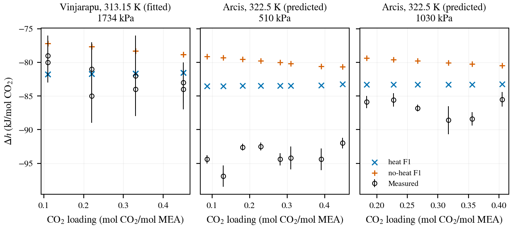

# Current working record {#working-record}

**The current record is the investigator-adopted heat-augmented SSM+DS F1 start A, for 30 wt% MEA on a CO₂-free basis at 40–80 °C.** The [#170 owner decision](https://github.com/tannerpolley/Amine-Thermodynamics/issues/170#issuecomment-6071318908) adds eight Vinjarapu integral heats to each F1–F6 fit; the [#147 design amendment](https://github.com/tannerpolley/Amine-Thermodynamics/issues/147#issuecomment-6070624850) fixes the same five interaction coordinates and inherited calibrated chemistry. Water, ion sizes and the density-only empirical volume translation remain fixed.

Pressure calibration covers 40/60 °C, species calibration covers 20–60 °C, and heat calibration uses 40 °C. Evidence is **calibration for the fitted data; prediction for Arcis, 80–120 °C and concentration transfer; no physical validation**. The high-temperature data have historical access and selection ancestry; they are not untouched tests. Concentration transfer and absorber/stripper use are not qualified. **The investigator promoted this record for manuscript writing on 2026-10-08.** Independent reviews of the heat fit, the F1–F6 rerun and the manuscript returned Supported; this notebook page has had no separate review.

The [selected record](results/selected-current-best-parameters.json) is byte-identical to [heat-160/A-parameters.json](results/heat-160/A-parameters.json), SHA-256 `66ff7715958e9d22e77bd129faf7f67822204e3285b50993bf3f67d72c3b9778`. The immutable Engine wheel is SHA-256 `94b55dfcf72f21b43010c7125d71f103f41fd56f7a6b6fe0774903eef71cc72a`, from merged Engine commit `026b30311b959f1a5db4feef4c15e243f7044a5f`; [evaluation execution](results/heat-final-170/evaluation/execution.json) records its use.

The current [fit-comparison rows](results/heat-final-170/fit-comparison.csv) give a 149-target objective cost of **32.056684**: 47 pressures, 94 species targets and eight integral heats. The matched pressure/species subtotal is **30.330866**, against **30.089761** without heat. Fitted pressure AARD is **13.814751%** and species AARD is **7.891434%**. AARD is the average absolute relative deviation; the declared residual scales and conditional errors do not constitute measured uncertainty for all targets.

# Current parameters {#selected-parameters}

These tables read the selected JSON and [conditional-uncertainty.json](results/heat-final-170/conditional-uncertainty.json), F1 entry. Exact serialized values govern display rounding. [Input hashes](figures/regression_overview/output/parameter-table-inputs.json) identify the presentation inputs.

[Green: a fixed charge or formulation definition]{.evidence-1} · [Blue: a current numerical input with recorded qualifications]{.evidence-2}. [★](#fitted-coordinates){.fit-star} marks the five fitted coordinates. Green does not certify fitted properties.

<!-- CURRENT-PARAMETERS:BEGIN -->

## Species parameters

Lengths are Å; energy parameters are K. Association volumes, segment counts, permittivities and solvation factors are dimensionless. A dash means the input is absent, not a fitted zero.

::: {.parameter-table .species-table}
| Species | $m$ | $\sigma$ | $\epsilon/k$ | $\epsilon^{AB}/k$ | $\kappa^{AB}$ | Scheme | $z$ | $\epsilon_r$ | $d_B$ | $f_{\mathrm{solv}}$ |
| :-- | :-- | :-- | :-- | :-- | :-- | :-- | :-- | :-- | :-- | :-- |
| CO₂ | 2.0729 | 2.7852 | 173.44025 | — | — | 2B | 0 | — | — | 1 |
| MEA | 3.0353 | 3.0435 | 277.174 | 2586.3 | 0.036287 | 2B | 0 | 32 | — | 1 |
| H₂O | 1.3340338 | water law | 415.47578 | 1725.6848 | 0.0461035 | 2B | 0 | water law | — | 1.5 |
| MEAH⁺ | 1 | 3.48508556586 | 232.687201645 | — | — | — | 1 | 8 | 3.53322927146 | 1 |
| MEACOO⁻ | 1 | 3.53543525721 | 453.265244384 | — | — | — | -1 | 8 | 3.54107030822 | 1 |
| HCO₃⁻ | 1 | 2.9296 | 70 | — | — | — | -1 | 8 | 3 | 1 |
| CO₃²⁻ | 1 | 2.4422 | 249.26 | — | — | — | -2 | 8 | 3 | 1 |
| H₃O⁺ | 1 | 3.4654 | 500 | — | — | — | 1 | 8 | 1.218 | 1 |
| OH⁻ | 1 | 2.0177 | 650 | — | — | — | -1 | 8 | 3.081076894 | 1 |
:::

CO₂ has induced 2B association with water and no self-association; its cross-association inputs are in `topology.edges` of the selected file. Ion association is absent.

Water diameter, with $T$ in K and $\sigma$ in Å:

$$\sigma_{\mathrm{H_2O}}(T)=2.7176052+10.11 e^{-0.01775T}-1.417 e^{-0.01146T}$$

Water relative permittivity:

$$\epsilon_{r,\mathrm{H_2O}}(T)=78.4104347858-0.361337662337(T-298.15)^{1}+0.00076555618295(T-298.15)^{2}$$

The selected file retains solvent-only dielectric mixing and excludes dispersion between ions with the same charge sign. Packing and Debye–Hückel diameters remain separate fields in that file; Born diameters are shown above. Fixed and transferred inputs carry their recorded qualifications; these tables confer no new physical validation.

## Binary interactions

Symmetric $k_{ij}$, upper triangle. A blue zero is a serialized fixed input, not a measured absence of interaction. Green exclusions state the selected formulation rule.

::: {.parameter-table .binary-interactions-table}
|  | CO₂ | MEA | H₂O | MEAH⁺ | MEACOO⁻ | HCO₃⁻ | CO₃²⁻ | H₃O⁺ | OH⁻ |
| :-- | :-- | :-- | :-- | :-- | :-- | :-- | :-- | :-- | :-- |
| CO₂ | — | 0 | -0.0242424022679 | 0 | 0 | 0 | 0 | 0 | 0 |
| MEA |  | — | -0.0803172261897 | 0 | 0 | 0 | 0 | 0 | 0 |
| H₂O |  |  | — | -0.312453113461325[★](#fitted-coordinates){.fit-star} | 0.2239502973575809[★](#fitted-coordinates){.fit-star} | 0.5[★](#fitted-coordinates){.fit-star} | -0.25 | 0.25 | -0.25 |
| MEAH⁺ |  |  |  | — | -0.9682867488255271[★](#fitted-coordinates){.fit-star} | 0 | 0 | excluded | 0 |
| MEACOO⁻ |  |  |  |  | — | excluded | excluded | 0 | excluded |
| HCO₃⁻ |  |  |  |  |  | — | excluded | 0 | excluded |
| CO₃²⁻ |  |  |  |  |  |  | — | 0 | excluded |
| H₃O⁺ |  |  |  |  |  |  |  | — | 0 |
| OH⁻ |  |  |  |  |  |  |  |  | — |
:::

The stored temperature dependence is $k_{ij}(T)=k_{ij}(T_{\mathrm{ref}})+b(1/T-1/T_{\mathrm{ref}})$. The slope $b$ has units K.

::: {.parameter-table .summary-table}
| Pair | $b$ (K) | $T_{\mathrm{ref}}$ (K) |
| :-- | :-- | :-- |
| CO₂–MEA | 0 | 313.15 |
| MEAH⁺–H₂O | 107.96395673675056[★](#fitted-coordinates){.fit-star} | 313.15 |
:::

## Five fitted coordinates {#fitted-coordinates}

::: {.parameter-table .summary-table}
| Coordinate | Current value | Conditional standard error | Bound |
| :-- | :-- | :-- | :-- |
| MEACOO⁻–water $k_{ij}$ | 0.2239502973575809[★](#fitted-coordinates){.fit-star} | 0.011759 | Free |
| MEAH⁺–water $k_{ij}$ | -0.312453113461325[★](#fitted-coordinates){.fit-star} | 0.012776 | Free |
| HCO₃⁻–water $k_{ij}$ | 0.5[★](#fitted-coordinates){.fit-star} | — | On upper bound |
| MEACOO⁻–MEAH⁺ $k_{ij}$ | -0.9682867488255271[★](#fitted-coordinates){.fit-star} | 0.026692 | Free |
| MEAH⁺–water $b$ (K) | 107.96395673675056[★](#fitted-coordinates){.fit-star} | 22.93 | Free |
:::

The errors condition on fixed chemistry, water, neutral binaries, Born inputs and residual weights. The HCO₃⁻–water coordinate is on its upper bound. The MEAH⁺–water slope is $b = 107.96 \pm 22.93$ K (conditional standard error). These errors do not establish unique ion properties. No uncertainty band or concentration-transfer claim follows.

## Reactions

R2/R4/R5 below are generated from the current selected JSON. It does not serialize fixed R1/R3; those rows and the reaction equations come from the retained [chemistry declaration](https://github.com/tannerpolley/Amine-Thermodynamics/blob/30ce082/data/reference/MEA/manifests/chemical_reaction_source_contract.json), including its stored aqueous-molality offsets.

::: {.parameter-table .summary-table}
| Reaction | $A$ | $B$ | $C$ | $D$ | $\Delta$ | Input owner |
| :-- | :-- | :-- | :-- | :-- | :-- | :-- |
| R1 · 2 H₂O ⇌ H₃O⁺ + OH⁻ | 132.899 | -13445.9 | -22.4773 | 0 | 8.0330699846 | Fixed chemistry |
| R2 · CO₂ + 2 H₂O ⇌ HCO₃⁻ + H₃O⁺ | 232.331415339 | -11105.6400305 | -36.7816 | 0 | — | Selected JSON |
| R3 · HCO₃⁻ + H₂O ⇌ CO₃²⁻ + H₃O⁺ | 216.049 | -12431.7 | -35.4819 | 0 | 4.0165349923 | Fixed chemistry |
| R4 · MEACOO⁻ + H₂O ⇌ HCO₃⁻ + MEA | 2.151 | -1545.3 | — | — | — | Selected JSON |
| R5 · MEAH⁺ + H₂O ⇌ MEA + H₃O⁺ | 3037.63995347 | -1.01731508373 | 0.0004277 | — | — | Selected JSON |
:::

For R1–R3, $\ln K=A+B/T+C\ln T+DT+\Delta$; R2 already includes the conversion in $A$ and has no separate offset. For R4, $\ln K=A+B/T$. For R5, $-\log_{10}K=A/T+B+CT$. The displayed layouts therefore give $B$ in K for R1–R4 and $A$ in K for R5; $D$ for R1–R3 and $C$ for R5 are in K⁻¹. Other coefficients are dimensionless. R2/R5 are inherited calibrated chemistry, held fixed in the five-coordinate fit; they are not new source measurements.

<!-- CURRENT-PARAMETERS:END -->

# Pressure and speciation

The figures read only the F1 rows in the retained [pressure](results/heat-final-170/pressure-figure-data.csv), [species](results/heat-final-170/species-figure-data.csv) and [pool](results/heat-final-170/pool-figure-data.csv) tables. Each row identifies the selected record by hash. **Model values are markers at measured states**; no continuous curve is inferred. Pressure CSV values are Pa, converted to kPa on the pressure axes. [Figure provenance](figures/regression_overview/output/provenance.json) records the input hashes and confirms that rendering executes no model.

{#fig-pressure}

{#fig-pressure-parity}

{#fig-pressure-residuals}

{#fig-speciation}

# Heat of absorption

The [retained heat rows](results/heat-final-170/figure-data/heat.csv) and [input hashes](results/heat-final-170/figure-data/input-hashes.json) support the integral finite-addition heat comparison. Vinjarapu uses eight fitted points at 313.15 K and 1.734 MPa, from zero carbon; Arcis uses 14 predicted points at 322.5 K, separated by pressure. Negative heat denotes exothermic absorption. The no-heat F1 control is evaluated on the same Engine wheel.

{#fig-heat}

RMSE is root-mean-square error; bias is calculated minus observed. Values below are from [heat-comparison.csv](results/heat-final-170/heat-comparison.csv), in kJ/mol CO₂.

| Record | Source / role | Pressure (MPa) | n | RMSE (kJ/mol) | Bias (kJ/mol) |
| --- | --- | --- | --- | --- | --- |
| heat F1 | Vinjarapu2024 · fitted | All | 8 | 2.1266 | 0.5998 |
| heat F1 | Arcis2011 · predicted | All | 14 | 8.3644 | 7.5001 |
| heat F1 | Arcis2011 · predicted | 0.5100 | 8 | 10.5795 | 10.4841 |
| heat F1 | Arcis2011 · predicted | 1.0300 | 6 | 3.7435 | 3.5214 |
| no-heat F1 | Vinjarapu2024 · predicted control | All | 8 | 4.5741 | 4.2684 |
| no-heat F1 | Arcis2011 · predicted | All | 14 | 11.6318 | 10.9755 |
| no-heat F1 | Arcis2011 · predicted | 0.5100 | 8 | 14.1430 | 14.0353 |
| no-heat F1 | Arcis2011 · predicted | 1.0300 | 6 | 7.0000 | 6.8957 |

The current fit gives −81.7538 to −81.5072 kJ/mol CO₂ for Vinjarapu. Its heat RMSE improves from 4.5741 to 2.1266 kJ/mol; Arcis RMSE improves from 11.6318 to 8.3644 kJ/mol. The positive Arcis bias means the model remains less exothermic than those observations. Heat calibration does not identify unique ion properties or establish physical validation.

# F1–F6 fit comparison

All heat-augmented problems use the same eight Vinjarapu heats. The table reports both matched no-heat controls and current heat fits from [fit-comparison.csv](results/heat-final-170/fit-comparison.csv). F1 is SSM+DS; F2/F3 change the Born treatment, F4/F5 add the Matin pool to F1/F2, and F6 changes source chemistry. Costs for different target sets are not directly comparable. HCO₃⁻–water is on its upper bound in F1; bound membership for every problem remains in the CSV.

| Problem | Objective | Targets | Cost | Pressure AARD (%) | Species n | Species AARD (%) | Heat cost |
| --- | --- | --- | --- | --- | --- | --- | --- |
| F1 | no heat | 141 | 30.0898 | 13.2565 | 94 | 7.9373 | 0.0000 |
| F2 | no heat | 141 | 57.2430 | 36.0792 | 94 | 8.4560 | 0.0000 |
| F3 | no heat | 141 | 154.6342 | 79.5732 | 94 | 11.6456 | 0.0000 |
| F4 | no heat | 159 | 46.0544 | 13.8667 | 112 | 14.0734 | 0.0000 |
| F5 | no heat | 159 | 63.8898 | 34.4715 | 112 | 11.9681 | 0.0000 |
| F6 | no heat | 141 | 30.1794 | 14.3321 | 94 | 7.9699 | 0.0000 |
| F1 | with heat | 149 | 32.0567 | 13.8148 | 94 | 7.8914 | 1.7258 |
| F2 | with heat | 149 | 60.0081 | 36.0678 | 94 | 8.4435 | 2.6588 |
| F3 | with heat | 149 | 160.5551 | 80.2452 | 94 | 11.9813 | 4.2801 |
| F4 | with heat | 167 | 47.6143 | 13.3442 | 112 | 14.0830 | 1.4504 |
| F5 | with heat | 167 | 66.6018 | 34.3375 | 112 | 12.1191 | 2.6371 |
| F6 | with heat | 149 | 40.9018 | 14.7318 | 94 | 7.9899 | 10.3466 |

# Matched high-temperature trade-off

The two F1 records below are evaluated on identical rows and Engine wheel, grouped by cohort and nominal temperature in [high-temperature-comparison.csv](results/heat-final-170/high-temperature-comparison.csv). “All” is the retained cohort aggregate, not an extra temperature. These are pressure predictions outside fitted temperatures; the aggregate also contains low-temperature comparisons.

| Cohort | Nominal temperature (°C) | n | No-heat F1 AARD (%) | Heat F1 AARD (%) |
| --- | --- | --- | --- | --- |
| Hilliard/Jou packet pressures | 40 | 32 | 13.4784 | 13.7841 |
| Hilliard/Jou packet pressures | 60 | 16 | 13.4512 | 14.7990 |
| Hilliard/Jou packet pressures | 80 | 11 | 9.0194 | 15.2212 |
| Hilliard/Jou packet pressures | 100 | 10 | 18.1241 | 29.6587 |
| Hilliard/Jou packet pressures | 120 | 10 | 24.1146 | 41.5535 |
| Hilliard/Jou packet pressures | All | 79 | 14.7864 | 19.7143 |
| canonical pressures | 40 | 59 | 21.6294 | 21.8668 |
| canonical pressures | 60 | 25 | 16.0157 | 16.3166 |
| canonical pressures | 80 | 21 | 19.4112 | 19.6061 |
| canonical pressures | 100 | 18 | 24.0083 | 30.8034 |
| canonical pressures | 120 | 36 | 29.3719 | 30.8510 |
| canonical pressures | All | 159 | 22.4761 | 23.7414 |

**A single linear-in-$1/T$ interaction slope cannot satisfy both the 40 °C heats and the 100–120 °C pressures in this retained comparison.** Heat fitting improves calorimetry while the high-temperature pressure deviations increase in both cohorts. This conclusion applies to the fixed chemistry, five fitted coordinates, residual scales and retained observations; it does not establish a general impossibility for another model. The working 40–80 °C interval is not qualification of high-temperature extrapolation or concentration transfer.

# Density, heat capacity and absorber status

## Density

The adopted record retains a density-only translation, $\rho_{\mathrm{corr}}=M_{\mathrm{mix}}/[v_{\mathrm{EOS}}+10^{-6}c(x_{\mathrm{MEAH^+}}+x_{\mathrm{MEACOO^-}})]$, with $c=39.5142952780$ cm³/mol. It is not applied to chemical potentials, enthalpy or heat capacity and is not applied automatically by Engine. Current [corrected-densities.csv](results/heat-final-170/corrected-densities.csv) gives the following four translation-calibration states at 0.100 MPa, 30 wt% MEA on a CO₂-free basis. This is calibration of density correction, not independent prediction.

| Temperature (K) | Loading (mol/mol MEA) | Observed (kg/m³) | Corrected (kg/m³) | Deviation (%) |
| --- | --- | --- | --- | --- |
| 323.15 | 0.3 | 1058.0000 | 1060.1526 | 0.2035 |
| 323.15 | 0.4 | 1083.0000 | 1081.3468 | -0.1526 |
| 343.15 | 0.3 | 1046.4000 | 1049.0123 | 0.2496 |
| 343.15 | 0.4 | 1071.9000 | 1070.3970 | -0.1402 |

The source locator is Amundsen (2009), Table 3, stored per row in the CSV. Source pressure is unreported; 0.100 MPa is the modeling assumption. The recorded uncertainty scope excludes the highest temperatures/loadings and leaves its exact per-row boundary unresolved. Outside these four calibration states, the retained density rows do not establish concentration-transfer qualification.

## Heat capacity

Current equilibrium solution Cp spot checks are retained in [heat-capacity-comparison.csv](results/heat-final-170/heat-capacity-comparison.csv), using the heat F1 rows only. The Hilliard (2008) Appendix G.2 observations use 7 mol MEA/kg water; the model uses 30 wt% MEA on a CO₂-free basis, assumes 101325 Pa and represents nominal unloaded MEA by loading $10^{-5}$.

| Temperature (K) | Nominal loading (mol/mol MEA) | Cp (kJ/(kg·K)) | Observed Cp (kJ/(kg·K)) | Deviation (%) |
| --- | --- | --- | --- | --- |
| 318.15 | 0.0 | 3.8680 | 3.7195 | 3.9938 |
| 318.15 | 0.358 | 3.4173 | 3.3675 | 1.4787 |
| 353.15 | 0.358 | 3.3414 | 3.4707 | -3.7256 |

Two spot checks exceed the existing 3% comparison limit. Solution Cp remains report-only; full property acceptance is not established. No current unloaded 80 °C Cp value or current-wheel pure-water grid assessment is retained in the heat-final set, so neither is shown as a current result.

## Absorber

No absorber solve using the adopted heat-augmented record is retained in `results/heat-final-170/`. The previous record's capture and temperature comparisons do not qualify the current record and are excluded from this live view. Absorber/stripper use remains unqualified; no current capture or temperature result is asserted.

# Open work

[#170: FPE submission](https://github.com/tannerpolley/Amine-Thermodynamics/issues/170) owns the remaining public-data delivery, preprint update and journal submission; the manuscript numbers pass and its independent review are complete. This notebook supplies retained evidence, not manuscript promotion or submission authority.

The pressure-decomposition diagnostic is **unavailable on this Engine (`IonicInsertion`)**: the [retained failure](results/heat-final-170/activity-contributions/diagnostic-failure.txt) records an unavailable ion-free ionic reference. It is dropped from the paper; no previous decomposition values are carried forward.

Past records are owned by [parameter-record-history.csv](results/parameter-record-history.csv) and Git. Rendering this live notebook never runs the thermodynamic model.
