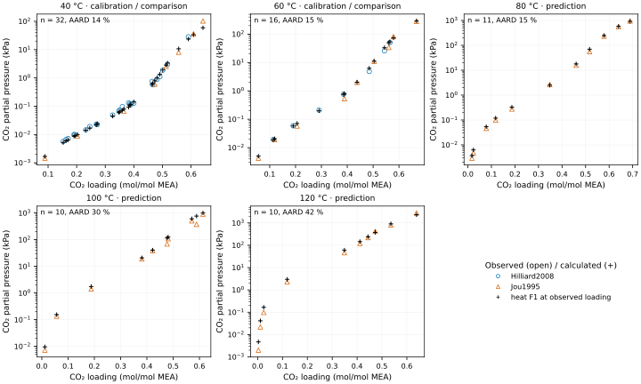
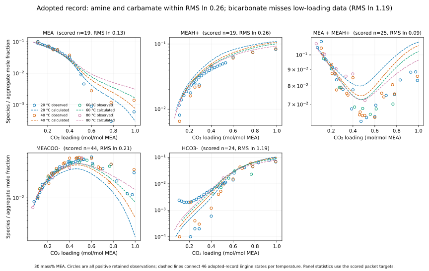
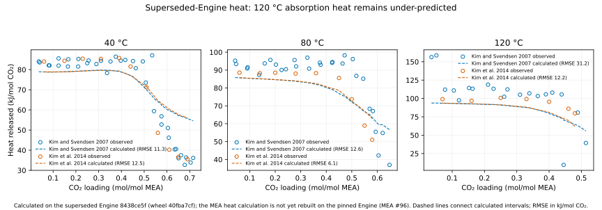

::: {.callout-note}
## Working notebook

This is a working view of retained evidence, not an independently validated process-model parameter set. Result generations and limitations are identified in each analysis section; rendering never reruns the model.
:::

# Selected parameters

Working nine-species bundle: the exploratory incumbent adopted on 3 September 2026 after the reaction-temperature fit (constant R2/R4/R5 enthalpy shifts, ln K unchanged at 313.15 K). It has not yet been independently validated for predictive process-column use. Lengths: Å; energy parameters: K; temperature: K. [Exact values and provenance](results/selected-current-best-parameters.json) supersede displayed rounding.

[Green: supported for the stated use]{.evidence-1} · [Blue: working value—review the evidence for green]{.evidence-2} · [Yellow: needs targeted testing or regression]{.evidence-3}. Green includes checked formulation rules and supported derived estimates; it does not imply every value was independently fitted. Blue includes fitted, fixed, and derived values whose support for the stated use remains under review. Yellow marks a follow-up, not an unknown number or an automatic instruction to refit. Move blue to green when its source, derivation, or relevant comparison supports the intended use; fixed mathematical definitions need checking, not regression. **The two yellow entries are the R2/R4 intercepts flagged by the formation/partition study; its later diagnostic disposition is linked below.** Other retained choices stay blue unless a specific comparison gives us a reason to reopen them.

[★](#parameter-change-history){.fit-star aria-label="Parameter change history"} marks a current value changed by our regression or data-calibrated selection; hover for the method and click for its record. Stars describe history, independently of the evidence color. Literature fits, fixed rules, derivations, and unretained trials are not starred.

## Species parameters

One row per species gives the component-parameter block. The full reactive ePC-SAFT bundle also requires the binary interactions and reaction correlations below. **—** means not applicable in the selected formulation; explicit zeros and fixed values are retained.

::: {.parameter-table .species-table}
<table class="table" id="species-parameters">
<thead>
<tr><th rowspan="2" scope="col">Species</th><th colspan="3" scope="colgroup">hc+disp</th><th colspan="3" scope="colgroup">assoc</th><th colspan="2" scope="colgroup">ionic</th><th colspan="2" scope="colgroup">Born</th><th rowspan="2" scope="col">Ref.</th></tr>
<tr>
<th scope="col">

$m$

</th>
<th scope="col">

$\sigma$

</th>
<th scope="col">

$\epsilon/k$

</th>
<th scope="col">

$\epsilon^{AB}/k$

</th>
<th scope="col">

$\kappa^{AB}$

</th>
<th scope="col">

Scheme

</th>
<th scope="col">

$z$

</th>
<th scope="col">

$\epsilon_r$

</th>
<th scope="col">

$d_B$

</th>
<th scope="col">

$f_{\mathrm{solv}}$

</th>
</tr>
</thead>
<tbody>
<tr>
<th scope="row">

CO₂

</th>
<td>

[2.0729]{.evidence-1}

</td>
<td>

[2.7852]{.evidence-1}

</td>
<td>

[★](#parameter-change-history){.fit-star title="CO₂ dispersion calibration — Data-calibrated grid selection; CO2 dispersion changed from the source value, not an optimizer estimate" aria-label="CO₂ dispersion calibration — Data-calibrated grid selection; CO2 dispersion changed from the source value, not an optimizer estimate"}[173.4403]{.evidence-2}

</td>
<td>

[0.0000]{.evidence-1 title="Zero CO2 self-association in the selected induced-association topology"}

</td>
<td>

[0.0451]{.evidence-1 title="Retained induced-association volume; source topology, not an independent fit"}

</td>
<td>

[2B]{.evidence-1}<a href="#note-a">a</a>

</td>
<td>

—

</td>
<td>

—

</td>
<td>

—

</td>
<td>

[1.0000]{.evidence-1 title="Fixed unit solvation factor in the selected formulation; not independently fitted"}

</td>
<td class="source-reference">

<a href="#ref-1">1</a>, <a href="#ref-2">2</a>

</td>
</tr>
<tr>
<th scope="row">

MEA

</th>
<td>

[3.0353]{.evidence-1}

</td>
<td>

[3.0435]{.evidence-1}

</td>
<td>

[277.1740]{.evidence-1}

</td>
<td>

[2586.3000]{.evidence-1}

</td>
<td>

[0.0375]{.evidence-1}

</td>
<td>

[2B]{.evidence-1}

</td>
<td>

—

</td>
<td>

[32.0000]{.evidence-2}

</td>
<td>

—

</td>
<td>

[1.0000]{.evidence-1 title="Fixed unit solvation factor in the selected formulation; not independently fitted"}

</td>
<td class="source-reference">

<a href="#ref-3">3</a>, <a href="#ref-4">4</a>

</td>
</tr>
<tr>
<th scope="row">

H₂O

</th>
<td>

[1.2047]{.evidence-1}

</td>
<td>

σ(T)<a href="#note-b">b</a>

</td>
<td>

[353.9500]{.evidence-1}

</td>
<td>

[2425.7000]{.evidence-1}

</td>
<td>

[0.0451]{.evidence-1}

</td>
<td>

[2B]{.evidence-1}

</td>
<td>

—

</td>
<td>

εr(T)<a href="#note-c">c</a>

</td>
<td>

—

</td>
<td>

[1.5000]{.evidence-2}

</td>
<td class="source-reference">

<a href="#ref-1">1</a>, <a href="#ref-5">5</a>

</td>
</tr>
<tr>
<th scope="row">

MEAH⁺

</th>
<td>

[1.0000]{.evidence-1 title="Fixed one-segment ion definition"}

</td>
<td>

[★](#parameter-change-history){.fit-star title="Historical ion/speciation fit — Historical local MEAH+ speciation fit: segment diameter" aria-label="Historical ion/speciation fit — Historical local MEAH+ speciation fit: segment diameter"}[3.4851]{.evidence-2}

</td>
<td>

[★](#parameter-change-history){.fit-star title="Historical ion/speciation fit — Historical local MEAH+ speciation fit: dispersion energy" aria-label="Historical ion/speciation fit — Historical local MEAH+ speciation fit: dispersion energy"}[232.6872]{.evidence-2}

</td>
<td>

—

</td>
<td>

—

</td>
<td>

—

</td>
<td>

[+1]{.evidence-1 title="Charge defines the chemical species; not a fitted parameter"}

</td>
<td>

[8.0000]{.evidence-2}

</td>
<td>

[★](#parameter-change-history){.fit-star title="Historical ion/speciation fit — Historical local MEAH+ speciation fit: Born diameter" aria-label="Historical ion/speciation fit — Historical local MEAH+ speciation fit: Born diameter"}[3.5332]{.evidence-2}

</td>
<td>

[1.0000]{.evidence-1 title="Fixed unit ion solvation factor"}

</td>
<td class="source-reference">

<a href="#ref-6">6</a>–<a href="#ref-8">8</a>

</td>
</tr>
<tr>
<th scope="row">

MEACOO⁻

</th>
<td>

[1.0000]{.evidence-1 title="Fixed one-segment ion definition"}

</td>
<td>

[★](#parameter-change-history){.fit-star title="Historical ion/speciation fit — Historical local MEACOO- speciation fit: segment diameter" aria-label="Historical ion/speciation fit — Historical local MEACOO- speciation fit: segment diameter"}[3.5354]{.evidence-2}

</td>
<td>

[★](#parameter-change-history){.fit-star title="Historical ion/speciation fit — Historical local MEACOO- speciation fit: dispersion energy" aria-label="Historical ion/speciation fit — Historical local MEACOO- speciation fit: dispersion energy"}[453.2652]{.evidence-2}

</td>
<td>

—

</td>
<td>

—

</td>
<td>

—

</td>
<td>

[−1]{.evidence-1 title="Charge defines the chemical species; not a fitted parameter"}

</td>
<td>

[8.0000]{.evidence-2}

</td>
<td>

[★](#parameter-change-history){.fit-star title="Historical ion/speciation fit — Historical local MEACOO- speciation fit: Born diameter" aria-label="Historical ion/speciation fit — Historical local MEACOO- speciation fit: Born diameter"}[3.5411]{.evidence-2}

</td>
<td>

[1.0000]{.evidence-1 title="Fixed unit ion solvation factor"}

</td>
<td class="source-reference">

<a href="#ref-6">6</a>–<a href="#ref-8">8</a>

</td>
</tr>
<tr>
<th scope="row">

HCO₃⁻

</th>
<td>

[1.0000]{.evidence-1 title="Fixed one-segment ion definition"}

</td>
<td>

[2.9296]{.evidence-2}

</td>
<td>

[70.0000]{.evidence-2}

</td>
<td>

—

</td>
<td>

—

</td>
<td>

—

</td>
<td>

[−1]{.evidence-1 title="Charge defines the chemical species; not a fitted parameter"}

</td>
<td>

[8.0000]{.evidence-2}

</td>
<td>

[3.0000]{.evidence-2}

</td>
<td>

[1.0000]{.evidence-1 title="Fixed unit ion solvation factor"}

</td>
<td class="source-reference">

<a href="#ref-1">1</a>, <a href="#ref-9">9</a>, <a href="#ref-10">10</a>

</td>
</tr>
<tr>
<th scope="row">

CO₃²⁻

</th>
<td>

[1.0000]{.evidence-1 title="Fixed one-segment ion definition"}

</td>
<td>

[2.4422]{.evidence-2}

</td>
<td>

[249.2600]{.evidence-2}

</td>
<td>

—

</td>
<td>

—

</td>
<td>

—

</td>
<td>

[−2]{.evidence-1 title="Charge defines the chemical species; not a fitted parameter"}

</td>
<td>

[8.0000]{.evidence-2}

</td>
<td>

[3.0000]{.evidence-2}

</td>
<td>

[1.0000]{.evidence-1 title="Fixed unit ion solvation factor"}

</td>
<td class="source-reference">

<a href="#ref-1">1</a>, <a href="#ref-9">9</a>, <a href="#ref-10">10</a>

</td>
</tr>
<tr>
<th scope="row">

H₃O⁺

</th>
<td>

[1.0000]{.evidence-1 title="Fixed one-segment ion definition"}

</td>
<td>

[3.4654]{.evidence-2}

</td>
<td>

[500.0000]{.evidence-2}

</td>
<td>

—

</td>
<td>

—

</td>
<td>

—

</td>
<td>

[+1]{.evidence-1 title="Charge defines the chemical species; not a fitted parameter"}

</td>
<td>

[8.0000]{.evidence-2}

</td>
<td>

[1.2180]{.evidence-2}

</td>
<td>

[1.0000]{.evidence-1 title="Fixed unit ion solvation factor"}

</td>
<td class="source-reference">

<a href="#ref-1">1</a>, <a href="#ref-9">9</a>, <a href="#ref-10">10</a>

</td>
</tr>
<tr>
<th scope="row">

OH⁻

</th>
<td>

[1.0000]{.evidence-1 title="Fixed one-segment ion definition"}

</td>
<td>

[2.0177]{.evidence-2}

</td>
<td>

[650.0000]{.evidence-2}

</td>
<td>

—

</td>
<td>

—

</td>
<td>

—

</td>
<td>

[−1]{.evidence-1 title="Charge defines the chemical species; not a fitted parameter"}

</td>
<td>

[8.0000]{.evidence-2}

</td>
<td>

[3.0811]{.evidence-1 title="Born hydration-energy-derived estimate; not an MEA-system fit"}

</td>
<td>

[1.0000]{.evidence-1 title="Fixed unit ion solvation factor"}

</td>
<td class="source-reference">

<a href="#ref-1">1</a>, <a href="#ref-9">9</a>, <a href="#ref-10">10</a>

</td>
</tr>
</tbody>
</table>
:::

The engine input schema accepts a Debye–Hückel diameter record for ionic formulations, but this bundle does not treat it as an independent regression parameter: the retained ion values are fixed by the convention $d_{DH}=0.88\sigma$. It is therefore omitted from this manuscript-facing parameter table while remaining in the machine-readable records. The explicit Born diameter $d_B$ remains because it is the retained Born/solvation input.

**a** CO₂ uses the selected induced 2B scheme with no self-association.

**b** Water segment diameter (Å), with $T$ in K:

$$\sigma_{\mathrm{H_2O}}(T)=2.7927+10.11e^{-0.01775T}-1.417e^{-0.01146T}$$
**c** Water relative permittivity, with $T$ in K:

$$\epsilon_{r,\mathrm{H_2O}}(T)=78.4104347858-0.3613376623(T-298.15)+0.000765556183(T-298.15)^2$$

The relative permittivity $\epsilon_r$ supports both ionic and Born contributions; it is grouped under ionic to avoid duplication. Bulk permittivity uses normalized MEA–water mass fractions only; the ion value 8 is retained for the extended Born formulation, and CO₂ is excluded from dielectric mixing. Unique ion Born diameters and the nonunit water solvation factor activate extended Born (SSM+DS). Ion association is absent in this topology; CO₂ retains its induced-association parameters, including zero self-association energy.

## Binary interactions

Symmetric $k_{ij}$; upper triangle shown. Blue **0** means an untested default combining rule—not a measured zero or zero physical interaction. The green CO₂–MEA **0** is retained as sufficient for the bounded sensitivity screen, not proof of an exact physical zero. Green **1** switches off like-charge dispersion in the chosen formulation; it is a fixed rule, not a separately fitted parameter. The nonzero transferred water–ion corrections are retained working values (blue), not automatic refitting targets.

::: {.parameter-table .binary-interactions-table}
| | CO₂ | MEA | H₂O | MEAH⁺ | MEACOO⁻ | HCO₃⁻ | CO₃²⁻ | H₃O⁺ | OH⁻ |
|:--|--:|--:|--:|--:|--:|--:|--:|--:|--:|
| CO₂ | — | [0]{.evidence-1 title="Sufficient for the retained 18-pressure-row / six-speciation-state screen; not a measured zero"} | [0.0133]{.evidence-1} | [0]{.evidence-2 title="Default combining rule; no independently fitted pair correction"} | [0]{.evidence-2 title="Default combining rule; no independently fitted pair correction"} | [0]{.evidence-2 title="Default combining rule; no independently fitted pair correction"} | [0]{.evidence-2 title="Default combining rule; no independently fitted pair correction"} | [0]{.evidence-2 title="Default combining rule; no independently fitted pair correction"} | [0]{.evidence-2 title="Default combining rule; no independently fitted pair correction"} |
| MEA | | — | [−0.0735]{.evidence-2}[★](#parameter-change-history){.fit-star title="Neutral binary interaction — MEA–water interaction regressed against Cai 1996 neutral VLE" aria-label="Neutral binary interaction — MEA–water interaction regressed against Cai 1996 neutral VLE"} | [0]{.evidence-2 title="Default combining rule; no independently fitted pair correction"} | [0]{.evidence-2 title="Default combining rule; no independently fitted pair correction"} | [0]{.evidence-2 title="Default combining rule; no independently fitted pair correction"} | [0]{.evidence-2 title="Default combining rule; no independently fitted pair correction"} | [0]{.evidence-2 title="Default combining rule; no independently fitted pair correction"} | [0]{.evidence-2 title="Default combining rule; no independently fitted pair correction"} |
| H₂O | | | — | [0]{.evidence-2 title="Default combining rule; no independently fitted pair correction"} | [0]{.evidence-2 title="Default combining rule; no independently fitted pair correction"} | [0]{.evidence-2 title="Default combining rule; no independently fitted pair correction"} | [−0.2500]{.evidence-2} | [0.2500]{.evidence-2} | [−0.2500]{.evidence-2} |
| MEAH⁺ | | | | — | [−0.0020]{.evidence-2}[★](#parameter-change-history){.fit-star title="Historical ion/speciation fit — Historical local speciation fit: MEAH+–MEACOO- interaction" aria-label="Historical ion/speciation fit — Historical local speciation fit: MEAH+–MEACOO- interaction"} | [0]{.evidence-2 title="Default combining rule; no independently fitted pair correction"} | [0]{.evidence-2 title="Default combining rule; no independently fitted pair correction"} | [1]{.evidence-1 title="Fixed like-charge dispersion suppression in the selected formulation; not a measured interaction"} | [0]{.evidence-2 title="Default combining rule; no independently fitted pair correction"} |
| MEACOO⁻ | | | | | — | [1]{.evidence-1 title="Fixed like-charge dispersion suppression in the selected formulation; not a measured interaction"} | [1]{.evidence-1 title="Fixed like-charge dispersion suppression in the selected formulation; not a measured interaction"} | [0]{.evidence-2 title="Default combining rule; no independently fitted pair correction"} | [1]{.evidence-1 title="Fixed like-charge dispersion suppression in the selected formulation; not a measured interaction"} |
| HCO₃⁻ | | | | | | — | [1]{.evidence-1 title="Fixed like-charge dispersion suppression in the selected formulation; not a measured interaction"} | [0]{.evidence-2 title="Default combining rule; no independently fitted pair correction"} | [1]{.evidence-1 title="Fixed like-charge dispersion suppression in the selected formulation; not a measured interaction"} |
| CO₃²⁻ | | | | | | | — | [0]{.evidence-2 title="Default combining rule; no independently fitted pair correction"} | [1]{.evidence-1 title="Fixed like-charge dispersion suppression in the selected formulation; not a measured interaction"} |
| H₃O⁺ | | | | | | | | — | [0]{.evidence-2 title="Default combining rule; no independently fitted pair correction"} |
| OH⁻ | | | | | | | | | — |
:::

## Reactions

The shifts convert the source basis to aqueous molality at infinite dilution in water. The table uses one parameter layout for all five reactions; a dash means that coefficient is not present in that reaction's equation.

::: {.parameter-table .reaction-table}
<table class="table" id="reaction-parameters">
<thead><tr><th>Reaction</th><th>$A$</th><th>$B$</th><th>$C$</th><th>$D$</th><th>$\Delta$</th><th>Source domain (K)</th><th>Ref.</th></tr></thead>
<tbody>
<tr><th scope="row">R1 · water autoprotolysis</th><td>132.8990</td><td>−13445.9000</td><td>−22.4773</td><td>0.0000</td><td>8.0331</td><td>273.15–498.15</td><td class="source-reference"><a href="#ref-11">11</a></td></tr>
<tr><th scope="row">R2 · CO₂ hydration (adopted)</th><td><a class="fit-star" href="#parameter-change-history" title="R2 intercept changed by the reaction-temperature fit">★</a>232.3314</td><td><a class="fit-star" href="#parameter-change-history" title="R2 temperature coefficient changed by the reaction-temperature fit">★</a>−11105.6400</td><td>−36.7816</td><td>0.0000</td><td>−8.2000</td><td>293.15–393.15</td><td class="source-reference"><a href="#ref-11">11</a></td></tr>
<tr><th scope="row">R3 · bicarbonate dissociation</th><td>216.0490</td><td>−12431.7000</td><td>−35.4819</td><td>0.0000</td><td>4.0165</td><td>273.15–498.15</td><td class="source-reference"><a href="#ref-11">11</a></td></tr>
<tr><th scope="row">R4 · carbamate hydrolysis</th><td><a class="fit-star" href="#parameter-change-history" title="R4 intercept changed by the reaction-temperature fit">★</a>1.5050</td><td><a class="fit-star" href="#parameter-change-history" title="R4 temperature coefficient changed by the reaction-temperature fit">★</a>−1317.0490</td><td>—</td><td>—</td><td>—</td><td>293.15–393.15</td><td class="source-reference"><a href="#ref-4">4</a></td></tr>
<tr><th scope="row">R5 · MEAH⁺ dissociation</th><td><a class="fit-star" href="#parameter-change-history" title="R5 inverse-temperature coefficient changed by the reaction-temperature fit">★</a>3037.6400</td><td><a class="fit-star" href="#parameter-change-history" title="R5 constant coefficient changed by the reaction-temperature fit">★</a>−1.0173</td><td><a class="fit-star" href="#parameter-change-history" title="R5 temperature coefficient changed by the reaction-temperature fit">★</a>0.0004</td><td>—</td><td>—</td><td>273.15–323.15</td><td class="source-reference"><a href="#ref-4">4</a></td></tr>
</tbody>
</table>
:::

**R1–R3 · common correlation**

$$
\ln K_{\mathrm{common}}(T)=A+\frac{B}{T}+C\ln T+DT+\Delta
$$

**R4 · carbamate hydrolysis**

$$
\ln K_4(T)=A_4+\frac{B_4}{T}
$$

**R5 · MEAH⁺ dissociation**

$$
\ln K_5(T)=-\ln(10)\left(\frac{A_5}{T}+B_5+C_5T\right)
$$

R2 carries the adopted constant enthalpy shift of −8.2000 kJ mol⁻¹ in $\Delta$; its intercept and inverse-temperature coefficient are therefore coupled at the 313.15 K pivot.

[Component source audit](https://github.com/tannerpolley/MEA-Thermodynamics/blob/codex/born-permittivity-formulation-study/docs/ePC-SAFT/full-component-parameter-source-audit.md) · [reaction source contract](https://github.com/tannerpolley/MEA-Thermodynamics/blob/codex/born-permittivity-formulation-study/data/reference/MEA/manifests/chemical_reaction_source_contract.json) · [reaction-temperature study](reaction-temperature-fit/index.qmd)

# Pressure

The overview figures below are regenerated from retained row-level result tables.
Pressure and speciation use the all-five-reaction candidate replay and therefore
are not exact replays of the selected JSON, which saved only R2/R4/R5. Heat uses
the hash-matched selected JSON. Rendering reads these records and never runs
the Engine.

**The adoption study evaluated all 161 observations; the adopted shifts removed most of the high-temperature bias in that comparison.** For 30 mass% MEA at 40–120 °C, the replayed candidate has log₁₀ RMSE **0.2318**—an RMS multiplicative factor of **1.71**—against 0.3317 (factor 2.15) for the previous record on the same rows. Paired on identical evaluated rows: calibration 0.3344 → 0.2366 (143 rows); the Xu 2011 holdout, never in the objective, 0.3096 → 0.1901 (18 rows). At 120 °C the RMSE is 0.165. Certified neighboring-loading and cross-temperature starts recover every state; recovery establishes numerical coverage, not physical accuracy.

{#fig-pressure fig-alt="CO2 partial pressure versus loading at 40 to 120 degrees Celsius, comparing observations with dashed model calculations from the all-five-reaction candidate replay."}

Pressure constrains molecular-CO₂ chemical potential coupled to the reaction network. It cannot independently identify reaction constants, Born diameters, dielectric mixing, and association parameters. Xu 2011 is excluded from the new fitting objective, but its earlier use in bundle selection means it is not untouched validation of the whole model.

[Adoption-study full replay](results/reaction-temperature-fit/full-validation-targets.csv) · [Paired comparison](results/reaction-temperature-fit/adoption-receipt.json) · earlier figure-generation results (refresh incomplete): [residuals](results/current-best-fit-residuals.csv), [statistics](results/current-best-fit-statistics.csv), [numerical failures](results/figure-calculation-failures.csv), [generation receipt](results/figure-calculation-receipt.json)

# Speciation

**For the replayed candidate, free and protonated MEA are better described than carbamate and bicarbonate, and the enthalpy shifts barely move speciation.** The scored observation set evaluates **129/131 positive targets** (previously 125), with log₁₀ RMSE **0.3630** (0.3702 → 0.3670 paired on the 125 shared rows). Recomputed from the positive evaluated and pivot-reuse speciation rows in the [retained full-target CSV](results/reaction-temperature-fit/full-validation-targets.csv), species scores are 0.0569 for MEA (19 rows), 0.1141 for MEAH⁺ (19), 0.0624 for MEA + MEAH⁺ (24), 0.4877 for MEACOO⁻ (43), and 0.5150 for HCO₃⁻ (24). These are diagnostic comparisons, not independent validation of each ionic parameter.

{#fig-speciation fig-alt="Principal species mole fractions versus carbon dioxide loading at 20 to 80 degrees Celsius, comparing observations with dashed model calculations from the all-five-reaction candidate replay."}

This display includes a broader set of reported observation operators than the scored targets. Reported zeros remain in the source data but cannot appear on logarithmic axes. Carbonate, hydronium, and hydroxide remain in the equilibrium calculation even though omitted from this principal-species view. Preserve the successful amine description while testing carbamate–bicarbonate coupling; do not reopen every ion parameter merely because the aggregate score is high.

Additional temperature views: [40 °C](figures/speciation/output/speciation-diagnostic-replay-40C.svg), [60 °C](figures/speciation/output/speciation-diagnostic-replay-60C.svg), [80 °C](figures/speciation/output/speciation-diagnostic-replay-80C.svg). The display grids are regenerated by the figure script when needed.

# Heat release

**The replayed candidate halves the absorption-heat error at 40/80 °C and improves the previously reserved 120 °C comparison, which still under-predicts.** All **113/113 intervals** evaluate. Paired on identical rows against the previous record: 66 Kim–Svendsen 40/80 °C calibration intervals RMSE **20.01 → 11.84 kJ mol⁻¹ CO₂** (bias −17.0 → −2.3); the 20 Kim–Svendsen 120 °C holdout intervals **39.30 → 31.15** (bias −28.8 → −18.8); the 27 Kim 2014 model-selection rows **16.84 → 10.71**. Only six 40/80 °C intervals entered the fit. The separate retained [selected-JSON heat replay](results/calorimetry/current-selected-direct-enthalpy-summary.json), whose parameter hash matches the current document, gives RMSE 11.8497, 31.1500, and 10.7128 kJ mol⁻¹ CO₂ for those three cohorts respectively; it predates the unfinished shared-driver refresh.

{#fig-heat fig-alt="Heat released per mole of absorbed carbon dioxide versus loading at 40, 80 and 120 degrees Celsius, comparing observations with dashed model calculations from the selected bundle."}

Heat release is the negative of (liquid enthalpy change minus incoming ideal-gas CO₂ enthalpy), divided by absorbed CO₂. The reconstruction assumes zero finite vapor inventory and an initial loading of 0.003. Source roles are 66 Kim–Svendsen 40/80 °C calibration rows, 20 at 120 °C held out, and 27 Kim 2014 comparison rows.

**Species references are now continuous and physically anchored.** At every temperature in 293.15–393.15 K the nine reference enthalpies solve the five typed reaction constraints (source correlation plus Engine source-reference transfer), three neutral thermal anchors, and one charge gauge; each is carried on the Engine's polynomial form. Reaction-reference consistency holds to **1.7 × 10⁻⁴ J mol⁻¹** across the domain, inside the Engine's 2 × 10⁻³ J mol⁻¹ admissibility tolerance. Anchors: CO₂ ideal-gas Shomate cp (NIST, Chase 1998); H₂O and MEA pure-liquid cp correlations (Hilliard 2008, as retained by MEA-Absorption-Column) net of the Engine's own residual cp so nothing is counted twice; formation enthalpies pin the constants (CODATA CO₂(g), H₂O(l); NIST MEA(l)); hydronium shares the water reference (zero-enthalpy proton). The retained anchored-reference calculation gives fixed-composition cp for 30 mass% MEA at 40 °C of 3.83 kJ kg⁻¹ K⁻¹ unloaded and 3.21 at loading 0.4. Water vaporization enthalpy from the EOS residual is within 1.3 % of steam tables at 40–120 °C. The Engine's residual cp under-predicts liquid-water cp by about 11 J mol⁻¹ K⁻¹, which is why the water and MEA anchors are liquid-based; the ideal-gas-anchored alternative is retained as a diagnostic. Above 393.15 K the source-reference transfer leaves the EOS domain at the 1 bar reference pressure, so the references are undefined there.

[Adopted heat results](results/calorimetry/current-selected-direct-enthalpy-summary.json) · [Interval values](results/calorimetry/current-selected-direct-enthalpy-comparison.csv) · [Paired comparison and adoption rules](results/reaction-temperature-fit/adoption-receipt.json) · [Thermal references](results/calorimetry/current-selected-reference-thermochemistry.json) · [Earlier thermal checks (retired three-knot rows invalid; refresh pending) and missing evidence](results/calorimetry/thermal-reference-validation.json)

## Parameter change history {#parameter-change-history}

This overview keeps the selected parameter tables and main regression figures
together. The sidebar leaves preserve the question, data, method, numerical
result, and conclusion for each distinct study; this anchor remains the target
for the change markers in the tables above.

# What changes next?

**Parameter priorities:** reconcile the reviewed shared start-volume correction and the later formation/partition and ionic-screen evidence before new fitting. [MEA #85](https://github.com/tannerpolley/MEA-Thermodynamics/issues/85#issuecomment-5537540222) reports evaluator v4 in another checkout; this branch still uses v3. [MEA #83](https://github.com/tannerpolley/MEA-Thermodynamics/issues/83#issuecomment-5536532837) reports no surviving F/S trial, and [MEA #86](https://github.com/tannerpolley/MEA-Thermodynamics/issues/86#issuecomment-5538014243) reports no non-degrading ionic direction under the corrected one-start policy. These are owner-reported results, not locally replayed comparisons or parameter adoption. Inspect the retained certificate failures with that owner before choosing the next joint comparison. Regress only where the observations can constrain a parameter; do not reopen all transferred ion values by default. Then review blue values for green: check fixed/derived rules algebraically and against their sources; check fitted values against relevant comparisons and identification limits. A successful solve or a precisely recorded number alone does not change the color.

The repaired screen (33 common targets, three real 120 °C pressure rows, Xu 2011 and Kim 2014 excluded from the objective) again put both retained directions on the ±5 kJ mol⁻¹ search bound; the single permitted recenter to the unbounded two-direction solution lowered the exact sparse weighted norm from 0.7530 to **0.6559** (baseline 1.0) and was replayed in full. Adoption followed the declared rules: evaluability not below the previous record, both held-out blocks improved, no paired cohort degraded, interior solution. Native Engine sensitivities for R4/R5 agree with the finite-difference columns to 0.2 %; R1–R3 sensitivities need typed parameter declarations, and heat rows need a total-enthalpy Jacobian the Engine does not expose.

What remains uncertain: the 120 °C heat bias (−18.8 kJ mol⁻¹) and the size of the R2/R5 shifts point to temperature dependence the enthalpy shifts cannot supply alone (Born/permittivity response, R5 far outside its 323 K source domain); carbamate and bicarbonate speciation are unchanged; loaded-solution heat capacities (Weiland 1997, Hilliard 2008) and an MEA ideal-gas cp are not retained, so solution cp is predicted, not validated. Each holdout block has now been scored once during selection. Further use is diagnostic and must be logged under a scoped experiment; independent validation requires genuinely unused blocks frozen before access.

::: {.callout-note collapse="true"}
## Coupling and the two different reductions

The [six-species study](https://github.com/tannerpolley/MEA-Thermodynamics/blob/codex/born-permittivity-formulation-study/analyses/enrtl_six_species_ideal_comparison/notebook.qmd) derives two net reactions: carbamate formation, R2 − R4 − R5, and bicarbonate formation, R2 − R5. Their log equilibrium constants differ by −ln K₄. Both reactions share MEA, CO₂, and MEAH⁺, so their amounts must satisfy the same carbon, amine, and charge balances. Activity coefficients also depend on the shared mixture composition: changing one species changes the equilibrium conditions for the others. This is chemical coupling, not an extra fitted interaction term.

The [recent sensitivity fit](results/reaction-temperature-fit/screen-receipt.json) instead retains all five reactions and two SVD parameter directions, dominated by R2/R5 and R4. It reduces fitting freedom, not the reaction network. The numerical count of two does not make those directions the two net reactions.

Still unresolved is whether the carbamate/bicarbonate split constrains reaction constants separately from ionic Born/dispersion and dielectric effects. The retained fit changes reaction-temperature dependence, holds the EOS parameters fixed, and barely improves paired speciation RMSE (0.3702 → 0.3670). Earlier ion perturbations are not a joint identifiability study of the current selection. The F/S and ionic-screen reports linked above address separate bounded directions and retain negative results; they do not establish joint identifiability. This checkout does not contain their newer corrected result set. The [scientific roadmap](https://github.com/tannerpolley/MEA-Thermodynamics/blob/codex/born-permittivity-formulation-study/docs/scientific/PREDICTIVE_MEA_PROGRAM.md) places reconciliation and numerical failure diagnosis before further joint fitting.
:::

# Supporting evidence

These links preserve the deeper analysis without reproducing it here. Figures and source data remain separate repository files for other agents; only the three displayed figures are embedded in this portable HTML.

::: {.parameter-table .summary-table}
| Question | Retained evidence |
|:--|:--|
| Which parameter vector and Engine? | [Selected parameters](results/selected-current-best-parameters.json), [analysis inventory and wheel identity](analysis.yaml) |
| What changed in the adopted record, and why? | [Adoption receipt](results/reaction-temperature-fit/adoption-receipt.json), [record history](results/parameter-record-history.csv), [holdout ledger](results/holdout-evaluations.csv), [full replay targets](results/reaction-temperature-fit/full-validation-targets.csv), [screen](results/reaction-temperature-fit/screen-receipt.json), [candidate scores](results/reaction-temperature-fit/candidate-receipt.json), [derivative checks](results/reaction-temperature-fit/sensitivity-check-receipt.json), [study notes](results/reaction-temperature-fit/README.md) |
| Can the absorber use it non-isothermally? | [Thermal references](results/calorimetry/current-selected-reference-thermochemistry.json), [thermal validation](results/calorimetry/thermal-reference-validation.csv); build the handoff locally with `scripts/build_absorption_handoff.py` |
| What did the historical Born/permittivity study show? | [Common-row comparisons](results/born-permittivity-study/full-common-row-statistics.csv), [reaction-synchronized comparison](results/born-permittivity-study/current-fast-common-comparison.csv), [joint sensitivity figure](figures/born_permittivity/output/selected-bundle-joint-sensitivity.svg) |
| What did earlier parameter studies show? | [Parameter-start comparison](results/parameter-start-comparison.csv), [bounded sensitivity](results/parameter-sensitivity-screen.csv), [R4–CO₂ campaign](results/best-in-slot-campaign/final-full-validation-summary.csv) |
| What about fewer species? | [Matched six-/nine-species notebook](https://github.com/tannerpolley/MEA-Thermodynamics/blob/codex/born-permittivity-formulation-study/analyses/enrtl_six_species_ideal_comparison/notebook.qmd) |
:::

Detailed source prose from the former LaTeX notebook remains in Git history; all retained numerical studies and 14 original figure bundles remain in this analysis directory. Rendering this notebook never runs the thermodynamic model.

# References

<ol class="references">
<li id="ref-1">D. Schick, L. Bierhaus, A. Strangmann, P. Figiel, G. Sadowski, and C. Held, “Predicting CO₂ solubility in aqueous and organic electrolyte solutions with ePC-SAFT advanced,” <em>Fluid Phase Equilibria</em> (2023). <a href="https://doi.org/10.1016/j.fluid.2022.113714">doi:10.1016/j.fluid.2022.113714</a>.</li>
<li id="ref-2">J. Gross and G. Sadowski, “PC-SAFT: An equation of state based on a perturbation theory for chain molecules,” <em>Industrial &amp; Engineering Chemistry Research</em> (2001). <a href="https://doi.org/10.1021/ie0003887">doi:10.1021/ie0003887</a>.</li>
<li id="ref-3">A. Najafloo and S. Zarei, “Modeling solubility of CO₂ in aqueous monoethanolamine (MEA) solution using SAFT-HR equation of state,” <em>Fluid Phase Equilibria</em> (2018). <a href="https://doi.org/10.1016/j.fluid.2017.09.029">doi:10.1016/j.fluid.2017.09.029</a>.</li>
<li id="ref-4">K. Nasrifar and A. H. Tafazzol, “Vapor-liquid equilibria of acid gas-aqueous ethanolamine solutions using the PC-SAFT equation of state,” <em>Industrial &amp; Engineering Chemistry Research</em> (2010). <a href="https://doi.org/10.1021/ie901181n">doi:10.1021/ie901181n</a>.</li>
<li id="ref-5">C. Held, M. Cameretti, and G. Sadowski, “Modeling aqueous electrolyte solutions. Part 1. Fully dissociated electrolytes,” <em>Fluid Phase Equilibria</em> (2008). <a href="https://doi.org/10.1016/j.fluid.2008.06.010">doi:10.1016/j.fluid.2008.06.010</a>.</li>
<li id="ref-6">M. Matin et al., “Facile Method for Determination of Amine Speciation in CO₂ Capture Solutions,” <em>Industrial &amp; Engineering Chemistry Research</em> (2012). <a href="https://doi.org/10.1021/ie300230k">doi:10.1021/ie300230k</a>.</li>
<li id="ref-7">J. P. Jakobsen, J. Krane, and H. F. Svendsen, “Liquid-phase composition determination in CO₂–H₂O–alkanolamine systems: An NMR study,” <em>Industrial &amp; Engineering Chemistry Research</em> (2005).</li>
<li id="ref-8">W. Böttinger, M. Maiwald, and H. Hasse, “Online NMR spectroscopic study of species distribution in MEA–H₂O–CO₂ and DEA–H₂O–CO₂,” <em>Fluid Phase Equilibria</em> (2008). <a href="https://doi.org/10.1016/j.fluid.2007.09.017">doi:10.1016/j.fluid.2007.09.017</a>.</li>
<li id="ref-9">C. Held, T. Reschke, S. Mohammad, A. Luza, and G. Sadowski, “ePC-SAFT revised,” <em>Chemical Engineering Research and Design</em> (2014). <a href="https://doi.org/10.1016/j.cherd.2014.05.017">doi:10.1016/j.cherd.2014.05.017</a>.</li>
<li id="ref-10">P. Figiel, G. Yu, and C. Held, “Predicting thermodynamic properties of ions in single solvents and in mixed solvents using a modified Born term within the ePC-SAFT framework,” <em>Industrial &amp; Engineering Chemistry Research</em> (2025). <a href="https://doi.org/10.1021/acs.iecr.5c00475">doi:10.1021/acs.iecr.5c00475</a>.</li>
<li id="ref-11">S. Baygi and M. Pahlavanzadeh, “Application of the PC-SAFT equation of state for modeling CO₂ solubility in aqueous monoethanolamine solutions,” <em>Chemical Engineering Research and Design</em> (2015). <a href="https://doi.org/10.1016/j.cherd.2014.07.017">doi:10.1016/j.cherd.2014.07.017</a>.</li>
</ol>
