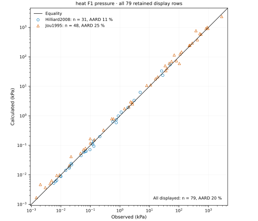
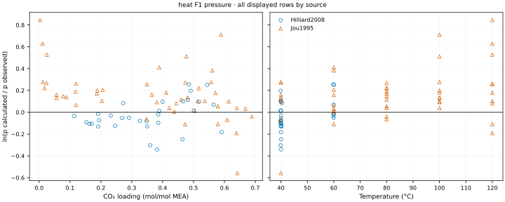
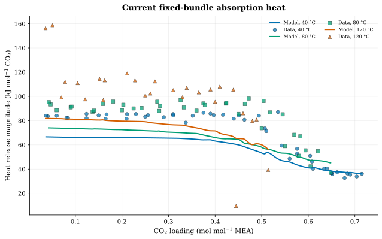

::: {.callout-note}
## Working notebook

The working record is SSM+DS model D `p5conv-a-11` for **30 wt% MEA, 40–80 °C**, under [decisions 21/24](https://github.com/tannerpolley/MEA-Thermodynamics/issues/121#issuecomment-5906843564). Its candidate assessment/comparison [Supported review](https://github.com/tannerpolley/MEA-Thermodynamics/issues/121#issuecomment-5907883147) met decision 21's gate. This promotion and regenerated notebook await their separate delivered review and have not been promoted for manuscript use.

Selected byte SHA-256: `9055458d8b7cd767a0d08e9f37e4fd28631e29c363364d7b842ebade645cb241`; candidate byte SHA-256: `42f236600f931f17b111cd6cc9760b706a2806cccba17a625c30086a2fa33952`. The producing and replay wheel is `28181e72e429c6e87fc6361082af1a7b21c8747e76bda65a1c30abb4a97402f2` (MEA merge `8c670d3a`, Engine build identifier `1a905ff8`; these commits are distinct).

The official fit uses **142 targets: 48 pressure + 94 species (40 Böttinger + 54 Matin)**. Matin's 18 HCO₃⁻ + CO₃²⁻ pool targets are report-only; its 21 °C measurement/packet 20 °C convention is retained. The full historical 160-target re-score is reported separately. This is numerical verification and bounded calibration/assessment evidence, not independent physical validation. Rendering reads retained results and never reruns the model. The [canonical loading correction](#canonical-loading-correction) supersedes the earlier canonical and concentration-transfer scores for the two 142-target records. Its new evidence awaits independent delivered review and manuscript-use confirmation.
:::

# Model D: historical 160-target assessment {#model-d-decision23}

**Both Born forms meet the accepted 104-row pressure rule and numerical-completeness checks.** The average absolute relative deviation (AARD) at 40–80 °C is **21.04 % for SSM+DS** and **20.50 % for Original Born**, against the owner’s 35 % limit. This comparison does not select a parameter record. Large errors on the 15 and 45 mass% MEA second-look rows, active bounds in Original Born, and the limits below prevent interpreting the pass as physical validation or qualification for absorber or stripper calculations.

This historical section reports [MEA #121 decisions 20–23](https://github.com/tannerpolley/MEA-Thermodynamics/issues/121#issuecomment-5896373779) and the [accepted recovery](https://github.com/tannerpolley/MEA-Thermodynamics/issues/121#issuecomment-5901117598). The following 160-target fits and comparison tables retain their original identities. The selected-parameter tables and regenerated pressure, speciation and heat figures later in this notebook now describe the 142-target `p5conv-a-11` working record. Its objective omits the 18 report-only Matin bicarbonate-pool targets.

## Model, data, and fitting controls

The two S1 forms use the same five adjustable coordinates: carbamate–water, MEAH⁺–water, and HCO₃⁻–water interaction coefficients, the MEAH⁺–MEACOO⁻ interaction coefficient, and the reciprocal-temperature slope of MEAH⁺–water. The first three coefficients have bounds ±0.5, the cation–anion coefficient ±1, and the slope ±1000 K. At $T_\mathrm{ref}=313.15$ K,

$$
k_{\mathrm{MEAH^+,water}}(T)=k_{\mathrm{MEAH^+,water}}(T_\mathrm{ref})
+b(1/T-1/T_\mathrm{ref}).
$$

R4 stays at its source correlation, $\ln K_4=2.151-1545.3/T$; R1–R3, R5, the remaining interaction coefficients, and species parameters stay at the recorded base values. SSM+DS uses effective Born coefficients $c_\mathrm{shell}=c_\mathrm{dielectric}=1$; Original Born uses explicit zeros. The SSM base document omits the two keys and the retained loader supplies (1, 1); the Original Born document supplies (0, 0). [Bases, candidates, and complete wheel identities](model-d/decision23-candidate-identities.json) identify this distinction.

Decision 23 fits **160 targets at 84 states**: 48 pressure targets (32 at 40 °C, 16 at 60 °C) and 112 liquid mole-fraction targets (84 at 20 °C, 16 at 40 °C, 12 at 60 °C). The weighted objective is half the sum of squared residuals, using $\ln(p_\mathrm{calc}/p_\mathrm{obs})/0.3$ for pressure and $(x_\mathrm{calc}-x_\mathrm{obs})/(0.1x_\mathrm{obs}+0.001)$ for species. Bicarbonate observations use the retained HCO₃⁻ + CO₃²⁻ pool. Böttinger 042/046 and Matin 016 remain excluded. The 80 °C isotherm stays outside the objective.

The accepted method is the existing Engine Ceres Levenberg–Marquardt fit with exact implicit derivatives, coordinate scales 0.01 and 10 K, 100 iterations and 7200 s per start. The function tolerance remains $10^{-12}$. Six prescribed starts per form include the old-rule optimum, C_src, pre-refit, incumbent-R4-C, and random seeds 1 and 2. The current admissibility check uses 293.15–353.15 K; this is narrower than decision 20’s historical 293.15–393.15 K check. Values at 393.15 K are retained for reporting and do not extend qualification.

Decision 23 removed 100–120 °C pressure targets from the objective and replaced the earlier all-temperature pressure and Mamun requirements with AARD ≤35 % on the 104 canonical 40–80 °C rows, retaining numerical completeness. The change followed the old-rule comparison: both forms passed the old pooled-pressure rule but failed its Mamun requirement. The owner narrowed the intended temperature domain; the retained 100–120 °C rows now report extrapolation. The [old-rule results](model-d/README.md#old-rule-all-temperatures-mamun-gate-s1-results) retain that chronology. No S2 fit is needed under the accepted S1 pass rule.

## Fitting results and uncertainty

| Quantity | SSM+DS (1, 1) | Original Born (0, 0) |
|:--|--:|--:|
| Weighted objective, 160 targets | 47.625767 | 40.201537 |
| Usable converged starts | 5 of 6 | 6 of 6 |
| Carbamate–water $k_{ij}$ | +0.078856 | −0.066551 |
| MEAH⁺–water $k_{ij}$ at 313.15 K | −0.298840 | +0.146688 |
| HCO₃⁻–water $k_{ij}$ | +0.393826 | **+0.500000 (upper bound)** |
| MEAH⁺–MEACOO⁻ $k_{ij}$ | −0.705057 | **−1.000000 (lower bound)** |
| MEAH⁺–water slope $b$, K | +107.644 | +88.447 |
| Jacobian rank | 5 | 5 |
| Full Engine covariance | Available at an interior point | Withheld: two active bounds |

SSM+DS seed 1 failed its initial equilibrium evaluation at Böttinger 049 (200 iterations, residual 2.36585); it contributes no fitting trajectory. The five completed SSM+DS starts agree in objective near 47.625767. Original Born’s three pre-reboot starts remain on wheel f66d972c; only its missing incumbent-R4-C, seed-1, and seed-2 starts ran on 28181e72. These converged in 15, 7, and 8 iterations, respectively, with no trial failures, to costs differing by less than $10^{-11}$. Their fitting wall times were 282.64, 158.11, and 169.96 s. No silent retry or completed-start rerun occurred.

The displayed SSM+DS candidate is the lowest-cost usable retained f66d972c result; Original Born is the lowest-cost usable 28181e72 result (seed 2). This construction chooses one representative optimum for assessment within each form; it is not adoption of either form. The full [SSM+DS fitting record](model-d/1-1-S1-40-80C-multistart.json), historical [Original Born record](model-d/0-0-S1-40-80C-multistart.json), and [three recovered Original Born starts](model-d/0-0-S1-40-80C-28181e72-multistart.json) retain every start and its diagnostics.

The SSM+DS local standard errors are 0.0259, 0.0291, 0.0985, and 0.0306 for the four interaction coefficients and 130.7 K for the slope. Original Born’s standard errors conditional on fixing both active-bound coordinates are 0.0122 for carbamate–water, 0.0111 for MEAH⁺–water, and 85.1 K for the slope. These local linear estimates assume independent weighted errors and omit model discrepancy. They do not establish independent physical identification of the coefficients; conditional errors do not replace the withheld full covariance. The slope errors are large relative to both fitted slopes.

{#fig-model-d-fit-cost fig-alt="Weighted objective on a logarithmic scale versus recorded fitting iteration, with separate panels for the two Born forms and labels identifying each start and fitting wheel."}

## Pressure and species comparisons

Pressure and species AARD below are unweighted relative deviations within the stated target group. They are separate from the weighted fitting objective.

| Retained comparison | Targets | SSM+DS AARD, % | Original Born AARD, % |
|:--|--:|--:|--:|
| **Accepted pressure rule, 40–80 °C** | **104** | **21.04** | **20.50** |
| Pressure actually fitted, 40/60 °C | 48 | 14.38 | 17.34 |
| Species actually fitted, 20/40/60 °C | 112 | 14.08 | 10.23 |
| Pressure at 80 °C, outside objective | 11 | 22.99 | 20.69 |
| Species at 80 °C, outside objective | 11 | 11.40 | 7.35 |
| Pressure at 100–120 °C, out of range | 57 | 33.24 | 31.25 |
| Predefined 30 mass% pressure subset, 40–120 °C | 106 | 27.86 | 25.80 |

{#fig-model-d-ssm-parity fig-alt="Calculated versus observed carbon dioxide partial pressure for 104 observations, separated by literature source, for Model D SSM plus dielectric scaling."}

{#fig-model-d-original-parity fig-alt="Calculated versus observed carbon dioxide partial pressure for the same 104 observations, separated by literature source, for Model D Original Born."}

The 104-row rule contains 36 Aronu, 30 Hilliard, 28 Jou, and 10 Idris rows. Their respective AARDs are 28.73, 10.92, 22.08, and 20.76 % for SSM+DS, and 24.44, 13.40, 23.53, and 19.08 % for Original Born. Mean $\ln(p_\mathrm{calc}/p_\mathrm{obs})$ over those 104 rows is −0.113 and −0.064; RMS ln is 0.326 and 0.283. The pass therefore retains a source-dependent pressure misfit and a pooled downward bias.

All 123 packet states and all 161 canonical pressure states evaluate for each form. There are zero reported tolerance failures or balance errors under the existing checks. Maximum absolute stationarity is $4.55\times10^{-13}$ (SSM+DS packet), $2.27\times10^{-13}$ (Original Born packet), $1.56\times10^{-13}$ (SSM+DS canonical), and $1.28\times10^{-13}$ (Original Born canonical). This establishes numerical completeness for these retained evaluations, not physical validity.

The raw scoring table keeps historical generic groups: its 68 packet pressure targets include the 20 high-temperature targets removed from the present objective, and its 120 non-80 °C species targets include eight excluded targets. The fitted groups in this section are the actual **48 pressure + 112 species** targets. [Scores](model-d/decision23-eval-28181e72-scores.csv), [target values](model-d/decision23-eval-28181e72-states.csv), and the [assessment summary](model-d/assessment-28181e72-summary.json) retain the groups and observation identities.

## Transfer, carbonate, and salt checks

| Second-look comparison from #108 | Pressure rows | SSM+DS AARD, % | Original Born AARD, % |
|:--|--:|--:|--:|
| 15 mass% MEA | 33 | 83.34 | 77.07 |
| 45 mass% MEA | 37 | 64.88 | 64.52 |

All 70 transfer states evaluate for each form, with no reported balance or tolerance failures and maximum absolute stationarity $1.71\times10^{-13}$. The high pressure errors show poor concentration transfer despite successful equilibrium solves. These rows were examined earlier in #106; the present [#108 scores](composition-transfer/second-look-model-d-decision23-eval-28181e72-scores.csv) and [values](composition-transfer/second-look-model-d-decision23-eval-28181e72-states.csv) are a second look, not untouched validation data.

The carbonate comparison retains all ten raw Jakobsen rows at 20/40 °C. The historical nine-point summary alone excludes the 40 °C, loading 0.21 point; it gives model/observed carbonate-share ratios of 0.83–2.37 for SSM+DS and 1.38–5.00 for Original Born. Original Born’s better pooled-species score does not imply better carbonate partitioning. Jakobsen’s NMR methods use a common fast-exchange bicarbonate/carbonate signal and a separate calibrated ratio to recover carbonate ([Jakobsen 2005](#ref-7), NMR calibration and liquid-phase composition sections); this partition is not a separately resolved carbonate peak. All ten raw comparisons remain in the [assessment summary](model-d/assessment-28181e72-summary.json).

The indicative NaHCO₃ comparison evaluates all 60 retained Pitzer table values per form at 278.15–318.15 K and 0.001–1 mol kg⁻¹. Stoichiometric osmotic-coefficient ARD is 4.43 % for SSM+DS and 0.508 % for Original Born; maximum absolute relative errors are 17.74 % and 2.845 %. Na⁺ stays at Figiel’s unrefitted values (σ = 2.8232 Å, $u/k=230$ K, Born diameter 3.445 Å; Na⁺–water $k=-0.3$); Na⁺–HCO₃⁻ stays at −0.514 from Held. Only each candidate’s fitted HCO₃⁻–water coefficient is transferred. Figiel’s Na⁺–water value was fitted at 298.15 K ([Figiel 2025](#ref-10), Tables 3 and 5; [Held 2014](#ref-9), Table 3). The reference values are evaluated Peiper–Pitzer correlations, not direct NaHCO₃ osmometry ([Peiper and Pitzer 1982](#ref-21), Table 6, journal pp. 631–636). [Salt values and scores](model-d/nahco3-decision23-eval-28181e72/nahco3-scores.csv) are indicative only: no sodium refit, new salt gate, or revival of the earlier N1/N2 fitting route is implied.

## Published pressure comparison and claim limits

Akula et al. report 40.5 % unweighted pressure MAPE for 30 mass% MEA, loading 0.003–0.5 and 40–120 °C ([Akula 2023a](#ref-18), p. 10 §4.2, Eq. 36). Its measured-pressure denominator matches the AARD calculation here, but the paper does not give the scored row count, row list, or calculated pressures. Its Table 3 (p. 8) lists pressure-calibration sources Aronu, Hilliard, Jou, Xu, and Kim; Figure 4 (p. 12) instead displays Aronu, Hilliard, Jou, Mamun, and Kim. The present 106-row subset contains Aronu 34, Hilliard 26, Jou 31, and Xu 15, and omits Kim and Mamun. Thus the values 27.86/25.80 % cannot establish superior performance on the same observations. The subset also includes this study’s out-of-range 100–120 °C calculations.

Akula jointly fits pressure and heat in Eq. 34 (weights 1 and 0.2), while its speciation comparisons are outside that fit (p. 11 and Figure 7, p. 14). Model D instead fits 112 species targets as well as 48 pressure targets. The differing data use prevents calling these species comparisons equivalent prediction tests. The source read for this comparison is Zotero RVYVQKSF/IIYKTEG7, PDF SHA-256 `08f429473719f766ea5d8fb370de310d7e81da94039bf23ce779d92a131d68d3`; its absent ignored reading copy did not make the primary paper unavailable.

Both historical 160-target forms passed the owner’s screening rule; that historical comparison adopted neither record and established no absorber/stripper physical validation. The later 142-target decision is stated below. The held-out 80 °C comparisons are outside the fit but were inspected in earlier studies; the 100–120 °C comparisons are extrapolations. This recovery does not establish new caloric performance, confidence intervals, matched-run speedup, or the cause of the historical 60-iteration plateaus. The retained assessment was covered by the [Supported delivered review](https://github.com/tannerpolley/MEA-Thermodynamics/issues/121#issuecomment-5907883147); the new promotion/views await separate review.

## Recovery and wheel provenance

Every current assessment uses Engine commit `8c670d3aa9673459867154fa5c344c97526a7818`, wheel SHA-256 `28181e72e429c6e87fc6361082af1a7b21c8747e76bda65a1c30abb4a97402f2`. The SSM+DS fit remains identified by its historical wheel SHA-256 `f66d972c032ce709ada69e8d8177e195c7e416800757663b7420c22bda5f6328` (commit `1303c119e4a21ba31e46596fe62ee3fdfe4cc253`). The three recovered Original Born starts and its displayed candidate use 28181e72; its three earlier completed starts retain f66d972c.

The [frozen-point qualification](model-d/qualification-28181e72.json) reproduces objective 40.20153733056146 at the unmoved explicit-(0, 0) point. The 160 predictions, residuals, weighted residuals and both 800-entry Jacobians match the Engine reference bit for bit. The reused relative $10^{-8}$ application-comparison criterion comes from the earlier PR188 reference check; it is not the Engine scientific solver tolerance. The objective difference is zero.

The assessment retained 37 input hashes unchanged, including the old fitting files, immutable probes and candidates. Historical results keep their generating wheel identities. The recovered fitting job took 611.78 s wall / 610.47 s CPU; the four serial assessment jobs took 72.06/71.77, 120.73/120.43, 53.96/53.87 and 0.94/0.92 s wall/CPU (packet, canonical, transfer, salt). These are observed job durations, not a comparative benchmark.

# Born-form comparison: SSM+DS vs Original Born {#born-form-comparison}

**The Born-form ranking depends on which species observations enter the fit.** Original Born has the lower cost on the historical 160-target objective, 40.201537 against 47.625767 for SSM+DS. After removing Matin's 18 bicarbonate-pool targets, the converged 142-target fits favor SSM+DS, 32.991897 against 34.584032. Both forms are reported here. This is an application of the modified Born term to reactive MEA–CO₂–H₂O extending [Figiel et al. (2025)](#ref-10), whose parameter estimation and results concern ion solvation, salt activities and aqueous/organic solvent mixtures (Model Parameters, Tables 2–5; Results, Figs. 4–9). It does not establish an intrinsic ranking of the two Born forms.

The historical 160-target calculations, the 142-target sensitivity fits and the exploratory reaction fits have different data or adjustable coordinates. They are distinguished throughout. The preceding decision-23 assessment concerns the older 160-target records; the completed numerical assessment of the 142-target records is reported below. The <a href="model-d/born-form-diagnosis/diagnosis.qmd" download="diagnosis.qmd">detailed diagnosis.qmd record</a> retains the original probes; <a href="model-d/born-form-diagnosis/p5conv-results.qmd" download="p5conv-results.qmd">the convergence record</a> retains the later P4/P5 fits. Both use numerical evidence from installed wheel `28181e72e429c6e87fc6361082af1a7b21c8747e76bda65a1c30abb4a97402f2`.

## Formulation and question

The question is whether the SSM+DS cost penalty in this MEA application follows from the inherited Born diameters, solvent factors, dielectric-saturation correction, or reduced composition sensitivity after the five interaction coordinates are fitted. SSM means the solvation-shell modification; DS means dielectric saturation. The implemented relations are the Engine equations `born_outer_shell_diameter`, `born_radial_charging_work` and `born_residual_helmholtz`:

$$
f_{\mathrm{mix}}=\frac{\sum_k x_k f_k}{\sum_k x_k},\qquad
D_i=d_i^{\mathrm{Born}}\left[1+c_{\mathrm{shell}}\frac{f_{\mathrm{mix}}-1}{|z_i|}\right],
$$

$$
W_{\mathrm{Born}}=\sum_{i\in\mathcal I}x_i z_i^2
\left[\frac{1-\varepsilon_{\mathrm{bulk}}^{-1}}{D_i}
+c_{\mathrm{dielectric}}(1-\varepsilon_{\mathrm{ion}}^{-1})
\left(\frac1{d_i^{\mathrm{Born}}}-\frac1{D_i}\right)\right],
\qquad
a^{\mathrm{Born}}=-\frac{e^2}{4\pi\varepsilon_0 k_B T}W_{\mathrm{Born}}.
$$

Here $a^{\mathrm{Born}}$ is the dimensionless residual Helmholtz contribution, $z_i$ is ionic charge number and $\mathcal I$ is the set of ions. Distances are expressed in consistent units, with metres in the SI prefactor; the retained diameter parameters are in Å. SSM+DS is $(c_{\mathrm{shell}},c_{\mathrm{dielectric}})=(1,1)$ and Original Born is $(0,0)$. At $c_{\mathrm{shell}}=0$, $D_i=d_i^{\mathrm{Born}}$, so the saturation correction vanishes; the retained equality evaluation verifies that $(0,1)$ equals $(0,0)$.

Figiel's Born Term, Eqs. (5)–(10), pp. 9407–9409, provides the shell and solvation-factor construction; Table 1, p. 9409, gives $\varepsilon_{\mathrm{ion}}=8$, and Model Parameters, Table 2, p. 9411, gives $f_{\mathrm{water}}=1.5$. The Engine equation record attributes its canonical charging form to corrected Eq. (7); the correction text was not separately verified in this source reading. The installed Engine averages $f_k$ over all nine components, including ions. With the baseline $f_{\mathrm{MEA}}=1$ and unit factors for CO₂ and the ions, $f_{\mathrm{mix}}=1+0.5x_{\mathrm{water}}$. Consequently, the shell diameter depends on ionic content and the Born contribution can enter water activity. Model D retains solvent-only bulk permittivity; it does not add explicit ion suppression to that mixing rule.

## Fit basis and source methods

The historical fit uses **160 targets at 84 declared states**, with a CO₂-free feed basis of **30 wt% MEA in water**: 48 pressure targets at 40/60 °C, 40 Böttinger species targets and 72 Matin species targets. The same five interaction coordinates and bounds are used for the two forms. The weights define dimensionless residuals and cost:

$$
r_p=\frac{\ln(p_{\mathrm{calc}}/p_{\mathrm{obs}})}{0.3},\qquad
r_x=\frac{x_{\mathrm{calc}}-x_{\mathrm{obs}}}{0.1x_{\mathrm{obs}}+0.001},\qquad
C=\frac12\sum_j r_j^2.
$$

The species targets are liquid mole fractions; a positive signed residual means the model lies above the observation. The bicarbonate target uses the retained HCO₃⁻ + CO₃²⁻ pool. These weights are the declared fitting scales, not independently measured experimental standard deviations. The 80 °C isotherm is outside this fit. P1 additionally describes the 15 and 45 wt% states on common composition paths; those descriptive probes do not enlarge the fitted domain.

[Matin et al. (2012)](#ref-6) use acid/base titration, total alkalinity and CO₂ loading at ambient pressure and temperature (Experimental Section, pp. 6614–6615; supplementary Table S1). Their figures label the measurements **21 °C**; the retained packet uses **20 °C**. Their Speciation Comparisons discussion reports bicarbonate above Jakobsen's NMR values, especially at loading 0.3–0.45 (Fig. 2, p. 6616), and compares their 21 °C results with Böttinger's 20 °C results (Fig. 3, p. 6617). Their MEA, MEAH⁺ and carbamate comparisons are closer to NMR. This source-method distinction is retained rather than correcting the data by the fitted residual.

[Böttinger et al. (2008)](#ref-8) use online quantitative ¹H/¹³C NMR (§3, pp. 132–134; MEA results in §7, Figs. 6–7). Fast proton exchange permits measurement of **MEA + MEAH⁺ as a sum**, rather than separate free and protonated MEA observations. Bicarbonate is quantified by ¹³C NMR, and the authors describe carbonate as practically absent under their conditions. Different measurement methods, temperatures, loading coverage and reported species prevent treating the residual signs alone as proof of experimental inconsistency.

## Historical full-objective costs and signed residuals

The two retained optima were re-evaluated on the same pinned wheel. The 7.424230 cost gap is concentrated in Matin: its cost is 11.341018 higher for SSM+DS, while pressure and Böttinger favor SSM+DS by 1.777157 and 2.139631. Matin's bicarbonate pool contributes 6.023860 of the net gap.

| Target group | Targets | SSM+DS cost | Original Born cost | SSM+DS − Original |
| --- | --- | --- | --- | --- |
| Pressure | 48 | 10.065137 | 11.842294 | -1.777157 |
| Böttinger species | 40 | 5.480496 | 7.620127 | -2.139631 |
| Matin species | 72 | 32.080134 | 20.739116 | +11.341018 |
| Full historical objective | 160 | 47.625767 | 40.201537 | +7.424230 |

| Source | Target | n | SSM+DS cost | SSM+DS signed mean | Original cost | Original signed mean |
| --- | --- | --- | --- | --- | --- | --- |
| Matin | HCO₃⁻ + CO₃²⁻ pool | 18 | 9.835334 | -0.808521 | 3.811474 | -0.437865 |
| Matin | MEA | 18 | 9.908868 | -0.854267 | 6.484238 | -0.696426 |
| Matin | MEAH⁺ | 18 | 11.199874 | 0.958349 | 9.984812 | 0.977601 |
| Matin | MEACOO⁻ | 18 | 1.136058 | 0.230421 | 0.458591 | 0.081936 |
| Böttinger | HCO₃⁻ + CO₃²⁻ pool | 4 | 2.363201 | 0.708901 | 3.372701 | 1.126223 |
| Böttinger | MEACOO⁻ | 18 | 2.452425 | -0.351656 | 3.591197 | -0.514441 |
| Böttinger | MEA + MEAH⁺ | 18 | 0.664871 | 0.050739 | 0.656229 | 0.117673 |

Signed means in the table use the same weighted residuals as the cost. There are no separate fitted Böttinger MEA or MEAH⁺ targets and no fitted Matin MEA + MEAH⁺ sum; absent target groups are not zeros.

{#fig-born-cost-groups fig-alt="Two panels of categorical costs for SSM plus dielectric saturation and Original Born: full objective and source groups on the left, species groups on the right."}

## Fixed-interaction scans A–D

These are exploratory one-dimensional scans with the five $k_{ij}$ coordinates fixed at each form's retained optimum. They are complete historical **160-target** evaluations where available, not new parameter fits or an assessment of the 142-target objective. A varies water and MEA solvation factors in SSM+DS; B varies ion-region relative permittivity in SSM+DS; C multiplies all ion Born diameters in both forms; D varies the MEA relative-permittivity input in both forms.

Within A's sampled values, $f_{\mathrm{water}}=1.5$ and $f_{\mathrm{MEA}}=1$ give the lowest costs, 47.625767. In B, $\varepsilon_{\mathrm{ion}}=8$ gives the lowest available sampled cost; the value 2 is unavailable. C gives costs 39.114436 and 39.142415 for Original Born at diameter multipliers 0.8 and 0.9, compared with 40.201537 at 1.0; SSM+DS gives its lowest sampled cost at 1.0. D gives SSM+DS costs 48.802928, 47.625767 and 47.025516 at MEA permittivities 24, 32 and 40, while Original Born gives 39.081604, 40.201537 and 43.422158. These sampled responses cannot establish optimal parameter values after refitting the interactions.

{#fig-born-fixed-scans fig-alt="Four panels showing retained cost against solvent factor, ion-region permittivity, Born-diameter multiplier and MEA permittivity, with the unavailable ion-permittivity case marked without a cost."}

## Born activity contributions and local hypotheses

P1 evaluates Born chemical-potential differences at identical temperature, density and composition and subtracts the infinite-dilution pure-water reference at 101325 Pa. Its reaction quantity is the dimensionless Born part of $\sum_i\nu_i\ln\gamma_i$. On the common 30 wt% composition path at 313.15 K, the changes over the retained loading range are:

| Reaction | Original Born on its path | SSM+DS on that same path |
| --- | --- | --- |
| R1 | -1.414296 | -2.610798 |
| R2 | -1.425040 | -2.163867 |
| R3 | -2.235989 | -2.973947 |
| R4 | +0.556367 | -0.172566 |
| R5 | -0.040186 | -0.819822 |

The magnitudes increase for R1–R3 and R5 in SSM+DS, while R4 decreases and changes sign. **P1 therefore shows no uniform attenuation of reaction activity sensitivity.** The 15 and 45 wt% common-path tables retain the additional concentration dependence. The simple per-ion charging-kernel ratio $d_i/D_i$ is not the full reaction sensitivity.

The Born part of $\ln a_{\mathrm{water}}$ and its SSM+DS − Original difference were evaluated at each Matin and Böttinger state, both at their own compositions and on the common composition path. For the 18 fitted Matin bicarbonate targets, its rank correlation with the weighted residual difference is **0.733746**; the common-path calculation gives the same rank correlation. Including the report-only retained Matin state gives **0.773684, n = 19**. The common path separates the composition-coupling association from a speciation shift, but **this remains descriptive association, not causal attribution**. [Per-state activities](model-d/born-form-diagnosis/p1-matin-bottinger-born-activities.csv), [correlations](model-d/born-form-diagnosis/p1-rank-correlations.csv) and [the association plot](model-d/born-form-diagnosis/matin-water-activity-association.svg) retain the decomposition.

P2 uses exact Engine interaction columns and two-step finite-difference Born-input columns, with relative steps $10^{-4}$ and $10^{-5}$, pointwise agreement tolerance $10^{-3}\max(|J_1|,|J_2|)+10^{-8}$ and one larger-step retry. No entry is dropped or zeroed; a column that still disagrees is unavailable. Bounds are engineering analog envelopes from Figiel's Model Parameters, Tables 2–3, p. 9411: 2–5 Å for the non-proton ions, 1–2 Å for H₃O⁺ and 1–2 for $f_{\mathrm{MEA}}$, with local displacements at most half the interval width. These are not measured MEA-ion bounds. The declared reduction screens are 3.71 cost units for at least half of the original gap, below 1.86 for not supported locally, and an inconclusive band between them.

| Hypothesis | Retained P2/P3 finding | Classification against the declared falsifier |
|:--|:--|:--|
| (a) Inherited Born diameters account for the gap | Main-ion local prediction: 4.072221 reduction; confirming five-interaction refit converged at 43.950877, a 3.674890 reduction, below 3.71. The secondary-ion group includes an unavailable H₃O⁺ derivative. | **Inconclusive**; at least half accounted for was not confirmed. |
| (b) Shell/MEA solvation-factor directions account for the gap | Bounded local predicted reduction 3.072805; no confirming refit under the accepted best-group selection. | **Inconclusive**. |
| (c) The dielectric-saturation correction accounts for the gap | Local saturation-direction reduction is zero (**not supported locally**); (0,1) = (0,0) is verified, but the (1,0) comparison has no complete objective. | **Unavailable** for the finite-form comparison. |
| (d) Reduced composition sensitivity explains the remaining gap | P1 shows no uniform attenuation; unavailable and unconfirmed parameter groups prevent the proposed elimination argument. | **Inconclusive**. |

The H₃O⁺ column has only 157 of 160 entries agreeing after its retry, so the joint P2/P3 group is unavailable. This derivative-quality result is distinct from a failed equilibrium solve and supplies no physical falsification. [Screening table](model-d/born-form-diagnosis/p2-screening.csv), [step agreement](model-d/born-form-diagnosis/p2-step-agreement.csv) and [confirming refit](model-d/born-form-diagnosis/p3-best-group-confirmation.json) retain the numerical basis.

The five final interaction coordinates are the exact P5 values in the selected record and [fit result](model-d/born-form-diagnosis/p5conv-a-11-results.json). For MEAH⁺–water, $k(T)=k+b(1/T-1/313.15\,\mathrm{K})$, with $k=-0.37931089293768305$ and $b=-148.5346444297559$ K. HCO₃⁻–water is at its +0.5 upper bound. The source R4 correlation is $\ln K_4=2.151-1545.3\,\mathrm{K}/T$ on the common aqueous-molality basis; R1–R3/R5 retain the assessed source corrections and inherited shifts. Effective R1–R5 equality is retained in the [identity check](results/promotion-107-identity.json).

## Reaction directions and converged Matin-role fits

P4 adds carbamate and bicarbonate offset and enthalpy directions, with $\delta$ a natural-log equilibrium-constant shift at 313.15 K and $\Delta H$ in kJ/mol:

$$
\Delta\ln K(T)=\delta-\frac{1000\Delta H}{R}(1/T-1/313.15),
\qquad |\delta|\leq1,\quad |\Delta H|\leq10\;\mathrm{kJ\,mol^{-1}}.
$$

The reduced directions are carbamate R2 − R4 − R5 and bicarbonate R2 − R5. They map to recorded reaction changes $\Delta R2=\mathrm{bicarbonate}$ and $\Delta R4=\mathrm{bicarbonate}-\mathrm{carbamate}$, for both offsets and enthalpies. R1, R3 and R5 remain fixed and all nine species remain in the equilibrium calculation. Reaction gradients have **finite-difference quality**, alongside exact Engine interaction gradients; no covariance is estimated.

The later P4 warm refits freed the five interaction coordinates and all four reaction coordinates. Their returned full-objective costs are **43.67 for SSM+DS and 32.29 for Original Born**:

| Form | Full 160 cost | Pressure | Böttinger | Matin |
| --- | --- | --- | --- | --- |
| SSM+DS | 43.665318 | 9.526312 | 5.325559 | 28.813446 |
| Original Born | 32.289167 | 8.736058 | 6.125182 | 17.427927 |

| Form | Carbamate δ | Carbamate ΔH, kJ/mol | Bicarbonate δ | Bicarbonate ΔH, kJ/mol |
| --- | --- | --- | --- | --- |
| SSM+DS | 0.195560 | 10.000000 | 0.080762 | 4.911380 |
| Original Born | 0.369794 | 10.000000 | 0.720019 | -0.871919 |

Both stopped at the remaining-time guard after four accepted steps and four complete Jacobians, **without convergence**. The carbamate $\Delta H$ reaches its **+10 kJ/mol bound in both**. The last accepted point has a complete objective but no new Jacobian. All 32 completed reaction columns pass the agreement rule; one SSM+DS bicarbonate enthalpy column required the permitted retry. The source-correlation combinations before EOS conversion are not measured reduced-reaction constants or absorption heats. These unfinished local fits leave Original Born lower on the full data, but do not establish a converged reaction-adjusted ranking.

P5 changes the fitted target set while keeping the five interaction bounds and weights, source reactions and Born inputs fixed. All four warm fits converged on the native relative function tolerance $10^{-12}$, with zero or one further accepted update from the capped records. **HCO₃⁻–water is at its +0.5 bound in every P5 fit**; Original Born also reaches the cation–anion −1 bound.

| Fitted set | Form | Fitted-set cost | Full 160 re-score | Pressure | Böttinger | Matin |
| --- | --- | --- | --- | --- | --- | --- |
| P5a: no Matin HCO₃⁻ pool (142) | SSM+DS | 32.991897 | 53.769479 | 8.143453 | 3.100821 | 42.525205 |
| P5a: no Matin HCO₃⁻ pool (142) | Original Born | 34.584032 | 43.623963 | 11.436856 | 5.735330 | 26.451777 |
| P5b: no Matin (88) | SSM+DS | 10.471772 | 59.081535 | 7.946689 | 2.525083 | 48.609763 |
| P5b: no Matin (88) | Original Born | 16.850037 | 46.985428 | 11.603555 | 5.246482 | 30.135391 |

SSM+DS is lower on the fitted 142- and 88-target sets, while every full 160-target re-score favors Original Born. Its reduced-set advantages are 1.592135 and 6.378265 cost units. The latter is sensitivity to removing all Matin targets, not the new official fit definition. [Converged costs](model-d/born-form-diagnosis/p5conv-costs.csv), [interaction coefficients and bounds](model-d/born-form-diagnosis/p5conv-k-coordinates.csv) and [species costs with signed means](model-d/born-form-diagnosis/p5conv-species-costs-and-signed-means.csv) retain the exact values.

{#fig-born-p5-ranking fig-alt="Two panels: fitted costs for the historical full, no-Matin-bicarbonate and no-Matin objectives, followed by full 160-target re-scores of the two reduced-set fits."}

## Unavailable solves and limits

The two unavailable cases reproduce exactly on the pinned wheel at 313.15 K: the (1,0) shell-only target at `vle_obs_0119`, and scan B at $\varepsilon_{\mathrm{ion}}=2$ at `vle_obs_0193`. [tannerpolley/ePC-SAFT#201](https://github.com/tannerpolley/ePC-SAFT/pull/201) reports the conserved-carbon balance (row 16) as the failing row in both; case 1 also fails the total-MEA balance. Continuation along the sampled branches turns back before each target: near $c_{\mathrm{dielectric}}=0.33$ for case 1 and $\varepsilon_{\mathrm{ion}}=2.018$–2.031 for case 2, with a returning segment above 2.

Along those branches the dimensionless Born contribution becomes more negative, from about −5 to −17 in case 1 and −22 to −52 in case 2; OH⁻ in case 1 or H₃O⁺ in case 2 reaches about 0.8–1 mol%. Bounded Newton probes and alternate starts found no criterion-meeting target root. The Engine report classifies both states as having **undetermined global existence**: disconnected solutions are not excluded, neither failure establishes physical nonexistence, and neither is proved to be a solver failure at an existing target solution. Its fix-before-negative investigation **remains open**, and no Engine runtime repair was made. Both cases therefore remain **unavailable for attribution, with an undetermined cause**; they do not rank the fitted forms and are not evidence about either Born form. The frozen requests and parameters remain in [engine-handoff/](model-d/born-form-diagnosis/engine-handoff/).

The completed values are **numerical verification and local fitting evidence, not physical validation**. They do not establish an intrinsic ranking, concentration transfer, a global optimum, caloric performance or adoption of either parameter record. Active bounds, engineering probe intervals, finite-difference quality, the Matin 21 °C versus packet 20 °C convention, source-method differences and the unconverged P4 refits limit interpretation. The original P2/P3 falsifiers concern the historical 160-target gap; they are not redefined after the objective change. The 142-target assessment and comparison section received the [Supported delivered review](https://github.com/tannerpolley/MEA-Thermodynamics/issues/121#issuecomment-5907883147). Physical use remains limited to the owner-selected 30 wt% MEA, 40–80 °C domain; the promotion/views require separate review and are not promoted for manuscript use.

## Canonical loading correction {#canonical-loading-correction}

**Corrected canonical requests conserve the measured CO₂ loading.** For the adopted SSM+DS record `9055458d`, the 104-row, 40–80 °C pressure AARD is 20.581177%; the 21-row canonical 80 °C AARD is 20.270257%. On the same 11 Jou 80 °C rows, the canonical calculation now agrees with the packet calculation at 9.239806% AARD. Original Born also agrees with its packet score, 11.208814%, on those 11 rows. Both records remain below the existing 35% rule. This is numerical verification and assessment on existing observations, not physical validation.

The request's first balance counts elemental carbon, including the two carbons per MEA; its second counts total MEA. Thus measured loading is $(C_{\mathrm{total}}-2n_{\mathrm{MEA,total}})/n_{\mathrm{MEA,total}}$. The old `probe.pressure_observations` assigned measured loading directly to neutral CO₂, while retaining carbamate, bicarbonate and carbonate starting amounts. Their combined CO₂ carbon is $10^{-4}$ mol on the 1 mol MEA basis in every current pressure template. All 161 canonical and 70 transfer requests therefore had loading too high by $10^{-4}$ mol CO₂/mol MEA. At `vle_obs_0203`, the old conserved loading was 0.0175, while the measured and packet loadings are 0.0174.

The builder now changes neutral CO₂ by the difference between desired and template conserved CO₂ carbon before recomputing balances. It accounts for the template's actual ionic seed rather than subtracting a fixed offset. The [231-request carbon comparison](model-d/assessment-p5a-loadfix-carbon-loading.csv) retains measured, old and corrected conserved loadings. The largest corrected loading error is $4.2\times10^{-16}$ mol CO₂/mol MEA. One previous-failure check for `vle_obs_0203` failed on the old builder and passes after correction, with $10^{-12}$ mol absolute tolerance to allow floating-point summation and subtraction error.

| Pressure comparison | Rows | SSM+DS old → corrected AARD, % | Original Born old → corrected AARD, % |
| --- | ---: | ---: | ---: |
| 40–80 °C rule | 104 | 20.574955 → 20.581177 | 20.776389 → 20.778397 |
| Canonical 80 °C | 21 | 20.282208 → 20.270257 | 20.830943 → 20.914492 |
| Same Jou 80 °C IDs, canonical | 11 | 9.421005 → 9.239806 | 11.208117 → 11.208814 |
| All canonical temperatures, including 100–120 °C | 161 | 22.713540 → 22.654097 | 22.853097 → 22.796081 |
| 15 wt% composition second look | 33 | 76.211811 → 75.946385 | 71.769169 → 71.495617 |
| 45 wt% composition second look | 37 | 46.235420 → 46.149817 | 47.124766 → 46.991021 |

The scalar table directly answers the effect of the correction; a plot would not clarify these six aggregate comparisons. [Exact aggregate values](model-d/assessment-p5a-loadfix-comparison.csv) and [all 11 Jou pressures for both records](model-d/assessment-p5a-loadfix-jou-80C.csv) retain unrounded values. The 11 IDs are `vle_obs_0203` through `vle_obs_0213`. Across all 78 pressure rows shared by the packet and canonical cohorts, maximum relative pressure differences are $1.94\times10^{-13}$ for SSM+DS and $2.55\times10^{-13}$ for Original Born, below the existing $10^{-8}$ relative assessment tolerance.

Packet calculations are unaffected: the replay reproduces all checked numeric packet-score fields exactly for each form, including fitted pressure/species scores, costs and carbonate comparisons. The 11-row packet 80 °C AARDs remain 9.239806% and 11.208814%. Their omission from the current five-coordinate fit does not establish an untouched holdout: inherited R2/R5 shifts used some 80 °C data, including Jou IDs `vle_obs_0206` and `vle_obs_0211`, as disclosed in [#68](https://github.com/tannerpolley/Amine-Thermodynamics/issues/68#issuecomment-5918593240).

| Numerical check | SSM+DS old → corrected | Original Born old → corrected |
| --- | ---: | ---: |
| Canonical complete | 161/161 → 161/161 | 161/161 → 161/161 |
| Packet complete | 123/123 → 123/123 | 123/123 → 123/123 |
| Transfer complete | 70/70 → 70/70 | 70/70 → 70/70 |
| Tolerance failures, each cohort | 0 → 0 | 0 → 0 |
| Reported balance errors, each cohort | 0 → 0 | 0 → 0 |
| Canonical max absolute stationarity | 1.705e−13 → 1.705e−13 | 1.705e−13 → 1.137e−13 |
| Packet max absolute stationarity | 3.979e−13 → 3.979e−13 | 3.411e−13 → 3.411e−13 |
| Transfer max absolute stationarity | 1.705e−13 → 1.279e−13 | 1.421e−13 → 1.137e−13 |

The existing solution checks retain material-balance error ≤$10^{-7}\max(1,|\mathrm{conserved\ total}|)$ mol and charge-balance error ≤$10^{-7}$ mol of elementary charge. Passing those checks on the old request did not detect its wrong measured loading: they checked conservation against the supplied totals. This correction adds the independent measured-loading comparison.

The [loading-correction summary](model-d/assessment-p5a-loadfix-summary.json) binds raw outputs, input hashes, diagnostics and prior assessment identities; [commands](model-d/assessment-p5a-loadfix-commands.json) retain existing assessment entry points with new `loadfix` paths. The SSM+DS replay uses the adopted file SHA-256 `9055458d8b7cd767a0d08e9f37e4fd28631e29c363364d7b842ebade645cb241`; its numerical parameters, reaction values and model families equal those of the earlier `42f23660` candidate. Original Born uses `p5conv-a-00-diagnostic-parameters.json`, SHA-256 `ebb5f8f9df2aa4ff9bbaec72899dae33fba2233823bb7e389bef92b3d2981900`. Both use the noneditable wheel SHA-256 `28181e72e429c6e87fc6361082af1a7b21c8747e76bda65a1c30abb4a97402f2`, one thread per job, at most two simultaneous jobs and 1800 s time limits.

The existing `compare.py` and `transfer.py` CSV `loading` fields contain neutral CO₂ starting amounts; the new carbon-loading and Jou comparison CSVs explicitly report measured loading. Existing figures and historical campaigns were not recalculated: `scripts/generate_figure_data.py:356` and `scripts/run_direct_parameter_campaign.py:136` contain separate nominal-neutral pressure request builders. Those paths remain a parent-task scope finding. Concentration errors remain large, and no parameter refit, uncertainty estimate, wider-domain qualification or physical-validation claim follows from this correction. This section and its retained results have not been independently reviewed or promoted for manuscript use.

## Assessment of the 142-target records

The following tables retain the assessment before the loading correction. Their canonical and concentration-transfer values for the 142-target records are superseded by the corrected values above; packet calculations remain unchanged.

The completed assessment compares the decision-24 records with the older decision-23 records. It is **numerical verification on fitted and previously inspected assessment data, not physical validation**. Both new records meet the 104-row pressure rule (AARD ≤35%) and the numerical-completeness checks. The [Supported delivered review](https://github.com/tannerpolley/MEA-Thermodynamics/issues/121#issuecomment-5907883147) met decision 21’s gate; #107 promotes the SSM+DS record with the stated limits.

| Comparison | Units | 142-target SSM+DS | 142-target Original | Old SSM+DS | Old Original |
| --- | --- | --- | --- | --- | --- |
| Pressure gate, 104 rows, 40–80 °C | AARD, % | 20.574955 | 20.776389 | 21.035580 | 20.495635 |
| Fitted pressure, 48 targets | AARD, % | 13.526616 | 17.312216 | 14.377518 | 17.339733 |
| Fitted species, new 94 / old 112 targets | AARD, % | 8.284851 | 8.233650 | 14.084452 | 10.230329 |
| 80 °C packet pressure, 11 targets | AARD, % | 9.239806 | 11.208814 | 22.985210 | 20.689038 |
| 80 °C packet species, 11 targets | AARD, % | 11.154216 | 7.359391 | 11.399025 | 7.345501 |
| 80 °C canonical pressure, 21 rows | AARD, % | 20.282208 | 20.830943 | 20.369412 | 20.007163 |
| 15 wt% transfer, 33 rows | AARD, % | 76.211811 | 71.769169 | 83.342202 | 77.069419 |
| 45 wt% transfer, 37 rows | AARD, % | 46.235420 | 47.124766 | 64.876640 | 64.518622 |

AARD is the unweighted mean absolute relative deviation with the observed value in the denominator. Fitted-species AARD compares **94 new targets with 112 old targets**; the target sets differ. The packet pressure and species groups at 80 °C each contain 11 targets; the canonical pressure group contains 21 rows. These groups are outside the fit but were inspected previously. The 15/45 wt% comparisons are a second look, not untouched validation, and retain large errors.

| Comparison | Units | 142-target SSM+DS | 142-target Original | Old SSM+DS | Old Original |
| --- | --- | --- | --- | --- | --- |
| Carbonate, nine points | calculated / observed | 0.423322–1.325562 | 1.207799–3.189248 | 0.828335–2.368164 | 1.383513–5.000878 |

The carbonate summary keeps the existing exclusion at 40 °C and loading 0.21; all ten raw points remain retained. The range describes the comparison with Jakobsen, not an independent carbonate validation.

| Comparison | Units | 142-target SSM+DS | 142-target Original | Old SSM+DS | Old Original |
| --- | --- | --- | --- | --- | --- |
| Matin pool AARD | % | 59.813492 | 35.117599 | 42.220878 | 19.504939 |
| Matin pool signed relative mean | % | -58.838358 | -34.299307 | -38.638718 | -17.642089 |
| Matin pool signed weighted mean | dimensionless | -1.417573 | -0.879882 | -0.808521 | -0.437865 |
| Matin pool signed mole-fraction mean | mol/mol | -0.001990 | -0.001277 | -0.001021 | -0.000611 |

All 18 Matin HCO₃⁻ + CO₃²⁻ targets are **report-only under decision 24**, whereas they were fitted in the older records. The signed means use model minus observation in their stated scale. SSM+DS disagrees more with the pool after it leaves the objective. The source-method basis for that role remains distinct from the fit preference.

| Numerical check | 142-target SSM+DS | 142-target Original | Old SSM+DS | Old Original |
| --- | --- | --- | --- | --- |
| Packet complete | 123/123 | 123/123 | 123/123 | 123/123 |
| Canonical complete | 161/161 | 161/161 | 161/161 | 161/161 |
| Packet tolerance failures | 0 | 0 | 0 | 0 |
| Canonical tolerance failures | 0 | 0 | 0 | 0 |
| Packet balance errors | 0 | 0 | 0 | 0 |
| Canonical balance errors | 0 | 0 | 0 | 0 |
| Packet max stationarity | 3.979e-13 | 3.411e-13 | 4.547e-13 | 2.274e-13 |
| Canonical max stationarity | 1.705e-13 | 1.705e-13 | 1.563e-13 | 1.279e-13 |

The new transfer evaluation is complete at all 70 rows, with zero tolerance failures and balance errors for each form. The checks retain the Engine requested tolerance, material-balance error ≤1e−7 × max(1, |conserved total|) mol and charge-balance error ≤1e−7 mol of elementary charge. This establishes numerical completeness for these evaluations.

| NaHCO₃ temperature, K | Rows | 142-target SSM+DS ARD, % | 142-target Original ARD, % | Old SSM+DS ARD, % | Old Original ARD, % |
| --- | --- | --- | --- | --- | --- |
| 278.15 | 12 | 4.282606 | 0.868330 | 3.966926 | 0.868330 |
| 288.15 | 12 | 4.606778 | 0.294961 | 4.301426 | 0.294961 |
| 298.15 | 12 | 4.811459 | 0.176168 | 4.515361 | 0.176168 |
| 308.15 | 12 | 4.952242 | 0.493169 | 4.664376 | 0.493169 |
| 318.15 | 12 | 4.995258 | 0.707331 | 4.714562 | 0.707331 |
| all | 60 | 4.729669 | 0.507992 | 4.432530 | 0.507992 |

All 60 new NaHCO₃ rows are evaluated without reported failures. They compare with evaluated Pitzer-fit values using unrefitted Figiel sodium inputs; this is an indicative check, not measured-salt validation of MEA parameters.

[Assessment summary](model-d/assessment-p5a-summary.json), [SSM+DS assessment](model-d/assessment-p5a-11-summary.json), [Original Born assessment](model-d/assessment-p5a-00-summary.json), and [older decision-23 assessment](model-d/assessment-28181e72-summary.json) retain the exact values. The assessment and this comparison section received the [Supported delivered review](https://github.com/tannerpolley/MEA-Thermodynamics/issues/121#issuecomment-5907883147); the subsequent promotion and regenerated figures remain a separate review scope.

## Decisions

The owner made [decisions 24 and 21 on 30 September 2026](https://github.com/tannerpolley/MEA-Thermodynamics/issues/121#issuecomment-5906843564). **Decision 24 makes Matin's 18 HCO₃⁻ + CO₃²⁻ pool targets report-only**, based on the authors' high-bicarbonate titration/NMR comparison; Matin's MEA, MEAH⁺ and MEACOO⁻ targets remain fitted. The official objective is now **142 targets**. **Decision 21 chooses SSM+DS**, based on its converged decision-24 cost of 32.991897 against 34.584032 for Original Born, a 4.6% advantage relative to Original Born. The choice is gated on the decision-23 assessment of both 142-target records—104-row 40–80 °C pressure AARD against the 35% limit, packet and canonical completeness, 15/45 wt% transfer, the 80 °C comparison, carbonate against Jakobsen and the indicative NaHCO₃ check—and a **Supported delivered review of that assessment and this comparison section**. The earlier intended adoption scope remains 30 wt% MEA at 40–80 °C; the numerical assessment and [Supported delivered review](https://github.com/tannerpolley/MEA-Thermodynamics/issues/121#issuecomment-5907883147) are complete. Decision 21’s gate is met; #107 promotes `p5conv-a-11` as the limited-domain working record, while its new promotion/views require separate delivered review.

# Selected parameters

Working nine-species bundle: SSM+DS model D `p5conv-a-11`, promoted on 30 September 2026 under decisions 21/24 for 30 wt% MEA at 40–80 °C. R4 is at its source coefficients; inherited R1–R3/R5 corrections retain their ancestry. Independent physical validation and process-column use are not established. Lengths: Å; energy parameters: K; temperature: K. [Exact values and provenance](results/selected-current-best-parameters.json) supersede displayed rounding.

[Green: supported for the stated use]{.evidence-1} · [Blue: working value—review the evidence for green]{.evidence-2} · [Yellow: needs targeted testing or refitting]{.evidence-3}. Green includes checked formulation rules and supported derived estimates; it does not imply every value was independently fitted. Blue includes fitted, fixed, and derived values whose support for the stated use remains under review. Yellow marks a follow-up, not an unknown number or an automatic instruction to refit. Move blue to green when its source, derivation, or relevant comparison supports the intended use; fixed mathematical definitions need checking, not refitting. **The two yellow entries are the R2/R4 intercepts flagged by the formation/partition study; its later diagnostic disposition is linked below.** Other retained choices stay blue unless a specific comparison gives us a reason to reopen them.

[★](#parameter-change-history){.fit-star aria-label="Parameter change history"} marks a current value changed by our parameter fitting or data-calibrated selection; hover for the method and click for its record. Stars describe history, independently of the evidence color. Literature fits, fixed rules, derivations, and unretained trials are not starred.

## Species parameters

One row per species gives the component-parameter block. The full reactive ePC-SAFT bundle also requires the binary interactions and reaction correlations below. **—** means not applicable in the selected formulation; explicit zeros and fixed values are retained.

::: {.parameter-table .species-table}
<table class="table" id="species-parameters">
<thead>
<tr><th rowspan="2" scope="col">Species</th><th colspan="3" scope="colgroup">hc+disp</th><th colspan="3" scope="colgroup">assoc</th><th colspan="2" scope="colgroup">ionic</th><th colspan="2" scope="colgroup">Born</th><th rowspan="2" scope="col">Ref.</th></tr>
<tr>
<th scope="col">

$m$

</th>
<th scope="col">

$\sigma$

</th>
<th scope="col">

$\epsilon/k$

</th>
<th scope="col">

$\epsilon^{AB}/k$

</th>
<th scope="col">

$\kappa^{AB}$

</th>
<th scope="col">

Scheme

</th>
<th scope="col">

$z$

</th>
<th scope="col">

$\epsilon_r$

</th>
<th scope="col">

$d_B$

</th>
<th scope="col">

$f_{\mathrm{solv}}$

</th>
</tr>
</thead>
<tbody>
<tr>
<th scope="row">

CO₂

</th>
<td>

[2.0729]{.evidence-1}

</td>
<td>

[2.7852]{.evidence-1}

</td>
<td>

[★](#parameter-change-history){.fit-star title="CO₂ dispersion calibration — Data-calibrated grid selection; CO2 dispersion changed from the source value, not an optimizer estimate" aria-label="CO₂ dispersion calibration — Data-calibrated grid selection; CO2 dispersion changed from the source value, not an optimizer estimate"}[173.4403]{.evidence-2}

</td>
<td>

[0.0000]{.evidence-1 title="Zero CO2 self-association in the selected induced-association topology"}

</td>
<td>

[0.0451]{.evidence-1 title="Retained induced-association volume; source topology, not an independent fit"}

</td>
<td>

[2B]{.evidence-1}<a href="#note-a">a</a>

</td>
<td>

—

</td>
<td>

—

</td>
<td>

—

</td>
<td>

[1.0000]{.evidence-1 title="Fixed unit solvation factor in the selected formulation; not independently fitted"}

</td>
<td class="source-reference">

<a href="#ref-1">1</a>, <a href="#ref-2">2</a>

</td>
</tr>
<tr>
<th scope="row">

MEA

</th>
<td>

[3.0353]{.evidence-1}

</td>
<td>

[3.0435]{.evidence-1}

</td>
<td>

[277.1740]{.evidence-1}

</td>
<td>

[2586.3000]{.evidence-1}

</td>
<td>

[0.036287]{.evidence-1}

</td>
<td>

[2B]{.evidence-1}

</td>
<td>

—

</td>
<td>

[32.0000]{.evidence-2}

</td>
<td>

—

</td>
<td>

[1.0000]{.evidence-1 title="Fixed unit solvation factor in the selected formulation; not independently fitted"}

</td>
<td class="source-reference">

<a href="#ref-3">3</a>, <a href="#ref-4">4</a>

</td>
</tr>
<tr>
<th scope="row">

H₂O

</th>
<td>

[1.2047]{.evidence-1}

</td>
<td>

σ(T)<a href="#note-b">b</a>

</td>
<td>

[353.9500]{.evidence-1}

</td>
<td>

[2425.7000]{.evidence-1}

</td>
<td>

[0.0451]{.evidence-1}

</td>
<td>

[2B]{.evidence-1}

</td>
<td>

—

</td>
<td>

εr(T)<a href="#note-c">c</a>

</td>
<td>

—

</td>
<td>

[1.5000]{.evidence-2}

</td>
<td class="source-reference">

<a href="#ref-1">1</a>, <a href="#ref-5">5</a>

</td>
</tr>
<tr>
<th scope="row">

MEAH⁺

</th>
<td>

[1.0000]{.evidence-1 title="Fixed one-segment ion definition"}

</td>
<td>

[★](#parameter-change-history){.fit-star title="Historical ion/speciation fit — Historical local MEAH+ speciation fit: segment diameter" aria-label="Historical ion/speciation fit — Historical local MEAH+ speciation fit: segment diameter"}[3.4851]{.evidence-2}

</td>
<td>

[★](#parameter-change-history){.fit-star title="Historical ion/speciation fit — Historical local MEAH+ speciation fit: dispersion energy" aria-label="Historical ion/speciation fit — Historical local MEAH+ speciation fit: dispersion energy"}[232.6872]{.evidence-2}

</td>
<td>

—

</td>
<td>

—

</td>
<td>

—

</td>
<td>

[+1]{.evidence-1 title="Charge defines the chemical species; not a fitted parameter"}

</td>
<td>

[8.0000]{.evidence-2}

</td>
<td>

[★](#parameter-change-history){.fit-star title="Historical ion/speciation fit — Historical local MEAH+ speciation fit: Born diameter" aria-label="Historical ion/speciation fit — Historical local MEAH+ speciation fit: Born diameter"}[3.5332]{.evidence-2}

</td>
<td>

[1.0000]{.evidence-1 title="Fixed unit ion solvation factor"}

</td>
<td class="source-reference">

<a href="#ref-6">6</a>–<a href="#ref-8">8</a>

</td>
</tr>
<tr>
<th scope="row">

MEACOO⁻

</th>
<td>

[1.0000]{.evidence-1 title="Fixed one-segment ion definition"}

</td>
<td>

[★](#parameter-change-history){.fit-star title="Historical ion/speciation fit — Historical local MEACOO- speciation fit: segment diameter" aria-label="Historical ion/speciation fit — Historical local MEACOO- speciation fit: segment diameter"}[3.5354]{.evidence-2}

</td>
<td>

[★](#parameter-change-history){.fit-star title="Historical ion/speciation fit — Historical local MEACOO- speciation fit: dispersion energy" aria-label="Historical ion/speciation fit — Historical local MEACOO- speciation fit: dispersion energy"}[453.2652]{.evidence-2}

</td>
<td>

—

</td>
<td>

—

</td>
<td>

—

</td>
<td>

[−1]{.evidence-1 title="Charge defines the chemical species; not a fitted parameter"}

</td>
<td>

[8.0000]{.evidence-2}

</td>
<td>

[★](#parameter-change-history){.fit-star title="Historical ion/speciation fit — Historical local MEACOO- speciation fit: Born diameter" aria-label="Historical ion/speciation fit — Historical local MEACOO- speciation fit: Born diameter"}[3.5411]{.evidence-2}

</td>
<td>

[1.0000]{.evidence-1 title="Fixed unit ion solvation factor"}

</td>
<td class="source-reference">

<a href="#ref-6">6</a>–<a href="#ref-8">8</a>

</td>
</tr>
<tr>
<th scope="row">

HCO₃⁻

</th>
<td>

[1.0000]{.evidence-1 title="Fixed one-segment ion definition"}

</td>
<td>

[2.9296]{.evidence-2}

</td>
<td>

[70.0000]{.evidence-2}

</td>
<td>

—

</td>
<td>

—

</td>
<td>

—

</td>
<td>

[−1]{.evidence-1 title="Charge defines the chemical species; not a fitted parameter"}

</td>
<td>

[8.0000]{.evidence-2}

</td>
<td>

[3.0000]{.evidence-2}

</td>
<td>

[1.0000]{.evidence-1 title="Fixed unit ion solvation factor"}

</td>
<td class="source-reference">

<a href="#ref-1">1</a>, <a href="#ref-9">9</a>, <a href="#ref-10">10</a>

</td>
</tr>
<tr>
<th scope="row">

CO₃²⁻

</th>
<td>

[1.0000]{.evidence-1 title="Fixed one-segment ion definition"}

</td>
<td>

[2.4422]{.evidence-2}

</td>
<td>

[249.2600]{.evidence-2}

</td>
<td>

—

</td>
<td>

—

</td>
<td>

—

</td>
<td>

[−2]{.evidence-1 title="Charge defines the chemical species; not a fitted parameter"}

</td>
<td>

[8.0000]{.evidence-2}

</td>
<td>

[3.0000]{.evidence-2}

</td>
<td>

[1.0000]{.evidence-1 title="Fixed unit ion solvation factor"}

</td>
<td class="source-reference">

<a href="#ref-1">1</a>, <a href="#ref-9">9</a>, <a href="#ref-10">10</a>

</td>
</tr>
<tr>
<th scope="row">

H₃O⁺

</th>
<td>

[1.0000]{.evidence-1 title="Fixed one-segment ion definition"}

</td>
<td>

[3.4654]{.evidence-2}

</td>
<td>

[500.0000]{.evidence-2}

</td>
<td>

—

</td>
<td>

—

</td>
<td>

—

</td>
<td>

[+1]{.evidence-1 title="Charge defines the chemical species; not a fitted parameter"}

</td>
<td>

[8.0000]{.evidence-2}

</td>
<td>

[1.2180]{.evidence-2}

</td>
<td>

[1.0000]{.evidence-1 title="Fixed unit ion solvation factor"}

</td>
<td class="source-reference">

<a href="#ref-1">1</a>, <a href="#ref-9">9</a>, <a href="#ref-10">10</a>

</td>
</tr>
<tr>
<th scope="row">

OH⁻

</th>
<td>

[1.0000]{.evidence-1 title="Fixed one-segment ion definition"}

</td>
<td>

[2.0177]{.evidence-2}

</td>
<td>

[650.0000]{.evidence-2}

</td>
<td>

—

</td>
<td>

—

</td>
<td>

—

</td>
<td>

[−1]{.evidence-1 title="Charge defines the chemical species; not a fitted parameter"}

</td>
<td>

[8.0000]{.evidence-2}

</td>
<td>

[3.0811]{.evidence-1 title="Born hydration-energy-derived estimate; not an MEA-system fit"}

</td>
<td>

[1.0000]{.evidence-1 title="Fixed unit ion solvation factor"}

</td>
<td class="source-reference">

<a href="#ref-1">1</a>, <a href="#ref-9">9</a>, <a href="#ref-10">10</a>

</td>
</tr>
</tbody>
</table>
:::

The Engine input fields accept a Debye–Hückel diameter record for ionic formulations, but this bundle does not treat it as an independently fitted parameter: the retained ion values are fixed by the convention $d_{DH}=0.88\sigma$. It is therefore omitted from this manuscript-facing parameter table while remaining in the machine-readable records. The explicit Born diameter $d_B$ remains because it is the retained Born/solvation input.

**a** CO₂ uses the selected induced 2B scheme with no self-association.

**b** Water segment diameter (Å), with $T$ in K:

$$\sigma_{\mathrm{H_2O}}(T)=2.7927+10.11e^{-0.01775T}-1.417e^{-0.01146T}$$
**c** Water relative permittivity, with $T$ in K:

$$\epsilon_{r,\mathrm{H_2O}}(T)=78.4104347858-0.3613376623(T-298.15)+0.000765556183(T-298.15)^2$$

The relative permittivity $\epsilon_r$ supports both ionic and Born contributions; it is grouped under ionic to avoid duplication. Bulk permittivity uses normalized MEA–water mass fractions only; the ion value 8 is retained for the extended Born formulation, and CO₂ is excluded from dielectric mixing. Unique ion Born diameters and the nonunit water solvation factor activate extended Born (SSM+DS). Ion association is absent in this topology; CO₂ retains its induced-association parameters, including zero self-association energy.

The packet-v5 MEA 2B self-association volume is 0.036287. Packet fingerprint `76315ac4e4961782d089c3c4504fb49667e120b9e31d46fe2a8e99837b8e0a45`, packet parameter hash `1ba95275f9e23264250e891aee3d6284d801f73205dad255101e6561b29aee5f` and pre-refit-v5 base hash `562b5976c7f6d44b782498480fce54bad1e3142d9541438f6d7a42a876a3df87` remain ancestry. Fixed and transferred component inputs retain their original qualifications.

## Binary interactions

Symmetric $k_{ij}$; upper triangle shown. Blue **0** means an untested default combining rule—not a measured zero or zero physical interaction. The green CO₂–MEA **0** is retained as sufficient for the bounded sensitivity screen, not proof of an exact physical zero. Like-charge dispersion is excluded explicitly by `exclude-same-sign-ion-pairs`; the diagonal and like-charge cells represent that fixed formulation rule. No redundant same-sign pair coefficients are serialized. The nonzero transferred water–ion corrections are retained working values (blue), not automatic refitting targets.

::: {.parameter-table .binary-interactions-table}
| | CO₂ | MEA | H₂O | MEAH⁺ | MEACOO⁻ | HCO₃⁻ | CO₃²⁻ | H₃O⁺ | OH⁻ |
|:--|--:|--:|--:|--:|--:|--:|--:|--:|--:|
| CO₂ | — | [0]{.evidence-1 title="Sufficient for the retained 18-pressure-row / six-speciation-state screen; not a measured zero"} | [0.0133]{.evidence-1} | [0]{.evidence-2 title="Default combining rule; no independently fitted pair correction"} | [0]{.evidence-2 title="Default combining rule; no independently fitted pair correction"} | [0]{.evidence-2 title="Default combining rule; no independently fitted pair correction"} | [0]{.evidence-2 title="Default combining rule; no independently fitted pair correction"} | [0]{.evidence-2 title="Default combining rule; no independently fitted pair correction"} | [0]{.evidence-2 title="Default combining rule; no independently fitted pair correction"} |
| MEA | | — | [−0.0735]{.evidence-2}[★](#parameter-change-history){.fit-star title="Neutral binary interaction — MEA–water interaction regressed against Cai 1996 neutral VLE" aria-label="Neutral binary interaction — MEA–water interaction regressed against Cai 1996 neutral VLE"} | [0]{.evidence-2 title="Default combining rule; no independently fitted pair correction"} | [0]{.evidence-2 title="Default combining rule; no independently fitted pair correction"} | [0]{.evidence-2 title="Default combining rule; no independently fitted pair correction"} | [0]{.evidence-2 title="Default combining rule; no independently fitted pair correction"} | [0]{.evidence-2 title="Default combining rule; no independently fitted pair correction"} | [0]{.evidence-2 title="Default combining rule; no independently fitted pair correction"} |
| H₂O | | | — | [−0.37931089293768305]{.evidence-2 title="P5 MEAH+-water at 313.15 K"} | [0.12982492242111807]{.evidence-2 title="P5 carbamate-water"} | [0.5]{.evidence-2 title="P5 bicarbonate-water upper bound"} | [−0.2500]{.evidence-2} | [0.2500]{.evidence-2} | [−0.2500]{.evidence-2} |
| MEAH⁺ | | | | — | [−0.7167720275459181]{.evidence-2}[★](#parameter-change-history){.fit-star title="Historical ion/speciation fit — 142-target P5 fit: MEAH+–MEACOO- interaction" aria-label="Historical ion/speciation fit — 142-target P5 fit: MEAH+–MEACOO- interaction"} | [0]{.evidence-2 title="Default combining rule; no independently fitted pair correction"} | [0]{.evidence-2 title="Default combining rule; no independently fitted pair correction"} | [excluded]{.evidence-1 title="exclude-same-sign-ion-pairs formulation rule"} | [0]{.evidence-2 title="Default combining rule; no independently fitted pair correction"} |
| MEACOO⁻ | | | | | — | [excluded]{.evidence-1 title="exclude-same-sign-ion-pairs formulation rule"} | [excluded]{.evidence-1 title="exclude-same-sign-ion-pairs formulation rule"} | [0]{.evidence-2 title="Default combining rule; no independently fitted pair correction"} | [excluded]{.evidence-1 title="exclude-same-sign-ion-pairs formulation rule"} |
| HCO₃⁻ | | | | | | — | [excluded]{.evidence-1 title="exclude-same-sign-ion-pairs formulation rule"} | [0]{.evidence-2 title="Default combining rule; no independently fitted pair correction"} | [excluded]{.evidence-1 title="exclude-same-sign-ion-pairs formulation rule"} |
| CO₃²⁻ | | | | | | | — | [0]{.evidence-2 title="Default combining rule; no independently fitted pair correction"} | [excluded]{.evidence-1 title="exclude-same-sign-ion-pairs formulation rule"} |
| H₃O⁺ | | | | | | | | — | [0]{.evidence-2 title="Default combining rule; no independently fitted pair correction"} |
| OH⁻ | | | | | | | | | — |
:::

## Reactions

The shifts convert the source basis to aqueous molality at infinite dilution in water. The table uses one parameter layout for all five reactions; a dash means that coefficient is not present in that reaction's equation.

::: {.parameter-table .reaction-table}
<table class="table" id="reaction-parameters">
<thead><tr><th>Reaction</th><th>$A$</th><th>$B$</th><th>$C$</th><th>$D$</th><th>$\Delta$</th><th>Source domain (K)</th><th>Ref.</th></tr></thead>
<tbody>
<tr><th scope="row">R1 · water autoprotolysis</th><td>132.8990</td><td>−13445.9000</td><td>−22.4773</td><td>0.0000</td><td>8.0331</td><td>273.15–498.15</td><td class="source-reference"><a href="#ref-11">11</a></td></tr>
<tr><th scope="row">R2 · CO₂ hydration (adopted)</th><td><a class="fit-star" href="#parameter-change-history" title="R2 intercept changed by the reaction-temperature fit">★</a>232.3314</td><td><a class="fit-star" href="#parameter-change-history" title="R2 temperature coefficient changed by the reaction-temperature fit">★</a>−11105.6400</td><td>−36.7816</td><td>0.0000</td><td>—</td><td>293.15–393.15</td><td class="source-reference"><a href="#ref-11">11</a></td></tr>
<tr><th scope="row">R3 · bicarbonate dissociation</th><td>216.0490</td><td>−12431.7000</td><td>−35.4819</td><td>0.0000</td><td>4.0165</td><td>273.15–498.15</td><td class="source-reference"><a href="#ref-11">11</a></td></tr>
<tr><th scope="row">R4 · carbamate hydrolysis</th><td><a class="fit-star" href="#parameter-change-history" title="R4 restored to source correlation">★</a>2.151</td><td><a class="fit-star" href="#parameter-change-history" title="R4 temperature coefficient restored to source correlation">★</a>−1545.3</td><td>—</td><td>—</td><td>—</td><td>293.15–323.15</td><td class="source-reference"><a href="#ref-4">4</a></td></tr>
<tr><th scope="row">R5 · MEAH⁺ dissociation</th><td><a class="fit-star" href="#parameter-change-history" title="R5 inverse-temperature coefficient changed by the reaction-temperature fit">★</a>3037.6400</td><td><a class="fit-star" href="#parameter-change-history" title="R5 constant coefficient changed by the reaction-temperature fit">★</a>−1.0173</td><td><a class="fit-star" href="#parameter-change-history" title="R5 temperature coefficient changed by the reaction-temperature fit">★</a>0.0004</td><td>—</td><td>—</td><td>273.15–323.15</td><td class="source-reference"><a href="#ref-4">4</a></td></tr>
</tbody>
</table>
:::

**R1 and R3 · common correlation**

$$
\ln K_{\mathrm{common}}(T)=A+\frac{B}{T}+C\ln T+DT+\Delta
$$

**R2 · CO₂ hydration (recorded correlation, no separate $\Delta$)**

$$
\ln K_2(T)=A_2+\frac{B_2}{T}+C_2\ln T+D_2T
$$

**R4 · carbamate hydrolysis**

$$
\ln K_4(T)=A_4+\frac{B_4}{T}
$$

**R5 · MEAH⁺ dissociation**

$$
\ln K_5(T)=-\ln(10)\left(\frac{A_5}{T}+B_5+C_5T\right)
$$

R2's recorded $A_2$ and $B_2$ already contain both the conversion to aqueous molality (+4.0165 in ln K) and the adopted constant enthalpy shift of −8.2019 kJ mol⁻¹, applied so that ln K is unchanged at the 313.15 K pivot; R2 therefore has no separate $\Delta$ term. At 313.15 K the recorded correlation gives $\ln K_2=-14.5050$.

[Component source audit](https://github.com/tannerpolley/MEA-Thermodynamics/blob/codex/born-permittivity-formulation-study/docs/ePC-SAFT/full-component-parameter-source-audit.md) · [reaction source record](https://github.com/tannerpolley/MEA-Thermodynamics/blob/codex/born-permittivity-formulation-study/data/reference/MEA/manifests/chemical_reaction_source_contract.json) · [reaction-temperature study](reaction-temperature-fit/index.qmd)

# Fit statistics {#fit-statistics}

The figure labels and [`results/current-best-fit-ln-statistics.csv`](results/current-best-fit-ln-statistics.csv) compute these from the retained residual rows (calculated against observed value, same state) through one function in `scripts/render_regression_overview.py`; the log₁₀ statistics file and the heat deviations come from their generation scripts and agree with it:

- **n**: number of rows with positive observed and calculated values.
- **bias (mean ln)**: mean of ln(pred/obs); positive means over-prediction on average.
- **RMS ln**: root mean square of ln(pred/obs).
- **log₁₀ RMSE** = RMS ln / ln 10 (RMS ln = 2.303 × log₁₀ RMSE).
- **RMS factor** = exp(RMS ln), the typical multiplicative error.
- **AARD %** = 100 · mean |pred/obs − 1|. AARD is asymmetric: over-prediction by a factor of 2 contributes 100 %, under-prediction by a factor of 2 contributes 50 %.
- **mean dev** (heat only) = mean(calculated − observed) in kJ mol⁻¹ CO₂.

The predecessor MEA and reactive ePC-SAFT papers report the mean absolute relative deviation of CO₂ partial (or total) pressure calculated at the measured loading, printed as AAD %, ARD, AARD, |ΔY/Y| or MAPE, per data set: Baygi 2015 Table 5 [<a href="#ref-11">11</a>], Najafloo 2018 Table 5 [<a href="#ref-3">3</a>], Uyan 2015 Eq. 25 [<a href="#ref-12">12</a>], Wangler 2018 Eq. 32 [<a href="#ref-13">13</a>], Bülow 2021a Eq. 28 [<a href="#ref-14">14</a>], Zhang 2011 Table 9 [<a href="#ref-15">15</a>], Hilliard 2008 Eq. 7-9 and Table 13.4-6 [<a href="#ref-16">16</a>], Aronu 2011 Eq. 21 [<a href="#ref-17">17</a>] and Akula 2023a Eq. 36 [<a href="#ref-18">18</a>]. None reports a log-space RMSE or a signed bias; Akula 2023a fits Σ(ln p_exp − ln p_cal)² but reports MAPE. The per-source pressure table and the figure legends therefore lead with AARD % on pCO₂, the same residual direction (pressure at measured temperature and loading), and keep bias and RMS ln / log₁₀ RMSE as symmetric complements.

Loading-direction statistics are not comparable with pressure AARD: Hilliard 2008 Table 13.4-6 gives 13.55 % on pCO₂ but 0.52 % on loading for Jou 1995 [<a href="#ref-16">16</a>], and Mac Dowell 2010 reports absolute deviations in x_CO₂ [<a href="#ref-19">19</a>]. Published values also cover different row subsets, and most (Zhang 2011, Hilliard 2008, Aronu 2011, Akula 2023a) are calibration values.

::: {.parameter-table .numeric-table}
| Source | This record (points) | Zhang 2011 eNRTL | Baygi 2015 PC-SAFT | Najafloo 2018 SAFT-HR | Hilliard 2008 eNRTL | Aronu 2011 e-UNIQUAC |
|:--|--:|--:|--:|--:|--:|--:|
| Jou 1995 | 17.6 (48) | 33.5 (124, cal.) | 43.2 (100, pred.) | 49.5 (100) | 13.6 (70, cal.) | — |
| Hilliard 2008 | 10.9 (30) | 35.5 (55, cal.) | 35.0 (42, pred.) | 42.6 (42) | 30.0 (55, cal.) | — |
| Mamun 2005 | 31.9 (19) | 13.5 (19, cal.) | 21.0 (19, pred.) | 40.0 | 27.1 (19, cal.) | — |
| Xu 2011 | 27.3 (18) | 28.0 (63, cal.) | 46.9 (52, pred.) | 15.4 | — | — |
| Aronu 2011 | 32.9 (36) | — | — | — | — | 24.3 (15–60 mass%, cal.) |
| Idris 2014 | 20.5 (10) | — | — | — | — | — |
:::

pCO₂ AARD % in the pressure direction. This record's values are broad assessment residuals on the retained rows; the official fit has 48 pressure targets at 40/60 °C, 80 °C is held out, and 100–120 °C is outside working qualification. Earlier source access prevents an untouched-validation claim. Published values carry their point counts and, where the survey recorded it, their role (cal. = calibration, pred. = prediction); a blank role was not recorded, and — means no value was found. No other-model value was found for the Idris 2014 rows, which come from Table 2 of Idris, Jens and Eimer 2014 [<a href="#ref-20">20</a>], the paper that also reports the Raman speciation measurements; all 10 rows match its Table 2 (30 mass% column; loading 0.242–0.460, pCO₂ 0.021–0.813 kPa). Table 2 also gives a per-row combined standard uncertainty for loading and pCO₂; all 10 are transcribed in the retained data.

# Pressure

The figures and broad display tables use the serialized working record `9055458d…cb241` on wheel `28181e72`, evaluator `shared-evaluation-v5`. All **161/161** canonical pressure states, **44/44** packet speciation states and **184/184** display-grid states evaluate, with no failed state in the [figure calculation record](results/figure-calculation-record.json). The grid has 46 direct states per temperature at 20, 40, 60 and 80 °C. State budgets are 180 s; the external figure job timeout is 3600 s with a 2 GiB address-space limit and one numerical-library thread.

The working-use pressure gate is **104 rows at 40–80 °C, AARD 20.574954591061093%**, below the owner's 35% limit. Source counts are Aronu 36, Hilliard 30, Jou 28 and Idris 10. The broader 161-row display includes 100–120 °C extrapolation; its AARD is **22.7135%** and log₁₀ RMSE **0.1439**. Those rows do not enlarge the working-use domain.

| Display pressure source | n | AARD % | Mean ln(pred/obs) | RMS ln | log₁₀ RMSE |
|:--|--:|--:|--:|--:|--:|
| Aronu2011 | 36 | 32.8556 | -0.3958 | 0.4785 | 0.2078 |
| Hilliard2008 | 30 | 10.8835 | -0.0273 | 0.1371 | 0.0595 |
| Idris2014 | 10 | 20.4534 | -0.1581 | 0.2737 | 0.1189 |
| Jou1995 | 48 | 17.6100 | +0.0711 | 0.2199 | 0.0955 |
| Mamun2005 | 19 | 31.9245 | -0.3904 | 0.4054 | 0.1761 |
| Xu2011 | 18 | 27.2886 | -0.1366 | 0.3860 | 0.1676 |

{#fig-pressure fig-alt="Pressure and source observations at five temperatures; 100 and 120 Celsius lie outside working qualification."}

{#fig-pressure-parity}

{#fig-pressure-residuals}

The official 142-target weighted cost is **32.99189726122113**, reproduced within 4.23e-12 absolute. The full historical 160-target re-score is **53.76947898651031**, within 4.93e-12 absolute. Pressure uses ln(pred/obs)/0.3; species use (pred−obs)/(0.1 obs+0.001). The 18 Matin pool targets are absent from the fitted cost and retained in reported comparisons. Exact target identities, counts and all assessment comparisons are in the [promotion verification](results/promotion-107-verification.json); these display statistics do not define the fitting objective.

## 142-target local identification

The five-column exact weighted physical Jacobian is evaluated at the serialized selected point through the existing native initial-Jacobian path, with **zero optimizer updates**. Physical singular values are 73.9801043, 45.0847435, 25.0537109, 3.93436295, 0.00569527215; these columns mix dimensionless interaction coefficients and the K-valued slope. Column-normalized singular values are 1.55012749, 1.13410791, 0.898647756, 0.698307315, 0.125312071. All five columns are numerically nonzero. The HCO₃⁻–water coordinate remains at its +0.5 upper bound with an outward descent direction (cost gradient -12.467401). Full unconstrained covariance and uncertainty bands are not reported. The [Jacobian table](results/promotion-107-jacobian.csv) and [identification summary](results/promotion-107-identification.json) replace no historical 160-target errors.

Historical 160-target SSM+DS accounting remains six starts attempted, five converged and one failed initial solve. The 142-target record is a warm continuation that converged after one further update, with relative function tolerance 1e−12 and zero trial failures. It is not six independent 142-target starts or evidence of a global optimum.

# Speciation

All **131 displayed packet targets** evaluate. This display includes excluded targets, the 80 °C comparison and Matin's report-only pool. The official fitted species group is **94 targets, AARD 8.284851159428564%**. Matin's 18 report-only HCO₃⁻ + CO₃²⁻ targets have **59.81349181429434% AARD**, with model below observation on average; the 24-target displayed pool combines both sources and is a different group.

| Display packet species / pool | n | AARD % | Mean ln(pred/obs) | RMS ln | log₁₀ RMSE |
|:--|--:|--:|--:|--:|--:|
| HCO3- + CO3^2- | 24 | 51.0865 | -0.8171 | 1.0761 | 0.4673 |
| MEA | 19 | 15.8553 | -0.1931 | 0.2873 | 0.1248 |
| MEA + MEAH+ | 25 | 3.1347 | -0.0199 | 0.0534 | 0.0232 |
| MEACOO- | 44 | 6.5185 | +0.0225 | 0.0749 | 0.0325 |
| MEAH+ | 19 | 10.5155 | +0.0987 | 0.1108 | 0.0481 |

Matin and Böttinger bicarbonate observations compare with **HCO₃⁻ + CO₃²⁻**. Jakobsen's separately reported bicarbonate compares with **HCO₃⁻ alone**. Physical species remain in the state and grid tables. Both renderers show the physical bicarbonate and pooled observation operator separately; marker/line labels and sidecars identify their basis. No individual carbonate/bicarbonate split is inferred from a pooled observation.

{#fig-speciation}

The [coverage summary](results/observation-coverage/summary.json), [positive/nondetection rows](results/observation-coverage/speciation-rows.csv) report the broader canonical source view and preserve zeros and outside-packet comparisons. They are distinct from the 142-target fit and the nine-point assessed carbonate subset.

The broader canonical speciation view scores 274/274 positive targets, with AARD 25.770050% and RMS ln 0.534439; all reported zeros remain nondetection comparisons in the retained row table. Outside-packet rows share previously accessed sources and are not independent validation.

Additional direct-grid views: [20 °C](figures/speciation/output/speciation-diagnostic-replay.svg), [40 °C](figures/speciation/output/speciation-diagnostic-replay-40C.svg), [60 °C](figures/speciation/output/speciation-diagnostic-replay-60C.svg), [80 °C](figures/speciation/output/speciation-diagnostic-replay-80C.svg).

# Heat release

The finite-dose total-enthalpy comparison is regenerated from the working record on wheel `28181e72`. All **113/113 intervals** evaluate, including all previously unavailable low-loading intervals, with the existing method and per-state limits. This refresh supplies current numerical identities and reported comparisons; it adds no caloric adoption gate or process-column qualification.

| Cohort | Intervals scored | RMSE (kJ mol⁻¹ CO₂) | Bias (kJ mol⁻¹ CO₂) |
|:--|--:|--:|--:|
| Kim–Svendsen 40/80 °C calibration | 66 / 66 | 8.027440 | -3.617420 |
| Kim 2014 model-selection comparison | 27 / 27 | 6.670190 | -0.252200 |
| Kim–Svendsen 120 °C comparison outside working range | 20 / 20 | 30.124813 | -13.250753 |

Heat release is $-[H_L(\alpha_2)-H_L(\alpha_1)-(\alpha_2-\alpha_1)h_{\mathrm{CO_2}}^{ig}]/(\alpha_2-\alpha_1)$, on a 1 mol MEA basis, with zero calorimeter vapor inventory and ideal-gas CO₂ feed. Neutral reference contributions cancel between interval endpoints. Six 40/80 °C intervals influenced the historical reaction-temperature fit; no heat targets enter the official 142-target fit. The 120 °C cohort remains extrapolation and is under-predicted on average by 13.2508 kJ mol⁻¹ CO₂.

{#fig-heat}

The [calorimetry page](calorimetry/index.qmd), [113-interval values](results/calorimetry/current-selected-direct-enthalpy-comparison.csv), [heat summary](results/calorimetry/current-selected-direct-enthalpy-summary.json) and [thermal checks](results/calorimetry/thermal-reference-validation.json) retain the method, identities and numerical consistency. These comparisons establish no independent physical validation or loaded-solution heat-capacity qualification.

The regenerated enthalpy-reference checks pass 9/9 states at 40, 80 and 120 °C and loadings 0.1, 0.3 and 0.5, under the existing 1e−6 relative limits. Maximum Gibbs–Helmholtz disagreement is 3.662e-13; maximum centered-feed re-solve disagreement is 5.604e-09. Pure-water heat capacity differs by up to 15.00% and vaporization enthalpy by up to 1.34%. These are numerical consistency and pure-water comparisons, not physical qualification of loaded MEA.

# Claim limits

- **Working domain:** 30 wt% MEA on an unloaded-solvent basis at 40–80 °C. The 20 °C source speciation and 100–120 °C comparisons remain executable and identified separately; neither extends working qualification. Inherited pressure bounds are computational bounds, not physical use limits.
- **Calibration and assessment:** 142 fitted targets; Matin's 18 bicarbonate-pool targets report-only. No untouched-data or independent physical-validation claim. SSM+DS's converged objective advantage over Original Born is narrow (4.6%).
- **Identification and bounds:** HCO₃⁻–water $k=+0.5$ is at its upper bound. The five-column local Jacobian is reported without unconstrained covariance, a global-optimum claim or uncertainty bands.
- **Composition and carbonate:** 15/45 wt% transfer AARD remains 76.2118%/46.2354%. The nine-point carbonate model/observation interval is 0.4233218–1.3255619; this comparison does not qualify all carbonate observations.
- **Reaction sources:** R4 retains $\ln K_4=2.151-1545.3/T$, with source range 293.15–323.15 K. R5's source range ends at 323.15 K. Calculations above the source ranges retain inherited reaction-source extrapolation.
- **Heat and process use:** all 113 intervals now evaluate, but current heat/thermal reporting is not caloric or absorber/stripper qualification. 100–120 °C remains outside working use.
- **Unavailable probes:** the two Born probe solves have an undetermined cause under Engine investigation. Selection of the assessed (1,1) record does not resolve those cases or attribute their failure to a Born form.
- **Delivery:** the candidate's Supported review is complete; the promotion and regenerated views await separate delivered review. Snakemake for this bundle stays held under #133; #90 remains open. No manuscript, ZIP or external publication is included.

## Parameter change history {#parameter-change-history}

This overview keeps the selected parameter tables and main fit-comparison figures
together. The study pages listed in the analysis index preserve the question, data, method, numerical
result, and conclusion for each distinct study; this anchor remains the target
for the change markers in the tables above.

# Historical next-work notes

**September-incumbent parameter priorities (historical):** reconcile the reviewed shared start-volume correction and the later formation/partition and ionic-screen evidence before new fitting. [MEA #85](https://github.com/tannerpolley/MEA-Thermodynamics/issues/85#issuecomment-5537540222) reports evaluator v4 in another checkout; this branch still uses v3. [MEA #83](https://github.com/tannerpolley/MEA-Thermodynamics/issues/83#issuecomment-5536532837) reports no surviving F/S trial, and [MEA #86](https://github.com/tannerpolley/MEA-Thermodynamics/issues/86#issuecomment-5538014243) reports no non-degrading ionic direction under the corrected one-start policy. These are owner-reported results, not locally replayed comparisons or parameter adoption. Inspect the retained certificate failures with that owner before choosing the next joint comparison. Regress only where the observations can constrain a parameter; do not reopen all transferred ion values by default. Then review blue values for green: check fixed/derived rules algebraically and against their sources; check fitted values against relevant comparisons and identification limits. A successful solve or a precisely recorded number alone does not change the color.

The historical repaired screen (33 common targets, three real 120 °C pressure rows, Xu 2011 and Kim 2014 excluded from the objective) again put both retained directions on the ±5 kJ mol⁻¹ search bound; the single permitted recenter to the unbounded two-direction solution lowered the exact sparse weighted norm from 0.7530 to **0.6559** (baseline 1.0) and was replayed in full. Adoption followed the declared rules: evaluability not below the previous record, both held-out blocks improved, no paired cohort degraded, interior solution. Native Engine sensitivities for R4/R5 agree with the finite-difference columns to 0.2 %; R1–R3 sensitivities need typed parameter declarations, and heat rows need a total-enthalpy Jacobian the Engine does not expose.

What remains uncertain: the 120 °C heat bias (−18.8 kJ mol⁻¹) and the size of the R2/R5 shifts point to temperature dependence the enthalpy shifts cannot supply alone (Born/permittivity response, R5 far outside its 323 K source domain); carbamate and bicarbonate speciation are unchanged; loaded-solution heat capacities (Weiland 1997, Hilliard 2008) and an MEA ideal-gas cp are not retained, so solution cp is predicted, not validated. Each holdout block has now been scored once during selection. Further use is diagnostic and must be logged under a scoped experiment; independent validation requires genuinely unused blocks frozen before access.

::: {.callout-note collapse="true"}
## Coupling and the two different reductions

The [six-species study](https://github.com/tannerpolley/MEA-Thermodynamics/blob/codex/born-permittivity-formulation-study/analyses/enrtl_six_species_ideal_comparison/notebook.qmd) derives two net reactions: carbamate formation, R2 − R4 − R5, and bicarbonate formation, R2 − R5. Their log equilibrium constants differ by −ln K₄. Both reactions share MEA, CO₂, and MEAH⁺, so their amounts must satisfy the same carbon, amine, and charge balances. Activity coefficients also depend on the shared mixture composition: changing one species changes the equilibrium conditions for the others. This is chemical coupling, not an extra fitted interaction term.

The [historical sensitivity fit](results/reaction-temperature-fit/screen-record.json) instead retains all five reactions and two SVD parameter directions, dominated by R2/R5 and R4. It reduces fitting freedom, not the reaction network. The numerical count of two does not make those directions the two net reactions.

Still unresolved is whether the carbamate/bicarbonate split constrains reaction constants separately from ionic Born/dispersion and dielectric effects. The retained fit changes reaction-temperature dependence, holds the EOS parameters fixed, and barely improves paired speciation RMSE (0.3702 → 0.3670). Earlier ion perturbations are not a joint identifiability study of the current selection. The F/S and ionic-screen reports linked above address separate bounded directions and retain negative results; they do not establish joint identifiability. This checkout does not contain their newer corrected result set. The [scientific roadmap](https://github.com/tannerpolley/MEA-Thermodynamics/blob/codex/born-permittivity-formulation-study/docs/scientific/PREDICTIVE_MEA_PROGRAM.md) places reconciliation and numerical failure diagnosis before further joint fitting.
:::

## Historical September-incumbent differential heat

The following values belong to `868a5018` on wheel `b66c7b96`, not the regenerated P5 interval comparison.

**On the historical wheel `b66c7b96`, the September incumbent `868a5018`'s differential heat of CO₂ absorption is 82.06 kJ mol⁻¹ at `vle_obs_0130` (313.15 K, loading 0.35) and 79.70 kJ mol⁻¹ at Böttinger 2008 state 058 (315 K, loading 0.415).** These values come from the Engine's record-anchored total enthalpy at single states ([reference-calorics results](results/reference-calorics/summary.json), [heat](results/reference-calorics/heat.csv)). At `vle_obs_0130`, the heat equals its Gibbs–Helmholtz form to 2.5 × 10⁻¹³ relative. It also matches RT²·d ln pCO₂/dT = 82.0066 kJ mol⁻¹ on the same wheel `b66c7b96` ([closure](results/reference-calorics/closure.csv)) to 2.5 × 10⁻¹³ relative once the fugacity, volume and pressure terms are added. These two agreements are numerical verification of the Engine calculation, not evidence about the physics.

Against the 10 Kim and Svendsen 2007 measurements at 40 °C and 30 mass% MEA (loading 0.25–0.45, ±2.2 %, about 1.85 kJ mol⁻¹; [comparison](results/reference-calorics/calorimetry.csv)), the model is low. The mean offset is 1.7 kJ mol⁻¹ at loading 0.35, about 0.9 times the measurement uncertainty, and 4.0 kJ mol⁻¹ at 0.415, about 2.2 times. The calculated heat is 2.4 kJ mol⁻¹ lower at the second state while the measurements stay flat near 84 kJ mol⁻¹. The two states differ in temperature and pressure as well as loading (313.15 K at the 6.68 kPa bubble point against 315 K at 101 kPa). At loading 0.415 the calculated heat changes by less than 2 kJ mol⁻¹ between 315 and 360 K (79.53–81.45), so temperature does not explain the difference; the pressure effect is not separated. No heat observation enters this calculation, so the model value is a prediction. It is not independent physical validation: the Kim–Svendsen 40/80 °C intervals are labelled calibration, and six of them entered the reaction-temperature fit. The measurements are also finite loading increments, whereas the model value is a derivative at one state.

## Historical September-incumbent diagnostics

The following timing and residual diagnoses concern `868a5018` and their recorded earlier Engines; they are not current-record pressure or sensitivity results.

**Engine comparison.** On the same 79 solved-pressure Hilliard 2008 and Jou 1995 states with parameter records whose coefficients equal the September incumbent `868a5018`'s, the greenfield Engine (`83ac1126`, wheel `3eb502ab`) took a median 211 s per cold sweep against 892 s for the superseded Engine (`8438ce5f`, wheel `40fba7cf`); the three alternating pairs gave ratios of 2.36, 8.18 and 4.21, and 1.94, 6.66 and 3.64 on the 63 states the superseded Engine evaluated in every run, so despite host load averages of 7–47 greenfield was faster in every pair by at least 1.9×. The times include each Engine's evaluator version, and the superseded totals include about 242 s spent on its bubble-Newton failures. From a cold start the superseded Engine evaluated 66 of 79 states (7 phase-certificate failures and 6 bubble-Newton iteration-limit failures) and greenfield 76 of 79; the MEA evaluator's speciated-liquid restart recovers the remaining three (`vle_obs_0128`, `0145`, `0227`), so that part of the gain belongs to the evaluator, not the Engine. On the states both evaluated, pCO₂ AARD agrees within 0.13 points (Hilliard 64.03 % against 63.90 %, Jou 57.83 % against 57.81 %) and the median |ln(greenfield/superseded)| is 0.0011: the two Engines compute the same model, so the misfit above is not caused by the change of Engine. At Böttinger 2008 state 050 on the pinned wheel `b66c7b96`, the temperature and pressure solved-state derivatives are available (finite-difference relative error ≤ 1.21 × 10⁻⁷), while the CO₂–water k_ij derivative the superseded Engine provided is refused on this problem (the current Engine provides it, ePC-SAFT #142) and reaction-coefficient derivatives remain unavailable. This is numerical verification and timing on calibration states, not physical validation ([comparison records](results/runs/engine-comparison/README.md)).

**Calibration misfit diagnosis.** A bounded diagnosis of the 79 Hilliard 2008 and Jou 1995 states ([README](results/runs/pco2-calibration-misfit/README.md)) ran on Engine `7fa8aaf4` (wheel `e9fb8a47`, recorded in its CSVs); its README reports that the values reproduce on Engine `83ac1126` (wheel `3eb502ab`) to about 10⁻¹¹, and the then-active pin matches `3eb502ab` to 2.1 × 10⁻¹¹ in ln. It places the residual in the non-reaction part of the model by elimination. It does not test the fitted EOS/ionic parameters or the ePC-SAFT ionic formulation directly. Removing five loading-bin means takes away about 79% of the residual sum of squares, against 12% for temperature and 13% for source. Plausible R2/R4/R5 shifts (±0.3 in ln K) remove only about 11%, lowering RMS ln from 0.59 to 0.56. The data add a floor of roughly 0.2–0.4 in ln, which is an estimate. The fit that produced the adopted reaction values scored only 5 pCO₂ rows (Jou 1995 at 80 and 120 °C).

# Supporting evidence

These links preserve the deeper analysis without reproducing it here. Figures and source data remain separate repository files; only the displayed figures are embedded in this portable HTML.

::: {.parameter-table .summary-table}
| Question | Retained evidence |
|:--|:--|
| Which parameter vector and Engine? | [Selected parameters](results/selected-current-best-parameters.json), [analysis inventory and wheel identity](analysis.yaml) |
| What changed in the adopted record, and why? | [Adoption record](results/reaction-temperature-fit/README.md), [record history](results/parameter-record-history.csv), [holdout ledger](results/holdout-evaluations.csv), [full replay targets](results/reaction-temperature-fit/full-validation-targets.csv), [screen](results/reaction-temperature-fit/screen-record.json), [candidate scores](results/reaction-temperature-fit/README.md), [derivative checks](results/reaction-temperature-fit/sensitivity-check-record.json), [study notes](results/reaction-temperature-fit/README.md) |
| Can the absorber use it non-isothermally? | [Physical ideal-gas records](https://github.com/tannerpolley/MEA-Thermodynamics/blob/65ad618a994eb5a49434b58ff6bf15c431fbe905/data/reference/MEA/thermal/physical-ideal-gas-calorics.json), [thermal validation](results/calorimetry/thermal-reference-validation.csv); build the handoff locally with `scripts/build_absorption_handoff.py` |
| What did the historical Born/permittivity study show? | [Common-row comparisons](results/born-permittivity-study/full-common-row-statistics.csv), [reaction-synchronized comparison](results/born-permittivity-study/current-fast-common-comparison.csv), [joint sensitivity figure](figures/born_permittivity/output/selected-bundle-joint-sensitivity.svg) |
| What did earlier parameter studies show? | [Parameter-start comparison](results/parameter-start-comparison.csv), [bounded sensitivity](results/parameter-sensitivity-screen.csv), [R4–CO₂ campaign](results/best-in-slot-campaign/final-full-validation-summary.csv) |
| What about fewer species? | [Matched six-/nine-species notebook](https://github.com/tannerpolley/MEA-Thermodynamics/blob/codex/born-permittivity-formulation-study/analyses/enrtl_six_species_ideal_comparison/notebook.qmd) |
:::

Detailed source prose from the former LaTeX notebook remains in Git history; all retained numerical studies and 14 original figure bundles remain in this analysis directory. Rendering this notebook never runs the thermodynamic model.

# References

<ol class="references">
<li id="ref-1">D. Schick, L. Bierhaus, A. Strangmann, P. Figiel, G. Sadowski, and C. Held, “Predicting CO₂ solubility in aqueous and organic electrolyte solutions with ePC-SAFT advanced,” <em>Fluid Phase Equilibria</em> (2023). <a href="https://doi.org/10.1016/j.fluid.2022.113714">doi:10.1016/j.fluid.2022.113714</a>.</li>
<li id="ref-2">J. Gross and G. Sadowski, “PC-SAFT: An equation of state based on a perturbation theory for chain molecules,” <em>Industrial &amp; Engineering Chemistry Research</em> (2001). <a href="https://doi.org/10.1021/ie0003887">doi:10.1021/ie0003887</a>.</li>
<li id="ref-3">A. Najafloo and S. Zarei, “Modeling solubility of CO₂ in aqueous monoethanolamine (MEA) solution using SAFT-HR equation of state,” <em>Fluid Phase Equilibria</em> (2018). <a href="https://doi.org/10.1016/j.fluid.2017.09.029">doi:10.1016/j.fluid.2017.09.029</a>.</li>
<li id="ref-4">K. Nasrifar and A. H. Tafazzol, “Vapor-liquid equilibria of acid gas-aqueous ethanolamine solutions using the PC-SAFT equation of state,” <em>Industrial &amp; Engineering Chemistry Research</em> (2010). <a href="https://doi.org/10.1021/ie901181n">doi:10.1021/ie901181n</a>.</li>
<li id="ref-5">C. Held, M. Cameretti, and G. Sadowski, “Modeling aqueous electrolyte solutions. Part 1. Fully dissociated electrolytes,” <em>Fluid Phase Equilibria</em> (2008). <a href="https://doi.org/10.1016/j.fluid.2008.06.010">doi:10.1016/j.fluid.2008.06.010</a>.</li>
<li id="ref-6">M. Matin et al., “Facile Method for Determination of Amine Speciation in CO₂ Capture Solutions,” <em>Industrial &amp; Engineering Chemistry Research</em> (2012). <a href="https://doi.org/10.1021/ie300230k">doi:10.1021/ie300230k</a>.</li>
<li id="ref-7">J. P. Jakobsen, J. Krane, and H. F. Svendsen, “Liquid-phase composition determination in CO₂–H₂O–alkanolamine systems: An NMR study,” <em>Industrial &amp; Engineering Chemistry Research</em> (2005).</li>
<li id="ref-8">W. Böttinger, M. Maiwald, and H. Hasse, “Online NMR spectroscopic study of species distribution in MEA–H₂O–CO₂ and DEA–H₂O–CO₂,” <em>Fluid Phase Equilibria</em> (2008). <a href="https://doi.org/10.1016/j.fluid.2007.09.017">doi:10.1016/j.fluid.2007.09.017</a>.</li>
<li id="ref-9">C. Held, T. Reschke, S. Mohammad, A. Luza, and G. Sadowski, “ePC-SAFT revised,” <em>Chemical Engineering Research and Design</em> (2014). <a href="https://doi.org/10.1016/j.cherd.2014.05.017">doi:10.1016/j.cherd.2014.05.017</a>.</li>
<li id="ref-10">P. Figiel, G. Yu, and C. Held, “Predicting thermodynamic properties of ions in single solvents and in mixed solvents using a modified Born term within the ePC-SAFT framework,” <em>Industrial &amp; Engineering Chemistry Research</em> (2025). <a href="https://doi.org/10.1021/acs.iecr.5c00475">doi:10.1021/acs.iecr.5c00475</a>.</li>
<li id="ref-11">S. Baygi and M. Pahlavanzadeh, “Application of the PC-SAFT equation of state for modeling CO₂ solubility in aqueous monoethanolamine solutions,” <em>Chemical Engineering Research and Design</em> (2015). <a href="https://doi.org/10.1016/j.cherd.2014.07.017">doi:10.1016/j.cherd.2014.07.017</a>.</li>
<li id="ref-12">M. Uyan, G. Sieder, T. Ingram, and C. Held, “Predicting CO₂ solubility in aqueous N-methyldiethanolamine solutions with ePC-SAFT,” <em>Fluid Phase Equilibria</em> (2015). <a href="https://doi.org/10.1016/j.fluid.2015.02.026">doi:10.1016/j.fluid.2015.02.026</a>.</li>
<li id="ref-13">A. Wangler, G. Sieder, T. Ingram, M. Heilig, and C. Held, “Prediction of CO₂ and H₂S solubility and enthalpy of absorption in reacting N-methyldiethanolamine/water systems with ePC-SAFT,” <em>Fluid Phase Equilibria</em> (2018). <a href="https://doi.org/10.1016/j.fluid.2017.12.033">doi:10.1016/j.fluid.2017.12.033</a>.</li>
<li id="ref-14">M. Bülow, N. G. Ince, S. Hirohama, G. Sadowski, and C. Held, “Predicting vapor–liquid equilibria for sour-gas absorption in aqueous mixtures of chemical and physical solvents or ionic liquids with ePC-SAFT,” <em>Industrial &amp; Engineering Chemistry Research</em> (2021). <a href="https://doi.org/10.1021/acs.iecr.1c00176">doi:10.1021/acs.iecr.1c00176</a>.</li>
<li id="ref-15">Y. Zhang, H. Que, and C.-C. Chen, “Thermodynamic modeling for CO₂ absorption in aqueous MEA solution with electrolyte NRTL model,” <em>Fluid Phase Equilibria</em> (2011). <a href="https://doi.org/10.1016/j.fluid.2011.08.025">doi:10.1016/j.fluid.2011.08.025</a>.</li>
<li id="ref-16">M. D. Hilliard, “A predictive thermodynamic model for an aqueous blend of potassium carbonate, piperazine, and monoethanolamine for carbon dioxide capture from flue gas,” doctoral dissertation, The University of Texas at Austin (2008).</li>
<li id="ref-17">U. E. Aronu, S. Gondal, E. T. Hessen, T. Haug-Warberg, A. Hartono, K. A. Hoff, and H. F. Svendsen, “Solubility of CO₂ in 15, 30, 45 and 60 mass% MEA from 40 to 120 °C and model representation using the extended UNIQUAC framework,” <em>Chemical Engineering Science</em> (2011). <a href="https://doi.org/10.1016/j.ces.2011.08.042">doi:10.1016/j.ces.2011.08.042</a>.</li>
<li id="ref-18">P. Akula, A. Lee, J. Eslick, D. Bhattacharyya, and D. C. Miller, “A modified electrolyte non-random two-liquid model with analytical expression for excess enthalpy: Application to the MEA-H₂O-CO₂ system,” <em>AIChE Journal</em> (2023). <a href="https://doi.org/10.1002/aic.17935">doi:10.1002/aic.17935</a>.</li>
<li id="ref-19">N. Mac Dowell, F. Llovell, C. S. Adjiman, G. Jackson, and A. Galindo, “Modeling the fluid phase behavior of carbon dioxide in aqueous solutions of monoethanolamine using transferable parameters with the SAFT-VR approach,” <em>Industrial &amp; Engineering Chemistry Research</em> (2010). <a href="https://doi.org/10.1021/ie901014t">doi:10.1021/ie901014t</a>.</li>
<li id="ref-20">Z. Idris, K. J. Jens, and D. A. Eimer, “Speciation of MEA-CO₂ adducts at equilibrium using Raman spectroscopy,” <em>Energy Procedia</em> (2014). <a href="https://doi.org/10.1016/j.egypro.2014.11.152">doi:10.1016/j.egypro.2014.11.152</a>.</li>
<li id="ref-21">J. C. Peiper and K. S. Pitzer, “Thermodynamics of aqueous carbonate solutions including mixtures of sodium carbonate, bicarbonate, and chloride,” <em>Journal of Chemical Thermodynamics</em> (1982). <a href="https://doi.org/10.1016/0021-9614(82)90078-7">doi:10.1016/0021-9614(82)90078-7</a>.</li>
</ol>
