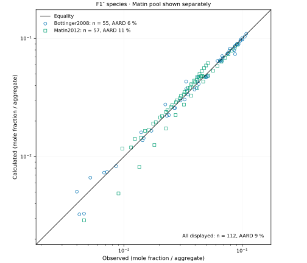
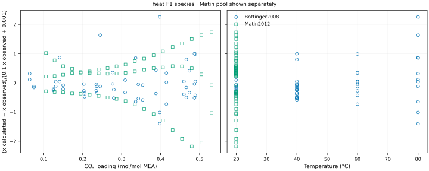
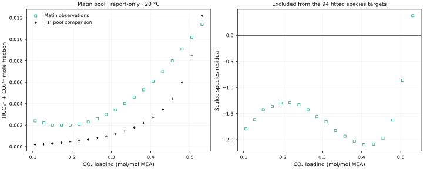

# Current working record {#working-record-160}

**The current record is the investigator-adopted #160 SSM+DS F1″ bundle, selected on 2026-10-03 for 30 wt% MEA on a CO₂-free basis at 40–80 °C.** Pressure calibration covers 40/60 °C and species calibration covers 20–60 °C. The 80 °C comparison is weaker; 100–120 °C is extrapolation. Concentration transfer is not qualified.

This notebook presents **calibration, numerical verification and conditional comparison**, without physical validation. The fitted comparisons reuse calibration data. The absorber comparison uses one fixed grid and disclosed assumptions. **Investigator promotion for manuscript writing remains pending**; this presentation revision awaits the parent's independent review.

The [selected JSON](results/selected-current-best-parameters.json) is byte-identical to the [retained F1″ candidate](results/density-cp-160/D1-evidence/F1-double-prime-candidate-parameters.json), SHA-256 `756fec502d3a1433d538abb073c4caeabf91902013ab7e27d5459ce70396543b`. The active immutable Engine wheel is SHA-256 `48a639e78d00ef88a2f7e66ed1e3d89831ca0ad5267322330d44f48c34926060`, from Engine commit `464a9897615e513e5cc404ce5b49f46a72466d3d`.

The [common-wheel qualification](results/density-cp-160/common-wheel-48a639e7/qualification.json) evaluates **141 targets at 83 states**, with cost **30.089761188864866**: pressure AARD **13.256546%** for **47 targets**, species AARD **7.937281%** for **94 targets**. Its relative cost difference from the retained fit is **9.8589 × 10⁻¹⁴**, below the **10⁻⁸** numerical equivalence tolerance. This checks one fixed objective; it establishes neither cold-start convergence nor root uniqueness.

# Current parameters {#selected-parameters}

The tables below are generated from the selected JSON, including its new water inputs, original ion segment counts, binary interactions and reaction overrides. Exact serialized values and source locators govern over display rounding. [Input hashes](figures/regression_overview/output/parameter-table-inputs.json) identify the files read by the presentation generator.

[Green: a fixed charge or formulation definition]{.evidence-1} · [Blue: a current numerical input with its recorded qualifications]{.evidence-2}. Green does not certify fitted properties. [★](#fitted-coordinates){.fit-star} identifies the five coordinates fitted in the #160 pressure/species problem. Chemistry, water, neutral binaries and Born inputs were fixed during that fit.

<!-- CURRENT-PARAMETERS:BEGIN -->

## Species parameters

Lengths are Å; energy parameters are K. Association volumes, segment counts, permittivities and solvation factors are dimensionless. A dash means the input is absent, not a fitted zero.

::: {.parameter-table .species-table}
| Species | $m$ | $\sigma$ | $\epsilon/k$ | $\epsilon^{AB}/k$ | $\kappa^{AB}$ | Scheme | $z$ | $\epsilon_r$ | $d_B$ | $f_{\mathrm{solv}}$ |
| :-- | :-- | :-- | :-- | :-- | :-- | :-- | :-- | :-- | :-- | :-- |
| CO₂ | 2.0729 | 2.7852 | 173.44025 | — | — | 2B | 0 | — | — | 1 |
| MEA | 3.0353 | 3.0435 | 277.174 | 2586.3 | 0.036287 | 2B | 0 | 32 | — | 1 |
| H₂O | 1.3340338 | water law | 415.47578 | 1725.6848 | 0.0461035 | 2B | 0 | water law | — | 1.5 |
| MEAH⁺ | 1 | 3.48508556586 | 232.687201645 | — | — | — | 1 | 8 | 3.53322927146 | 1 |
| MEACOO⁻ | 1 | 3.53543525721 | 453.265244384 | — | — | — | -1 | 8 | 3.54107030822 | 1 |
| HCO₃⁻ | 1 | 2.9296 | 70 | — | — | — | -1 | 8 | 3 | 1 |
| CO₃²⁻ | 1 | 2.4422 | 249.26 | — | — | — | -2 | 8 | 3 | 1 |
| H₃O⁺ | 1 | 3.4654 | 500 | — | — | — | 1 | 8 | 1.218 | 1 |
| OH⁻ | 1 | 2.0177 | 650 | — | — | — | -1 | 8 | 3.081076894 | 1 |
:::

CO₂ has induced 2B association with water and no self-association; its cross-association inputs are in `topology.edges` of the selected file. Ion association is absent.

Water diameter, with $T$ in K and $\sigma$ in Å:

$$\sigma_{\mathrm{H_2O}}(T)=2.7176052+10.11 e^{-0.01775T}-1.417 e^{-0.01146T}$$

Water relative permittivity:

$$\epsilon_{r,\mathrm{H_2O}}(T)=78.4104347858-0.361337662337(T-298.15)^{1}+0.00076555618295(T-298.15)^{2}$$

The selected file retains solvent-only dielectric mixing and excludes dispersion between ions with the same charge sign. Packing and Debye–Hückel diameters remain separate fields in that file; Born diameters are shown above. Fixed and transferred inputs carry their recorded qualifications; these tables confer no new physical validation.

## Binary interactions

Symmetric $k_{ij}$, upper triangle. A blue zero is a serialized fixed input, not a measured absence of interaction. Green exclusions state the selected formulation rule.

::: {.parameter-table .binary-interactions-table}
|  | CO₂ | MEA | H₂O | MEAH⁺ | MEACOO⁻ | HCO₃⁻ | CO₃²⁻ | H₃O⁺ | OH⁻ |
| :-- | :-- | :-- | :-- | :-- | :-- | :-- | :-- | :-- | :-- |
| CO₂ | — | 0 | -0.0242424022679 | 0 | 0 | 0 | 0 | 0 | 0 |
| MEA |  | — | -0.0803172261897 | 0 | 0 | 0 | 0 | 0 | 0 |
| H₂O |  |  | — | -0.3194004575874091[★](#fitted-coordinates){.fit-star} | 0.2230769983733113[★](#fitted-coordinates){.fit-star} | 0.5[★](#fitted-coordinates){.fit-star} | -0.25 | 0.25 | -0.25 |
| MEAH⁺ |  |  |  | — | -0.9674984297781464[★](#fitted-coordinates){.fit-star} | 0 | 0 | excluded | 0 |
| MEACOO⁻ |  |  |  |  | — | excluded | excluded | 0 | excluded |
| HCO₃⁻ |  |  |  |  |  | — | excluded | 0 | excluded |
| CO₃²⁻ |  |  |  |  |  |  | — | 0 | excluded |
| H₃O⁺ |  |  |  |  |  |  |  | — | 0 |
| OH⁻ |  |  |  |  |  |  |  |  | — |
:::

The stored temperature dependence is $k_{ij}(T)=k_{ij}(T_{\mathrm{ref}})+b(1/T-1/T_{\mathrm{ref}})$. The slope $b$ has units K.

::: {.parameter-table .summary-table}
| Pair | $b$ (K) | $T_{\mathrm{ref}}$ (K) |
| :-- | :-- | :-- |
| CO₂–MEA | 0 | 313.15 |
| MEAH⁺–H₂O | -1.0308441902699457[★](#fitted-coordinates){.fit-star} | 313.15 |
:::

## Five fitted coordinates {#fitted-coordinates}

::: {.parameter-table .summary-table}
| Coordinate | Current value | Conditional standard error | Bound |
| :-- | :-- | :-- | :-- |
| MEACOO⁻–water $k_{ij}$ | 0.2230769983733113[★](#fitted-coordinates){.fit-star} | 0.011809 | Free |
| MEAH⁺–water $k_{ij}$ | -0.3194004575874091[★](#fitted-coordinates){.fit-star} | 0.0144 | Free |
| HCO₃⁻–water $k_{ij}$ | 0.5[★](#fitted-coordinates){.fit-star} | — | Upper bound; SE excluded |
| MEACOO⁻–MEAH⁺ $k_{ij}$ | -0.9674984297781464[★](#fitted-coordinates){.fit-star} | 0.026717 | Free |
| MEAH⁺–water $b$ (K) | -1.0308441902699457[★](#fitted-coordinates){.fit-star} | 103.39 | Free |
:::

The errors condition on fixed chemistry, water, neutral binaries, Born inputs and residual weights. The HCO₃⁻–water coordinate is on its upper bound. The MEAH⁺–water slope is not distinguishable from zero on this conditional scale: its standard error is much larger than its magnitude. No uncertainty band or concentration-transfer claim follows.

## Reactions

R2/R4/R5 below are generated from the current selected JSON. It does not serialize fixed R1/R3; those rows and the reaction equations come from the retained [chemistry declaration](https://github.com/tannerpolley/Amine-Thermodynamics/blob/30ce082/data/reference/MEA/manifests/chemical_reaction_source_contract.json), including its stored aqueous-molality offsets.

::: {.parameter-table .summary-table}
| Reaction | $A$ | $B$ | $C$ | $D$ | $\Delta$ | Input owner |
| :-- | :-- | :-- | :-- | :-- | :-- | :-- |
| R1 · 2 H₂O ⇌ H₃O⁺ + OH⁻ | 132.899 | -13445.9 | -22.4773 | 0 | 8.0330699846 | Fixed chemistry |
| R2 · CO₂ + 2 H₂O ⇌ HCO₃⁻ + H₃O⁺ | 232.331415339 | -11105.6400305 | -36.7816 | 0 | — | Selected JSON |
| R3 · HCO₃⁻ + H₂O ⇌ CO₃²⁻ + H₃O⁺ | 216.049 | -12431.7 | -35.4819 | 0 | 4.0165349923 | Fixed chemistry |
| R4 · MEACOO⁻ + H₂O ⇌ HCO₃⁻ + MEA | 2.151 | -1545.3 | — | — | — | Selected JSON |
| R5 · MEAH⁺ + H₂O ⇌ MEA + H₃O⁺ | 3037.63995347 | -1.01731508373 | 0.0004277 | — | — | Selected JSON |
:::

For R1–R3, $\ln K=A+B/T+C\ln T+DT+\Delta$; R2 already includes the conversion in $A$ and has no separate offset. For R4, $\ln K=A+B/T$. For R5, $-\log_{10}K=A/T+B+CT$. The displayed layouts therefore give $B$ in K for R1–R4 and $A$ in K for R5; $D$ for R1–R3 and $C$ for R5 are in K⁻¹. Other coefficients are dimensionless. R2/R5 are inherited calibrated chemistry, held fixed in the five-coordinate fit; they are not new source measurements.

<!-- CURRENT-PARAMETERS:END -->

# Pressure and species fit evidence {#fit-statistics}

The pressure residual is $\ln(p_{\mathrm{calc}}/p_{\mathrm{obs}})/0.3$; the species residual is $(x_{\mathrm{calc}}-x_{\mathrm{obs}})/(0.1x_{\mathrm{obs}}+0.001)$. Cost is half the sum of squared scaled residuals. The [native F1 fit](results/density-cp-160/D1-evidence/F1-A/native-fit.json) identifies the fitted targets. Its [two-start summary](results/density-cp-160/D1-evidence/fit-summary.json) gives relative cost agreement **3.3036 × 10⁻¹³**; this agreement does not prove a global optimum.

The figures read F1 rows from the retained [pressure](results/density-cp-160/D1-evidence/pressure-figure-data.csv), [species](results/density-cp-160/D1-evidence/species-figure-data.csv) and [pool](results/density-cp-160/D1-evidence/pool-figure-data.csv) files. Those rows were produced on wheel `28181e72`; the common-wheel replay above verifies the same fitted objective on active wheel `48a639e7`. They describe the current F1″ physical inputs, with the density-only translation excluded from equilibrium. The figures read retained values without running the Engine.

**Pressure values in these retained files are Pa.** Pressure axes divide those values by 1000 to show kPa. Loading is mol total CO₂ per mol analytical MEA; species and aggregate values are dimensionless liquid mole fractions. Model values are markers at observed loadings. No retained continuous calculation is used and no model curve is drawn.

Average absolute relative deviation (AARD) is $100\,\mathrm{mean}|q_{\mathrm{calc}}/q_{\mathrm{obs}}-1|$. Display statistics are computed only from the named retained rows, with no new model evaluations.

::: {.parameter-table .summary-table}
| Rows | Pressure n | Pressure AARD (%) | Species n | Species AARD (%) |
|:--|--:|--:|--:|--:|
| Fitted targets, active-wheel replay | 47 | 13.256546 | 94 | 7.937281 |
| All retained F1 display rows, including outside-fit comparisons and Matin pool | 79 | 14.786419 | 131 | 16.186308 |
:::

The fitted statistics come from `qualification.json`; the display statistics and source counts come from [statistics.csv](figures/regression_overview/output/statistics.csv). The display set includes **19 Matin pool rows**, all excluded from F1 fitting; state 016 is display-only even in the separate 18-pool assessment. Its 19-row AARD is **61.400391%**. These rows must not enlarge the 94-target fitted species score. [Matin (2012)](#ref-6) and [Böttinger (2008)](#ref-8) retain different observation operators; the packet's `HCO3-` label is a **HCO₃⁻ + CO₃²⁻ pool**, not a bicarbonate-only measurement. Böttinger `MEA + MEAH+` is also an aggregate. Matin inputs retain the source-unverified legacy qualification and packet temperature 20 °C.

## Pressure

{#fig-pressure}

The observations are retained under [Hilliard (2008)](#ref-16) and [Jou (1995)](#ref-jou). Temperature panels group the recorded state temperatures by their nominal series; the numerical values are unchanged.

{#fig-pressure-parity}

{#fig-pressure-residuals}

## Species parity and residuals

{#fig-species-parity}

{#fig-species-residuals}

## Speciation

{#fig-speciation}

{#fig-matin-pool}

# Density

The selected record uses a **density-only empirical volume translation**:

$$
\rho_{\mathrm{corr}}=\frac{M_{\mathrm{mix}}}{v_{\mathrm{EOS}}+10^{-6}c(x_{\mathrm{MEAH^+}}+x_{\mathrm{MEACOO^-}})},\qquad c=39.51429527803833\ \mathrm{cm^3/mol}.
$$

The [retained volume correction](results/density-cp-160/D1-evidence/volume-correction.json) uses native composition and equation-of-state molar volume. It does not alter native molar-density fields, chemical potentials, equilibrium, enthalpy or heat capacity. Engine parameter loading does not apply it automatically; the retained absorber producer applies it explicitly.

The [four fitted density states](results/density-cp-160/D1-evidence/corrected-target-densities.csv), from [Amundsen (2009), Table 3](#ref-amundsen), give the following values. Pressure was unreported in the source; the retained correction calculation uses 100000 Pa. The source uncertainty boundary for the loaded rows remains unresolved.

::: {.parameter-table .summary-table}
| Temperature (K) | Loading (mol/mol MEA) | Corrected density (kg/m³) | Observed density (kg/m³) | Deviation (%) |
|--:|--:|--:|--:|--:|
| 323.15 | 0.3 | 1060.1296 | 1058.0 | +0.201281 |
| 323.15 | 0.4 | 1081.3164 | 1083.0 | −0.155458 |
| 343.15 | 0.3 | 1048.7823 | 1046.4 | +0.227670 |
| 343.15 | 0.4 | 1070.0845 | 1071.9 | −0.169376 |
:::

All four meet the **1.6%** comparison limit. On the active wheel, the [absorber physical-check rows](results/density-cp-160/stage5-absorber/physical-checks.csv) give corresponding errors **+0.2018, −0.1550, +0.2282 and −0.1689%**, hence all **≤0.229%**. These remain fitted density comparisons; the two producers are kept distinct.

{#fig-density}

The [64 outside-fit density rows](results/density-cp-160/D1-evidence/corrected-outside-densities.csv) have AARD **0.2706%**, with deviations **−0.5712 to +0.6834%** ([retained summary](results/density-cp-160/D1-evidence/run-summary.json)). These are conditional comparisons without independent validation or bound source uncertainty.

# Heat capacity

The current water inputs meet the sampled **3%** Cp value limit. The [#124 assessment](results/density-cp-160/cp-124-assessment/summary.json) retains an unmet joint requirement because mean saturated-density errors worsened; no requirement was waived by working-record adoption. Only the current record's values are shown below.

::: {.parameter-table .summary-table}
| Grid | Quantity | States | Mean absolute error (%) | Maximum absolute error (%) |
|:--|:--|--:|--:|--:|
| Primary | Liquid Cp | 20 | 0.412549 | 0.604524 |
| Primary | Saturated liquid density | 20 | 0.132313 | 0.194363 |
| Primary | Saturation pressure | 20 | 0.295906 | 0.436665 |
| Staggered | Liquid Cp | 19 | 0.432562 | 0.604049 |
| Staggered | Saturated liquid density | 19 | 0.136279 | 0.194760 |
| Staggered | Saturation pressure | 19 | 0.299973 | 0.437434 |
:::

The [retained metrics](results/density-cp-160/cp-124-assessment/water-metrics.csv) use IAPWS-95 [reference rows](results/density-cp-160/cp-124-assessment/iapws95-reference.csv). The primary grid spans **298.15–393.15 K**, the staggered grid **300.65–390.65 K**, both at **5 K** spacing. Liquid Cp is evaluated at **0.300 MPa**; density and vapor pressure use saturation states. Water caloric inputs remain fixed in the [assessment](results/density-cp-160/cp-124-assessment/inputs.json). No physical or parameter uncertainty was propagated.

{#fig-water}

The retained assessment reports **42/42** current water Cp values inside 3%. The current subset of `water.csv` supplies **42/42** liquid rows and **39/39** saturation states. Its maximum relative Cp/enthalpy-difference disagreement is **2.541 × 10⁻⁹** and its maximum unscaled saturation residual is **1.599 × 10⁻¹⁴**. The additional half-error step rule is met by **41/42** current rows; the published step-halving improvement rule is met by all **42/42**. These numerical checks do not imply physical validation.

## Solution Cp

The current-wheel [absorber C5 rows](results/density-cp-160/stage5-absorber/physical-checks.csv) compare equilibrium $dH/dT$ at fixed pressure and analytical feed against [Hilliard (2008), Appendix G.2, printed p. 937](#ref-16), at **7 mol MEA/kg water and assumed 101325 Pa**. Nominal unloaded MEA uses the disclosed loading-$10^{-5}$ proxy.

::: {.parameter-table .summary-table}
| Temperature (K) | Nominal loading (mol/mol MEA) | Cp (kJ/(kg·K)) | Observed Cp (kJ/(kg·K)) | Deviation (%) |
|--:|--:|--:|--:|--:|
| 318.15 | 0 | 3.868664 | 3.7195 | +4.0103 |
| 318.15 | 0.358 | 3.383767 | 3.3675 | +0.4831 |
| 353.15 | 0.358 | 3.314773 | 3.4707 | −4.4927 |
:::

Two rows miss 3%. Solution Cp remains report-only for #160; full #149 property acceptance is not established. Equilibrium-minus-frozen Cp represents the temperature-driven reaction/speciation response, not an isolated effect of fitted reaction-law shifts.

**Unloaded 80 °C Cp is unavailable on wheel `48a639e7`: 0/1 requested values.** The [retained assessment](results/density-cp-160/cp-124-assessment/summary.json) rejects the trace-carbonate stationarity row under the unchanged raw-residual gate, so no model loading-induced Cp difference is available. The upstream correction and current rerun are tracked below; no value from an unmerged branch is shown.

# Absorber comparison

The [Stage 5 handoff](results/density-cp-160/stage5-absorber/handoff.json) retains one **65-node, nine-film-point 3C case** on the active wheel; the quadrature count is in its bound resolved configuration, `analyses/bvp_solution_methods/results/amine_160_candidate/upwind_cos_n65_parameter_transfer/resolved_config.json` at absorber commit `bb70f6f7` (local branch `work/160-amine-density-cp`, not yet published to GitHub), file SHA-256 `c729944d…` as recorded in the handoff. The absorber repository owns the solve. The retained model/observation comparisons are:

::: {.parameter-table .summary-table}
| Quantity | Current record | Reference or limit |
|:--|--:|:--|
| CO₂ capture | 90.6093% | 89.5%; within 5 percentage points |
| Five temperature taps, root-mean-square error | 3.4415 K | ≤6 K |
| Native-grid maximum liquid temperature | 348.3281 K at 5.2229 m | Peak tap 348.05 K at 4.8 m; within 5 K |
:::

The [retained handoff](results/density-cp-160/stage5-absorber/handoff.json) gives maximum scaled residual **5.6617 × 10⁻⁸**, below **10⁻⁷**, with zero scaled bound violation. Its numerical checks and native-grid physical-certificate checks pass. These checks do not establish a physical-validation claim.

{#fig-absorber}

The model retains estimated mobilities, an assumed **318.15 K** liquid inlet, a provisional vapor caloric reference and the producer's `reported_total_wet` gas basis with `legacy_ratio` composition. No mesh independence, between-node accuracy, root uniqueness, propagated source/parameter uncertainty or global physical validation is established. The accepted comparisons apply to this one fixed-grid case.

# Open work

- [#124](https://github.com/tannerpolley/Amine-Thermodynamics/issues/124) remains open: unloaded 80 °C Cp was unavailable on the active wheel; [Engine #261](https://github.com/tannerpolley/ePC-SAFT/issues/261) fixed the upstream issue, and [#161](https://github.com/tannerpolley/Amine-Thermodynamics/issues/161) tracks the rerun.
- [#147](https://github.com/tannerpolley/Amine-Thermodynamics/issues/147) remains open: the heat-of-absorption follow-up. [Engine #269](https://github.com/tannerpolley/ePC-SAFT/issues/269) merged (`c1067020`), so the Engine now solves its zero-carbon bubble endpoint. #147's §8 qualification on that wheel (SHA-256 `e8ad39e0…`) is complete and independently Supported ([record](https://github.com/tannerpolley/Amine-Thermodynamics/issues/147#issuecomment-6025992100)): the model gives −68.17 and −68.29 kJ/mol CO₂ for 0→0.11 and 0→0.45 at 313.15 K and 1.734 MPa, against measured −79 to −85 kJ/mol. These are numerical verification results; the authorized heat-of-absorption fit has not yet run.

# Record history

Past records and comparisons are in [parameter-record-history.csv](results/parameter-record-history.csv) and Git history. This notebook replaces the previous view with current retained work; rendering it never runs the thermodynamic model.

# References

<ol class="references">
<li id="ref-6">M. Matin et al., “Facile Method for Determination of Amine Speciation in CO₂ Capture Solutions,” <em>Industrial &amp; Engineering Chemistry Research</em> (2012). <a href="https://doi.org/10.1021/ie300230k">doi:10.1021/ie300230k</a>.</li>
<li id="ref-8">W. Böttinger, M. Maiwald, and H. Hasse, “Online NMR spectroscopic study of species distribution in MEA–H₂O–CO₂ and DEA–H₂O–CO₂,” <em>Fluid Phase Equilibria</em> (2008). <a href="https://doi.org/10.1016/j.fluid.2007.09.017">doi:10.1016/j.fluid.2007.09.017</a>.</li>
<li id="ref-16">M. D. Hilliard, “A predictive thermodynamic model for an aqueous blend of potassium carbonate, piperazine, and monoethanolamine for carbon dioxide capture from flue gas,” doctoral dissertation, The University of Texas at Austin (2008).</li>
<li id="ref-jou">F.-Y. Jou, A. E. Mather, and F. D. Otto, “The Solubility of CO₂ in a 30 Mass Percent Monoethanolamine Solution,” <em>The Canadian Journal of Chemical Engineering</em> 73 (1995), 140–147. <a href="https://doi.org/10.1002/cjce.5450730116">doi:10.1002/cjce.5450730116</a>.</li>
<li id="ref-amundsen">T. G. Amundsen, L. E. Øi, and D. A. Eimer, “Density and Viscosity of Monoethanolamine + Water + Carbon Dioxide from (25 to 80) °C,” <em>Journal of Chemical &amp; Engineering Data</em> 54 (2009), 3096–3100. <a href="https://doi.org/10.1021/je900188m">doi:10.1021/je900188m</a>.</li>
</ol>
